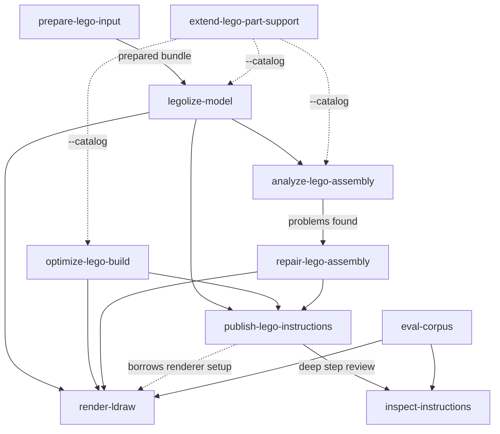

# Choosing a skill

You do not have to. Say what you want and your agent matches it. This page is for when
you want to understand *why* it picked what it picked — or to point it somewhere else.

---

## By what you have

| You have | You want | Skill |
| --- | --- | --- |
| `.obj` `.stl` `.ply` `.vox` `.npy` | Bricks | [`legolize-model`](skills/legolize-model.md) |
| …the same file | To know if it is usable first | [`prepare-lego-input`](skills/prepare-lego-input.md) |
| `.ldr` `.mpd` | It made better | [`optimize-lego-build`](skills/optimize-lego-build.md) |
| `.ldr` `.mpd` | To know why it is wobbly | [`analyze-lego-assembly`](skills/analyze-lego-assembly.md) |
| `.ldr` `.mpd` | It fixed | [`repair-lego-assembly`](skills/repair-lego-assembly.md) |
| Any model | A booklet | [`publish-lego-instructions`](skills/publish-lego-instructions.md) |
| Existing instructions | Them checked | [`inspect-instructions`](skills/inspect-instructions.md) |
| Any model | To see it | [`render-ldraw`](skills/render-ldraw.md) |
| A part the tool does not know | Support for it | [`extend-lego-part-support`](skills/extend-lego-part-support.md) |
| A code change | To know if it helped overall | [`eval-corpus`](skills/eval-corpus.md) |

---

## How they hand off

Solid arrows are "and then do this". Dotted arrows are "this supplies something that
one needs".

---

## The boundaries that are drawn on purpose

These are not accidents of implementation. Each is a deliberate refusal.

!!! abstract "`legolize-model` vs `optimize-lego-build`"

    New model from a mesh or voxel file → `legolize-model`.
    Improving an existing brick assembly → `optimize-lego-build`.

    There is deliberately **no routing skill** sitting above them to decide. The
    input type is the routing.

!!! abstract "`analyze` never repairs"

    Analysis is diagnosis only. It changes nothing and fixes nothing. When it finds
    problems it hands you to `repair-lego-assembly` rather than quietly attempting a
    fix you did not ask for.

!!! abstract "`repair` never dresses up a failure"

    If no validated repair was found, the skill says so. It retains the best rejected
    attempt for you to look at — **labelled as rejected**. A candidate that did not
    pass is never presented as a fix.

!!! abstract "`publish` makes the booklet; `inspect` audits the plan"

    `publish-lego-instructions` produces the thing a human follows.
    `inspect-instructions` asks whether that thing makes sense. Different questions,
    different skills.

!!! abstract "`optimize` never overwrites your source"

    Neither does anything else. Every operation writes into a new directory beside
    your input. And if a retiled rebuild comes out *worse* than what you had — more
    bricks, or weaker — the skill will tell you that. Losing a comparison is a valid,
    useful answer.

---

## What each skill will ask you

This table is the most practical thing on this page. It tells you which actions happen
silently, and which will stop and wait for you.

| Action | Consent |
| --- | --- |
| Refreshing the LDraw parts library | :material-check: **Silent** — it is a user-data cache, no admin rights, and a valid copy survives a failed check |
| Installing or upgrading the `legolization` CLI | :material-check: **Silent** — but a failure stops the operation rather than continuing |
| Installing a **renderer** | :material-alert: **Must ask.** Checking for one is free; installing one is not done unasked |
| `exhaustive` quality — the time budget | :material-alert: **You supply the number.** The skill will not invent it |
| `exhaustive` repair effort — the time budget | :material-alert: **You supply the number** |
| The material retry ladder after a failure | :material-alert: **Consent *and* a total budget**, both from you |
| Re-running from scratch instead of resuming | :material-alert: **Only when you ask** for a from-scratch rerun |
| Activating a drafted part into the catalog | :material-alert: **Explicit confirmation.** Nothing activates silently |
| Promoting a part into the built-in catalog | :material-alert: **Explicit confirmation** |
| Replacing the evaluation baseline | :material-alert: **Explicit confirmation** — and never to hide a regression |

The pattern behind it: **caches and dependencies are silent; anything that costs your
time, changes shared state, or discards evidence must ask.**

---

## Ordinary phrasings that route correctly

You do not need the skill names. These all work:

| You say | It goes to |
| --- | --- |
| "legolize / brickify / Lego-ify this" | `legolize-model` |
| "make a buildable brick version of this shape" | `legolize-model` |
| "which way is up on this?" / "how big will it be?" | `prepare-lego-input` |
| "rebuild this with fewer bricks" / "strengthen this" | `optimize-lego-build` |
| "is this stable?" / "why might it collapse?" / "what's floating?" | `analyze-lego-assembly` |
| "fix this" / "reinforce this" / "stabilize this without changing the look" | `repair-lego-assembly` |
| "build instructions" / "booklet" / "printable steps" / "A4" | `publish-lego-instructions` |
| "do these steps make sense?" / "will something fall off halfway?" | `inspect-instructions` |
| "show me" / "view" / "preview" / "screenshot" / "render" | `render-ldraw` |
| "unsupported part" / "add support for part 4070" | `extend-lego-part-support` |
| "did my change make things better or worse overall?" | `eval-corpus` |

If it picks wrong, name the skill — "use `analyze-lego-assembly` on this" — and it will
switch.
