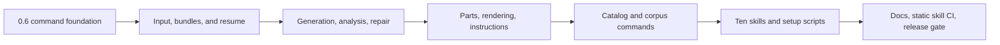

# Legolization 0.6 skills-suite implementation roadmap

> Planning document, not implementation. It sequences the confirmed specification into independently verifiable phases. No phase authorizes publication, release, or a destructive migration without its stated gate.

## Delivery strategy

Build the CLI and portable bundle contract first, then make the ten skills thin conversational interfaces over those supported commands. This keeps task behavior testable in Python and avoids a second, script-only implementation path.

Every implementation phase runs the repository-wide local verification required by `AGENTS.md`: `uv run ruff check .`, `uv run pytest`, `uv run ty check`, and `uv run pyrefly check`. The skill-specific CI remains static/Ubuntu-only; it does not run expensive forward agent trials.

## Phase 0 — Baseline and release boundary

**Goal:** establish the 0.6 implementation boundary without changing runtime behavior beyond version plumbing.

**Work**

- Record the existing behavior of `main.py`, `commands.py`, legacy helper scripts, `.claude/skills`, and relevant tests before moving them.
- Bump package metadata and user-facing version reporting to `0.6.0`; add `legolization --version`.
- Define the shared result-envelope dataclasses/schema and exit-code mapping in package code.
- Confirm the package can be built locally; keep PyPI publication explicitly outside this repository implementation phase.

**Likely components:** `pyproject.toml`, `src/legolization/__init__.py`, `src/legolization/main.py`, a new result/CLI support module, and focused command tests.

**Gate:** current explicit `build`, `validate`, `cache`, and `analyze` behavior remains covered; `--version` reports 0.6.0; old and new command errors map predictably under `--json`.

## Phase 1 — Command dispatcher and configuration plumbing

**Goal:** introduce the explicit command hierarchy and eliminate the legacy bare input parser cleanly.

**Work**

- Extend the dispatcher for `bundle`, `input inspect`, `model render`, `instructions audit`, `catalog infer`, `catalog validate`, and the eight `corpus` operations.
- Preserve existing explicit commands and remove the `legolization INPUT ...` compatibility path.
- Add shared options for human/JSON output, output locations, configuration file loading, `--catalog`, and `--catalog-estimates`.
- Ensure CLI values override project TOML values using the existing configuration model.
- Move reusable behavior from retired instruction/corpus/render compatibility scripts into importable `src/legolization` modules; do not leave wrappers.

**Likely components:** `main.py`, `commands.py`, `configuration.py`, `manifest.py`, `analyze_cli.py`, new command modules, and tests replacing old script entry-point coverage.

**Gate:** every named command is discoverable via help; JSON stdout always contains exactly one envelope; legacy bare invocation fails with clear migration guidance; no duplicate production logic remains in the retired helper scripts.

## Phase 2 — Portable bundle foundation

**Goal:** make `legolization bundle` a durable operation coordinator before adding every generation feature.

**Work**

- Implement operation-specific sibling output naming and numeric collision suffixes.
- Create atomic `bundle.json` stage updates and the portable bundle layout.
- Compute bundle identity from input content hash, effective config hash, Legolization version, and catalog hash; never store an absolute source path.
- Implement default identity-matched resume, `--fresh`, mismatched-output sibling behavior, and in-place artifact-drift regeneration.
- Implement interruption handling (exit 130), stage status/warnings/verdicts, and retained partial results.
- Add `--cancel-pending`: terminate only identity-matched detached workers, mark cancellation atomically, and retain valid completed artifacts/diagnostics for resume.

**Likely components:** `manifest.py`, `assembly_artifacts.py`, `assembly_paths.py`, `pipeline.py`, new bundle orchestration/worker modules, schemas, and integration tests using small fixtures.

**Gate:** a deliberately interrupted or partially completed small bundle resumes without changing identity; a cancellation cannot affect another bundle identity; artifact drift regenerates only the affected artifact.

## Phase 3 — Input inspection and imported-model paths

**Goal:** support the full input contract before expanding strategy selection.

**Work**

- Implement `input inspect` for `.vox`, `.npy`, `.obj`, `.stl`, and `.ply`, including optional normalized `.npy` plus JSON sidecar.
- Reuse mesh/voxel inspection to report recommended studs or plates-per-voxel; classify mesh orientation confidence.
- Preserve all components and scale during inspection and retry workflows.
- Sample embedded mesh colors; report when a uniform color is required.
- Route `.ldr`/`.mpd` bundles through preservation-by-default, with explicit `--retile` creating a colored occupancy target and recording its shape authority.

**Likely components:** `mesh.py`, `ldraw_in.py`, `grid.py`, `color.py`, `configuration.py`, input command module, and fixture-based input tests.

**Gate:** supported native inputs produce stable inspection results; ambiguous up-axis and absent color data are explicit machine-readable conditions; imported LDraw preservation and retile paths are distinguishable in reports.

## Phase 4 — Candidate execution, quality, and retry orchestration

**Goal:** implement the complete generation decision policy around existing placement strategies.

**Work**

- Add fast, balanced, and exhaustive candidate plans; include global exact only when preflight qualifies it and record a skip reason otherwise.
- Cap workers at logical CPU count and replace non-persistent deadline behavior with detached, identity-stamped candidate workers writing atomic private results.
- Add source-color variant candidates (hard/no-dither, soft/no-dither, soft+dither) and deduplicate equivalent cases.
- Select a winner using the existing weighted objective plus color error; publish a full comparison report and only the winner model.
- At soft deadline, publish the best buildable completed candidate as provisional exit 3 while allowing later identity-matched resume to adopt a better late result.
- Implement the approved second-invocation retry budget and material ladder: four-plate shell, six-plate shell, solid.

**Likely components:** `compare.py`, `placement/registry.py`, `placement/global_exact.py`, `pipeline.py`, `hollow.py`, `physical.py`, bundle worker/orchestration code, and deterministic strategy tests.

**Gate:** candidate plans match the specified seeds/durations; no preflight-ineligible exact run starts; deadline, adoption, cancellation, retry allocation, and exit codes have deterministic tests.

## Phase 5 — Analysis and repair bundles

**Goal:** connect existing physics and redesign capabilities to complete diagnostic outputs.

**Work**

- Make analysis always produce JSON reports, graph/components/floating output, HTML diagnostics, and renders when available.
- Mark topology-only recommendations explicitly unverified when results are indeterminate.
- Implement repair sibling outputs, effort tiers, BOM-preserving counterfactuals, validated redesign escalation, and best-rejected-candidate retention.
- Ensure catalog overlays and explicit estimate sidecars are passed consistently through build, bundle, analyze, and repair.

**Likely components:** `analysis.py`, `assembly_*.py`, `redesign.py`, `support.py`, `catalog.py`, `assembly_artifacts.py`, analysis/repair command modules, and existing analysis/repair tests.

**Gate:** repair never overwrites source input; every failed repair explains why and retains its best candidate; estimate-sidecar provenance appears in reports while following the confirmed no-safety-adjustment policy.

## Phase 6 — Managed parts, renderer, and instruction publication

**Goal:** supply portable model rendering and instruction publication with exact partial-result semantics.

**Work**

- Implement one managed official LDraw library setup operation with shell and PowerShell variants, platform user-data storage, validated downloads, metadata, and weekly update checks.
- Implement one renderer setup operation with shell and PowerShell variants: LDView on macOS; LeoCAD via winget on Windows; LeoCAD plus Xvfb on Ubuntu.
- Add `model render`, numeric output suffixing, requested-view outcome codes, and renderer/library version recording.
- Add `instructions audit`; update instruction construction for subassemblies, insertion-press auditing, English-only layout, Letter/A4 selection with Letter fallback, and size-based step density.
- Change booklet behavior so unavailable/declined renderer omits HTML/PDF entirely, required rendering returns partial, and partial step rendering uses explicit missing-step markers instead of placeholders.

**Likely components:** `instructions/booklet.py`, `instructions/render.py`, `instructions/verification.py`, `instructions/subassembly.py`, `ldraw_out.py`, new render/setup/parts modules and minimal paired setup scripts.

**Gate:** renderer-off bundles omit booklet files with exit 0; required missing renderer yields exit 3; partial step failure produces marked partial booklet; a valid existing parts library lets a failed weekly check continue.

## Phase 7 — Catalog extension and corpus commands

**Goal:** expose extension and evaluation workflows through package commands rather than standalone scripts.

**Work**

- Implement catalog inference, source/provenance capture, draft estimates, geometry validation, overlay activation, and confirmation-only upstream promotion.
- Write the required `-legolization-support` directory layout.
- Package corpus manifests/generators; implement list, generate, download, verify, collect, assemble, and evaluate.
- Store corpus inputs in platform user-data locations and collection/scorecard output in `./legolization-eval/` by default.
- Require explicit baseline-write confirmation in skill flow before forwarding `--write-baseline`.

**Likely components:** `catalog.py`, `eval_artifacts.py`, corpus functionality moved from `scripts/` into `src/legolization`, command modules, and schema/fixture tests.

**Gate:** a catalog overlay becomes active only after all required checks; corpus evaluation does not mutate a baseline unless explicitly instructed; unavailable downloaded meshes are reported as skipped rather than failures.

## Phase 8 — Create and migrate the ten skills

**Goal:** build the user-facing suite as concise, portable interfaces over the completed CLI.

**Work**

- Initialize each canonical root `skills/<name>/` folder with `skill-creator` tooling; every folder contains `SKILL.md`, `agents/openai.yaml`, and only necessary resources.
- Write concise imperative workflows, clear trigger descriptions, quoted `$skill-name` default prompts, and CLI-first examples for all ten skills.
- Add only the two approved paired setup-script resources; do not add other operational helper scripts.
- Create small and large original SVG icons for each skill using the agreed brick-palette vector direction and brand color.
- Replace `.claude/skills` with root `skills/`; remove obsolete copies and old names without aliases.
- Validate every skill with the local `quick_validate.py` supplied by skill-creator.

**Likely components:** `skills/`, removal of `.claude/skills/`, icon assets, and generated `agents/openai.yaml` files.

**Gate:** exactly ten skills validate locally; `npx skills@1 add . --list` discovers exactly those ten; no deprecated skill folders or compatibility copies remain.

## Phase 9 — Documentation, CI, and release-readiness review

**Goal:** make the suite discoverable and enforce its static packaging contract.

**Work**

- Update README with install command, runtime behavior, catalog, natural-language examples, platform setup, and LEGO Group non-affiliation notice.
- Update CLAUDE guidance and self-evaluation references to root skill locations and CLI commands.
- Add an Ubuntu GitHub workflow that runs skill discovery, exact inventory check, repository-vendored frozen `quick_validate.py`, SVG/XML validation, `bash -n`, and PowerShell parsing without executing installers.
- Run all repository tests/type/lint checks and focused command/skill discovery tests.
- Review the diff for removal-only migrations, public CLI help, JSON contract consistency, generated asset licensing, and release version/package metadata.

**Gate:** CI validates the exact canonical suite without forward agent trials; documentation has no stale `.claude/skills` paths; all required local checks pass; PyPI publication is left as a separately authorized release action.

## Recommended implementation checkpoints

| Checkpoint | Deliverable suitable for review | Depends on |
| --- | --- | --- |
| A | Explicit command hierarchy, version, result envelope, configuration precedence. | Phase 0–1 |
| B | Resumable portable bundle plus native/LDraw input handling. | Phase 2–3 |
| C | Strategy/quality/retry policy and analysis/repair bundles. | Phase 4–5 |
| D | Parts setup, rendering, instruction publication, catalogs, and corpus. | Phase 6–7 |
| E | Ten skills, assets, discovery CI, and documentation migration. | Phase 8–9 |

Implement and review one checkpoint at a time. Do not start the final skills migration until the CLI surfaces they call have stable help, JSON, exit-code, and fixture-test contracts.

