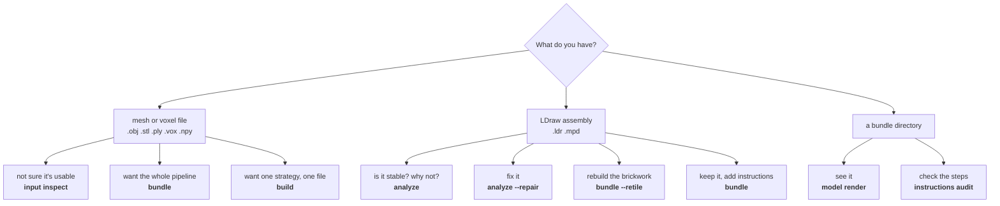

# Command reference

Eleven top-level commands. Everything in this section was verified against
`legolization <command> --help`.

```
legolization [--version] COMMAND ...
```

| Command | What it does | Page |
| --- | --- | --- |
| `bundle` | Run the complete generation pipeline into a portable bundle | [bundle](bundle.md) |
| `build` | Build an LDraw model from 3D input with a single strategy | [build](build.md) |
| `analyze` | Analyze LDraw geometry and search for a valid repair | [analyze](analyze.md) |
| `input` | Inspect and normalize source models | [input](input.md) |
| `model` | Operate on generated models (currently: render) | [model and instructions](model-and-instructions.md) |
| `instructions` | Audit step-by-step build instructions | [model and instructions](model-and-instructions.md) |
| `catalog` | Infer and validate parts-catalog extensions | [catalog](catalog.md) |
| `corpus` | Manage and evaluate the placement corpus | [corpus](corpus.md) |
| `parts` | Manage the official LDraw parts library | [parts, cache, validate](parts-cache-validate.md) |
| `cache` | Inspect or clear the template cache | [parts, cache, validate](parts-cache-validate.md) |
| `validate` | Validate an assembly manifest | [parts, cache, validate](parts-cache-validate.md) |

Which one you want, by input:



---

## Shared option groups

Three groups of flags recur across commands.

### Output format

| Flag | Applies to | Effect |
| --- | --- | --- |
| `--json` | every command | Write **exactly one** result envelope to stdout; progress and warnings go to stderr. |

### Configuration

| Flag | Effect |
| --- | --- |
| `--config PATH` | Project TOML configuration file |
| `--set KEY=VALUE` | Override one dotted configuration key. Repeatable. |

Available on: `build`, `bundle`, `input inspect`, `cache`.
**`analyze` accepts `--config` but not `--set`.**

### Catalog

| Flag | Effect |
| --- | --- |
| `--catalog PATH` | Parts-catalog extension. Repeatable; appends to `catalog.extensions`. |
| `--catalog-estimates PATH` | Estimate sidecar with labeled provenance. Repeatable. |

Available on: `build`, `bundle`, `analyze`. `analyze` additionally accepts
`--connector-catalog`, `--ldcad-metadata`, and `--studio-metadata`.

---

## Gotchas worth knowing before you hit them

!!! danger "`cache` takes `--config`/`--set` *before* the operation"

    Unlike every other command, `cache` registers the configuration options on the
    **group** parser:

    ```sh
    legolization cache --config project.toml inspect    # correct
    legolization cache inspect --config project.toml    # error
    ```

!!! warning "`analyze` has no `--set`"

    Only `--config`. Its budget, seed, support, and scenario knobs are dedicated
    flags instead.

!!! warning "Two different things are called \"support\""

    `stability.support` in TOML is `baseplate | table` — whether ground contacts may
    pull down. `analyze --support` is
    `auto | free | wheels | auto-ground | anchored-baseplate | selected:IDS` — how an
    imported assembly is seated. They are unrelated axes that share a word.

!!! warning "`--restarts > 1` with exact placement is a hard error"

    Exact placement is deterministic, so racing it across seeds would be identical
    work. `build --restarts 3` fails if the strategy resolves to `global-exact`.

!!! warning "`--duration` overrides every tier default"

    Including `fast` and `balanced`, not just `exhaustive`.

!!! info "Exit 3 is not always bad"

    `catalog infer` returns 3 for a draft-only bundle; `bundle` returns 3 for a
    provisional result with workers still running; `instructions audit` returns 3
    for "findings". See [Exit codes and JSON](../exit-codes-and-json.md).

---

## Removed: bare invocation

Passing a model file as the first argument is no longer supported and does not
silently guess a command:

```console
$ legolization spot.obj
error: the bare 'legolization INPUT' invocation was removed in 0.6.
Use one of:
  legolization bundle spot.obj              # full pipeline: model, BOM, instructions
  legolization build spot.obj -o OUT.ldr    # single-strategy model build
  legolization analyze spot.obj             # analyze an existing LDraw model
```

This exits 1. Unknown command names also exit 1 — argparse's native exit 2 is
deliberately overridden, because 2 is reserved for "unbuildable".
