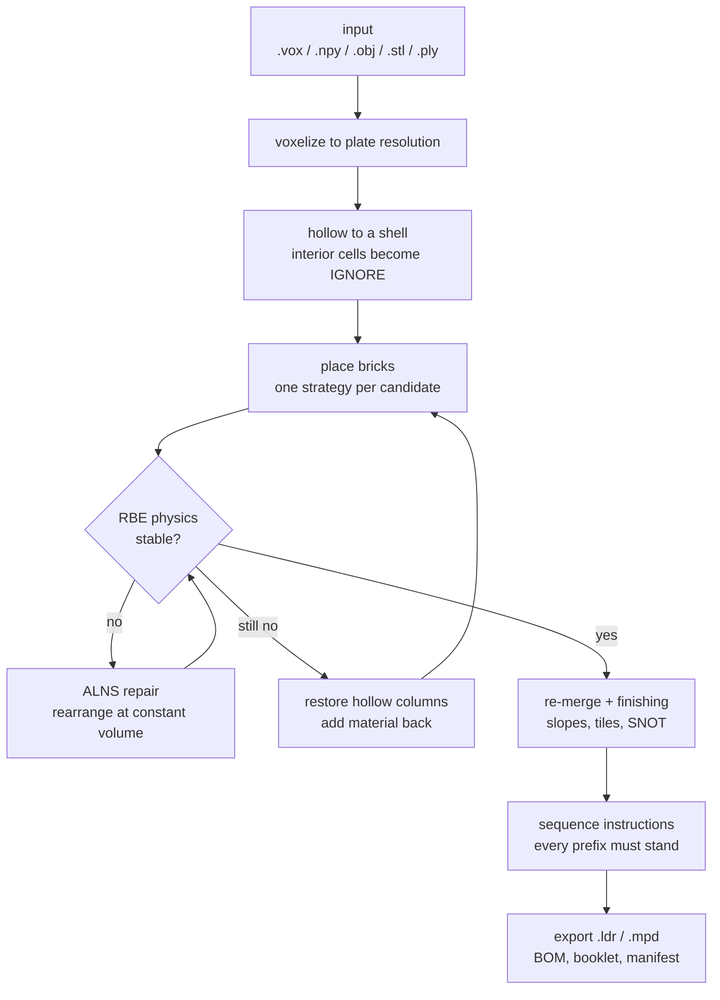

# Core concepts

Nine ideas explain almost everything the tool does and every decision it will ask
you about. Read this once and the command pages stop being surprising.

---

## 1. Studs, plates, and LDU

LDraw measures everything in **LDU** (LDraw Units). Two ratios matter:

| Quantity | LDU | Source |
| --- | ---: | --- |
| Horizontal stud pitch | 20 | `ldraw_units.STUD_LDU` |
| Vertical plate height | 8 | `ldraw_units.PLATE_LDU` |

A brick is three plates tall — 24 LDU. So a 1×1 brick is 20 × 20 × 24 LDU, and its
footprint is *wider than it is tall per plate*: the vertical resolution of a model is
2.5× finer than the horizontal resolution.

That asymmetry is why a model's height in plates is not simply its width in studs.
When a mesh is voxelized, it is pre-stretched vertically by 2.5 before sampling, so
every plate layer samples the true surface rather than replicating a neighbour. Mesh
grids are aspect-correct by construction.

!!! tip "What this means in practice"

    `--target-studs N` sets the **footprint width**, not the height. A 24-stud-wide
    model of a tall shape can be 100+ plate layers, and runtime scales with total
    cells, not with `N`.

---

## 2. Three geometry representations, deliberately kept separate

This is the single most important structural idea in the codebase, and it explains
why "analyze" can handle models that "build" cannot.

| Representation | Unit | Used for |
| --- | --- | --- |
| **Target cells** | 1 stud × 1 stud × 1 plate, integers | Coverage — which cells the shape wants filled |
| **Filled cells** | same lattice | Which cells a part *contributes* to the shape (a slope excludes its sloped void) |
| **Exact LDU boxes** | integer LDU AABBs | Collision, connector locations, physical contact |

Coarse cells are never used as physical connector evidence. Contacts are matched in
exact integer LDU, which is what keeps half-stud and half-plate features — SNOT
mounts, headlight bricks, brackets — distinct from ordinary stud-up geometry.

The practical consequence: **generated placement is yaw-only** and lives on the
coarse lattice, but **imported LDraw geometry is preserved exactly**. An imported
model with a meaningful pitch or roll is analyzed capability by capability and
reported as partial, never silently snapped onto the generation lattice.

---

## 3. Colours, and the "ignore" wildcard

Every grid cell carries an LDraw colour code, or one of two sentinels:

- `EMPTY` — nothing here.
- `IGNORE` — filled, but colour-free.

`IGNORE` is what makes hollowing work well. Interior cells are invisible, so forcing
them to a specific colour would fragment merges on boundaries nobody will ever see.
Instead they are colour-free wildcards: any brick colour may cover them.

Merging follows a small lattice — all-`IGNORE` stays `IGNORE`, one specific colour
wins, and two *different* specific colours are incompatible and cannot merge. At the
end of placement, leftover `IGNORE` bricks inherit a colour by breadth-first search
from the nearest coloured brick.

Colour handling has two modes:

- `hard` (default) — a brick may never miscolour a cell.
- `soft` — merges that miscolour a few cells are accepted probabilistically, weighted
  by how many cells they would get wrong. Fewer, larger bricks; slightly wrong colour
  at some boundaries. Set with `--set placement.colour_mode=soft`.

`bundle` compares hard, soft, and soft+dithered variants automatically and scores
them all against the same canonical hard reference — so a dithered candidate cannot
win by softening its own target.

---

## 4. The buildable gate

```python
buildable = stability.stable and component_count == 1 and floating_count == 0
```

Three independent conditions, all required:

- **stable** — every brick reaches force and torque equilibrium with friction demand
  under capacity. See [The RBE model](../theory/stability/rbe.md).
- **one component** — the whole model is a single stud-connected graph. Ground
  contact does *not* join components: two towers standing on the same baseplate but
  not connected to each other are two components.
- **nothing floating** — every brick has a stud path to the ground.

This gate is hard. Nothing rescues a candidate that fails it: unbuildable candidates
are never published as the winner, only retained under `diagnostics/` for diagnosis.

!!! warning "Disconnected inputs report multiple components"

    An input made of several separate voxel islands is reported as multiple
    components even when every island stands on the ground. That is correct — they
    are not one model — but it means such inputs exit 2 by design.

---

## 5. Bundles

Every operation writes a **portable bundle directory**, by default a sibling of the
input named for the operation:

| Operation | Directory |
| --- | --- |
| `bundle` (generation) | `<name>-legolization` |
| `input inspect --write` | `<name>-prepared` |
| `bundle --retile` | `<name>-optimized` |
| `bundle` on an `.ldr`/`.mpd` (preserve) | `<name>-instructions` |
| `analyze` | `<name>-analysis` |
| `analyze --repair` | `<name>-repair` |
| `catalog infer` / `validate` | `<key>-legolization-support` |

If a directory already exists for *different* work, a numeric suffix is appended —
`model-legolization-2` — rather than overwriting it.

`bundle.json` is the authoritative record: source identity, effective configuration,
software/library/catalog versions and hashes, every artifact with its hash, per-stage
status, warnings, and verdicts. It is rewritten atomically after each stage, and it
never contains an absolute source path, so a bundle stays portable.

Downstream commands and skills accept a bundle *directory* wherever they accept a
model, and find the primary model through `bundle.json`.

Full layouts and schemas: [Bundles and artifacts](bundles-and-artifacts.md).

---

## 6. Identity and resume-by-default

A bundle's identity is a hash of four things:

1. the input file's content,
2. the effective configuration,
3. the Legolization version,
4. the parts-catalog hash.

Never timestamps, never output paths. Two consequences:

- **Rerunning the same command resumes** rather than restarting. Completed stages
  whose artifact hashes still match are skipped; a stage whose artifact drifted on
  disk is regenerated in place.
- **A changed config produces a different bundle.** Change `--quality` and you get a
  new numbered sibling, not a silently overwritten one.

`--fresh` opts out and forces a fresh numeric-sibling run.

The `cache` and `output` configuration sections are deliberately excluded from the
identity hash, so a bundle resumes across machines with different cache paths.

---

## 7. Detached workers and soft deadlines

Candidate placement does not run in the foreground. `bundle` spawns **detached,
identity-stamped worker processes**, capped at the logical CPU count.

At the soft deadline the bundle publishes the best completed buildable candidate as a
**provisional partial result (exit 3)** while late workers keep running. A later
identity-matched resume may adopt a better late result.

- `bundle --cancel-pending` terminates only *this* bundle's identity-matched workers,
  records the cancellation atomically, and keeps completed artifacts for a resume.
- Worker liveness is a held file lock, not a bare PID probe, so a recycled PID can
  never be mistaken for a live worker.

---

## 8. Configuration is strict

Configuration is nested TOML. Precedence is:

```
built-in defaults  →  --config FILE  →  --set KEY=VALUE  →  explicit CLI flags
```

Only options the user *explicitly supplied* on the command line participate — an
unset flag does not stomp a TOML value with its parser default.

Strictness is the point:

- Unknown keys fail. `--set placement.stratergy=bond` is an error, not a no-op.
- `--set` values are parsed as **TOML**, so `false`, `12`, `1.5`, `"text"`, and
  `[1,2]` all get the right type.
- Relative paths inside a TOML file resolve against **that file's directory**.
- Incompatible combinations fail *before* work starts, not 20 minutes in.

Full schema: [Configuration reference](configuration.md).

---

## 9. One JSON envelope

Every command accepts `--json`. Under it, stdout contains **exactly one** result
envelope and nothing else; progress and warnings go to stderr. Errors still emit the
envelope on stdout.

```json
{
  "schema": "legolization.result/v1",
  "version": "0.6.0",
  "command": "bundle",
  "status": "complete",
  "exit_code": 0,
  "artifacts": [{"path": "…", "kind": "model", "sha256": "…"}],
  "warnings": []
}
```

This is what makes the tool scriptable and what the [skills](../basics/index.md)
consume. See [Exit codes and JSON](exit-codes-and-json.md).

---

## The pipeline in one diagram



Each mutation phase is **guarded**: if the layout was stable before the pass and the
pass makes it unstable, the pass is reverted wholesale. Quality passes can never turn
a buildable model into an unbuildable one.

The full phase order, with the guards and their file references, is in
[The pipeline](../theory/pipeline.md).
