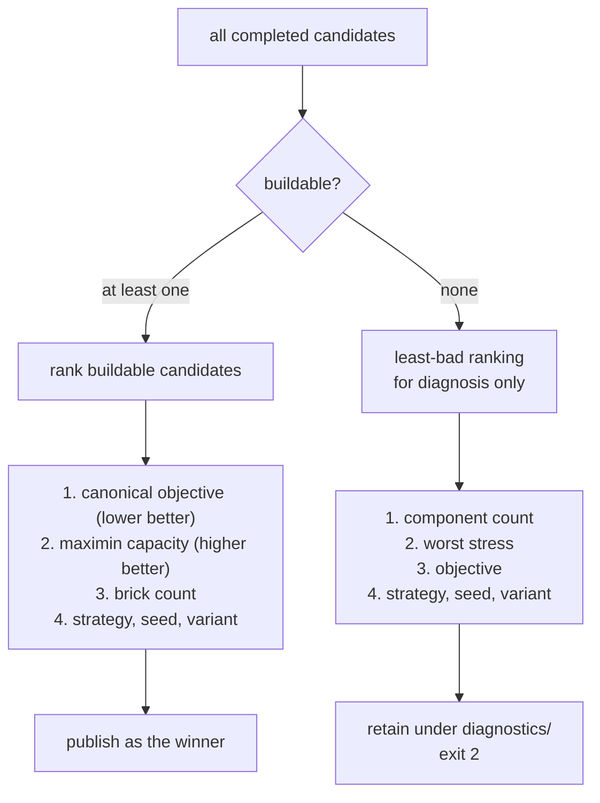

# Quality tiers and budgets

`bundle` does not run one placement algorithm — it runs a **sweep** of candidates in
parallel, gates them on buildability, ranks the survivors, and publishes one winner.
`--quality` chooses how large that sweep is; `--duration` chooses how long it may
take.

---

## The four tiers

| Tier | Strategies | Seeds | Default budget | Global exact? |
| --- | --- | ---: | ---: | --- |
| `fast` | `greedy` only | 0 | 120 s | No — never |
| `balanced` *(default)* | `beauty`, `bond`, `fast`, `greedy`, `kollsker`, `luo`, `smga` | 0 | 900 s | Yes, when preflight qualifies |
| `exhaustive` | all seven | 0, 1, 2 | **`--duration` required** | Yes, when preflight qualifies |
| `direct` | the single configured `placement.strategy` | 0 | — | n/a (no sweep) |

```sh
legolization bundle model.obj                              # balanced
legolization bundle model.obj --quality fast               # quick preview
legolization bundle model.obj --quality exhaustive --duration 3600
legolization bundle model.vox --quality direct --set placement.strategy=luo
```

`exhaustive` refuses to guess a budget for you:

```text
error: exhaustive quality requires an explicit --duration
```

That is deliberate. Triple-seeding every strategy on a mesh model can run for hours,
and only you know how long you are willing to wait.

### `--duration` always wins

When supplied, `--duration SECONDS` **overrides the tier default in every tier**,
including `fast` and `balanced`. It is the soft deadline for the whole candidate
stage, not a per-candidate limit.

```sh
legolization bundle model.obj --quality fast --duration 600   # slow "fast" tier
```

---

## Colour variants

Independently of the strategy list, `bundle` compares up to three colour treatments
of the same target:

| Variant | `placement.colour_mode` | `input.dither` |
| --- | --- | --- |
| `hard` | hard | off |
| `soft` | soft | off |
| `soft-dither` | soft | on |

Total candidates = `strategies × seeds × variants`, plus one for global exact at
seed 0 when it qualifies.

Two collapses keep this from being wasteful:

- A single-colour target collapses to `hard` only — soft colour has nothing to trade.
- `soft-dither` collapses into `soft` when dithering produced a byte-identical grid.

Collapsed variants are recorded in `bundle.json` under the candidates stage, so you
can see what was skipped and why.

---

## Global exact placement

Whole-model exact placement solves the entire model as one MILP with a connectivity
certificate. It is optimal within its objective but only tractable on small models,
so it is gated by a **preflight check** against `placement.exact.max_cells`
(default 256 filled cells).

- It is included in `balanced` and `exhaustive` sweeps *only* when preflight passes.
- It is **never** included in `fast`.
- It is never raced across seeds — it is deterministic, so extra seeds would be
  identical work.

When preflight declines, `bundle.json` records the reason. See
[Exact methods](../theory/placement/exact.md).

---

## How the winner is chosen

Selection is lexicographic, and the buildability gate comes first.



Every candidate is scored against the **canonical hard, no-dither reference grid**.
This matters: without it, a soft or dithered candidate would be graded against the
easier target it created for itself.

The full per-candidate table lands in `comparison/report.json`:

```json
{
  "schema": "legolization.bundle-comparison/v1",
  "winner": {"strategy": "bond", "seed": 0, "variant": "hard"},
  "reason": "buildable, best canonical objective 0.1234 (colour error 0.0, 118 bricks) among 5 buildable candidate(s)",
  "buildable": true,
  "candidates": [ ... ]
}
```

When nothing is buildable the sweep still names a winner — fewest components, then
lowest stress. Its purpose is **diagnosis, not shipping**, and the bundle exits 2
with the model under `diagnostics/best-rejected.ldr`.

---

## The material retry ladder

When a model is not buildable as-is, the usual cause is too little material: a
one-brick shell cannot carry the load its shape implies. `--retry-materials` walks a
fixed three-rung ladder, adding material at each rung:

| Rung | Configuration override |
| --- | --- |
| `four-plate` | `geometry.shell_plates=4`, `geometry.hollow=true` |
| `six-plate` | `geometry.shell_plates=6`, `geometry.hollow=true` |
| `solid` | `geometry.hollow=false` |

```sh
legolization bundle model.obj --retry-materials --duration 1800
```

`--duration` is **required** here — the ladder needs a total to divide.

Budget sharing is cumulative rather than fixed: rung *i* gets a soft deadline at
`start + (i+1) × total/3`, so a rung that finishes early hands its unused time
forward. A rung reached with no time left is recorded as
`skipped ("budget exhausted")` rather than being run badly.

The ladder stops at the **first buildable rung**. Its `model/` and `bom/` are
promoted from `rungs/<name>/` to the retry bundle root, and the other rungs' bundles
are kept for inspection.

!!! note "It changes what the model looks like"

    Thicker shells and solid fills use more parts and more mass, and `solid` can
    change the interior layering enough to alter the instruction sequence. The ladder
    is a fallback for *unbuildable*, not a general quality knob.

---

## Repair effort (a different budget)

`analyze --repair` has its own tier flag, `--effort`, which budgets the **repair
search** rather than a placement sweep:

| Tier | Budget |
| --- | ---: |
| `fast` | 60 s |
| `balanced` *(default)* | 300 s |
| `exhaustive` | requires an explicit `--time-budget` |

An explicit `--time-budget` always wins over the tier. Inside that budget, the
counterfactual analysis gets the first slice — `min(60 s, 25% of budget)` — and the
redesign search gets the remainder.

See [`analyze`](cli/analyze.md).

---

## Choosing a tier in practice

| Situation | Tier |
| --- | --- |
| "Does this input even work?" | `fast` |
| Normal use | `balanced` (just omit the flag) |
| Final version of something you will actually build | `exhaustive` with a budget you can afford |
| Benchmarking one strategy, or reproducing a specific result | `direct` |
| Model failed with exit 2 | `--retry-materials --duration N` |

Runtime scales hard with model size, not with tier alone. Synthetic test shapes take
seconds; a mesh at 28–36 studs can take tens of minutes **per strategy**. Run large
sweeps in the background — progress lines only print when stderr is a TTY, so a
backgrounded run is silent until it finishes. Check `bundle.json`, not the console.
