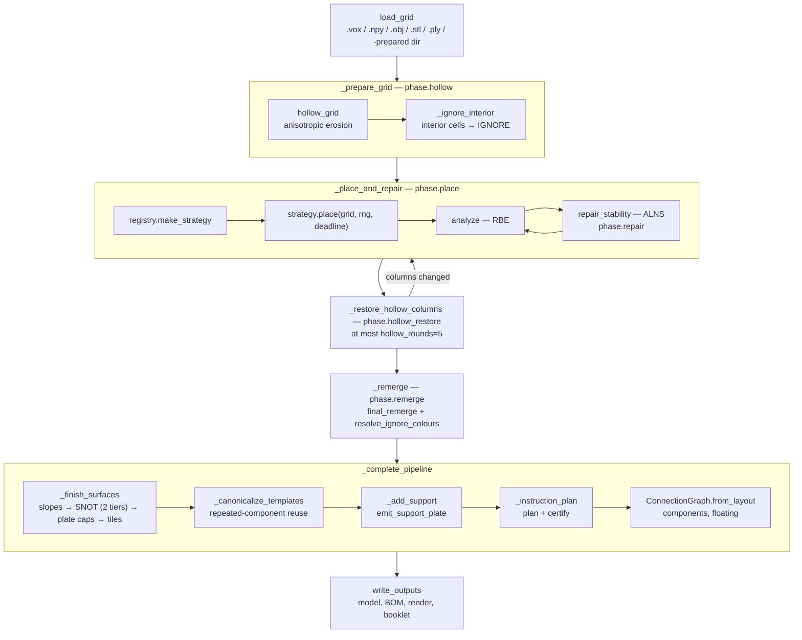
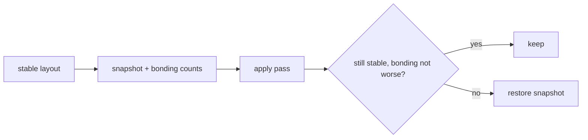

# The pipeline

The orchestration lives in `src/legolization/pipeline.py`. `main.py` and
`__main__.py` are shims; the CLI layer wraps this.

---

## Phase order



Each phase is instrumented with a named span, so a profile attributes time to
`phase.place`, `phase.repair`, `phase.remerge`, and so on.

---

## Loading

`load_grid` dispatches on the file suffix. A `-prepared` bundle directory
short-circuits to its `normalized.npy` at `plates_per_voxel=1`, because the
normalization already happened.

The mesh front end (`mesh.py`) does something worth noting. The mesh is first
oriented z-up using **proper 90° rotations only** — never an axis swap, which would
mirror the model — then **pre-stretched 2.5× vertically** before a single surface
voxelization at the stud pitch, followed by a fill.

Because the stretch precedes voxelization, every plate layer samples the true surface
rather than replicating its neighbour. Mesh grids are aspect-correct by construction.
This contrasts with `grid._stretch_layers`, the voxel path, which genuinely does
replicate.

### Choosing a voxelization

`_select_voxelization` sweeps the `auto_scale` stud range against
`grid_phases ∈ {1,2,4,8}` half-cell offsets and takes the lexicographic minimum of

$$
(\;\mathrm{surface\_error},\; -\mathrm{feature\_ratio},\; -\text{constructibility},\; \mathrm{target\_studs},\; \text{phase}\;)
$$

| Term | Definition |
| --- | --- |
| `surface_error` | Mean KD-tree distance from surface-voxel centres to mesh vertices, normalized by pitch |
| `feature_ratio` | $\lvert\text{unique nearest vertices}\rvert / \lvert\text{surface voxels}\rvert$ — detail retention |
| `constructibility` | `bonds / filled`, where bonds are face-adjacent filled pairs on all three axes |

Heuristic, tuned. Guards cap the grid at 512 cells per dimension and 16 M cells total.

`_mesh_annotations` additionally computes a signed distance field, its gradient as
local surface normals, and `|laplace(signed)|` as curvature. Surface cells in the top
quartile of curvature become `detail_candidates`, consumed later by the SNOT pass and
by exact placement's special-part gate.

---

## Hollowing

`hollow.py` is 65 lines and does one thing:

```python
codes[core_mask(shell_studs, shell_plates)] = EMPTY
```

The subtlety is in `core_mask`. Cells are 1 stud × 1 stud × 1 plate — anisotropic. So
"one brick of shell" is `margin_xy = 1, margin_z = 3`, and the erosion is
correspondingly anisotropic: a common erosion to `min(xy, z)` followed by axis-only
extensions.

Defaults of 1 stud lateral and 3 plates vertical put the shell close to Luo's ~3-voxel
shells.

### Restore as the last resort

`restore_columns` runs only after ALNS repair has failed. For every grid column within
Chebyshev radius `hollow_restore_radius` (default 2) of a *trouble* column — one
containing a brick in `stability.unstable_ids` — it restores the original interior
fill as `IGNORE` cells.

Two design choices matter:

- Restored cells are **colour-free**, so any brick colour may cover them and merges do
  not fragment on invisible boundaries.
- The function **returns the identical object** when nothing changed, which is the
  outer loop's termination signal.

The ordering — repair first, restore second — is deliberate. ALNS repair rearranges
bricks at *constant volume*; restore *adds material*. Trying the free fix before the
expensive one is the whole point.

---

## The guard pattern

Every quality-improving pass runs inside `_guarded_finish`:

1. If the current verdict is stable, snapshot `layout.copy()` and record the
   stud-graph component count and floating-brick count.
2. Apply the pass.
3. Re-run `analyze` and re-measure the stud graph.
4. If the verdict regressed — **or the component count or floating count
   increased** — `layout.replace_with(guard)`.



The bonding check is not decoration: a stable verdict alone is weaker than the
buildable predicate. A carve-and-refill pass can sever the only bond between two
grounded halves, and each half stands perfectly well on its own — the solver stays
happy while the model now comes apart in your hands. The guard therefore holds every
pass to the same standard as [the SNOT re-bond guard](placement/finishing.md#the-re-bond-guard):
components and floating bricks must not increase.

This is why finishing passes are safe to enable by default. Slopes, tiles, SNOT
cladding, and template canonicalization can each make a model prettier or cheaper;
none of them can make a buildable model unbuildable.

`_canonicalize_templates` uses the same pattern and additionally records
`status="rejected_stability"` provenance rows, so a rejected reuse is visible rather
than silent.

### Two-tier SNOT

The SNOT pass gets a refinement of the guard. It runs in two stability-checkpointed
tiers:

| Tier | Donors |
| --- | --- |
| 1 | Inside their own columns only |
| 2 | Wall-spanning donors permitted |

A tier-2 failure retreats to the **tier-1 checkpoint**, not to zero. Before this
existed, a measured run on the mushroom model accepted 86 SNOT mounts and then
reverted all of them because tier 2 tipped the verdict — losing tier 1's genuine
improvements along with tier 2's overreach.

---

## The buildable predicate

```python
buildable = stability.stable and component_count == 1 and floating_count == 0
```

Note that `component_count` and `floating_count` come from `ConnectionGraph`, which
computes them with **deliberately different semantics**:

- `component_count()` counts components over **stud connections between bricks only**.
  Ground contact does not join components — two grounded but mutually disconnected
  towers are two components. This is Luo's single-connectedness condition.
- `floating_ids()` uses **ground-merged reachability** — bricks with no stud path to
  the ground.

A model can have zero floating bricks and still be two components. Both conditions are
required.

---

## Where each phase can fail

| Phase | Failure | Response |
| --- | --- | --- |
| `load_grid` | Unsupported format, ambiguous multi-model VOX, conflicting overlaps | Error, exit 1 |
| `place` | No feasible exact cover | `PlacementInfeasibleError` → exit 2 |
| `place` (exact) | Candidate/cell/time cap | `fail` → exit 4; `fallback` → switch strategy; `continue` → run to deadline |
| `repair` | Deficit not reducible in `max_rounds` | Fall through to hollow restore |
| `hollow_restore` | `hollow_rounds` exhausted | Report unbuildable, exit 2 |
| `remerge`, finishing | Regression | Guarded revert; pipeline continues |
| `instruction_plan` | Unstable prefix under `strict` | Raise; under `warn`, emit with a warning |
| `write_outputs` | No renderer | Per `--render` policy — see [Rendering and parts](../guide/rendering-and-parts.md) |

---

## Determinism

Everything is seeded, default `0`. Exact placement deletes its RNG reference outright
— enumeration and MILP ordering are fully deterministic — which is why racing it
across seeds is a hard error rather than merely wasteful.

The sequencer is fully deterministic with no RNG at all: every ordering key ends in a
brick id or a deterministic chunk position.

Mesh voxelization and the synthetic corpus generators are deterministic, so identical
inputs give byte-identical outputs. Manifests contain no wall-clock timestamp for the
same reason.

The one place determinism is qualified: solver-tolerance-level alternative optima can
differ across solver versions on degenerate instances. That is handled by a boundary
guard that re-solves near-threshold verdicts on the exact cold path — see
[Warm solving](stability/warm-solving.md).
