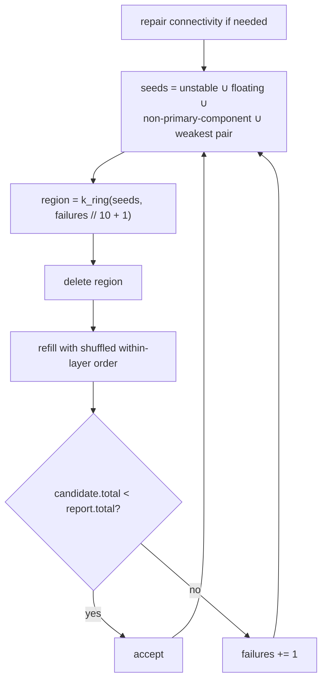

# Constructive heuristics

Two strategies that build a tiling in one pass, committing to each placement as they
go. Both descend from Kollsker & Malaguti's remainder-lookahead heuristic.

---

## The lookahead function $h(r)$

**Source:** Kollsker & Malaguti, EJOR 289(1):270–284, 2021 · `placement/greedy.py`
{ .provenance }

The idea: when choosing a placement, do not just count the cells it covers — count how
many parts the *remainder* will cost.

Let $h(r)$ be the minimum number of parts needed to cover exactly $r$ contiguous studs
using the catalog's available lengths $(1, 2, 3, 4, 6, 8)$.

$$
h_{\text{exact}}(r) = \min\Big\{\,|P| \;:\; P \subseteq \text{lengths},\; \textstyle\sum P = r \,\Big\}
$$

computed by an equality-DP and memoized. For large $r$ this becomes expensive, so
Kollsker's $h_3$ approximates it:

$$
h_3(r) =
\begin{cases}
h_{\text{exact}}(r) & r < \rho\\
\left\lfloor \frac{r - \rho}{8} \right\rfloor + 1 + h_3\big(r - 8\lfloor\cdot\rfloor\big) & r \ge \rho
\end{cases}
$$

with $\rho = 25$ — peel 8-stud chunks while the remainder is large, then solve the tail
exactly. Since 8 is the longest available length, peeling it is optimal whenever enough
length remains.

!!! note "An honest assessment of what $h(r)$ buys"

    The module docstring says it plainly: $h(r)$ **rarely lowers the part count on its
    own**. Its real value is turning a 6+1-versus-4+3 decision into a *tie* — which
    the bond term then breaks toward staggered seams.

    It is a tie-generator more than an optimizer, and the strategies are built around
    that understanding.

---

## `greedy`

**Source:** hybrid — Kollsker's $h(r)$ + a stretcher-bond term, with a Luo-style
delete-and-rebuild loop · `placement/greedy.py`
{ .provenance }

The only strategy that works in 3D directly rather than layer by layer.

### Fill

A bottom-up seed sweep in deterministic $(z, x, y)$ order. For each uncovered seed,
enumerate every valid placement of every brick and plate, then select the lexicographic
maximum of

$$
\big(\,-\mathrm{parts\_estimate},\;\; \mathrm{bond\_score},\;\; |\text{cells}|,\;\; 10^{-3}\cdot\text{jitter}\,\big)
$$

The parts estimate is the candidate itself plus what its two ends will cost:

$$
\mathrm{parts\_estimate} = 1 + h_3(\mathrm{left\_run}) + h_3(\mathrm{right\_run})
$$

where the runs are contiguous same-colour uncovered cells beyond the candidate's ends
along its long axis, at the seed's row and layer.

### Bond score

$$
\mathrm{bond\_score} = \big|\text{distinct supports below}\big|
  \;-\; \alpha_1 \cdot \frac{\sum_{\text{borders}} \exp(-\alpha_2 d)}{|\text{borders}|}
$$

with $d$ the stud distance from a border to the nearest seam in the layer below, along
the border normal, scanned within a $\pm 3$ stud window. $d = 0$ is a continued
(stack-bond) seam.

So a placement is rewarded for tying together many bricks below, and penalized for
lining its own edges up with the joints underneath.

### Reinforce

After the fill, a Luo-style destroy-and-rebuild loop:

The ring grows every 10 failures — Luo's growing-neighbourhood schedule, $N = 10$.
`fail_max = 20`.

### The component floor

A subtle correctness point: the achievable component target is **not always 1**.
Disjoint voxel islands in the input can never merge, no matter how well you place
bricks. So `_grid_component_count` computes the grid's own 6-connected island count and
the reinforcement loop targets *that*, rather than spinning forever trying to reach 1.

### Cost and limits

Candidate enumeration is $O(|\text{parts}| \times |\text{orientations}| \times
|\text{cells per part}|)$ per seed. The refinement is iteration-bounded, and `greedy`
**explicitly ignores the deadline** — it deletes its deadline reference. It is fast
enough not to need one, and the shipped example goldens pin its exact output bytes.

---

## `bond`

**Source:** Kollsker & Malaguti's constructive heuristic ·
`placement/layered/bond.py`
{ .provenance }

The per-layer constructive tiler, and the default fallback for `auto` above the exact
cell cap.

### Cost

Each candidate rectangle is scored, and the cheapest is committed:

$$
c = 1 + h_3(\text{remaining runs}) + \sum_{\text{2 borders}} \alpha_1 \exp(-\alpha_2 d) + U[0, e_{\max})
$$

| Term | Role |
| --- | --- |
| $1$ | This part |
| $h_3(\cdot)$ | Summed over probe rays off both ends, per transverse row |
| $\alpha_1 e^{-\alpha_2 d}$ | Stagger penalty, $d$ to the nearest below-**seam or gap** within a 4-stud window |
| $U[0, 1)$ | Jitter, to diversify ties |

Note that the stagger term counts **gaps** as well as seams. A hole below is just as
bad a place to line an edge up with as a joint.

!!! warning "Seam keying is off-by-one on purpose"

    A seam between below-columns $p$ and $p+1$ is keyed by $p$. So the *trailing*
    border of a rectangle probes from $x_0 - 1$, not $x_0$. Getting this wrong
    silently halves the stagger term's effect on one side.

### Scan randomization

A random axis and a random primary/secondary flip give **eight** distinct scan orders.
That is the strategy's only source of diversity across seeds — everything else is
deterministic given the order.

### Incomplete-construction repair

Kollsker's repair, applied after the pass:

1. Collect adjacent pairs along the scan axis whose combined axis length is $< 8$.
2. Remove them.
3. Refill in the **inverted** direction.
4. Keep the result only if it uses strictly fewer parts.

Short adjacent runs are exactly the signature of a greedy scan that committed too early
and stranded a remainder. Re-running that stretch backwards often merges them.

### Adaptation from the paper

The paper's model is one-dimensional rows. Here it is generalized per-row along the
layer's scan axis, which is the natural 2D lift and is documented as such.

### Cost

Single-pass constructive, $O(|\text{columns}| \times |\text{candidates per column}|)$.
Like `greedy`, it deletes its deadline reference — it is fast enough not to need one.

---

## Comparing the two

| | `greedy` | `bond` |
| --- | --- | --- |
| Works in | 3D directly | Layer by layer |
| Diversity source | Jitter + shuffled rebuild | 8 scan orders |
| Refinement | Destroy-and-rebuild around weak spots | Short-run repair |
| Uses physics during search | ✅ — seeds come from `unstable_ids` | ❌ — geometry only |
| Deadline-aware | ❌ | ❌ |

`greedy` is the only heuristic that consults the RBE *during* placement rather than
after. That is why it is the `fast` quality tier's sole strategy: one pass, physics-
aware, and cheap.

`bond` produces better seam quality on walls and slabs, which is why it is the
fallback when exact placement declines.
