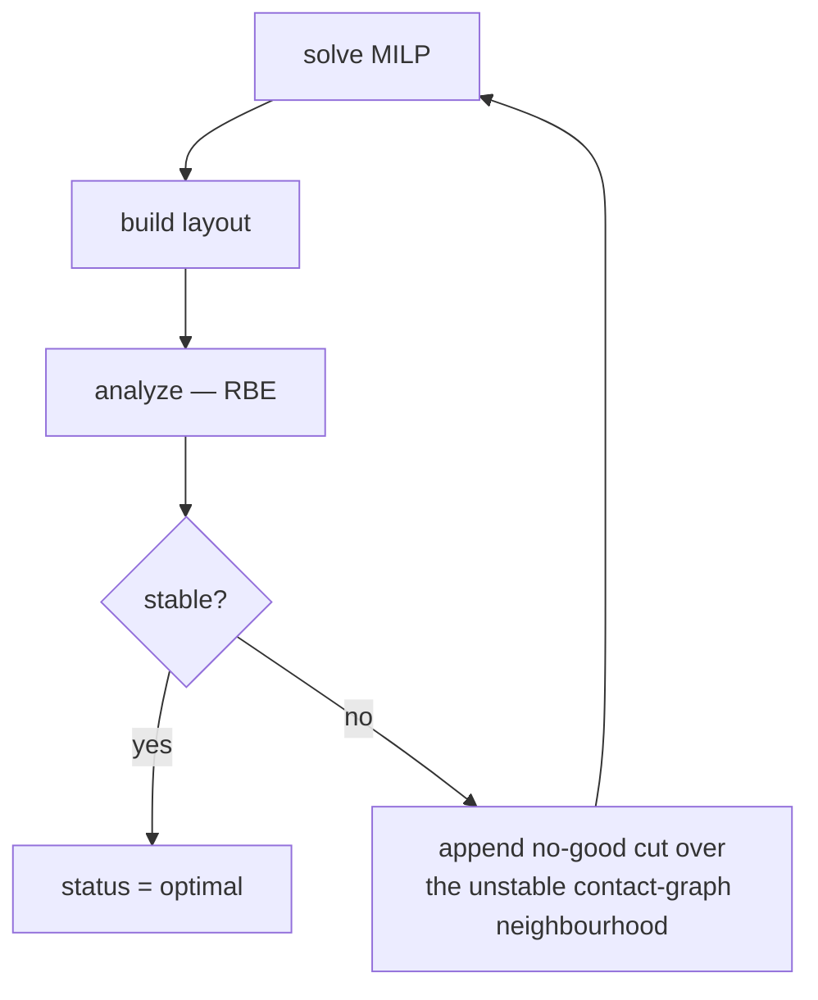

# Exact methods

Two strategies that solve a mixed-integer program rather than search heuristically.
They are the only ones that can claim optimality — each within a carefully bounded
scope.

---

## `kollsker`

**Source:** Kollsker & Malaguti, EJOR 289(1):270–284, 2021, eqs. 1–3 (exact set
partitioning), scoped per layer per the paper's own fix-and-optimise matheuristic
(eqs. 26–39) · `placement/layered/kollsker.py`
{ .provenance }

### The model

Binary $x_b$ per feasible placement, minimize part count subject to exact cover:

$$
\begin{aligned}
\min\quad & \sum_b x_b \\
\text{s.t.}\quad & \sum_{b \,\ni\, v} x_b = 1 \qquad \forall v \in \text{component} \\
& x_b \in \{0, 1\}
\end{aligned}
$$

Solved **per 4-connected component** of each layer problem. That scoping is what keeps
the binary count in the hundreds-to-few-thousands where a MILP is fast; a whole layer
of a large model would be intractable.

### Two-stage lexicographic solve

| Stage | Objective | Constraint |
| --- | --- | --- |
| 1 | $c = 1$ for all $b$ | exact cover |
| 2 | $c = -(\mathrm{bond\_weight}\cdot\text{bond} + \mathrm{ground\_weight}\cdot\text{grounding}) + 10^{-6} \cdot \text{rank}$ | exact cover **and** $\sum_b x_b = N^\star$ |

Stage 1 finds the minimum part count $N^\star$. Stage 2 maximizes quality *at that
optimum*, with the count **pinned**.

The pinning is the point: **brick economy is never traded for bond quality.** Grounding
and staggering are purely how the equal-count freedom is spent. The $10^{-6}\cdot$rank
term makes the choice among remaining ties deterministic.

### Bond reward

$$
\text{bond}(r) = \frac{\sum_{\text{seams straddled}} p \;-\; 0.5\sum_{\text{seams aligned with a border}} p}{2(w + l)}
$$

Straddling a seam below is rewarded; lining a border up with one is penalized at half
weight. Normalizing by the perimeter keeps a large rect from collecting reward simply
by being large.

$p$ is the engine's `seam_priority` — see
[The layered engine](layered-engine.md#seam_priority).

### Budgeting and fallback

`layer_time_s = 10.0`, and stage 1's wall time is **charged against the same
allowance**, so a slow stage 1 does not get a free stage 2 on top. An expired deadline
causes the component to be *skipped* rather than floored to a degenerate solve;
`_MIN_SOLVE_S = 0.05`.

Fallback to `BondStrategy.tile` happens at **component granularity** on:

- candidate blowup (`candidate_limit = 20_000`),
- timeout,
- solver failure.

So one hard component does not cost the whole layer its optimality.

### Deliberate omission of $h_3$

The lookahead is absent, and the docstring explains why: $h_3$ guides *sequential
commitment*, which simultaneous exact cover subsumes. There is no remainder to estimate
when you are choosing all placements at once.

More strongly: any heuristic tiling is a feasible point of this model, so the per-layer
optimum is **never worse** than the constructive bond pass on the same component.

### The Kollsker drift

Per-layer optima are the smallest *and* the least fragmented tilings — and yet the
strategy finished **worse end-to-end** than heuristics that produce worse layers.

The cause was `improve_connectivity`'s count-blind acceptance: a single accepted random
rewrite added **+179 bricks** to mushroom's 112-brick per-layer minimum. A tiling with
nothing wasted has no slack, so any rewrite that ignores part count destroys
disproportionately more of it.

Fixed by best-of-$k$ bridging draws plus a `BridgeSynthesizer`. Full measured story:
[Kollsker drift report](../../reports/kollsker-drift-report.md).

The general lesson is worth stating: **local optimality is not composable across
phases.** A phase that optimizes one criterion hands the next phase less room, and the
next phase must be taught to respect that.

---

## `global-exact`

**Source:** not from a single paper — a whole-model exact-cover MILP with rooted
single-commodity connectivity flow and a stability cutting-plane loop ·
`placement/global_exact.py`
{ .provenance }

The only strategy that reasons about the whole model at once, and the only one whose
result can be called optimal in a global sense.

### Candidate generation

For every eligible part (`BRICK`, `PLATE`, `TILE`, `SLOPE`, `SNOT`, `SPECIAL_SNOT`,
excluding parts with a `mount_normal`), every orientation, and every anchor placing a
filled cell on a target cell. Deduplicated by
`(part_key, x, y, layer, yaw, colour)`.

A candidate is valid when `filled ⊆ target`, no cell is below ground, and
`merge_colour` is defined over its cells (`IGNORE` resolving to code 7).

`SPECIAL_SNOT` candidates are reserved for mesh `detail_candidates` — the high-curvature
surface cells identified during voxelization. Special geometry is for detail, not for
bulk fill.

### Variables

| Variable | Domain | Per |
| --- | --- | --- |
| $x_i$ | $\{0,1\}$ | candidate placement |
| $y_p$ | $\{0,1\}$ | connection pair |
| $f_e$ | $\ge 0$ | directed arc |
| $r_g$ | $\ge 0$ | grounded candidate root arc |

### Constraints

**Exact cover and collision:**

$$
\sum_{i \,\ni\, \text{cell}} x_i = 1 \quad \forall\text{cell} \in \text{target}
$$

$$
x_l + x_r \le 1 \quad \forall (l, r) \text{ exactly intersecting}
$$

Collision pairs are found by coarse 20/8-LDU bucketing followed by exact
`boxes_intersect` — the bucketing prunes, the exact test decides.

**Connectivity**, as a single-commodity flow certificate:

$$
y_p \le x_l, \qquad y_p \le x_r, \qquad x_l + x_r - y_p \le 1
$$

$$
f_e \le M y_p, \qquad r_g \le M x_g, \qquad M = |\text{candidates}|
$$

$$
\sum_{\text{in}} f - \sum_{\text{out}} f - x_i = 0 \quad \forall i
$$

The first three linearize $y_p = x_l \wedge x_r$ — an arc may carry flow only when both
its endpoints are selected. The conservation row says each selected candidate consumes
exactly one unit of flow, rooted at a ground-seated candidate. A selected candidate with
no path to a root cannot balance its row, so the model is infeasible — which is exactly
the connectivity requirement, expressed linearly.

### Objective

$$
c_i = \sigma \cdot (1 \text{ or } m_i) + \varepsilon \cdot i, \qquad
c_{y_p} = -\mathrm{BOND\_REWARD} \cdot \text{contacts}(p)
$$

$$
\sigma = \max\!\left(10^6,\;\; \mathrm{contact\_total} + \varepsilon\frac{n^2}{2} + 1\right)
$$

with $\varepsilon = 1$ (`RANK_EPSILON`) and `BOND_REWARD` $= 1$.

!!! success "A lexicographic order encoded in one linear objective"

    $\sigma$ is chosen so that the bond reward and the deterministic rank tiebreak can
    **never** flip the primary brick-count or mass objective. The bound is exactly the
    maximum possible total of the secondary terms, plus one.

    So the solver optimizes part count first, bond quality second, and index order
    third — in a single MILP, without a two-stage solve.

### The stability cutting plane

The cut is $\sum_{i \in S} x_i \le |S| - 1$, where $S$ is the **unstable
neighbourhood** — `unstable_ids ∪ weakest_pair` plus one ring of support-graph
neighbours — not the whole layout.

Cutting the whole selection would forbid one specific answer and learn almost nothing.
Cutting the neighbourhood forbids the *local pattern* that failed, which generalizes.
It falls back to the full selection only when the region is empty.

### Limits and policy

| Cap | Default |
| --- | ---: |
| `max_cells` (preflight) | 256 |
| `max_candidates` | 100 000 |
| `time_limit_s` | 60 |
| `max_stability_cuts` | 256 |

`limit_policy` decides what a limit means:

| Policy | Behaviour |
| --- | --- |
| `fail` *(default)* | Raise `ExactPlacementLimitError` → exit 4 |
| `fallback` | Delegate to `fallback_strategy` (`bond`/`fast`/`greedy`), record `ExactOutcome(status="fallback")` |
| `continue` | Keep going to the deadline; **requires `placement.time_budget_s`** |

`preflight_reason` is the shared gate used by both the `auto` selector and the bundle
planner, which is why `bundle.json` can tell you exactly why exact placement was not
attempted.

Infeasibility — as opposed to a limit — raises `PlacementInfeasibleError` and exits 2.
The distinction matters: a limit means "we ran out of budget", infeasibility means "no
such tiling exists".

### Determinism

`global-exact` deletes its RNG reference outright. Enumeration order and MILP variable
order are fully deterministic, which is why racing it across seeds is a hard error
rather than merely wasteful.

---

## What "optimal" means here

Precision matters, because both strategies use the word in a bounded sense.

| Strategy | Optimal over | **Not** optimal over |
| --- | --- | --- |
| `kollsker` | Part count within one 4-connected component of one layer | The whole layer's interaction with other layers; the whole model; anything after connectivity repair |
| `global-exact` | Its objective over the whole model, within the enumerated candidate set and its caps | Physics — stability enters only through iterative cuts, so the result is *a* stable optimum of the cut-augmented model, not the stable layout with provably minimal parts |

Neither optimizes the objective $J$ that ranks candidates in the bundle sweep. An
exact solver can lose the sweep to a heuristic, and that is not a bug — it optimized a
different, narrower thing.
