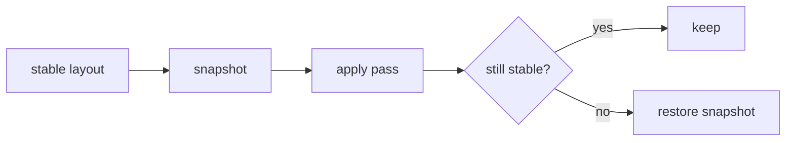

# Finishing passes

**Source:** `placement/slopes.py`, `placement/snot.py`, `placement/templates.py` ·
all built on [`carve`](merge-and-repair.md#carve-the-transactional-primitive)
{ .provenance }

Four passes that improve a layout after placement and repair have finished. All are
guarded — a pass that would flip a stable layout to unstable is reverted wholesale.

---

## Slopes

`apply_slopes` substitutes slope parts for stepped brick corners while **preserving
target occupancy exactly**.

### The shape-preservation predicate

A slope candidate is admissible iff:

- every `filled` cell of the slope is **inside** the shape, **and**
- every `void` cell of the slope is **outside** the shape and unoccupied.

That second clause is the whole trick. A slope's void is the wedge it removes; if that
wedge is outside the target shape anyway, replacing a stepped stack with a slope changes
nothing about what the model occupies — it only changes how the surface reads.

### Ordering and ranking

One full sweep per candidate part, **largest filled profile first**:

| Part | Profile |
| --- | --- |
| 45° 2×2 | largest |
| inverted 45° 2×2 | |
| 33° 3×1 | |
| 45° 2×1 | |
| inverted 45° 2×1 | smallest |

Largest-first ensures a big slope is never pre-empted by a smaller earlier match at the
same location.

Within a part, candidates rank by

$$
(-\mathrm{fill\_size},\;\; \mathrm{normal\_error},\;\; \mathrm{part\_key},\;\; z,\;\; \dots)
$$

where

$$
\mathrm{normal\_error} = 1 - \big\langle\, \hat{n}_{\text{observed}},\; \hat{n}_{\text{expected}} \,\big\rangle
$$

and the expected face normal is $(h\sin\theta,\; v\cos\theta)$ with $v = -1$ for
inverted parts. The observed normal comes from the mesh annotations computed during
voxelization — so on mesh inputs, slope orientation follows the actual surface rather
than a guess from the voxel steps.

### The remainder cap

`_MAX_REMAINDER = 4`, and this is a **measured** limit, not a guess. On suzanne at 16
studs:

| Cap | Slopes placed | Outcome |
| ---: | ---: | --- |
| 0 | 2 | stable |
| 2 | 10 | stable |
| 4 | 29 | stable, worst RBE 0.137 |
| 6 | 44 | stable |
| 8 | 51 | **collapses** |

The structure survives through 6 and fails at 8. The cap sits at 4 with margin.

The mechanism: carving a slope out of a brick leaves a remainder that must be re-tiled
with smaller parts, and small parts bond worse. Past some density, the surface becomes
a raft of weakly-bonded fragments.

### Tiles and plate caps

`apply_tiles` swaps exposed plates (those whose studs are unused) for tiles, via
`refill_tiling` restricted to the tile category. Purely cosmetic; occupancy-preserving.

`apply_plate_caps` splits exposed 3-plate bricks into three plates. **Opt-in**, because
it changes layering and part count — a plate cap is not a free cosmetic improvement the
way a tile is.

---

## SNOT cladding

`apply_snot` clads tall flat wall faces with sideways tiles on **exact connector
geometry**, using real receiving parts: 87087 carriers, 4070 headlight bricks, and
99781 inverted brackets. Every mount is priced by the same RBE physics through genuine
lateral stud contacts — there is no special-cased "cladding is free" path.

Opt-in via `finishing.snot`.

### Finding sites

Brick-aligned 3-plate wall windows whose outward approach is clear to the grid edge, in
vertical runs of at least 2.

The clearance test matches `blocking`'s insertion model exactly — a mount you cannot
physically slide in is not a mount. An earlier version clad enclosed cavities, which
looked fine in a render and could not be built.

### Running-bond stagger

Windows on a wall line are paired along the wall with a stagger index
$(z \bmod 3\ \text{slab}) \bmod 2$, so cladding courses **cross the seams below**
rather than stacking on them. The same bonding principle as the brickwork underneath.

### Two-column and fallback sites

| Site | Parts |
| --- | --- |
| Two-column | `11211` two-stud carrier + sideways 1×2 tile |
| Fallback, per column | `87087` + 1×1 tile |

### The re-bond guard

Every mount is validated on a copy and accepted only if the layout's **stud-graph
component count and floating count do not increase**.

!!! warning "Tier 1 converts only free-standing 1×1 wall columns"

    Carving a bracket out of a wall-spanning brick would destroy that brick's bonding
    contribution — the very thing holding the wall together. **Tier 1** refuses those
    donors rather than trading structure for surface detail. **Tier 2** (below)
    deliberately permits them, which is exactly why it runs under its own checkpoint:
    the bolder carves are attempted only after the safe ones are banked.

### Two-tier checkpointing

The pipeline runs SNOT in two stability-checkpointed tiers:

| Tier | Donor scope |
| --- | --- |
| 1 | Inside their own columns only |
| 2 | Wall-spanning donors permitted |

A tier-2 failure retreats to the **tier-1 checkpoint**, not to zero.

Before this existed, a measured mushroom run accepted **86 mounts and reverted all of
them** because tier 2 tipped the verdict — losing tier 1's genuine improvements along
with tier 2's overreach.

On revert, the reduced-QP screen may pre-empt the cold solve. That is safe *only*
because reverting restores an already-certified checkpoint, so the screen never authors
a verdict — see [the interlock](../stability/index.md#the-certification-interlock).

---

## Template canonicalization

`instantiate_repeated_templates` finds repeated components and reuses one derived
placement across all instances.

Components are matched up to **yaw, translation, and colour relabelling**:
canonicalization takes the lexicographic minimum over four yaws of the normalized cell
tuple with colours relabelled by first-appearance order, and the signature is that
tuple's SHA-256.

The cache key is content-addressed:

```text
(component_signature, catalog_hash, configuration_hash, physics_profile, algorithm_version)
```

so a different catalog, configuration, or physics profile can never produce a false
hit.

Statuses are deliberately fine-grained — see
[Representations](../representations.md#repeated-components). The one worth
understanding is **`local_miss`**: the cached placement is structurally valid but
collides *here*. That says nothing about its reusability elsewhere, so it must not
evict or poison the entry.

The pipeline adds a sixth status, `rejected_stability`, when the guard reverts an
applied template — so a reuse that was tried and undone is visible in the provenance
rather than silently absent.

---

## Why all of this is safe to enable by default

Every pass runs inside `_guarded_finish`:



Slopes and tiles are on by default because they cannot make a buildable model
unbuildable. SNOT and plate caps are **off** by default for a different reason: they
change part count, layering, and appearance enough that they should be a decision, not
a surprise.
