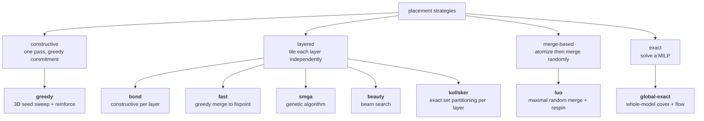

# Placement

**Source:** `src/legolization/placement/` · one shared objective, eight strategies
{ .provenance }

Placement chooses which parts cover which target cells. It is the combinatorial core
of the problem, and it is NP-hard even ignoring physics.

---

## The problem

Given target cells $V$ with colours, and a catalog of parts, choose a set of placements
$S$ such that:

$$
\sum_{b \in S,\; b \ni v} 1 = 1 \quad \forall v \in V \qquad \text{(exact cover)}
$$

with no two placements physically intersecting, every placement's colour compatible
with the cells it covers, the result a single stud-connected component, and every part
grounded — while minimizing part count or mass.

Exact cover alone is NP-hard. Connectivity adds a certificate. Physics couples the
discrete choice to a continuous optimization. That decomposition is why eight
strategies exist rather than one.

---

## The shared objective

Whatever a strategy optimizes internally, candidates are compared with one weighted
sum. All terms are normalized to roughly $[0,1]$; lower is better.

$$
J = w_{c}\,\frac{|S|}{|V|}
  + w_{s}\,\mathrm{max\_score}
  + w_{a}\,\mathrm{seam\_alignment}
  + w_{\ell}\,\mathrm{colour\_mismatch}
  + w_{p}\,\mathrm{perp\_error}
  + w_{y}\,\mathrm{sym\_error}
  + w_{k}\,\mathrm{speckle}
  + w_{r}\,\mathrm{profile}
$$

| Weight | Default | Term |
| --- | ---: | --- |
| $w_c$ `cost` | 1.0 | Parts per filled voxel |
| $w_s$ `stability` | **4.0** | Worst per-brick RBE stress |
| $w_a$ `aesthetics` | 0.5 | Seam alignment |
| $w_\ell$ `colour` | 1.0 | Colour mismatch |
| $w_p$ `perpendicularity` | 0.0¹ | Parallel-to-support fraction |
| $w_y$ `symmetry` | 0.25 | Global-plane imbalance |
| $w_k$ `speckle` | 0.0¹ | Exposed colour-junction changes |
| $w_r$ `profile` | 0.0¹ | Layer-to-layer footprint churn |

Stability dominates by design. ¹ Reported but unweighted: perpendicularity
measured *inverted* against the human corpora, and the two audition terms
have not passed their promotion gates — the evidence and the gates live in
[the beauty-term validation report](../../reports/aesthetics-validation.md).

### `seam_alignment`

The fraction of brick-pair interfaces repeated one plate up — i.e. seams that
*continue* rather than stagger. A stretcher bond scores 0.0; an $n$-course stack bond
scores $(n-1)/n$.

The counting rule matters: each pair is counted **once per vertical run, at the run's
top plate**. Without that, a brick-to-brick joint (three plates tall) would count three
times and outweigh a plate joint for no physical reason.

### `perpendicularity_error`

SM-GA's $n_p$, inverted: the fraction of rectangular support pairs whose long axes are
**parallel**. Perpendicular stacking ties the structure together across two axes;
parallel stacking does not. Square and 1×1 parts carry no direction and are skipped
rather than counted as either.

Measured against the external corpora, this term points the wrong way as a
*beauty* signal — official sets score worse than our output, and the
permutation-drift harness finds it blind to vandalism — so its default weight
is 0.0 and it is kept as a structural bonding diagnostic alongside
`seam_alignment`. Evidence:
[the beauty-term validation report](../../reports/aesthetics-validation.md).

### `symmetry_error`

Global-plane mirror symmetry: one mirror plane ($x$ or $y$) and one mirror
centre shared by the whole model, both from the footprint bounding box, scoring
the unbalanced-brick fraction under the better axis. A brick is balanced when a
same-shape, same-colour partner sits at the mirrored position in its own layer.

This corrects Min's per-layer $g_a$ (kept as `layer_symmetry_error`), whose
per-layer axis and centre choices score a staircase of individually symmetric
layers as perfect. The correction is validated on the human corpora: real sets
are strongly globally mirror-symmetric, and the global form detects
progressive vandalism with a larger effect than the per-layer form.

### `colour_speckle_error` and `profile_roughness` (audition terms)

`speckle`: of the exposed, adjacent cell pairs belonging to two different
bricks, the fraction whose colours differ. `profile`: the mean Jaccard
distance between consecutive layers' occupied-column sets. Both are computed
and reported at weight 0.0; each may gain a default weight only by passing the
population-separation and drift gates — which, so far, **neither does** (they
measure palette richness and shape complexity respectively, not beauty; the
validation report has the numbers).

### `connection_density`

Reported but not in $J$: $2\,|\text{distinct support edges}| / |S|$ — the average
number of bricks each brick is tied to.

---

## The strategy taxonomy



| Strategy | Class | Guarantee | Page |
| --- | --- | --- | --- |
| `greedy` | Constructive | None | [Constructive](constructive.md#greedy) |
| `bond` | Layered constructive | None | [Constructive](constructive.md#bond) |
| `fast` | Layered merge | Local optimum of its own cost | [Metaheuristics](metaheuristics.md#fast) |
| `smga` | Layered GA | None | [Metaheuristics](metaheuristics.md#smga) |
| `beauty` | Layered beam | None (beam, not A*) | [Metaheuristics](metaheuristics.md#beauty) |
| `kollsker` | Layered exact | **Minimum parts per layer** | [Exact](exact.md#kollsker) |
| `luo` | Merge-based | None | [Merge and repair](merge-and-repair.md#luo) |
| `global-exact` | Whole-model exact | **Optimal within its candidate set** | [Exact](exact.md#global-exact) |

---

## The registry

A flat `dict[str, StrategyFactory]` where
`StrategyFactory = Callable[[Catalog, PipelineConfig], PlacementStrategy]`.
`make_strategy(name, catalog=, config=)` raises `ValueError` listing known names.

The protocol is one method:

```python
class PlacementStrategy(Protocol):
    outcome: ExactOutcome | None

    def place(
        self,
        grid: VoxelGrid,
        *,
        rng: np.random.Generator,
        deadline: float | None,
    ) -> Layout: ...
```

The `rng` is a **NumPy `Generator`**, not `random.Random` — registered strategies
call NumPy-specific methods such as `rng.integers`, so a caller passing the
standard-library type gets an `AttributeError`.

!!! note "`strategy_names()` deliberately excludes `global-exact`"

    Comparisons and corpus sweeps must not race the exact solver. It is deterministic,
    so extra seeds are identical work, and its runtime profile is so different that
    including it would distort every sweep timing.

Each factory translates `PipelineConfig` fields into constructor keyword arguments, and
validates at *construction* time rather than against the frozen config — which is where
knobs like `connectivity_fail_max` (0 disables the connectivity pass, an ablation used
for drift diagnostics) get checked.

---

## Two invariants every strategy respects

### Bonding

Aligned vertical seams are the structural failure mode of brick construction. Every
strategy penalizes a seam that continues from the layer below, most via a
distance-decayed term:

$$
\text{penalty} = \alpha_1 \exp(-\alpha_2 d)
$$

where $d$ is the stud distance from a placement's border to the nearest seam
underneath, with $\alpha_1 = 4.0$, $\alpha_2 = 0.8$ (Kollsker's constants).
$d = 0$ means a continued seam and takes the full penalty.

### Colour compatibility

Two placements may only merge when `merge_colour` is defined — see
[Representations](../representations.md#sentinels-and-the-colour-lattice). Under `soft` colour mode,
merges that miscolour cells are accepted probabilistically; see
[Merge and repair](merge-and-repair.md#soft-colour-importance-sampling).

---

## What happens after a strategy returns

No strategy's output ships as-is:

1. **RBE physics** scores every brick.
2. **ALNS repair** rearranges bricks at *constant volume* around the deficit.
3. **Hollow restore** adds material back — only if repair failed.
4. **Re-merge** takes a final pass, including a plate re-phase candidate.
5. **Finishing** applies slopes, tiles, and optionally SNOT cladding.

Each is guarded: a pass that would flip a stable layout to unstable is reverted
wholesale. A strategy's job is a good *starting point*, not a final answer — which is
part of why the differences between strategies are smaller in finished models than
their descriptions suggest.

See [The pipeline](../pipeline.md) and [Finishing passes](finishing.md).
