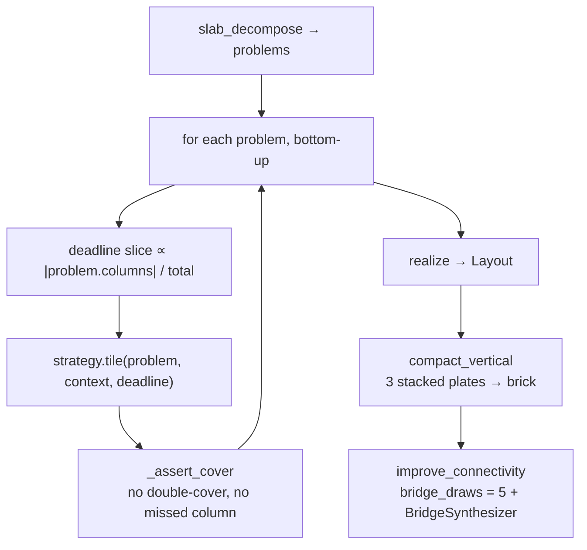

# The layered engine

**Source:** `placement/layered/engine.py` · shared substrate for `bond`, `fast`,
`smga`, `beauty`, and `kollsker`
{ .provenance }

Five of the eight strategies tile one layer at a time. The engine gives them a common
problem decomposition, a common notion of layer context, and common enumeration — so
each strategy only has to supply a `tile` method.

---

## Slab decomposition

The first job is deciding what is a **brick problem** and what is a **plate problem**.

Columns that are filled and colour-compatible across a full **absolute** 3-plate slab
form a brick `LayerProblem` with `height_plates = 3`. Leftovers become per-layer plate
problems with `height_plates = 1`.

$$
\text{slab}(z) = z - \big((z - \text{phase}) \bmod 3\big)
$$

!!! important "Absolute slabs, not relative"

    The slab boundary is absolute — anchored to $z \equiv 0 \pmod 3$, not to each
    column's own start. This mirrors `merge.atomize` exactly.

    The reason: brick atoms in *adjacent columns* must line up to be mergeable. If each
    column started its own slab wherever it happened to begin, neighbouring columns
    would have offset brick boundaries and could never merge into a 2×N brick.

Problems are ordered `(layer, −height_plates)` — bricks before plates within a layer.

---

## `Rect2D`

An inclusive footprint rectangle plus a colour. `long_axis` returns `None` for squares,
which is what lets the perpendicularity terms skip direction-free parts rather than
counting them arbitrarily.

---

## `LayerContext`

Everything a tiler needs to know about the layer below, computed once.

| Field | Meaning |
| --- | --- |
| `support_of` | column → brick id below (`GROUND_ID` at layer 0) |
| `gap_columns` | columns with nothing below |
| `seams` | joints in the layer below |
| `seam_priority` | how urgent each seam is to bridge |
| `long_axis_of` | the long axis of each supporting brick |
| `stackable_footprints` | plate footprints that could complete a 3-plate stack |
| `grounded_below` | columns whose support has a stud path to ground *at band time* |

### `seam_priority`

Min's stability priority $p$:

| Situation | $p$ |
| --- | ---: |
| The seam's two bricks are in **different components** | **1.0** |
| They share a direct supporter | 0.1 |
| Otherwise | 0.5 |

Bridging a seam between two different components is what *joins* them — that is
structurally urgent. Bridging a seam whose two sides already rest on the same brick
below buys almost nothing, because they are already tied together.

### `stackable_footprints`

Min's vertical-merge reward $g_v$, reinterpreted at plate resolution.

The catalog has no 2-brick-tall part, so "merge vertically" cannot mean choosing a
taller piece. What it can mean is: place this plate so that it *completes* a footprint
which the later `compact_vertical` pass can turn into a brick. That is the signal.

### `grounded_below`

Three-valued on purpose:

- a column with a grounded support,
- a column without one,
- **`None` — the signal was not computed.**

Every consumer must treat `None` as *no information*, not as *not grounded*. Conflating
those would make grounding rewards fire arbitrarily on layers where the walk had not
run.

### `grounding_gain`

$$
\text{gain}(\text{rect}) = \big|\{\text{covered columns whose support exists but is not yet ground-reachable}\}\big|
$$

conditional on the rect **also covering at least one grounded column**. Without that
condition, a rect spanning only ungrounded columns would score a gain while anchoring
nothing.

This is the "mushroom cap-ring" signal: the rect that ties a floating cap to the stem
is the one that covers both. Consumed by `fast`, `beauty`, and `kollsker` stage 2.

---

## Enumeration

| Function | Returns |
| --- | --- |
| `rect_dims(height)` | Distinct catalog `(w, l)` footprints for that height, sorted by descending area, cached |
| `rects_covering(column)` | All catalog-feasible, colour-compatible rects containing that column |
| `enumerate_layer_rects(limit)` | Up to `limit + 1` rects |

The `limit + 1` is deliberate: collecting one extra lets the caller distinguish "exactly
at the limit" from "overflowed the limit", which decides whether an exact method may
still claim optimality.

`random_fill` produces a feasible random exact cover with rects weighted
$p \propto \text{area}$ — SM-GA's bias-toward-large heuristic, and the shared repair
primitive for GA crossover holes and split-and-remerge escapes.

---

## `LayeredStrategy.place`

Two engine-level steps do work no per-layer tiler can:

**`compact_vertical`** merges three same-footprint stacked plates into a brick.
Necessary because pairwise 2D merges can *never* form a brick — there is no 2-plate-tall
part to be an intermediate step.

**`improve_connectivity`** joins components across layers. Per-layer tiling has no view
of connectivity at all, so this is where a layered strategy's output becomes a single
model. See [Merge and repair](merge-and-repair.md#improve_connectivity).

### Deadline slicing

Each problem gets a share of the remaining budget proportional to its column count.
A large layer gets more time than a small one, and a strategy that overruns one layer
does not starve the rest.

### `_assert_cover`

Every tiler's output is validated: no column covered twice, no column missed. This is
an internal invariant check, not input validation — a tiler that violates it is a bug,
and finding it here rather than three phases later is worth the cost.

---

## What the engine does not do

It has **no view of physics**. Layer tiling is a geometry and bonding problem; the RBE
runs afterwards on the realized layout.

That is a real limitation, and it is why `kollsker`'s per-layer optima did not
translate into better end-to-end results — see the
[Kollsker drift report](../../reports/kollsker-drift-report.md) and
[Merge and repair](merge-and-repair.md#the-kollsker-drift). A locally optimal tiling can
be globally worse once connectivity repair rewrites part of it.

The `grounding_gain` and `seam_priority` signals are the engine's partial answer:
proxies for structural quality that a per-layer tiler *can* see.
