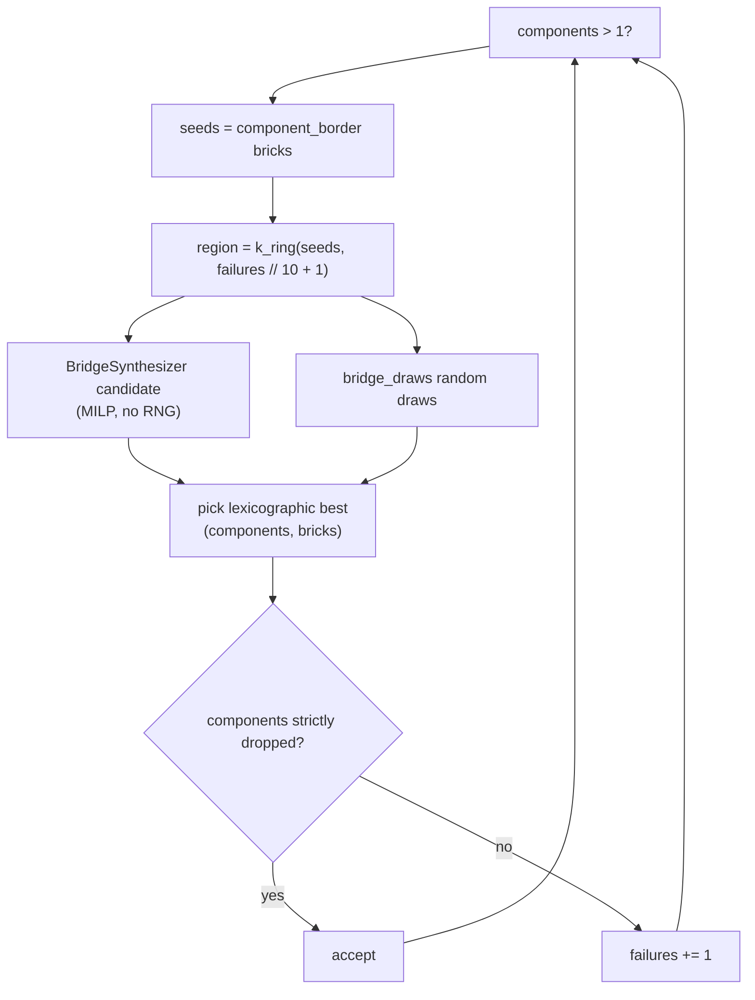
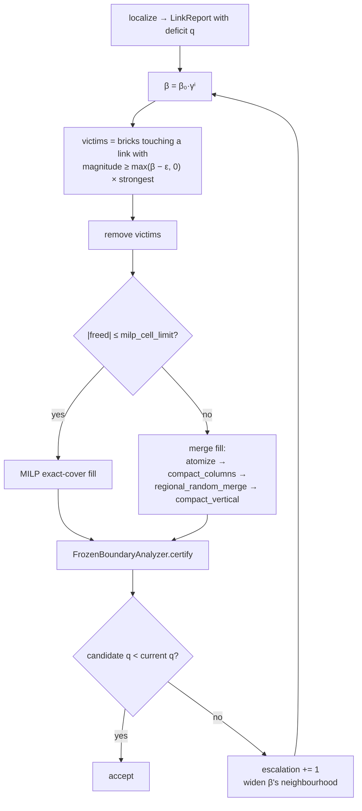

# Merge and repair

**Source:** Luo et al. 2015 (merge engine), Kollsker Algorithm 1 (ALNS repair) ·
`placement/merge.py`, `placement/repair.py`, `placement/luo.py`
{ .provenance }

The merge engine is the substrate under `greedy`, `luo`, ALNS repair, and the layered
engine's post-processing. Rather than choosing placements, it starts from unit atoms
and merges them.

---

## Atomize

`atomize` produces 1×1 atoms — **bricks** on absolute 3-plate slabs ($z \equiv 0 \bmod
3$ with three uniform-colour cells), **plates** otherwise.

The absolute-slab policy is the same one the layered engine uses, and for the same
reason: brick atoms in adjacent columns must line up to be mergeable. Column-relative
slabs would produce offset boundaries that never merge.

## Merge rule

Two bricks merge iff:

1. same layer,
2. same height,
3. mergeable categories,
4. compatible colours (`merge_colour` defined),
5. the **union footprint is a solid rectangle**,
6. **that rectangle exists in the catalog.**

Conditions 5 and 6 together are why the catalog's available footprints propagate all
the way into the merge engine: an L-shaped union is not a part, and neither is a 1×5.

## Maximal random merge

A worklist of candidate pairs, seeded from the neighbourhoods of given seed ids. Pop a
random pending pair (swap-with-last-then-pop for O(1) removal); on a successful merge,
re-push the new brick's neighbourhood. Runs to local maximality.

Three variants: `maximal_random_merge` over everything, `regional_random_merge` over a
region, `_random_merge_from` given explicit seeds.

---

## Soft-colour importance sampling

**Source:** Luo et al. 2015 · `merge._soft_colour`
{ .provenance }

Under `colour_mode = "soft"`, a merge between differently-coloured bricks is not
refused outright. Let $e_a$ be the number of cells that brick $a$'s colour would
miscolour, and $e_b$ likewise. Draw

$$
u \sim U\!\left[0,\;\; \frac{1}{e_a} + \frac{1}{e_b} + w_c\right)
$$

$$
\text{outcome} =
\begin{cases}
\text{take } a\text{'s colour} & u < 1/e_a\\
\text{take } b\text{'s colour} & u < 1/e_a + 1/e_b\\
\textbf{discard the merge} & \text{otherwise}
\end{cases}
$$

The $1/e$ weighting means the colour that would get *fewer* cells wrong is more likely
to win. The third branch is the escape valve, and $w_c$ (`placement.colour_weight`)
controls its width — **large $w_c$ recovers the hard constraint** in the limit.

This is how soft colour mode produces fewer, larger bricks: colour boundaries stop
fragmenting the tiling into 1×1s, at the price of some cells being the wrong colour.

---

## `improve_connectivity`

The accept/reject state machine that turns a per-layer tiling into a single connected
model.

Acceptance requires a **strict** component drop. Anything less would let the loop churn
forever accepting neutral rewrites.

!!! important "The MILP competes; it does not pre-empt"

    The `BridgeSynthesizer` produces a deterministic candidate that *enters the same
    comparison* as the random draws, rather than being taken whenever it succeeds.

    Measured: a pre-empting accept cost **+11 bricks end-to-end** on the mushroom model.
    The synthesizer finds a bridge; it does not necessarily find the *cheap* one.

    The RNG stream is identical to the no-synthesizer case whether the synthesizer
    declines or loses, so enabling it does not perturb reproducibility of the random
    draws.

### The Kollsker drift

`bridge_draws = 5` in the layered engine, but `1` in `greedy` — because greedy's
shipped goldens pin its exact bytes.

The five-draw best-of-$k$ exists because of the measured drift documented in the
[Kollsker drift report](../../reports/kollsker-drift-report.md): a count-blind
connectivity rewrite is disproportionately destructive to a tiling that has no waste in
it. Per-layer-optimal tilings suffered most, which is why the fix landed with that
strategy.

---

## Compaction

**`compact_vertical`** merges three same-footprint stacked plates into a brick. Pairwise
2D merges can never form a brick, because there is no 2-plate-tall part to be an
intermediate.

**`compact_columns`** does something subtler — **phase voting**.

After `split_to_atoms`, a region is all 1×1 plates. Each vertical run could be
brickified starting at phase 0, 1, or 2 mod 3, but neighbouring runs must agree or the
resulting bricks will not line up to merge laterally.

So a single start phase is **voted across all runs**, weighted by how many cells each
phase would successfully brickify. Then every run's triples on the winning phase become
bricks.

Without this, repaired regions stay plate rafts at roughly 3× the part count — the
individually-optimal phase per column produces a globally unmergeable mess.

---

## `final_remerge`

Two candidates are generated and compared:

1. a conservative merge pass over the existing layout,
2. a **plate re-phase**: split all plates, `compact_columns` to vote a fresh phase,
   then re-merge.

Accept the smallest candidate whose `evaluate().total ≤ baseline` **and**
`components ≤ base_components`. Both conditions — a candidate that merges better while
disconnecting something is not an improvement.

With screening enabled, `_screened_remerge` computes like-for-like screened totals and
deliberately returns `report=None`, forcing the caller to cold-certify. That is the
verdict interlock expressed in the type: there is no way to accidentally use a screened
report as a verdict.

Finally, `resolve_ignore_colours` runs a multi-source BFS from every coloured brick to
give leftover `IGNORE` bricks a colour, with isolated ones falling back to code 71
(light bluish gray).

---

## `luo`

**Source:** Luo, Yue, Huang, Chung, Imai, Nishita, Chen — *Legolization: Optimizing
LEGO Designs*, SIGGRAPH Asia 2015 · `placement/luo.py`
{ .provenance }

The strategy built directly on the merge engine:
`atomize → maximal_random_merge → two split-and-remerge phases`.

### Phase 1 — topology (Alg. 5)

While components > 1: take component-border bricks, grow a $k = \lfloor
\text{failures}/10 \rfloor + 1$ ring, split to atoms, re-merge, accept **only on a
strict component drop**.

### Phase 2 — stability (Alg. 7)

While unstable and `failures < 100`:

- **seeds** = the weakest pair, plus one **importance-sampled** unstable brick with
  $p \propto \text{score}$ — so the worst brick is most likely to be chosen, but not
  deterministically, which avoids getting stuck rebuilding the same spot;
- **respin** = $k$-ring split → `compact_columns` → `maximal_random_merge`;
- accept on strict improvement.

### Acceptance metric

`acceptance ∈ {maximin, rbe}`, default **maximin**:

| Metric | Basis |
| --- | --- |
| `maximin` | Luo's $C_M$ from `solve_maximin` — a **single strict ordering** over layouts. Positive means stable with margin; negative means unstable but still comparable; infeasible maps to $-\infty$. |
| `rbe` (legacy) | Lexicographic $(|\mathrm{unstable\_ids}|, -\mathrm{min\_capacity})$ |

Maximin is the better acceptance criterion precisely because it totally orders
layouts, including unstable ones — which is the regime this loop spends most of its
time in.

### Screening and rebasing

With `SolverConfig.screen == "bricksim"`, a `ReducedScreen` baseline is held and
`_screened_out` skips a confidently-worse candidate's **two** exact solves.

The correctness requirement: `_rebase` rebuilds the baseline from the new layout
whenever the accepted candidate's report was not a clean `"ok"`. Otherwise the screen
would rank later candidates against a layout that no longer exists — a bug that
degrades quality slowly rather than crashing.

### Budget

`time_budget_s` becomes a local deadline, min-ed with the pipeline deadline. It is
checked at every **solve boundary** — a started solve runs to completion. Documented
cost: each round is two full RBE solves, scaling roughly $n^{2.8}$.

---

## ALNS repair

**Source:** Kollsker's Algorithm 1, with Whiting-style localization ·
`placement/repair.py`
{ .provenance }

The pipeline's answer to "the layout is unstable but the material is there".

| Knob | Default | Role |
| --- | ---: | --- |
| `beta0` | 0.8 | Initial destroy threshold |
| `gamma` | 0.5 | Per-round decay — each round destroys more |
| `epsilon` | 0.05 | Threshold slack |
| `max_rounds` | 12 | Cap |
| `localizer` | `qp` | The [artificial-link QP](../stability/exactness.md#the-artificial-link-qp); `rbe` synthesizes links from per-brick scores instead |
| `filler` | `merge` | Or `milp` |
| `milp_cell_limit` | 200 | Above this many freed cells, skip the MILP |

The escalation ladder is the ALNS idea: start with a small, cheap neighbourhood and
widen it on failure, until $\beta$'s neighbourhood covers everything.

!!! note "Repair runs before hollow restore, on purpose"

    Repair rearranges bricks at **constant volume** — it costs nothing in material.
    Hollow restore **adds material**, which costs parts and mass and changes the
    model's appearance.

    Trying the free fix before the expensive one is the whole ordering rationale.

---

## `carve` — the transactional primitive

`placement/carve.py` underlies every finishing pass, and its design is worth noting
because it is what makes those passes safe.

- `covering_donors` finds the rect bricks covering a claim set, **refusing** when any
  donor is a slope, tile, or sideways part — those cannot be cleanly re-tiled.
- `refill_tiling` exact-covers the *remainder* (donor cells minus the claim) with a
  minimum-cost MILP ($c = 1 + 10^{-6}\cdot\text{index}$ for a deterministic tiebreak).
- Colours are inherited **per cell from the carved donors**, not from the grid —
  because these passes run *after* `resolve_ignore_colours`, so grid codes may still be
  `IGNORE` where the layout's colours are already resolved.

!!! success "The whole tiling is computed before any mutation"

    A failed candidate costs nothing. There is no partial-carve state to roll back,
    because nothing is carved until a complete valid refill exists.
