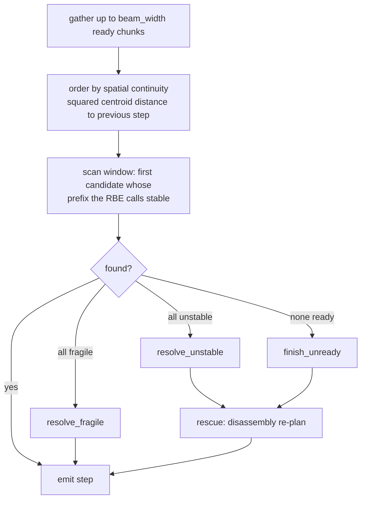

# Sequencing

**Source:** Ma, Gong, Xu, Chen, Zhao, Huang, Zhou (block relations); Tian et al. and
Luo et al. (assembly-by-disassembly) · `instructions/` ·
duality and no-deadlock **proved**
{ .provenance }

Placement produces a *set* of bricks. Instructions require an *order* — and the
existence of a valid order is not implied by the set being buildable.

The contract: order the bricks so that **every emitted prefix is a physically stable,
vertically insertable structure**. Insertability holds on every path — each emits
ready chunks or pure band order, both sweep-feasible. The stability half is
guaranteed only on the certified paths: when no stable order exists, the degradation
ladder below (`resolve_fragile`, `resolve_unstable`, `finish_unready`) emits the
least-bad prefix — press-fragile or unstable — with its honest verdict recorded and
an explicit warning, never a laundered certificate.

---

## Bands

A **band** is all bricks sharing a base layer.

!!! success "The band invariant"

    Two bricks in the same band can never support or vertically block each other.

    Support requires one to be above the other; vertical blocking requires the same.
    Same base layer excludes both.

This single fact is what makes the disassembly rescue deadlock-free, and it is why
chunking never crosses a band boundary.

## Chunking

`chunking.py` splits each band into steps:

1. Seed from `(y, x, id)` order.
2. **Pull mirror partners in.** `mirror_pairs` finds exact mirror symmetry about a
   bounding-box mid-plane, returning a brick→partner map for the **first** axis ($x$
   then $y$) under which *every* brick has a same-shape same-colour partner. Empty when
   the model is asymmetric.
3. Grow by nearest centroid until `target_step_size` (7), never exceeding
   `max_step_size` (10). A brick whose partner must come with it is charged 2.
4. Fold an undersized final chunk (below `min_step_size`, 3) into its predecessor.
5. Order chunks by mean centroid $(y, x)$.

Keeping mirror-symmetric halves in the same step is what stops a booklet from telling
you to build the left wing now and the right wing eleven steps later.

---

## Blocking: what obstructs an insertion

**The theoretical move:** a stud-up brick is inserted by a straight **vertical sweep
from above**. Therefore the only insertion obstacle that matters is another brick
*higher in one of its columns*. The paper's block edges along the other axes cannot
obstruct a vertical sweep.

A corollary worth stating: **pure bottom-up band order is always insertion-feasible.**
Blockers only bite once steps are reordered for mid-build stability.

`vertical_blockers` builds three occupancy indices (columns, rows-x, rows-y) and then:

| Part kind | Blockers |
| --- | --- |
| Ordinary brick | Everything above it in any of its columns |
| **Side-stud carrier** | Additionally, anything at or above the protruding stud's final height in the neighbour column — the stud sweeps that column even though the part itself descends vertically |
| **Sideways-mounted part** | Everything on the outward slide-in half-ray |

!!! note "The half-ray uses a bisect, not a scan"

    A sparse LDraw import might have two pieces a billion studs apart. Stepping to the
    model bounds would cost a billion lookups; a bisect on the sorted row index costs
    $O(\log n)$.

    Its predecessor used a fixed scan cap, which **silently approved impossible
    insertions** whenever the blocker sat past the cap.

`directional_blockers` computes exact-AABB sweep blockers for all six directions,
which is the seam left open for future sideways building.

## The readiness predicate

$$
\text{ready}(C, P) \iff \forall b \in C:
\begin{cases}
\text{supports}(b) \subseteq P \cup C & \text{(1) supports are placed}\\
\text{blockers}(b) \cap P = \varnothing & \text{(2) nothing obstructs the sweep}\\
\text{blocks}(b) \subseteq P \cup C & \text{(3) pull-forward safety}
\end{cases}
$$

for chunk $C$ and already-placed set $P$.

Clause (1) allows same-chunk supports — bricks placed together may rest on each other.

Clause (3) is the non-obvious one: **placing $b$ must not strand a still-unplaced
brick under a new overhang.** Without it, a greedy step could create an overhang whose
underside can never be reached, and the sequencer would only discover this many steps
later with no way back.

---

## The greedy loop

**Spatial ordering** is Ma et al.'s continuity heuristic: sort by squared centroid
distance to the previous step's centroid. It is **ordering only** — with the
first-stable early exit intact, it costs no extra LP calls, it just changes which
candidate is examined first.

**One LP per step on the fast path.** The scan stops at the first stable candidate.

### The degradation ladder

| Situation | Response |
| --- | --- |
| All candidates statically fine but **press-fragile** | `resolve_fragile`: try the largest ready press-stable subset whose *remainder* also survives a press, then an adjacent-chunk composite, then emit fragile with a warning |
| Ready but **unstable** | `resolve_unstable`: `fallback="disassembly"` → rescue; else raise (strict) or warn |
| **Nothing ready** (deadlock) | `finish_unready`: rescue, or the legacy unchecked band order |

Rescue disables the forward warm solver, builds a `RemovalSolver` over the remaining
scope, and re-plans the whole remainder by disassembly.

---

## Assembly by disassembly

**Source:** Tian et al.'s reduction with Luo's "path of best stability" ·
`instructions/search.py`
{ .provenance }

Start from *everything placed*, repeatedly remove a **removable** chunk, and reverse
the removal order to get a build order.

A chunk is removable when it supports nothing that stays and nothing sits above it.

### Why the reversal is valid

**Proved.**

!!! success "Removability–insertability duality"

    Removability upward at a state is **exactly** insertability downward onto the
    remainder — both are the same column condition: nothing occupies the swept columns
    above the chunk.

    Therefore every forward insert in the reversed order is collision-free. $\blacksquare$

### Why it never deadlocks

**Proved.**

!!! success "The no-deadlock argument"

    Some chunk in the **highest still-present band** is always removable:

    - same-band bricks cannot support or block each other (the band invariant);
    - higher bands are gone, by maximality of the chosen band;
    - no *placed* brick depends on a remaining one, because every greedy emission
      already passed `chunk_ready`.

    So the removal loop always has a legal move, and terminates having removed
    everything. $\blacksquare$

### Ranking and cost

Candidates rank by $(-\text{band},\; -\text{chunk stress},\; \text{position})$, then
the top `beam_width` are LP-tested, early-exiting on the first stable remainder.

The LP amortization is neat: **the LP for a remainder doubles as the verdict of the
previous prefix**, so the search costs about one extra LP per rescued step rather than
one per candidate.

---

## Beam search

`search = "beam"` explores whole build orders rather than committing greedily.

State badness is lexicographic:

$$
(\;|\text{unstable}|,\;\; \textstyle\sum \text{score},\;\; \text{order}\;)
$$

!!! important "Unstable expansions are kept, not pruned"

    They accumulate badness instead of being discarded. That is what makes this a
    **best-stability-path** search rather than a feasibility search — on a shape where
    every order passes through an unstable state, a feasibility search finds nothing
    while this finds the least-bad path.

States are deduplicated by their **placed set**, keeping the lexicographically best
path to each.

LP spend is capped by `lp_budget` (default $8 \times |\text{chunks}|$). At the cap the
search **degrades to greedy** — single beam, first-stable early exit — rather than
failing. A fully deadlocked beam finishes by disassembly.

---

## Within-step ordering

Two orders, for two situations:

| Order | Used for | Rule |
| --- | --- | --- |
| `_brick_order` | Ordinary steps | $(\text{layer}, y, x, \text{id})$ |
| `_insertion_order` | Cross-band press-aware composite steps | **Topological sort** over `support → dependent` and `b → blocker` edges, with the same key as tiebreak |

The topological sort returns `()` when a cycle makes the step un-orderable — an honest
"there is no valid order for this composite" rather than an arbitrary one.

## View hints

`0 ROTSTEP` commands are emitted when the step has genuinely moved around the model:

1. Compute the step's centroid azimuth relative to the model centroid.
2. Skip if inside a **2-stud dead zone** around the centre — a step at the middle has
   no meaningful direction.
3. Rotate only if the current view's angular distance exceeds **120°**…
4. …and the best 90°-multiple view improves it by at least **45°**.

`_facing(view) = 45° − view`, because LDraw viewers default to a front-right view. The
thresholds exist to stop the booklet from spinning the model every other step, which is
more disorienting than a slightly bad angle.

ROTSTEP hints apply to MAIN steps only, not to subassembly-internal steps.

---

## Verification

`verify_plan` checks three step kinds against different predicates:

| Step kind | Checks |
| --- | --- |
| **Global** | `sorted(plan.order) == sorted(layout.bricks)` — every brick exactly once |
| `main_step` | Per-brick support, blockers, stability; declared `insertion_fragile` bit |
| `sub_step` | Supports within the sub placed before dependents; no already-seen sub brick blocks the insert; analysis in the **grounded frame**; declared `prefix_stable` matches |
| `attach_step` | Checked as a **unit insertion** — every sub brick's world blockers against the placed world, unit grounding, post-attach analysis, attach-count bookkeeping |

`certify_instructions` then runs `verify_plan` **plus a cold LP per expanded step**,
distinguishing subassembly-build (grounded frame), subassembly-attach (whole unit
merged), and plain placement. Any disagreement between a declared `prefix_stable` and
the cold verdict is a violation, and the first unstable step is recorded with its
action, occurrence ids, unstable ids, and max score.

This is the final gate before a plan is attached to the result.

---

## Metrics

`instructions/metrics.py` implements Ma et al.'s comparison measures — with two
documented errata:

| Measure | Note |
| --- | --- |
| Kendall's $\tau$ over precedence pairs | The paper prints the denominator as $n(n-2)/2$. With distinct ranks, concordant + discordant $= n(n-1)/2$, so that is an obvious typo; the code uses $n(n-1)/2$. |
| RLSD $= \dfrac{\sum_i (i - \text{pos}(i))^2 / n}{(n+1)(n-1)/2}$ | This normalizer caps a **full reversal at 2/3, not 1.0** — so RLSD values are not on the $[0,1]$ scale the name suggests. |

`plan_quality` aggregates stored verdicts without any LP, for cheap reporting.
