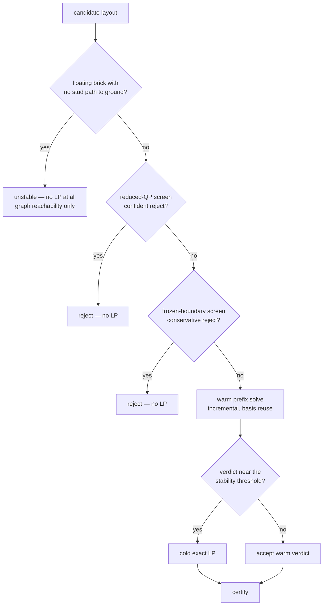

# Stability

Everything in `src/legolization/stability/`. This is where the project's strongest
guarantees live, and where its most careful engineering is.

---

## The question being answered

Given a set of placed bricks, can the assembly stand?

Formally: does there exist an assignment of contact forces such that every brick is in
static equilibrium, every force respects its physical nature (a stud can push, and can
resist pull-out only up to a friction capacity), and no capacity is exceeded?

That is a feasibility problem. The system solves a slightly different one, and the
difference is the single best design decision in the physics stack.

---

## Equilibrium in the objective

A pure feasibility formulation answers *yes* or *no*. When the answer is *no* it says
nothing about **where** or **how badly**.

StableLego's formulation instead puts the equilibrium residual in the objective as an
L1 slack:

$$
\min_F\; \sum_r t_r + \alpha \sum_i \text{dmax}_i + \beta \sum_j \text{drag}_j
\quad\text{s.t.}\quad |A F + b| \le t,\; F \ge 0,\; t \ge 0
$$

Every structure now solves — including floating ones and collapsing ones — and the
residuals `t` localize the failure to specific bricks. That is what makes the repair
loop possible at all: you cannot destroy-and-repair around a deficit you cannot
locate.

The cost is that "stable" becomes a post-hoc test on the solution (are all residuals
within tolerance, and is every friction demand under capacity?) rather than a property
of feasibility. That test is `_score`, and it is the same in every code path.

---

## The scoring function

For each brick:

```
force_ok   = all |residual[0:3]| ≤ tol_force    (1e-6)
torque_ok  = all |residual[3:]|  ≤ tol_torque   (1e-7)
drag_max   = max over the brick's bottom drag columns

score = 1.0            if not in equilibrium, or drag_max ≥ T
      = drag_max / T   otherwise

stable = all scores < 1.0
```

The score doubles as a **stress heatmap**: 0 is effortless, 0.7–1.0 is
standing-but-fragile, and exactly 1.0 means at or over capacity.

!!! tip "`max_score` exactly 1.0 on every strategy means toppling"

    A joint problem varies with the layout. When every strategy reports exactly 1.0,
    the verdict is *global* — the centre of mass is outside the support polygon. No
    placement change fixes that; the shape needs a base.

---

## The four solvers

Four different formulations answer four different questions. They are not
interchangeable.

| Solver | Question | Output | Page |
| --- | --- | --- | --- |
| **RBE LP** | Is this stable, and which bricks are worst? | Per-brick scores, localization | [The RBE model](rbe.md) |
| **Maximin** | Which of these two layouts is sturdier? | One scalar $C_M$, strict ordering, no localization | [Exactness](exactness.md) |
| **Artificial-link QP** | *Where* must material be rearranged? | Deficit $q$ spread over patch links | [Exactness](exactness.md) |
| **Reduced QP screen** | Is this candidate confidently worse? | Advisory reject, or fall through | [Screens](screens.md) |

The RBE LP is the certifier — the only one whose verdicts are published. The other
three exist because certification is expensive and most of the work is comparison,
not certification.

---

## The performance hierarchy

A large model's runtime is dominated by LP solves: profiling found the HiGHS solve at
roughly 99% of large-model wall clock, with model construction under 1%. Optimizing
means reducing *solve count*, not caching model construction.

So there is a hierarchy, cheapest first:



Each level can be wrong in one direction only, and the interlock below makes that safe.

---

## The certification interlock

> **Every accepted modified layout and every emitted instruction sequence is certified
> by a full cold solve.**

The only thing a screen may do without a cold solve is **reject** a candidate. A
rejected candidate is simply not used, so a wrong rejection costs quality, never
correctness. A wrong acceptance costs nothing, because acceptance is never final.

Three mechanisms enforce this in code:

1. `FrozenBoundaryAnalyzer.certify()` always cold-solves survivors, and `accept()`
   **raises** if asked to advance a baseline without full cold certification.
2. A confident reduced-QP rejection returns `cold_result=None`, which callers treat as
   a failed candidate — there is no path where it becomes a verdict.
3. `ScreenReport` is a deliberately different type from `StabilityResult` and never
   enters a verdict-bearing artifact.

The one apparent exception proves the rule: the SNOT pass uses the screen to pre-empt a
cold solve *on revert*. That is safe because reverting restores an already-certified
checkpoint, so the screen never authors a verdict.

---

## Physical constants

Transcribed from StableLego and its released implementation — **measured and fitted
there, not re-derived here**.

| Constant | Value | Meaning |
| --- | ---: | --- |
| `T_CAPACITY_N` | 0.98 N | Per-contact-point friction capacity (100 g × g) |
| `ALPHA` | 1e-3 | Objective weight on each brick's max drag |
| `BETA` | 1e-6 | Objective weight on total drag |
| `GRAVITY` | 9.8 N/kg | |
| `KNOB_PITCH_M` | 0.0078 m | In-plane lever unit |
| `PLATE_HEIGHT_M` | 0.0032 m | 9.6 mm brick ÷ 3 |

BrickSim's constants live separately and are **deliberately not** unified with these:
`MU = 0.2` (ABS static friction) and `MU_F0 = 0.7 N` (preload friction budget).
Mixing constant sets between two papers' models would produce numbers belonging to
neither.

Where these constants could come from instead, and what a finite-element treatment
would change, is discussed in the
[physics fidelity notes](../../reports/physics-fidelity-notes.md).

---

## Physics profiles

Two named profiles derive the solver switches:

| Profile | `torque_z` | `paper_knob_rule` | `rotate_contact_pattern` | `ground_pull` |
| --- | --- | --- | --- | --- |
| `corrected` *(default)* | ✅ | ✅ | ✅ | `support == "baseplate"` |
| `stablelego-parity` | ❌ | ❌ | ❌ | ✅ |

`stablelego-parity` reproduces the paper's numbers, including its simplifications.
`corrected` is what real work uses. The three differences are explained in
[The RBE model](rbe.md#the-three-corrections).

Production is LP only — `stability.solver.mode` rejects anything but `"lp"`. A
complementarity MILP exists as a private small-instance oracle for equivalence tests,
not as a CLI mode, because it is provably redundant.

---

## Where to go next

- **[The RBE model](rbe.md)** — variables, rows, contact patterns, the constants in
  their equations.
- **[Exactness and certificates](exactness.md)** — the relaxation proof, maximin, the
  artificial-link QP.
- **[Screens](screens.md)** — the restriction theorem, the confidence band, why the
  paper's scheme was rejected.
- **[Warm solving](warm-solving.md)** — basis reuse, the floating shortcut,
  block-diagonal removal.
