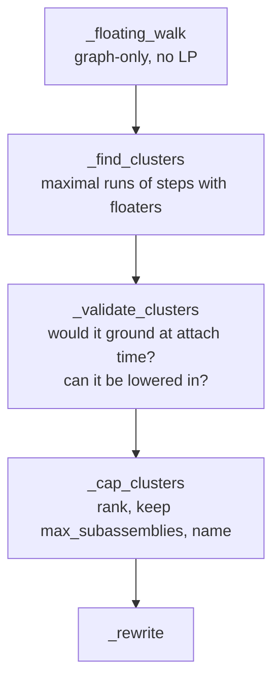

# Subassemblies

**Source:** `instructions/subassembly.py` · motivated by
[the unstable-prefix report](../reports/unstable-prefix-report.md) · empirical
{ .provenance }

The one class of unstable build step that no reordering can fix, and the rewrite that
addresses it.

---

## The empirical finding

An investigation catalogued every warned unstable step across the corpus and found
that they all belong to **one class**:

> A chunk whose **only stud route to ground arrives in a later band**.

Think of a mushroom cap. The cap's ring must be placed before the stem can reach it —
but the ring rests on nothing until the stem arrives. There is no ordering of the same
brick set in which the ring is supported when it is placed, because the thing that will
support it does not exist yet.

The report tested the obvious remedies:

| Remedy | Effect |
| --- | --- |
| Beam search over whole build orders | Removed essentially nothing |
| Wider ready windows | Removed essentially nothing |
| Larger LP budgets | Removed essentially nothing |

That is a strong negative result. Search cannot fix it because **the problem is not a
search failure** — the valid order does not exist within the constraint that everything
is built in place.

---

## The reframing

Human builders solve this without thinking about it: build the cap on the table, then
lift it onto the stem.

That changes the constraint. The cap is never unsupported, because during its
construction it rests on the table in **its own grounded frame**. The only moment
requiring the model's support is the single attach.

So the fix is not a better ordering. It is a different *decomposition*.

---

## Detection

### 1. Floating walk

The floating brick set after each step, computed by **stud-graph reachability from
grounded ids**. No LP at all — this is a pure graph traversal, which is what makes the
whole detection pass cheap enough to run by default.

### 2. Find clusters

Find maximal runs of steps with a non-empty floating set. The run's `ground_step` is
the first step whose prefix has no floaters — the moment the floating stretch finally
gets its support.

Take the **placement window** (all bricks placed from `start` through `ground_step`),
split it into stud-graph components, and keep components that:

- intersect the ever-floating set, **and**
- have at least `min_sub_bricks` (3) bricks.

### 3. Validate

Two rejections, both necessary:

| Rejection | Why |
| --- | --- |
| The unit **would not ground** at attach time (`still_floating & cluster.bricks`) | Extracting it would not fix anything — it would still be floating when attached |
| Something already placed **blocks lowering the unit in** (`blockers[bid] & prior`) | The unit is physically un-attachable; extraction would produce an impossible instruction |

### 4. Cap

Rank by

$$
\big(-|\text{bricks} \cap \mathrm{ever\_floating}|,\;\; \mathrm{first\_float\_step},\;\; \min(\text{bricks})\big)
$$

keep `max_subassemblies` (6), name them `sub-1..sub-N`, and re-sort by attach step.
Capping exists because a booklet with fifteen subassemblies is worse than one with
three and a couple of warnings.

---

## The rewrite

Each cluster's bricks are removed from their original steps. Then, for each unit:

1. Analyze it via `layout.subset(bricks).translated(dz=anchor)` — **its own
   grounded-on-table frame**.
2. Recursively call `plan_instructions` with `subassemblies=False, rotstep=False` to
   sequence the unit itself.
3. Emit those steps carrying `submodel=name`.
4. Emit one `BuildStep(brick_ids=(), attaches=name)` whose verdict is the **post-attach
   world analysis**.

!!! important "The plan stays flat"

    Each subassembly's steps appear immediately before its attach step, in one linear
    list — not as a nested tree.

    This is a deliberate consumer contract: per-step BOM callouts, step images, and
    booklet entries are all index-zipped against the step list. A nested structure
    would break every one of them.

### Why `translated(dz=)` preserves ids

`Layout.translated` deliberately bypasses `add()` to keep brick ids stable. Subassembly
bookkeeping keys on ids throughout — re-adding the bricks would renumber them and
silently disconnect the unit's steps from the cluster that produced them.

### Why the rewrite is safe

**Proved**, given the cluster construction:

!!! success "Preservation argument"

    Extracted bricks only ever move **later** in the sequence.

    And any window brick that stud-touches the cluster is *inside* the cluster, by
    stud-graph component construction.

    Therefore no surviving main step can lose a support: a step's supports are either
    outside the window entirely (unaffected), or inside the cluster (in which case the
    step itself is inside the cluster). $\blacksquare$

### Stale press marks

The pre-rewrite insertion-press verdicts are **stale** — extraction changes every kept
step's prefix, and a press verdict is a property of the prefix it acts on.

So each kept step's press verdict is re-derived against the prefix this plan actually
builds, through one warm walker over the final world order. Reusing the old marks would
warn about presses that no longer happen and miss ones that now do.

### Strictness ordering

With subassemblies enabled, strictness is judged **after** the rewrite.

The extraction exists precisely to stabilize persistently floating stretches, so the
pre-rewrite sequence must be allowed to carry warnings — otherwise `stability_policy =
"strict"` would raise before the fix that resolves those warnings had a chance to run.

---

## What this does and does not fix

**Honest accounting**, and the module says so itself.

The RBE has **no rigid-body notion of a subassembly**. It does not know that the cap is
a single object being lowered as a unit. The post-attach prefix is analyzed by the same
LP as before, brick by brick.

So:

| | |
| --- | --- |
| **Disappears** | Per-chunk floating warnings during the unit's construction. Measured on mushroom: **17 warned steps → 2–3 attach warnings.** |
| **Remains** | An attach onto a genuinely weak seat still warns. If the model cannot carry the cap once it is on, extraction does not change that. |

The improvement is in **buildability of the instructions**, not in the physics of the
finished model. A human following the booklet no longer has to hold seventeen pieces in
mid-air; they build one piece on the table and place it. Whether the finished model
stands was never the thing this pass was fixing.

---

## Output

Subassemblies become `.mpd` submodel `FILE` sections. Booklets get per-unit sections
and attach callouts.

The `.ldr` fallback — for consumers that cannot read submodels — flattens attach steps
back to world-frame bricks. That loses the "build it separately" instruction but keeps
the model correct.

---

## Configuration

| Key | Default | Effect |
| --- | --- | --- |
| `instructions.options.subassemblies` | `true` | Enable detection |
| `instructions.options.min_sub_bricks` | `3` | Minimum unit size |
| `instructions.options.max_subassemblies` | `6` | Cap on extracted units |

Detection is on by default because it is cheap — the floating walk is graph-only — and
because the class it addresses is common in exactly the organic shapes people most want
to brickify.
