# Automatic Generation of Vivid LEGO Architectural Sculptures

Source PDF: `Automatic Generation of Vivid LEGO Architectural Sculptures.pdf`

Evidence bundle: `evidence/`

<!-- Page 1 -->

DOI: 10.1111/cgf.13603 COMPUTER GRAPHICS forum V olume 00 (2019), number 0 pp. 1–12

### J. Zhou1 ,X .C h e n1 and Y . Xu2

1National Engineering Laboratory for Brain-Inspired Intelligence Technology and Application, University of Science and Technology of China, Chin a zjben@mail.ustc.edu.cn, xjchen99@ustc.edu.cn 2Tsinghua University, China yqxu@tsinghua.edu.cn

## Abstract

Brick elements are very popular and have been widely used in many areas, such as toy design and architectural fields. Designing a vivid brick sculpture to represent a three-dimensional (3D) model is a very challenging task, which requires professional skills and experience to convey unique visual characteristics. We introduce an automatic system to convert an architectural model into a LEGO sculpture while preserving the original model’s shape features. Unlike previous legolization techniques that generate a LEGO sculpture exactly based on the input model’s voxel representation, we extract the model’s visual features, including repeating components, shape details and planarity. Then, we translate these visual features into the final LEGO sculpture by employing various brick types. We propose a deformation algorithm in order to resolve discrepancies between an input mesh’s continuous 3D shape and the discrete positions of bricks in a LEGO sculpture. We evaluate our system on various architectural models and compare our method with previous voxelization-based methods. The results demonstrate that our approach successfully conveys important visual features from digital models and generates vivid LEGO sculptures.

### Keywords: LEGO, visual feature, fabrication

```text
ACM CCS: Computing methodologies→ Shape modelling, Applied computing→ Computer-aided design
```

## 1. Introduction

Brick elements are very popular in construction systems, and have been widely used in many areas, such as toy design and architectural fields. The LEGO R⃝ company has produced a large variety of bricks, and a large number of LEGO sculptures have been made all over the world by both kids and adults. Playing with LEGO bricks allows people to build their own sculptures by hand and stimulates their creativity. The magical power of the LEGO brick system mainly comes from two features: universality and versatility. The universality of LEGO bricks enables users to assemble different types of bricks together with a common connection structure. The versatility of the bricks allows users to build LEGO sculptures in various shapes with rich details. These two features make LEGO sculptures capable of expressing a wide range of objects, such as buildings, cars, spaceships and so on. The LEGO construction problem, which is defined as, ‘Given any 3D body, how can it be built from LEGO bricks?’ [Tim98], was presented for computer-aided design systems early in 1998. It is a non-trivial and challenging problem [GHP98], even for human experts. To create a fine LEGO sculpture, a designer needs to learn to look at everything with ‘LEGO eyes’ [Sch14]. The size, detail and pattern of a LEGO sculpture determine whether it is appealing. A designer needs to choose a scale for a LEGO sculpture first by considering the subject’s shapes. The pattern is also an important factor to consider, especially for architectural sculptures. The most impressive LEGO sculptures require careful planning by experienced designers. Since the LEGO construction problem was proposed, various methods have been presented in order to generate LEGO brick layouts from three-dimensional (3D) models in computer graphics [PR03, vZS08, TSP13, L YH*15, Ste16]. These ‘legolization’ techniques mainly focus on the stability of the output sculpture. Some other goals, such as minimizing the number of bricks and retaining colour consistency, have also been considered. However, visual factors, such as scale, shape details and patterns, which play very important roles in the manual design process, are seldom considered. Figure 1 shows a manually designed LEGO sculpture and a LEGO sculpture with a sloping roof fashioned from cuboid bricks. c⃝ 2019 The Authors Computer Graphics Forum c⃝ 2019 The Eurographics Association and John Wiley & Sons Ltd. Published by John Wiley & Sons Ltd. 1

<!-- Page 2 -->

2 J. Zhou et al. / Automatic Generation of Vivid LEGO Sculptures

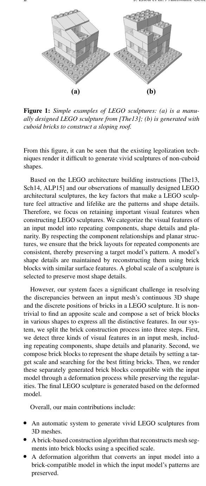

**Figure 1.** Simple examples of LEGO sculptures: (a) is a manu-

ally designed LEGO sculpture from [The13]; (b) is generated with cuboid bricks to construct a sloping roof. From this figure, it can be seen that the existing legolization techniques render it difficult to generate vivid sculptures of non-cuboid shapes. Based on the LEGO architecture building instructions [The13, Sch14, ALP15] and our observations of manually designed LEGO architectural sculptures, the key factors that make a LEGO sculpture feel attractive and lifelike are the patterns and shape details. Therefore, we focus on retaining important visual features when constructing LEGO sculptures. We categorize the visual features of an input model into repeating components, shape details and planarity. By respecting the component relationships and planar structures, we ensure that the brick layouts for repeated components are consistent, thereby preserving a target model’s pattern. A model’s shape details are maintained by reconstructing them using brick blocks with similar surface features. A global scale of a sculpture is selected to preserve most shape details. However, our system faces a significant challenge in resolving the discrepancies between an input mesh’s continuous 3D shape and the discrete positions of bricks in a LEGO sculpture. It is nontrivial to find an apposite scale and compose a set of brick blocks in various shapes to express all the distinctive features. In our system, we split the brick construction process into three steps. First, we detect three kinds of visual features in an input mesh, including repeating components, shape details and planarity. Second, we compose brick blocks to represent the shape details by setting a target scale and searching for the best fitting bricks. Then, we render these separately generated brick blocks compatible with the input model through a deformation process while preserving the regularities. The final LEGO sculpture is generated based on the deformed model. Overall, our main contributions include: r An automatic system to generate vivid LEGO sculptures from 3D meshes. r A brick-based construction algorithm that reconstructs mesh segments into brick blocks using a specified scale. r A deformation algorithm that converts an input model into a brick-compatible model in which the input model’s patterns are preserved.

## 2. Related Work

Our system could be interpreted as a brick-based physical realization of 3D models. It converts a 3D digital model into a LEGO sculpture that can be physically built with LEGO bricks. Our system is related to geometric feature detection techniques for extracting visual features, as well as layout optimization problems. This section contains descriptions of work that is closely related to our system.

### 2.1. Physical realizations of 3D models

Many techniques have been proposed to convert 3D models into real objects for various purposes. For example, a strip-based approximate unfolding technique was proposed to generate papercraft toys from 3D meshes [MS04]. Another example is buildable, interlocking puzzle pieces that are generated based on a 3D model [LFL09]. Given 3D models, there are also many techniques that have been proposed to automatically generate paper architecture that can be folded into a plane [LSH*10, LJGH11]. We focus on a legolization problem [Tim98, PR03, L YH*15], which converts an input model into a sculpture composed of a set of bricks in different shapes.

### 2.2. Computer-assisted LEGO construction

Instead of physical construction, many digital tools have been developed to help people virtually assemble and render LEGO sculptures, such as LDraw [Jes95] and the LEGO digital designer [The12]. These tools allow users to search for and choose bricks from a database and place them in a scene. Though these virtual design software packages make it convenient for users to browse different LEGO sculptures and test their own designs, it still takes a lot of time for a user to search for suitable bricks and assemble them in a way that best expresses his/her idea. Our system provides users with a more direct way to generate a prototype of brick sculptures by taking a 3D model as an input and automatically finding the best bricks to compose a sculpture.

### 2.3. Brick layout optimization

V arious methods have been proposed to solve the LEGO construction problem [Tim98] since it was first presented. These systems typically follow the same pipeline. First, an input 3D model is voxelized. Then, cuboid bricks are used to generate brick layouts layer by layer to fill in the voxel representation. Finally, an optimization step is applied to the initial brick layout to satisfy different criteria. Gower et al. [GHP98] first introduced six criteria to evaluate the stability of a LEGO sculpture. A more advanced and flexible cost function was later proposed [PR03]. Heuristic methods, such as the evolutionary algorithm [PR03, Pet01], the cellular automata method [vZS08], the greedy algorithm [OACN13, TSP13], the genetic algorithm [LJKM15, LKKM15] and the multi-phase search approach [Ste16] have been applied to generate brick layouts. Kim et al. conducted a survey of different legolization techniques [KKL14]. Other works have focused on stability analysis of a given structure [WW12]. [FP98] predicted the resistance of structures made of modular components, including LEGO bricks. Recently, Luoet al. [L YH*15] proposed a force-based stability analysis method to generate stable brick sculptures. Their stability-aware c⃝ 2019 The Authors Computer Graphics Forum c⃝ 2019 The Eurographics Association and John Wiley & Sons Ltd.

<!-- Page 3 -->

### J. Zhou et al. / Automatic Generation of Vivid LEGO Sculptures 3

refinement iteratively analyses and locally reconfigures a structure to gradually improve overall stability. Though a great deal of effort has been devoted to developing techniques that reduce the complexity and improve the stability of LEGO sculptures, these techniques are constrained by the cuboid realization of input models. A detail-preserving oriented legolization system [Lam08] generates more detailed LEGO sculptures by using some of the specialized LEGO pieces that allow orthogonal connections. However, no semantic structures are maintained, and still, only cuboid bricks are used in this system. As a result, the generated LEGO sculptures are visually similar to voxel representations. There is still a large gap between a voxel sculpture and a sculpture made with LEGO products. In comparison, our system automatically generates vivid LEGO sculptures by emphasizing the visual features of an input model and supporting various brick types.

### 2.4. Regularity of 3D models

Regularity is useful for many geometric processing tasks. For example, symmetrical structures could be used for mesh segmentation [SKS06] and shape understanding [MGP06]. Repeating structures are also significant features of architectural models. Pauly et al. [PMW*08] conducted a pattern analysis on mesh models to detect repeated geometric patterns. In point clouds, repeating structures were also detected for various purposes [DAB15b, KRBSG17]. Kalojanov et al. [KWS16] extracted basic construction sets from a given mesh. The fabricated physical construction sets, similar to bricks, could be used to assemble variants of the original geometry. A fully automatic coupled segmentation and similarity detection approach [DAB15a] could detect similar structures in 3D polygonal building models. We modify this algorithm by adding colour constraints and strict shape similarity to precisely detect repeating structures rather than similar structures.

## 3. Overview

```text
The input of our system is a 3D mesh M ={ V,F }. Here, V repre-
sents vertexes and F represents faces.
```

The output of our system is a brick layout, denoted as a set of

```text
bricks L ={ B1,...,B n} connected vertically in a 3D space. Each
item Bi ={ p,θ,ty pe} represents one brick. p is a brick’s position
in a voxel coordinate.
```

We divide a continuous 3D space into the voxel coordinate system

```text
according to the standard LEGO unit size. θis a brick’s orientation,
for which only four angles 0 , π
2 ,π, 3π
```

## 2 around the y direction are

allowed.type represents a brick’s type, which is identified according to a brick’s shape. In our current database, there are 29 types of bricks that are divided into three categories, as shown in Figure 2. Besides 11 cuboid bricks that are frequently used in various LEGO sculptures, we add 13 sloping bricks and five circular bricks that are suitable for architectural sculptures. In general, our goal is to compose a set of LEGO bricks into a LEGO sculpture L that retains the visual features of an input model

### M. By designating the visual features as repeating components,

shape details and planarity, we look for the best scale s for the target model. In addition, we seek to use standard LEGO bricks

**Figure 2.** LEGO brick examples: (a) cuboid bricks, (b) sloping

bricks, (c) circular bricks. to represent the shape details of L while maintaining repeating patterns and planarity: arg min L ,s

```text
E(L ,sM ) = Edetail (L ,sM ) + Epattern (L ,M ), (1)
```

where Edetail and Epattern define the deviation between a LEGO sculpture and a target model with respect to the shape details and regularities. However, it is tedious to explicitly define a closed form for the two energies while considering several types of visual features and regularities. Moreover, the combinatorial optimization problem is highly complex because the brick number n and the brick parameters in L are unknown. While innumerable potential brick layouts exist, it is especially challenging to find the best brick layout under defined criteria. We decompose this problem into three steps in order to find a feasible solution. Figure 3 shows the pipeline. First, repeating components, shape details and planes in an input model are detected and segmented in the visual feature detection step. These features define the shapes and patterns we want to keep in the brick sculpture. Then, for the segmented shape details, we

```text
generate brick blocks Lblock ={ B1,...,B m} to minimize Edetail .
```

We first select candidate types type of bricks inside Lblock and look for an appropriate scale s to ensure that as many shape details as possible are represented by chosen bricks. Then, the positions of bricks are specified in order to complete a brick block. Finally, the brick blocks are arranged together to generate a LEGO sculpture. In this step, the target shape should be slightly deformed from the input model to generate an interim mesh model that not only preserves the pattern from the input mesh, but also ensures compatibility with the discrete voxel coordinates.

## 4. Visual Feature Detection

Visual features represent distinctive shapes and patterns that we want to depict in the generated brick sculpture. We extract three types of visual features: repeating components, shape details and planarity.

### 4.1. Repeating component detection

Repeating components are common in architectural models and are the basic elements to express building shapes. Besides geometry, colour is also important for humans to recognize and understand a building. We can easily separate a roof from a wall of a house by their c⃝ 2019 The Authors Computer Graphics Forum c⃝ 2019 The Eurographics Association and John Wiley & Sons Ltd.

<!-- Page 4 -->

4 J. Zhou et al. / Automatic Generation of Vivid LEGO Sculptures (a) Input model (c) Brick block generation (d) LEGO sculpture generation(b) Visual feature detection (d-1) Model deformation (d-2) Brick layout generation(b-1) Repeating component (b-2) Shape detail (b-3) Planarity

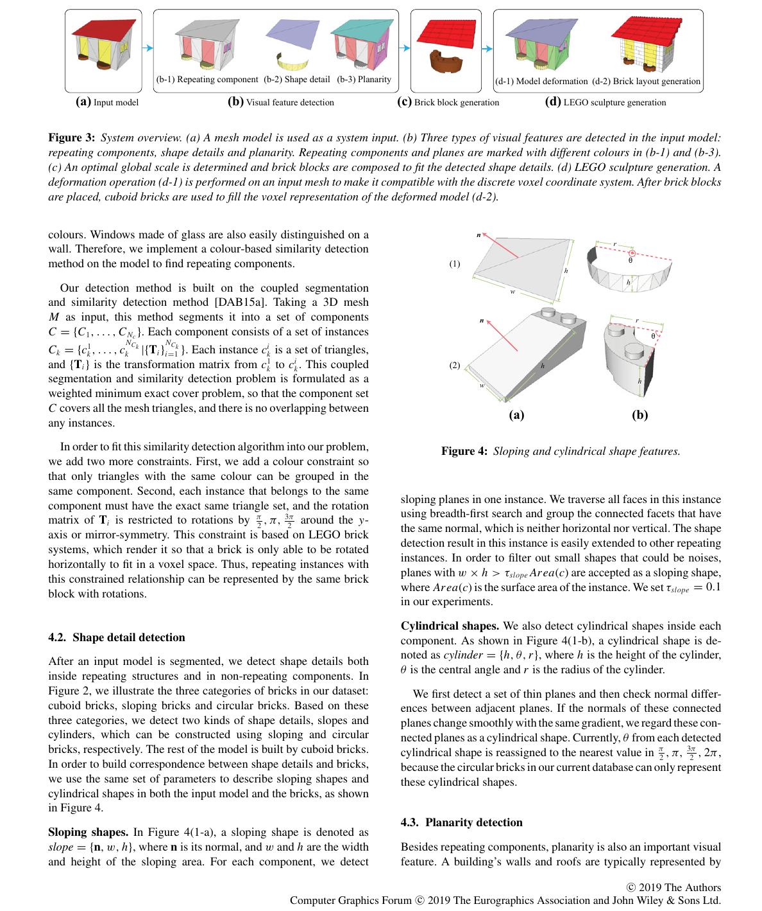

**Figure 3.** System overview. (a) A mesh model is used as a system input. (b) Three types of visual features are detected in the input model:

repeating components, shape details and planarity. Repeating components and planes are marked with different colours in (b-1) and (b-3). (c) An optimal global scale is determined and brick blocks are composed to fit the detected shape details. (d) LEGO sculpture generation. A deformation operation (d-1) is performed on an input mesh to make it compatible with the discrete voxel coordinate system. After brick blocks are placed, cuboid bricks are used to fill the voxel representation of the deformed model (d-2). colours. Windows made of glass are also easily distinguished on a wall. Therefore, we implement a colour-based similarity detection method on the model to find repeating components. Our detection method is built on the coupled segmentation and similarity detection method [DAB15a]. Taking a 3D mesh M as input, this method segments it into a set of components

```text
C ={ C1,...,C Nc }. Each component consists of a set of instances
Ck ={ c1
k,...,c
NCk
k |{Ti}
NCk
i=1 }. Each instance ci
k is a set of triangles,
```

and {Ti} is the transformation matrix from c1 k to ci k . This coupled segmentation and similarity detection problem is formulated as a weighted minimum exact cover problem, so that the component set C covers all the mesh triangles, and there is no overlapping between any instances. In order to fit this similarity detection algorithm into our problem, we add two more constraints. First, we add a colour constraint so that only triangles with the same colour can be grouped in the same component. Second, each instance that belongs to the same component must have the exact same triangle set, and the rotation matrix of Ti is restricted to rotations by π 2 ,π, 3π

## 2 around the y-

axis or mirror-symmetry. This constraint is based on LEGO brick systems, which render it so that a brick is only able to be rotated horizontally to fit in a voxel space. Thus, repeating instances with this constrained relationship can be represented by the same brick block with rotations.

### 4.2. Shape detail detection

After an input model is segmented, we detect shape details both inside repeating structures and in non-repeating components. In

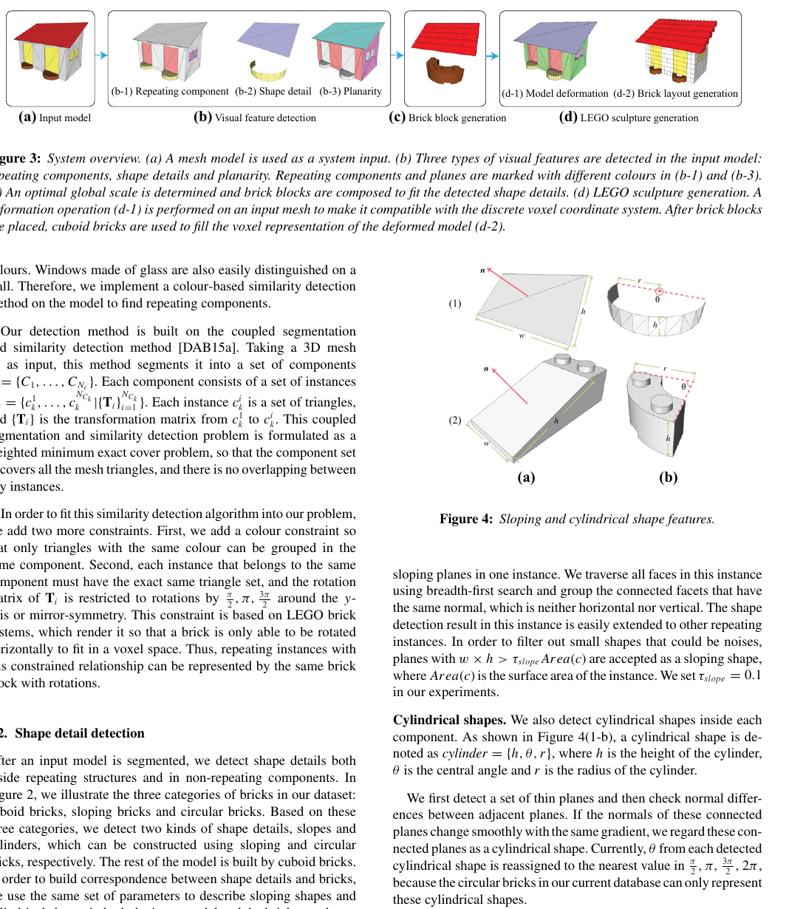

**Figure 2.** , we illustrate the three categories of bricks in our dataset:

cuboid bricks, sloping bricks and circular bricks. Based on these three categories, we detect two kinds of shape details, slopes and cylinders, which can be constructed using sloping and circular bricks, respectively. The rest of the model is built by cuboid bricks. In order to build correspondence between shape details and bricks, we use the same set of parameters to describe sloping shapes and cylindrical shapes in both the input model and the bricks, as shown in Figure 4. Sloping shapes. In Figure 4(1-a), a sloping shape is denoted as

```text
slope ={ n,w,h },w h e r en is its normal, and w and h are the width
```

and height of the sloping area. For each component, we detect θ h (a) (b) r w h n (1) (2) h n w h θ r

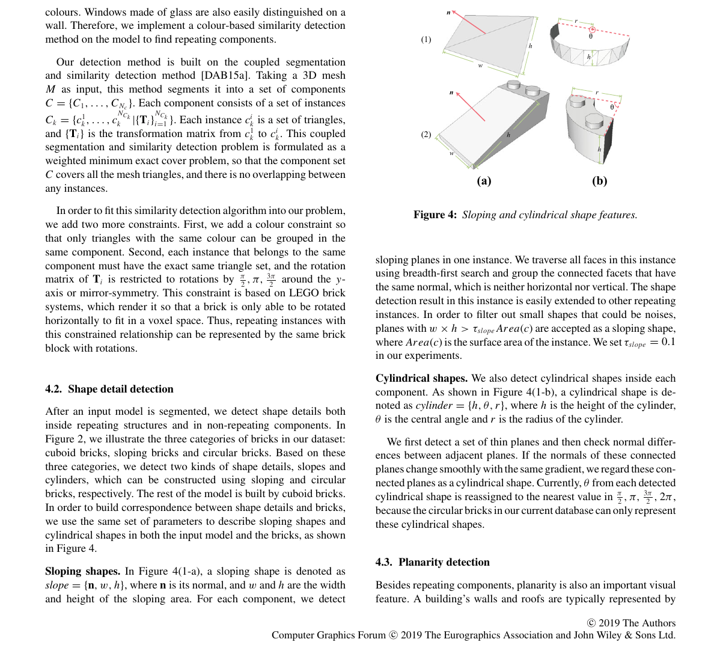

**Figure 4.** Sloping and cylindrical shape features.

sloping planes in one instance. We traverse all faces in this instance using breadth-first search and group the connected facets that have the same normal, which is neither horizontal nor vertical. The shape detection result in this instance is easily extended to other repeating instances. In order to filter out small shapes that could be noises,

```text
planes with w × h>τ slopeArea (c) are accepted as a sloping shape,
where Area (c) is the surface area of the instance. We setτslope = 0.1
in our experiments.
```

Cylindrical shapes. We also detect cylindrical shapes inside each component. As shown in Figure 4(1-b), a cylindrical shape is de-

```text
noted as cylinder ={ h, θ, r},w h e r eh is the height of the cylinder,
θ is the central angle and r is the radius of the cylinder.
```

We first detect a set of thin planes and then check normal differences between adjacent planes. If the normals of these connected planes change smoothly with the same gradient, we regard these con-

```text
nected planes as a cylindrical shape. Currently,θfrom each detected
```

cylindrical shape is reassigned to the nearest value in π 2 ,π, 3π 2 , 2π, because the circular bricks in our current database can only represent these cylindrical shapes.

### 4.3. Planarity detection

Besides repeating components, planarity is also an important visual feature. A building’s walls and roofs are typically represented by c⃝ 2019 The Authors Computer Graphics Forum c⃝ 2019 The Eurographics Association and John Wiley & Sons Ltd.

<!-- Page 5 -->

### J. Zhou et al. / Automatic Generation of Vivid LEGO Sculptures 5

large planes. In a sculpture, bricks should correspond to these areas by forming a planar piece to maintain regularity. Similar to the process of slope detection, connected triangles from the input mesh that have the same normal are grouped into one planar segment. A

```text
planar segment with an area larger thanτpArea (M) is considered to
be a detected plane in our system. We set τp = 0.05 in our system.
```

The colour pieces in Figure 3(b-3) are the detected planes.

## 5. Brick Block Generation

In this section, we compose brick blocks that retain an input model’s shape details. Due to the limited brick shapes and sizes, not every shape detail from an input model can be preserved in a composed sculpture at an arbitrary scale. We try to preserve most shape details; thus, we divide our brick block generation into three steps: brick candidate selection, model scale selection and block construction. The brick candidate selection step picks several candidate brick types for each shape detail independently. Then, we globally choose a model scales that preserves the most shape details using candidate bricks. Finally, we choose the best fitting bricks from the candidates according to the chosen model’s scale to generate a brick block for each repeating component.

### 5.1. Brick candidate selection

We match the shape parameters in order to pick sloping bricks and circular bricks to compose brick blocks for sloping shapes and cylindrical shapes, respectively. Slopes. For each detected slope, we choose only one brick that has the minimum shape difference, which is defined as

```text
d(slopei, slopej ) = λn|ni − nj |+
⏐⏐⏐⏐
wi
hi
− wi
hj
⏐⏐⏐⏐ . (2)
```

The former term evaluates the normal difference between two

```text
slopes and the latter term evaluates the slope surface difference. λn
```

is a relatively large value so as to ensure that the normal difference has a higher priority than the surface difference. Cylinders. Due to the standard dimensions and angles of circular bricks in a LEGO set, the best fitting bricks for cylindrical shapes cannot be found before a model’s scale s is chosen. We first choose

```text
candidate bricks according to the angles. Circular bricks with θ=
π
```

## 2 are chosen as brick candidates for cylindrical shapes with θ=

π 2 ,π, 3π

```text
2 , and circular bricks with θ= 2π are chosen for cylindrical
shapes with θ= 2π. Then, with a selected model scale, the best
```

fitting brick is determined by its desired radius.

### 5.2. Model scale selection

An input 3D model can be converted into brick sculptures with different scales. For brick sculptures made of cuboid bricks, the complexity of a sculpture rises in tandem with its resolution. Higher resolution is generally preferable since it allows the sculpture to reproduce more details from the input model. However, brick sculptures with versatile bricks do not follow this rule. A structure, such as a cylinder, can only be preserved using certain bricks of certain

```text
(a) (b) s = 1
Invalid
(c) s = 1.5 (d) s = 2
```

**Figure 5.** Brick blocks generated with different scales s.( a )T w o

target shapes: a slope (top) and a semi-circle (bottom). The slope is composed of standard sloping bricks with increasing s. The semi-

```text
circle with r = 2 is built by stitching two standard quarter-circle
bricks together when s = 1 and s = 2. However , when the target
model size increases by s = 1.5, there are no circular bricks with
r = 3. A cylindrical shape is best represented by brick blocks with
a few fixed scales.
```

sizes. When a block’s resolution becomes too large or too small, the shape may be difficult to represent well. As shown in Figure 5, when a model’s scale increases, a brick block’s resolution should become larger. For a sloping shape, we can generate a brick block with higher resolution by stacking sloping bricks. However, for a semi-circle shape, using standard LEGO bricks, there are only two suitable scales, as shown in Figures 5(b) and (d). When the scale changes, it is not necessarily possible to simply alter the resolution in order to build a specific shape with a particular circular brick. If

```text
s = 1.5 and we continue to use the circular brick block with s = 1
```

to represent this shape, the shape difference will increase. In order to produce a less distorted brick sculpture, we utilize brick blocks with the same scale, and s is chosen globally to best preserve all of the shape details with LEGO bricks. For slopes, simply stacking LEGO bricks could replicate the target shape using different scales that are above the minimum scale smin . Below this scale, the block size will be smaller than one brick. Therefore, we define the scale energy for a sloping shape as Eslope ( s,s B min ) = {

```text
0,s ≥ sB
min
sB
min − s, s < s B
min
. (3)
where s is the current scale, and sB
min is the minimum scale for a
component if using the brick type B.
```

Cylindrical shapes cannot be built by simply stacking circular bricks. The best scale sB cylindrical is definite for a specific circular brick B. Therefore, we define the scale energy for a cylindrical shape of a brick as Ecylinder ( s,s B cylinder ) = ⏐⏐s − sB cylinder ⏐⏐ . (4) Considering all the slopes and cylindrical shapes in a model, the energy for a scale s is defined as c⃝ 2019 The Authors Computer Graphics Forum c⃝ 2019 The Eurographics Association and John Wiley & Sons Ltd.

<!-- Page 6 -->

6 J. Zhou et al. / Automatic Generation of Vivid LEGO Sculptures

```text
Escale(s) =
∑
{slope}
Eslope
(
s,s B
min
)
+
∑
{cylinder}
Emin
cylinder
(
s,s B
cylinder
)
. (5)
```

Each cylindrical shape has several brick candidates with different sB cylinder , and we use the one with the minimum Ecylinder to compute Escale (s). We choose the scale s∗ with the minimum cost from all possible sB min and sB cylinder . Even if a scales∗ is globally the best, it is sometimes inappropriate for a specific slope or cylindrical shape. In order to avoid extremely large shape deviation, we run a post-process for each component.

```text
If s∗ < 0.5sB
min for a slope, or
|s∗−sB
cylinder |
sB
cylinder
> 0.5 for a cylinder, the
```

component shape is no longer preserved using specialized bricks. We then just use cuboid bricks to compose it in the later brick layout generation step.

### 5.3. Block construction

After selecting an appropriate scale for an input model, we then

```text
construct a brick block Lrs ={ B1,...,B nrs }, which is composed
```

of a set of bricks, for each component. In the final sculpture, several repeating component’s instances can be represented using the same brick block with different transformation matrices {Ti}. Figure 3(c) shows two generated brick blocks for a slope and a cylindrical shape, respectively. For a rectangular slope, a brick block’s layout is composed of

```text
nw × nh sloping bricks. nw and nh are computed as
⎧
⎨
⎩
nw =
⌊
s×wslope
wbrick
⌉
nh =
⌊
s×hslope
hbrick
⌉ , (6)
```

where ⌊x⌉ computes the closest integer of x. For a cylindrical shape, the candidate brick with minimum (|s − sB cylinder |) is used to build this block. Circular bricks are then stacked to fit the height of the cylindrical shape. The number of stacked bricks is computed as

```text
nh =
⌊s × hcylinder
hbrick
⌉
. (7)
```

## 6. LEGO Sculpture Generation

After brick blocks are generated for each shape detail, we then assemble them together and fill in the rest to complete a stable LEGO sculpture. The brick block assembly stage computes the block positions, and the filling stage computes the brick sets for the rest of the model. In the block generation part, we obtain a set of bricks with their

```text
orientations θand type, and the relative positionsp. To assemble the
```

blocks, we must compute the position of each block within the global model. While standard LEGO bricks are manufactured to exact dimensions, simply putting them together according to the digital model’s prescribed positions does not make them compatible in the

```text
(a) s = 1 (b) s = 1.5
```

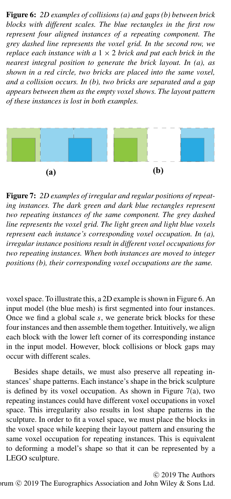

**Figure 6.** 2D examples of collisions (a) and gaps (b) between brick

blocks with different scales. The blue rectangles in the first row represent four aligned instances of a repeating component. The grey dashed line represents the voxel grid. In the second row, we replace each instance with a 1 × 2 brick and put each brick in the nearest integral position to generate the brick layout. In (a), as shown in a red circle, two bricks are placed into the same voxel, and a collision occurs. In (b), two bricks are separated and a gap appears between them as the empty voxel shows. The layout pattern of these instances is lost in both examples. (a) (b)

**Figure 7.** 2D examples of irregular and regular positions of repeat-

ing instances. The dark green and dark blue rectangles represent two repeating instances of the same component. The grey dashed line represents the voxel grid. The light green and light blue voxels represent each instance’s corresponding voxel occupation. In (a), irregular instance positions result in different voxel occupations for two repeating instances. When both instances are moved to integer positions (b), their corresponding voxel occupations are the same. voxel space. To illustrate this, a 2D example is shown in Figure 6. An

```text
input model (the blue mesh) is first segmented into four instances.
```

Once we find a global scale s, we generate brick blocks for these four instances and then assemble them together. Intuitively, we align each block with the lower left corner of its corresponding instance in the input model. However, block collisions or block gaps may occur with different scales. Besides shape details, we must also preserve all repeating instances’ shape patterns. Each instance’s shape in the brick sculpture is defined by its voxel occupation. As shown in Figure 7(a), two repeating instances could have different voxel occupations in voxel space. This irregularity also results in lost shape patterns in the sculpture. In order to fit a voxel space, we must place the blocks in the voxel space while keeping their layout pattern and ensuring the same voxel occupation for repeating instances. This is equivalent to deforming a model’s shape so that it can be represented by a LEGO sculpture. c⃝ 2019 The Authors Computer Graphics Forum c⃝ 2019 The Eurographics Association and John Wiley & Sons Ltd.

<!-- Page 7 -->

### J. Zhou et al. / Automatic Generation of Vivid LEGO Sculptures 7

(a) (c) (b) v1 v1

## 1 v1

## 2 v1

## 1 v1

2

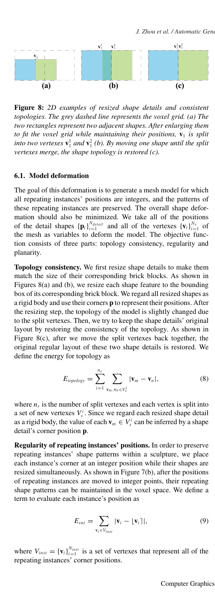

**Figure 8.** 2D examples of resized shape details and consistent

topologies. The grey dashed line represents the voxel grid. (a) The two rectangles represent two adjacent shapes. After enlarging them to fit the voxel grid while maintaining their positions, v1 is split into two vertexes v1

## 1 and v2

1 (b). By moving one shape until the split vertexes merge, the shape topology is restored (c).

### 6.1. Model deformation

The goal of this deformation is to generate a mesh model for which all repeating instances’ positions are integers, and the patterns of these repeating instances are preserved. The overall shape deformation should also be minimized. We take all of the positions of the detail shapes {pi}Ndetail

```text
i=1 and all of the vertexes {vi}Nv
i=1 of
```

the mesh as variables to deform the model. The objective function consists of three parts: topology consistency, regularity and planarity. Topology consistency. We first resize shape details to make them match the size of their corresponding brick blocks. As shown in Figures 8(a) and (b), we resize each shape feature to the bounding box of its corresponding brick block. We regard all resized shapes as a rigid body and use their cornersp to represent their positions. After the resizing step, the topology of the model is slightly changed due to the split vertexes. Then, we try to keep the shape details’ original layout by restoring the consistency of the topology. As shown in

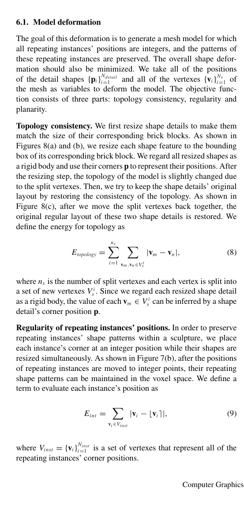

**Figure 8.** (c), after we move the split vertexes back together, the

original regular layout of these two shape details is restored. We define the energy for topology as

```text
Etopology =
ns∑
i=1
∑
vm,vn∈V is
|vm − vn|, (8)
```

where ns is the number of split vertexes and each vertex is split into a set of new vertexes V i s . Since we regard each resized shape detail

```text
as a rigid body, the value of each vm ∈ V i
s can be inferred by a shape
detail’s corner position p.
```

Regularity of repeating instances’ positions. In order to preserve repeating instances’ shape patterns within a sculpture, we place each instance’s corner at an integer position while their shapes are resized simultaneously. As shown in Figure 7(b), after the positions of repeating instances are moved to integer points, their repeating shape patterns can be maintained in the voxel space. We define a term to evaluate each instance’s position as

```text
Eint =
∑
vi∈Vinst
|vi −⌊ vi⌉|, (9)
where Vinst ={ vi}Ninst
i=1 is a set of vertexes that represent all of the
repeating instances’ corner positions.
```

**Figure 9.** A comparison of the models before and after deformation.

(a) The input mesh with different components shown in different colours. (b) The deformed model. The roof and the doorstep, marked by red and orange rectangles, have been resized to fit their brick blocks’ sizes. The positions of the two windows have also shifted to fit the voxel grid. Planarity. In the deformed model, a plane’s vertexes should remain on the same plane after the deformation takes place. Therefore, we define a planarity term as

```text
Eplanarity =
nd∑
i=1
nPi∑
j=1
ni ·
(
vj
i − v0
i
)
, (10)
```

where nd is the number of detected planes and each detected plane Pi has nPi vertexes. ni is the normal of Pi ,a n d v0 i represents the average vertex positions on Pi ,d e fi n e da sv0

```text
i =
∑nPi
j=1 vj
i
nPi
.
```

Considering three parts of the objective function described above, the final objective function is defined as

```text
Edeform = Eint + λt Etopology + λpEplanarity, (11)
where λt and λp are two weights for controlling the three terms. We
set λt = 5a n dλp = 4 experimentally.
```

We use the HLBFGS algorithm [Liu] to solve this optimization problem and obtain a newly deformed model. A comparison of the model before and after deformation is shown in Figure 9. The shape of the roof is changed due to the resizing step. The shape and position changes of doors and windows are caused by Eto pology and Eint .T h e planes in the deformed model are preserved by Eplanarity . Though the shapes and positions of instances are changed after deformation, the input model’s pattern is still retained in the deformed model.

### 6.2. Brick layout generation

Brick blocks represent the shape details that we want to keep in the final brick sculpture. So, these blocks have higher priority than the rest of the sculpture. First, we put brick blocks into a voxel coordinate. After the deformation step, the position of each brick block can then be determined by the positions of shape details in the deformed mesh. Collisions between brick blocks may still exist in certain cases, so we arrange larger blocks first to maintain their integrity. c⃝ 2019 The Authors Computer Graphics Forum c⃝ 2019 The Eurographics Association and John Wiley & Sons Ltd.

<!-- Page 8 -->

8 J. Zhou et al. / Automatic Generation of Vivid LEGO Sculptures Then, we voxelize the deformed model to generate a voxel representation V. Similar to previous systems [TSP13, L YH*15], we hollow out the voxel representation to reduce the number of bricks. We generate the rest of the brick layout with cuboid bricks using a modified brick layout algorithm [L YH*15] to generate the final brick sculpture. We first put 1 × 1 bricks in all empty voxels in

## V. Then, we randomly merge as many of the mergeable pairs as

possible to generate the final layout. In order to keep the repeating pattern of instances, we add two constraints in the merging step of the basic brick layout algorithm. First, corresponding voxels from a component’s repeating instances merge simultaneously. This constraint ensures that the brick layout generated for each repeating instance is exactly the same. Second, the voxels that lie on the sculpture surface and belong to an instance of a repeating component are not allowed to merge with the voxels outside of its instance. This constraint maintains a clear boundary around each repeating instance and therefore retains the shape pattern. V oxels inside the sculpture are not constrained because the appearance is not affected.

### 6.3. Stability

Stability is an important factor when building LEGO sculptures. Since we only focus on architectural models in this paper, the generated LEGO sculptures are usually stable because of the supportive ground plane and the innate characteristics of architectural models. We do not consider stability under complicated condition as in [L YH*15]. A commonly used method to enhance stability is to regenerate local layouts and ensure that all bricks are connected [TSP13]. However, unsupported bricks may still exist in our automatically generated results, mainly because of two reasons. First, thin structures in the input mesh may generate single layer structures that are not stable in brick-based models. Since bricks cannot provide horizontal support, any bricks without both upper and lower layers are not securely supported. Second, in order to maintain the pattern of repeating instances, some bricks are constrained by simultaneously merging in the brick layout generation step. So, the random re-merging method may not solve the stability problem in our system. We adopt a two-step stability optimization method to ensure that our final brick layout is fully connected and therefore constructible. First, we use an algorithm that is similar to [TSP13] for rearranging local brick layouts. If the stability problem cannot be solved, we then use a greedy algorithm to add a minimum number of supporting layers under the unsupported bricks, as highlighted in yellow in

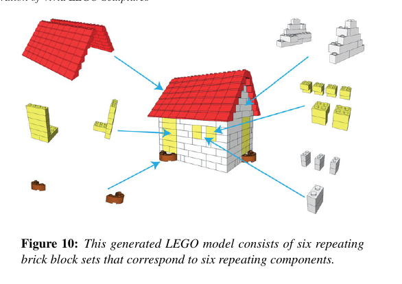

**Figure 12..** In each iteration, the layer with most unstable bricks is

provided with extra support until all unstable bricks are supported directly or indirectly. The shape of the supporting layers remains the same as the upper layer in order to provide optimum support. We use plates, which are similar to bricks except they are a third of the height, to construct these supporting layers so that a sculpture’s shape changes are minimized. The same algorithm as in the brick layout generation is used to create the layout for the supporting layers. Because these supporting layers are not constrained by an

```text
input model’s pattern, we can easily find a randomly generated
```

layout that connects all unstable bricks to the main body. In this way, a sculpture’s stability is ensured.

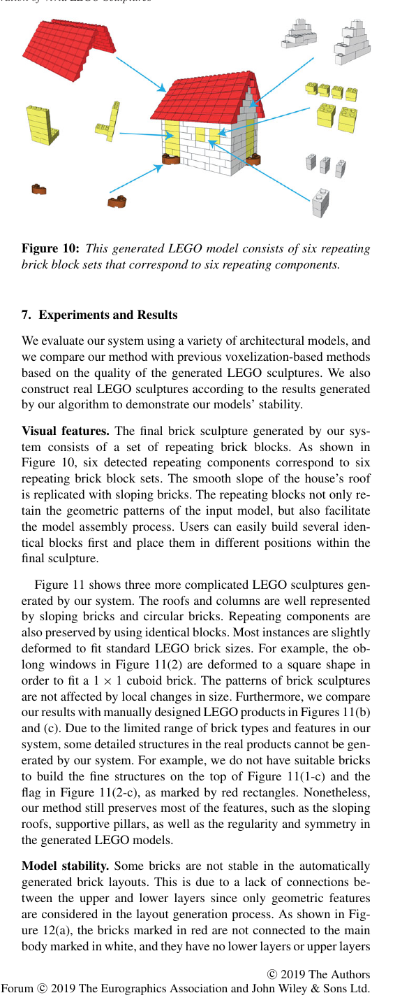

**Figure 10.** This generated LEGO model consists of six repeating

brick block sets that correspond to six repeating components.

## 7. Experiments and Results

We evaluate our system using a variety of architectural models, and we compare our method with previous voxelization-based methods based on the quality of the generated LEGO sculptures. We also construct real LEGO sculptures according to the results generated by our algorithm to demonstrate our models’ stability. Visual features. The final brick sculpture generated by our system consists of a set of repeating brick blocks. As shown in

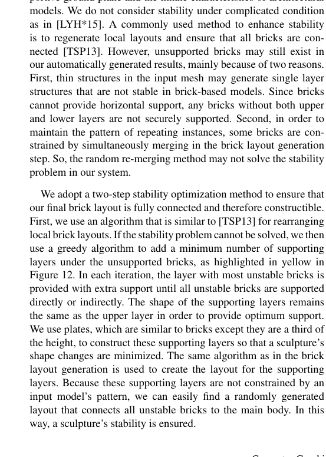

**Figure 10.** , six detected repeating components correspond to six

repeating brick block sets. The smooth slope of the house’s roof is replicated with sloping bricks. The repeating blocks not only retain the geometric patterns of the input model, but also facilitate the model assembly process. Users can easily build several identical blocks first and place them in different positions within the final sculpture.

**Figure 11.** shows three more complicated LEGO sculptures gen-

erated by our system. The roofs and columns are well represented by sloping bricks and circular bricks. Repeating components are also preserved by using identical blocks. Most instances are slightly deformed to fit standard LEGO brick sizes. For example, the oblong windows in Figure 11(2) are deformed to a square shape in order to fit a 1 × 1 cuboid brick. The patterns of brick sculptures are not affected by local changes in size. Furthermore, we compare our results with manually designed LEGO products in Figures 11(b) and (c). Due to the limited range of brick types and features in our system, some detailed structures in the real products cannot be generated by our system. For example, we do not have suitable bricks to build the fine structures on the top of Figure 11(1-c) and the flag in Figure 11(2-c), as marked by red rectangles. Nonetheless, our method still preserves most of the features, such as the sloping roofs, supportive pillars, as well as the regularity and symmetry in the generated LEGO models. Model stability. Some bricks are not stable in the automatically generated brick layouts. This is due to a lack of connections between the upper and lower layers since only geometric features are considered in the layout generation process. As shown in Figure 12(a), the bricks marked in red are not connected to the main body marked in white, and they have no lower layers or upper layers c⃝ 2019 The Authors Computer Graphics Forum c⃝ 2019 The Eurographics Association and John Wiley & Sons Ltd.

<!-- Page 9 -->

### J. Zhou et al. / Automatic Generation of Vivid LEGO Sculptures 9

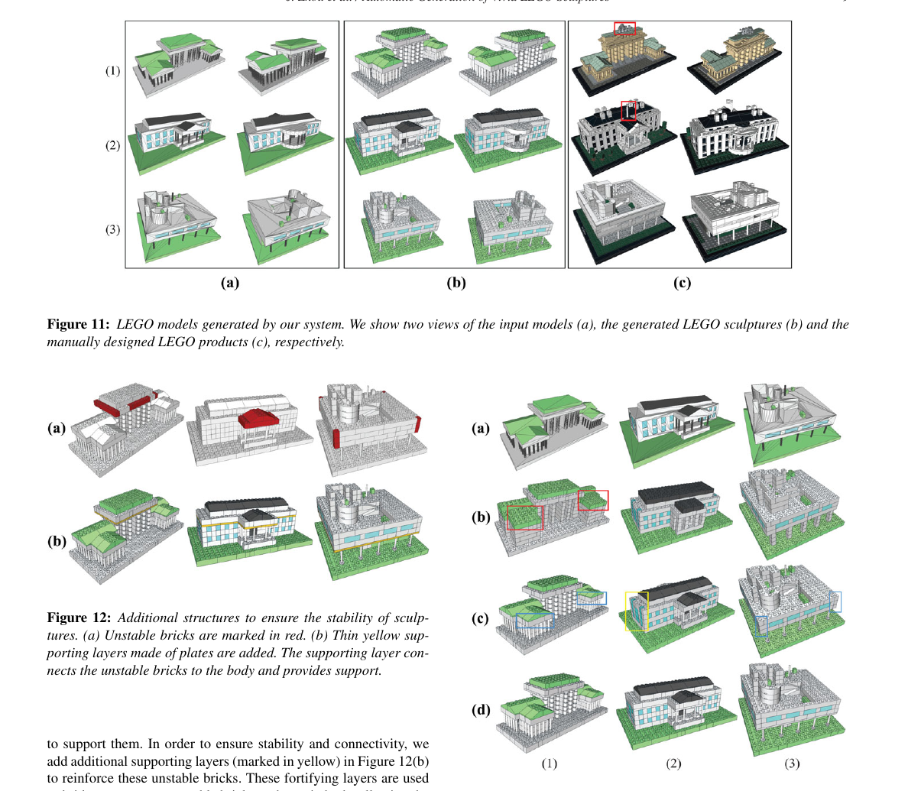

**Figure 11.** LEGO models generated by our system. We show two views of the input models (a), the generated LEGO sculptures (b) and the

manually designed LEGO products (c), respectively.

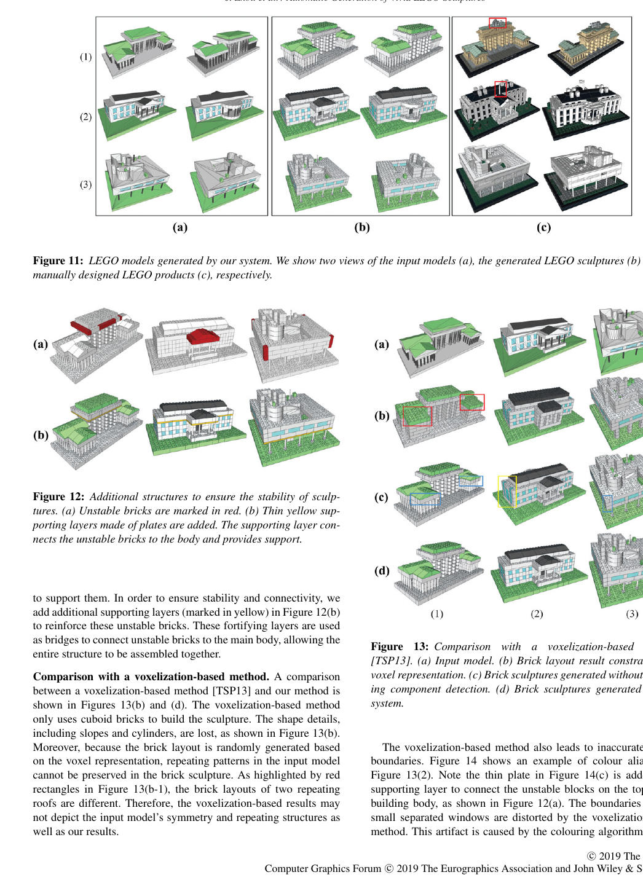

**Figure 12.** Additional structures to ensure the stability of sculp-

tures. (a) Unstable bricks are marked in red. (b) Thin yellow supporting layers made of plates are added. The supporting layer connects the unstable bricks to the body and provides support. to support them. In order to ensure stability and connectivity, we add additional supporting layers (marked in yellow) in Figure 12(b) to reinforce these unstable bricks. These fortifying layers are used as bridges to connect unstable bricks to the main body, allowing the entire structure to be assembled together. Comparison with a voxelization-based method. A comparison between a voxelization-based method [TSP13] and our method is shown in Figures 13(b) and (d). The voxelization-based method only uses cuboid bricks to build the sculpture. The shape details, including slopes and cylinders, are lost, as shown in Figure 13(b). Moreover, because the brick layout is randomly generated based on the voxel representation, repeating patterns in the input model cannot be preserved in the brick sculpture. As highlighted by red rectangles in Figure 13(b-1), the brick layouts of two repeating roofs are different. Therefore, the voxelization-based results may not depict the input model’s symmetry and repeating structures as well as our results.

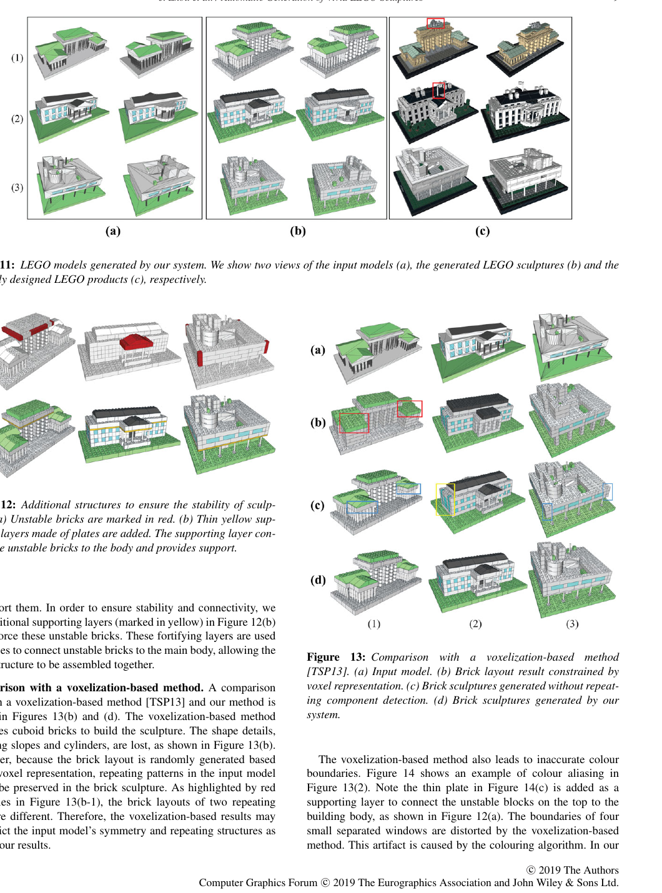

**Figure 13.** Comparison with a voxelization-based method

[TSP13]. (a) Input model. (b) Brick layout result constrained by voxel representation. (c) Brick sculptures generated without repeating component detection. (d) Brick sculptures generated by our system. The voxelization-based method also leads to inaccurate colour boundaries. Figure 14 shows an example of colour aliasing in

**Figure 13.** (2). Note the thin plate in Figure 14(c) is added as a

supporting layer to connect the unstable blocks on the top to the building body, as shown in Figure 12(a). The boundaries of four small separated windows are distorted by the voxelization-based method. This artifact is caused by the colouring algorithm. In our c⃝ 2019 The Authors Computer Graphics Forum c⃝ 2019 The Eurographics Association and John Wiley & Sons Ltd.

<!-- Page 10 -->

10 J. Zhou et al. / Automatic Generation of Vivid LEGO Sculptures

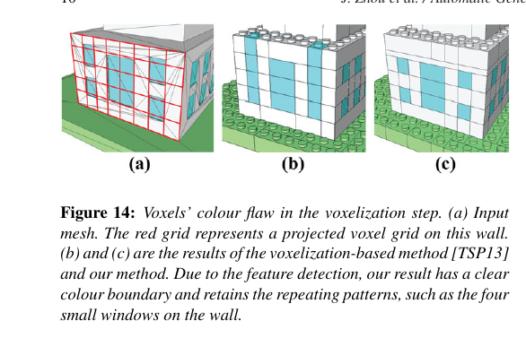

**Figure 14.** V oxels’ colour flaw in the voxelization step. (a) Input

mesh. The red grid represents a projected voxel grid on this wall. (b) and (c) are the results of the voxelization-based method [TSP13] and our method. Due to the feature detection, our result has a clear colour boundary and retains the repeating patterns, such as the four small windows on the wall.

```text
(a) 10×10×7 (b) 19×16×14 (c) 38×32×31
```

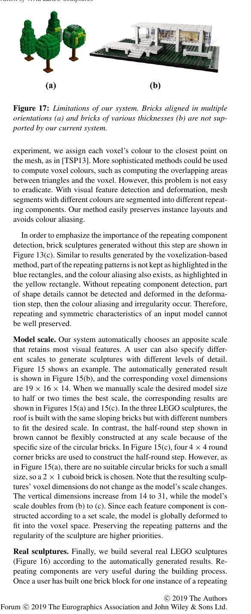

**Figure 15.** Brick models with different mesh-voxel ratios. Each

model’s voxel resolution is shown below the model.

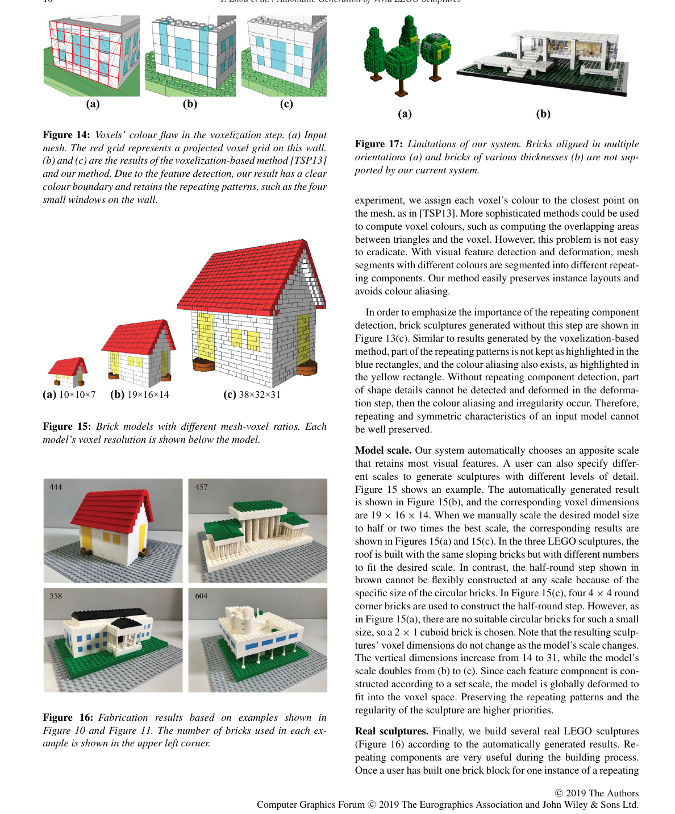

**Figure 16.** Fabrication results based on examples shown in


**Figure 10.** and Figure 11. The number of bricks used in each ex-

ample is shown in the upper left corner .

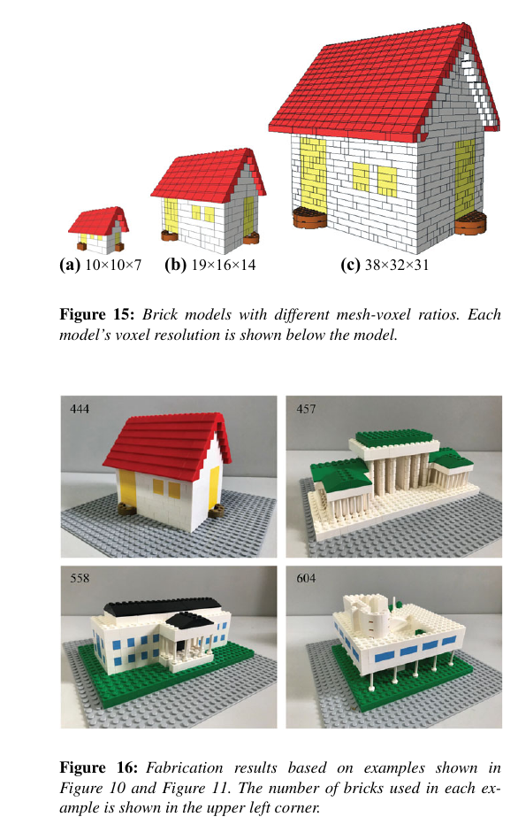

**Figure 17.** Limitations of our system. Bricks aligned in multiple

orientations (a) and bricks of various thicknesses (b) are not supported by our current system. experiment, we assign each voxel’s colour to the closest point on the mesh, as in [TSP13]. More sophisticated methods could be used to compute voxel colours, such as computing the overlapping areas between triangles and the voxel. However, this problem is not easy to eradicate. With visual feature detection and deformation, mesh segments with different colours are segmented into different repeating components. Our method easily preserves instance layouts and avoids colour aliasing. In order to emphasize the importance of the repeating component detection, brick sculptures generated without this step are shown in

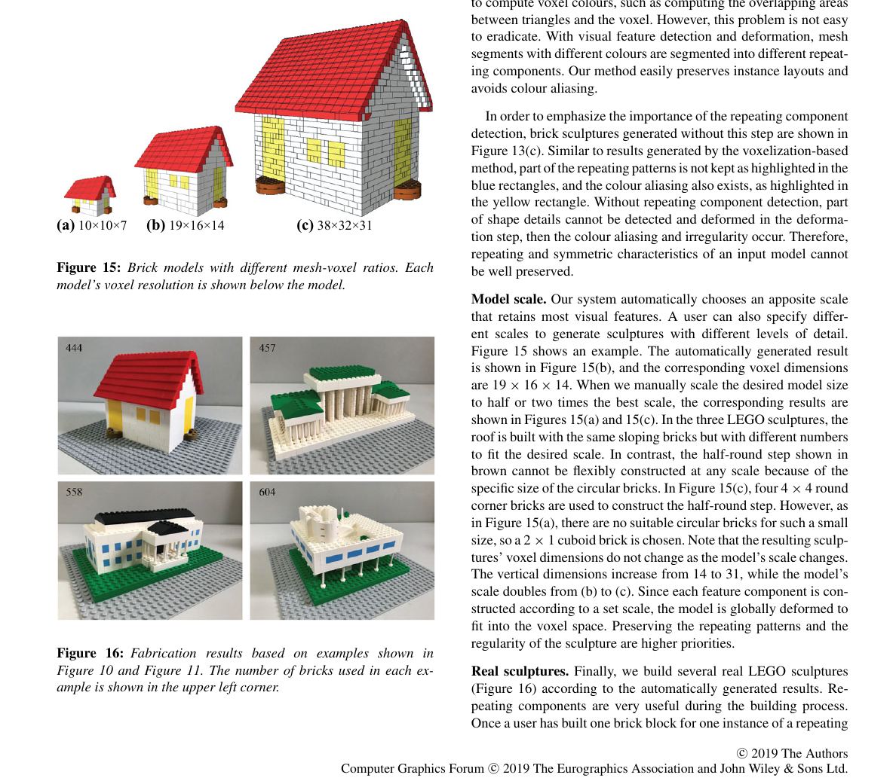

**Figure 13.** (c). Similar to results generated by the voxelization-based

method, part of the repeating patterns is not kept as highlighted in the blue rectangles, and the colour aliasing also exists, as highlighted in the yellow rectangle. Without repeating component detection, part of shape details cannot be detected and deformed in the deformation step, then the colour aliasing and irregularity occur. Therefore, repeating and symmetric characteristics of an input model cannot be well preserved. Model scale. Our system automatically chooses an apposite scale that retains most visual features. A user can also specify different scales to generate sculptures with different levels of detail.

**Figure 15.** shows an example. The automatically generated result

is shown in Figure 15(b), and the corresponding voxel dimensions are 19 × 16 × 14. When we manually scale the desired model size to half or two times the best scale, the corresponding results are shown in Figures 15(a) and 15(c). In the three LEGO sculptures, the roof is built with the same sloping bricks but with different numbers to fit the desired scale. In contrast, the half-round step shown in brown cannot be flexibly constructed at any scale because of the specific size of the circular bricks. In Figure 15(c), four 4 × 4 round corner bricks are used to construct the half-round step. However, as in Figure 15(a), there are no suitable circular bricks for such a small size, so a 2 × 1 cuboid brick is chosen. Note that the resulting sculptures’ voxel dimensions do not change as the model’s scale changes. The vertical dimensions increase from 14 to 31, while the model’s scale doubles from (b) to (c). Since each feature component is constructed according to a set scale, the model is globally deformed to fit into the voxel space. Preserving the repeating patterns and the regularity of the sculpture are higher priorities. Real sculptures. Finally, we build several real LEGO sculptures (Figure 16) according to the automatically generated results. Repeating components are very useful during the building process. Once a user has built one brick block for one instance of a repeating c⃝ 2019 The Authors Computer Graphics Forum c⃝ 2019 The Eurographics Association and John Wiley & Sons Ltd.

<!-- Page 11 -->

### J. Zhou et al. / Automatic Generation of Vivid LEGO Sculptures 11

structure, it is simple to build brick blocks for other instances using the exact same process. In this way, a user becomes skilled in building these repeating blocks and builds sculptures easier and faster. However, there are also drawbacks of the randomly generated layout. Disordered layouts require a user to refer to the instructions each time they place a brick.

## 8. Conclusion and Future Work

In this paper, we present an automatic system to convert an architectural model into a brick sculpture while preserving the original model’s visual features. We propose a new pipeline for brick layout generation that supports various brick types. Our pipeline extracts visual features from an input model and retains these visual features in the subsequent brick sculpture using brick blocks. A model deformation algorithm is presented to make the model compatible with separately generated brick blocks. The results illustrated by various sculptures demonstrate that our system fully utilizes the characteristics of bricks and expands the possibilities of automatically generated brick sculptures. A comparison between our method and voxelization-based techniques shows that our system produces more vivid and appealing brick sculptures. Though our method generates diverse brick sculptures with more brick types, there are still a few limitations. First, we only detect simple geometry features, such as slopes and cylindrical shapes, to replicate with bricks from the database. In the future, we would like to add more brick types into our database to sculpt architectural models with a higher level of sophistication both internally and externally. Second, adding layers of plates under unstable bricks is not always the best solution. An entire layer may need to be added because of one unstable brick. A simple user interface could be designed to help a user check for unstable bricks and manually re-merge them. Moreover, the techniques of placing bricks in different directions and adding thin plates are also widely used in LEGO sculptures, as shown in Figure 17. Extending vertical connections to multi-directional connections to generate more complicated sculptures is another direction for future work.

## Acknowledgements

We thank the reviewers for their generous reviews that shaped the direction of the paper. This work was supported by the National Key Research & Development Plan of China under Grant No. 2016YFB1001402 and the National Natural Science Foundation of China under Nos. 61472377 and 61632006.

## References

[ALP15] ALPHIN T.: The LEGO Architect .N oS t a r c hP r e s s ,S a n Francisco, CA, 2015. [DAB15a] D EMIR I., A LIAGA D. G., B ENES B.: Coupled segmentation and similarity detection for architectural models. ACM Transactions on Graphics 34, 4 (July2015), 104:1–104:11. URL: http://doi.acm.org/10.1145/2766923. [DAB15b] D EMIR I., ALIAGA D. G., BENES B.: Procedural editing of 3d building point clouds. In 2015 IEEE International Conference on Computer Vision (ICCV) (Dec 2015), pp. 2147–2155. doi: http://doi.org/10.1109/ICCV .2015.248. [FP98] F UNES P. , POLLACK J. B.: Componential Structural Simulator. Tech. rep., CS-98-198, Brandeis University Department of Computer Science, 1998. [GHP98] G OWER R., H EYDTMANN A., P ETERSEN H.: LEGO: Automated model construction. In Proceedings 32nd European Study Group with Industry (1998), pp. 81–94. [Jes95] J ESSIMAN J.: LDraw, LEGO CAD software package, 1995. Available at: http://www.ldraw.org/. Last accessed on 7 February 2019. [KKL14] K IM J. W., KANG K. K., L EE J. H.: Survey on automated LEGO assembly construction. In Proceedings WSCG (2014), pp. 89–96. [KRBSG17] K OBYSHEV N., R IEMENSCHNEIDER H., B ´ODIS-SZOMOR ´U A., G OOL L. V .: Efficient architectural structural element decomposition. Computer Vision and Image Understanding 157 (2017), 300–312. [Large-Scale 3D Modeling of Urban Indoor or Outdoor Scenes from Images and Range Scans. URL: http://www.sciencedirect.com/science/article/pii/S107731421 6300807, https://doi.org/10.1016/j.cviu.2016.06.004.] [KWS16] K ALOJANOV J., WAND M., SLUSALLEK P .: Building construction sets by tiling grammar simplification. Computer Graphics Fo r u m 3 5, 5 (2016), 33–42. [Lam08] L AMBRECHT B.: V oxelization of Boundary Representations Using Oriented LEGO Plates. University of California, Berkeley, 2008. [LFL09] L O K.-Y ., FU C.-W., LI H.: 3d polyomino puzzle. ACM Transactions on Graphics (TOG) 28, 5 (2009), 157:1–157:8. [Liu] L IU Y .: HLBFGS. https://xueyuhanlang.github.io/software/ HLBFGS/. Last accessed on 7 February 2019. [LJGH11] L I X.-Y ., JU T., GU Y. , HU S.-M.: A geometric study of v-style pop-ups: Theories and algorithms. ACM Transactions on Graphics 30 , 4 (July2011), 98:1–98:10. URL: http:// doi.acm.org/10.1145/2010324.1964993. [LJKM15] L EE S.-M., J UNG K. Y ., K IM J. W., M YUNG H.: A novel genetic algorithm for autonomous assembly of structural LEGO bricks. In 2015 12th International Conference on Ubiquitous Robots and Ambient Intelligence (URAI) (2015), IEEE, pp. 151–152. [LKKM15] L EE S., K IM J., K IM J. W., M OON B.-R.: Finding an optimal LEGO R⃝brick layout of voxelized 3d object using a genetic algorithm. In Proceedings of the 2015 Annual Conference on Genetic and Evolutionary Computation (New Y ork, NY , USA, 2015), GECCO ’15, ACM, pp. 1215–1222. URL: http://doi.acm.org/10.1145/2739480.2754667. [LSH*10] L I X.-Y ., SHEN C.-H., H UANG S.-S., J U T., H U S.- M.: Popup: Automatic paper architectures from 3d models. ACM Transactions on Graphics 29 , 4 (July2010), 111:1–111:9. URL: http://doi.acm.org/10.1145/1778765.1778848. c⃝ 2019 The Authors Computer Graphics Forum c⃝ 2019 The Eurographics Association and John Wiley & Sons Ltd.

<!-- Page 12 -->

12 J. Zhou et al. / Automatic Generation of Vivid LEGO Sculptures [L YH*15] LUO S.-J., YUE Y. , HUANG C.-K., CHUNG Y. - H . , IMAI S., NISHITA T., CHEN B.-Y .: Legolization: Optimizing LEGO designs. ACM Transactions on Graphics (TOG) 34 , 6 (2015), 204–222. [MGP06] M ITRA N. J., G UIBAS L. J., P AULY M . :P a r t i a la n da p proximate symmetry detection for 3d geometry. ACM Transactions on Graphics 25 , 3 (July 2006), 560–568. [URL: http://doi.acm.org/10.1145/1141911.1141924]. [MS04] M ITANI J., SUZUKI H.: Making papercraft toys from meshes using strip-based approximate unfolding. ACM Transactions on Graphics (TOG) 23 (2004), 259–263. [OACN13] O NO S., A NDR´E A., C HANG Y. , NAKAJIMA M.: LEGO builder: Automatic generation of LEGO assembly manual from 3d polygon model. ITE Transactions on Media Technology and Applications 1, 4 (2013), 354–360. [Pet01] P ETROVIC P .: Solving LEGO brick layout problem using evolutionary algorithms. In Proceedings to Norwegian Conference on Computer Science (Norwegian, 2001). [PMW*08] P AULY M., M ITRA N. J., W ALLNER J., P OTTMANN H., GUIBAS L. J.: Discovering structural regularity in 3d geometry. ACM Transactions on Graphics 27 , 3 (Aug. 2008), 43:1–43:11. [URL: http://doi.acm.org/10.1145/1360612.1360642]. [PR03] P EYSAKHOV M., R EGLI W. C.: Using assembly representations to enable evolutionary design of LEGO structures. AI EDAM: Artificial Intelligence for Engineering Design, Analysis and Manufacturing 17 , 02 (2003), 155–168. [Sch14] S CHW ARTZJ.: The Art of LEGO Design .N oS t a r c hP r e s s , San Francisco, CA, 2014. [SKS06] S IMARI P. , KALOGERAKIS E., S INGH K.: Folding meshes: Hierarchical mesh segmentation based on planar symmetry. In Proceedings of the F ourth Eurographics Symposium on Geometry Processing (Aire-la-Ville, Switzerland, Switzerland, 2006), SGP ’06, Eurographics Association, pp. 111–119. [URL:

```text
http://dl.acm.org/citation.cfm?id=1281957.1281972.]
```

[Ste16] S TEPHENSON B.: A multi-phase search approach to the LEGO construction problem. In Proceedings of the Ninth Annual Symposium on Combinatorial Search, SOCS 2016 (Tarrytown, NY , USA, July 6–8, 2016), pp. 89–97. http://aaai. org/ocs/index.php/SOCS/SOCS16/paper/view/13950. [The12] The LEGO Group: LEGO digital designer, 2012. Available at: http://ldd.lego.com. Last accessed on 7 February 2019. [The13] The LEGO Group: LEGO Architecture Studio Set 21050 Instructions. 2013. [Tim98] T IMCENKO O.: LEGO: How to build with LEGO. 32nd European Study Group with Industry Final Report (1998), 81–94. [TSP13] T ESTUZ R., S CHW ARTZBURGY. , PAULY M.: Automatic generation of constructable brick sculptures. In Eurographics (Short Papers) (2013), pp. 81–84. [vZS08] V AN ZIJL L., SMAL E.: Cellular automata with cell clustering. In Proceedings Automata (2008), pp. 425–441. [WW12] Waß MANN M., W EICKER K.: Maximum flow networks for stability analysis of LEGO R⃝ structures. In Algorithms–ESA 2012. L. Epstein and P . Ferragina (Eds.). Springer, Berlin, Heidelberg (2012), pp. 813–824. c⃝ 2019 The Authors Computer Graphics Forum c⃝ 2019 The Eurographics Association and John Wiley & Sons Ltd.
