# Generating Physically Stable and Buildable Brick Structures from Text

Source PDF: `Generating Physically Stable and Buildable Brick Structures from Text.pdf`

Evidence bundle: `evidence/`

<!-- Page 1 -->

Ava Pun* Kangle Deng* Ruixuan Liu* Deva Ramanan Changliu Liu Jun-Yan Zhu Carnegie Mellon University Generated Structure using LEGO Bricks Manual Assembly following the steps Automated Assembly by Robot Arms

```text
Input T ext Prompt: “A streamlined vessel with a long, narrow hull.”
Intermediate Steps
… … …
A backless bench with
 armrest
A bookshelf with
horizontal tiers
A rectangular table with
```

four legs A basic sofa A classical guitarA classic-style car with a prominent front grilleA high-backed chair A streamlined, elongated vessel Rustic stone bench with moss growth […] Weathered cargo ship […] Gothic cathedral bookshelf […] Vintage floral tapestry with deep reds and golds […] Hot rod with flame paintwork […] Parlor guitar with ladder bracing […] Walnut wooden table […] Rustic farmhouse chair […] (a) Physically Stable Text-to-Brick Generation (c) Result Gallery (b) Real-world Assembly using LEGO Bricks

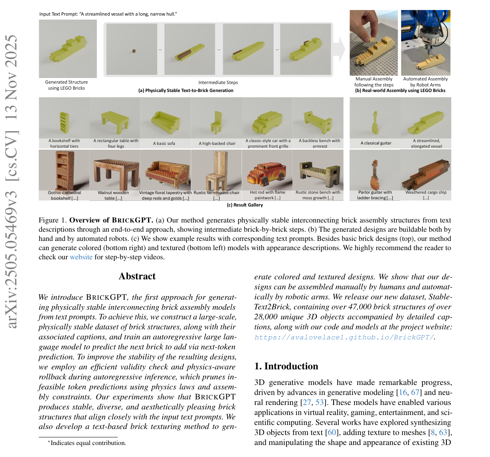

**Figure 1.Overview.** of BRICKGPT.(a) Our method generates physically stable interconnecting brick assembly structures from text

descriptions through an end-to-end approach, showing intermediate brick-by-brick steps. (b) The generated designs are buildable both by hand and by automated robots. (c) We show example results with corresponding text prompts. Besides basic brick designs (top), our method can generate colored (bottom right) and textured (bottom left) models with appearance descriptions. We highly recommend the reader to check our website for step-by-step videos.

## Abstract

We introduceBRICKGPT, the first approach for generating physically stable interconnecting brick assembly models from text prompts. To achieve this, we construct a large-scale, physically stable dataset of brick structures, along with their associated captions, and train an autoregressive large language model to predict the next brick to add via next-token prediction. To improve the stability of the resulting designs, we employ an efficient validity check and physics-aware rollback during autoregressive inference, which prunes infeasible token predictions using physics laws and assembly constraints. Our experiments show thatBRICKGPT produces stable, diverse, and aesthetically pleasing brick structures that align closely with the input text prompts. We also develop a text-based brick texturing method to gen- *Indicates equal contribution. erate colored and textured designs. We show that our designs can be assembled manually by humans and automatically by robotic arms. We release our new dataset, Stable- Text2Brick, containing over 47,000 brick structures of over 28,000 unique 3D objects accompanied by detailed captions, along with our code and models at the project website: https://avalovelace1.github.io/BrickGPT/.

## 1. Introduction

3D generative models have made remarkable progress, driven by advances in generative modeling [16, 67] and neural rendering [27, 53]. These models have enabled various applications in virtual reality, gaming, entertainment, and scientific computing. Several works have explored synthesizing 3D objects from text [60], adding texture to meshes [8, 63], and manipulating the shape and appearance of existing 3D arXiv:2505.05469v3 [cs.CV] 13 Nov 2025

<!-- Page 2 -->

objects and scenes [20, 41]. However, creating real-world objects with existing methods remains challenging. Most approaches focus on generating diverse 3D objects with high-fidelity geometry and appearance [22, 88], but these digital designs often cannot be physically realized due to two key challenges [47]. First, the objects may be difficult to assemble using standard components. Second, the resulting structure may be physically unstable even if assembly is possible. Without proper support, parts of the design could collapse, float, or be disconnected. In this work, we address the challenge of generatingphysically realizable objects. We study this problem in the context of designing structures made of interlocking toy bricks, such as LEGO® blocks. These are widely used in education, artistic creation, and manufacturing prototyping. Additionally, they can serve as a reproducible benchmark, as all standard components are readily available. Due to the significant effort required to design brick structures manually, recent studies have developed automated algorithms to streamline the process and generate compelling results. However, existing approaches primarily create structures from a given 3D object [46] or focus on a single object category [13, 14]. Our goal is to generate brick assembly structures directly from freeform text prompts while ensuring physical stability and buildability. Specifically, we aim to train a generative model that produces designs that are: • Physically stable: Built on a baseplate with strong structural integrity, without floating or collapsing bricks. • Buildable: Compatible with standard toy brick pieces and able to be assembled brick-by-brick by humans or robots. In this work, we introduce BRICKGPT with the key insight of repurposing autoregressive large language models, originally trained for next-token prediction, for next-brick prediction. We formulate the problem of brick structure design as an autoregressive text generation task, where the next-brick dimension and placement are specified with a simple textual format. To ensure generated structures are bothstableandbuildable, we enforce physics-aware assembly constraints during both training and inference. During training, we construct a large-scale dataset of physically stable brick structures paired with captions. During autoregressive inference, we enforce feasibility with an efficient validity check and physics-aware rollback to ensure that the final tokens adhere to physics laws and assembly constraints. Our experiments show that the generated designs are stable, diverse, and visually appealing while adhering to input prompts. Our method outperforms pre-trained LLMs with or without in-context learning, and previous approaches based on 3D mesh generation. Finally, we explore applications such as text-driven brick texturing, as well as manual assembly and automated robotic assembly of our designs. Our dataset, code, and models are available at the project website: https://avalovelace1.github.io/BrickGPT/.

## 2. Related Work

Text-to-3D Generation.Text-to-3D generation has seen remarkable progress recently, driven by advances in neural rendering and generative models. Dreamfusion [60] and Score Jacobian Chaining [78] pioneer zero-shot text-to-3D generation by optimizing neural radiance fields [53] with pretrained diffusion models [64]. Subsequent work has explored alternative 3D representations [3, 34, 36, 43, 49, 52, 68] and improved loss functions [ 26, 45, 48, 76, 80, 86]. Rather than relying on iterative optimization, a promising alternative direction trains generative models directly on 3D asset datasets, with various backbones including diffusion models [21, 33, 35, 55, 62, 65, 88, 89, 92], large reconstruction models [22, 32, 75, 84], U-Nets [37, 70], and autoregressive models [4–6, 19, 56, 66, 69, 82]. However, these existing methods cannot be directly applied to generating brick structures as they do not account for the unique physical and assembly constraints of real-world designs [47]. We bridge this gap by introducing a method for generating physically stable and buildable brick structures directly from text prompts. Autoregressive 3D Modeling.Recent research has successfully used autoregressive models to generate 3D meshes [4– 6, 9, 19, 56, 66, 69, 82], often conditioned on input text or images. Most recently, LLaMA-Mesh [81] demonstrates that large language models (LLMs) can be fine-tuned to output 3D shapes in plain-text format, given a text prompt. However, most existing autoregressive methods focus on mesh generation. In contrast, we focus on generating brick structures from text prompts, leveraging LLMs’ reasoning capabilities. Brick Assembly and Design Generation.Creating brick structures given a reference 3D shape has been widely studied [29]. Existing works [ 58, 71, 91] formulate the generation as an optimization problem guided by hand-crafted heuristics, such as ensuring that all bricks are interconnected and minimizing the number of bricks. Wang et al. [79] translate a visual manual into step-by-step brick assembly instructions. Luo et al. [46] use stability analysis to find weak structural parts and rearrange the local brick layout to generate physically stable designs. Kim et al. [28], Liu et al. [40] formulate a planning problem to fill the target 3D model sequentially. However, these methods only generate designs given an input 3D shape, assuming a valid brick structure exists, which is difficult to verify in practice. Few works have explored learning-based techniques to generate toy brick designs. Thompson et al. [72] use a deep graph generative model in which the graph encodes brick connectivity. However, this method is limited to generating simple classes using a single brick type. More recently, Ge et al. [14] use a diffusion model to predict a semantic volume, which is then translated into a high-quality micro building. Their method produces impressive results for a single category. Zhou et al. [90] and Ge et al. [13] generate compelling

<!-- Page 3 -->

… …

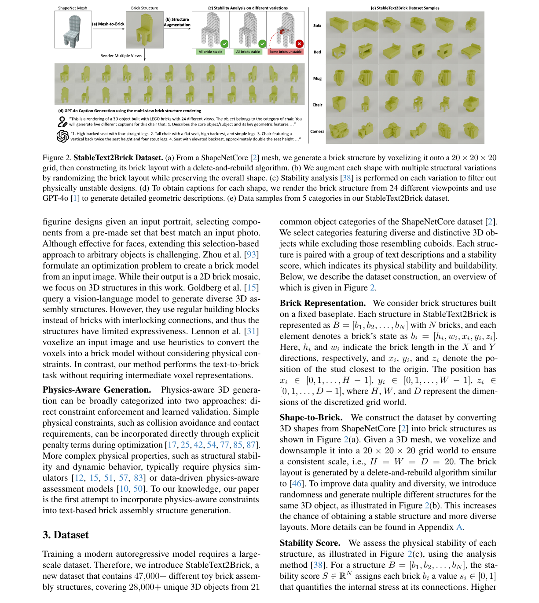

**Figure 2.StableText2Brick.** Dataset.(a) From a ShapeNetCore [ 2] mesh, we generate a brick structure by voxelizing it onto a 20×20×20

grid, then constructing its brick layout with a delete-and-rebuild algorithm. (b) We augment each shape with multiple structural variations by randomizing the brick layout while preserving the overall shape. (c) Stability analysis [38] is performed on each variation to filter out physically unstable designs. (d) To obtain captions for each shape, we render the brick structure from 24 different viewpoints and use GPT-4o [1] to generate detailed geometric descriptions. (e) Data samples from 5 categories in our StableText2Brick dataset. figurine designs given an input portrait, selecting components from a pre-made set that best match an input photo. Although effective for faces, extending this selection-based approach to arbitrary objects is challenging. Zhou et al. [93] formulate an optimization problem to create a brick model from an input image. While their output is a 2D brick mosaic, we focus on 3D structures in this work. Goldberg et al. [15] query a vision-language model to generate diverse 3D assembly structures. However, they use regular building blocks instead of bricks with interlocking connections, and thus the structures have limited expressiveness. Lennon et al. [31] voxelize an input image and use heuristics to convert the voxels into a brick model without considering physical constraints. In contrast, our method performs the text-to-brick task without requiring intermediate voxel representations. Physics-Aware Generation.Physics-aware 3D generation can be broadly categorized into two approaches: direct constraint enforcement and learned validation. Simple physical constraints, such as collision avoidance and contact requirements, can be incorporated directly through explicit penalty terms during optimization [17, 25, 42, 54, 77, 85, 87]. More complex physical properties, such as structural stability and dynamic behavior, typically require physics simulators [12, 15, 51, 57, 83] or data-driven physics-aware assessment models [10, 50]. To our knowledge, our paper is the first attempt to incorporate physics-aware constraints into text-based brick assembly structure generation.

## 3. Dataset

Training a modern autoregressive model requires a largescale dataset. Therefore, we introduce StableText2Brick, a new dataset that contains 47,000+ different toy brick assembly structures, covering 28,000+ unique 3D objects from 21 common object categories of the ShapeNetCore dataset [2]. We select categories featuring diverse and distinctive 3D objects while excluding those resembling cuboids. Each structure is paired with a group of text descriptions and a stability score, which indicates its physical stability and buildability. Below, we describe the dataset construction, an overview of which is given in Figure 2. Brick Representation.We consider brick structures built on a fixed baseplate. Each structure in StableText2Brick is

```text
represented as B= [b 1, b2, . . . , bN ] with N bricks, and each
element denotes a brick’s state as bi = [h i, wi, xi, yi, zi].
```

Here, hi and wi indicate the brick length in the X and Y directions, respectively, and xi, yi, and zi denote the position of the stud closest to the origin. The position has xi ∈[0,1, . . . , H−1] , yi ∈[0,1, . . . , W−1] , zi ∈ [0,1, . . . , D−1] , where H, W , and D represent the dimensions of the discretized grid world. Shape-to-Brick.We construct the dataset by converting 3D shapes from ShapeNetCore [2] into brick structures as shown in Figure 2(a). Given a 3D mesh, we voxelize and downsample it into a 20×20×20 grid world to ensure

```text
a consistent scale, i.e., H=W=D= 20 . The brick
```

layout is generated by a delete-and-rebuild algorithm similar to [46]. To improve data quality and diversity, we introduce randomness and generate multiple different structures for the same 3D object, as illustrated in Figure 2(b). This increases the chance of obtaining a stable structure and more diverse layouts. More details can be found in Appendix A. Stability Score.We assess the physical stability of each structure, as illustrated in Figure 2(c), using the analysis

```text
method [38]. For a structure B= [b 1, b2, . . . , bN ], the sta-
bility score S∈R N assigns each brick bi a value si ∈[0,1]
```

that quantifies the internal stress at its connections. Higher

<!-- Page 4 -->

LLaMA-3.2-Instruct-1B Create a LEGO model of the input. Format your response as a list of bricks ……

```text
<Input>
“A chair with …… legs.”
Create legs.”… 1x1(7,8,0) ……
…
4x2(1,7, )17
… … …
```

## 1 x1(7,8,0) x2(1,7, )1 …… EOS

SEP 17 Create a LEGO model of the input description: “A rectangular sofa with a high backrest extending to form side armrests, featuring a spacious seating area and a supportive box-like base.” Validity Check -Valid Brick type -Collision free … … Resample Collision … … … … Resample 4x6 Brick out of library (c) Inference (b) Training(a) Brick Structure Tokenization 1x1 (7,8,0) 1x2 (7,6,0) 1x1 (7,2,0) … 1x2 (5,7,17) 4x2 (1,7,17) Each brick hxw (x,y,z) corresponds to 10 tokens. 1 2 3 … 125 126 Caption: “A chair with a high, rounded backrest and a flat, rectangular seat supported by four solid, straight legs.” Brick Structure:Brick Sequence: Final Stability Check

```text
Output
Remove unstable bricks and
subsequent ones until stable
User
BrickGPT
126th Brick:
4x2 (1,7,17)
1st Brick:
1x1 (7,8,0)
40th Brick:
1x2 (5,0,2)
80th Brick:
1x2 (7,6,5)
100th Brick:
2x6 (2,0,7)
```

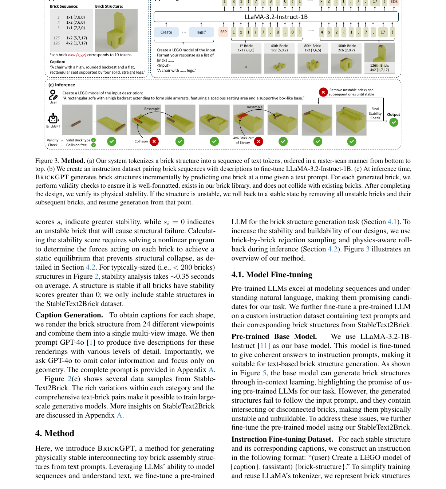

**Figure 3.Method..** (a) Our system tokenizes a brick structure into a sequence of text tokens, ordered in a raster-scan manner from bottom to

top. (b) We create an instruction dataset pairing brick sequences with descriptions to fine-tune LLaMA-3.2-Instruct-1B. (c) At inference time, BRICKGPT generates brick structures incrementally by predicting one brick at a time given a text prompt. For each generated brick, we perform validity checks to ensure it is well-formatted, exists in our brick library, and does not collide with existing bricks. After completing the design, we verify its physical stability. If the structure is unstable, we roll back to a stable state by removing all unstable bricks and their subsequent bricks, and resume generation from that point.

```text
scores si indicate greater stability, while si = 0 indicates
```

an unstable brick that will cause structural failure. Calculating the stability score requires solving a nonlinear program to determine the forces acting on each brick to achieve a static equilibrium that prevents structural collapse, as de-

```text
tailed in Section 4.2. For typically-sized (i.e., <200 bricks)
```

structures in Figure 2, stability analysis takes ∼0.35 seconds on average. A structure is stable if all bricks have stability scores greater than 0; we only include stable structures in the StableText2Brick dataset. Caption Generation.To obtain captions for each shape, we render the brick structure from 24 different viewpoints and combine them into a single multi-view image. We then prompt GPT-4o [1] to produce five descriptions for these renderings with various levels of detail. Importantly, we ask GPT-4o to omit color information and focus only on geometry. The complete prompt is provided in Appendix A.

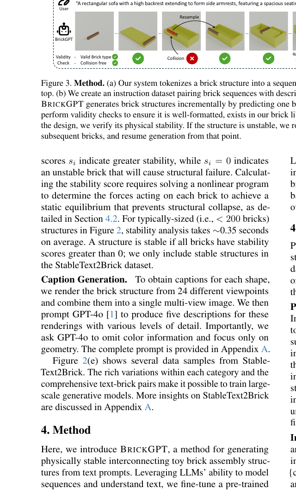

**Figure 2.** (e) shows several data samples from Stable-

Text2Brick. The rich variations within each category and the comprehensive text-brick pairs make it possible to train largescale generative models. More insights on StableText2Brick are discussed in Appendix A.

## 4. Method

Here, we introduce BRICKGPT, a method for generating physically stable interconnecting toy brick assembly structures from text prompts. Leveraging LLMs’ ability to model sequences and understand text, we fine-tune a pre-trained LLM for the brick structure generation task (Section 4.1). To increase the stability and buildability of our designs, we use brick-by-brick rejection sampling and physics-aware rollback during inference (Section 4.2). Figure 3 illustrates an overview of our method.

### 4.1. Model Fine-tuning

Pre-trained LLMs excel at modeling sequences and understanding natural language, making them promising candidates for our task. We further fine-tune a pre-trained LLM on a custom instruction dataset containing text prompts and their corresponding brick structures from StableText2Brick. Pre-trained Base Model.We use LLaMA-3.2-1B- Instruct [11] as our base model. This model is fine-tuned to give coherent answers to instruction prompts, making it suitable for text-based brick structure generation. As shown in Figure 5, the base model can generate brick structures through in-context learning, highlighting the promise of using pre-trained LLMs for our task. However, the generated structures fail to follow the input prompt, and they contain intersecting or disconnected bricks, making them physically unstable and unbuildable. To address these issues, we further fine-tune the pre-trained model using our StableText2Brick. Instruction Fine-tuning Dataset.For each stable structure and its corresponding captions, we construct an instruction in the following format: “(user) Create a LEGO model of {caption}. (assistant) {brick-structure}.” To simplify training and reuse LLaMA’s tokenizer, we represent brick structures

<!-- Page 5 -->

**Figure 4.Force.** Model.(a) We consider all forces exerted on a

single brick, including gravity (black), vertical forces with the top brick (red/blue) and bottom brick (green/purple), and horizontal (shear) forces due to knob connections (cyan), and adjacent bricks (yellow). (b) The structural force model F extends the individual force model to multiple bricks. Solving for static equilibrium in F determines each brick’s stability score. in plain text. But what format should we use? The standard format LDraw [30] has two main drawbacks. First, it does not directly include brick dimensions, which are crucial for assessing the structure and validating brick placements. Second, it includes unnecessary information such as arbitrary brick orientation and scale, which are redundant since all bricks are axis-aligned in our setting. Instead of using LDraw, we introduce a custom format to represent each brick structure. Each line of our format

```text
represents one brick as “{h}×{w} ({x},{y},{z})”, where
h×w are brick dimensions and (x, y, z) are its coordinates.
```

All bricks are 1-unit-tall, axis-aligned cuboids, and the order of h and w encodes the brick’s orientation about the vertical axis. This format significantly reduces the number of tokens required to represent a design, while including brick dimension information essential for 3D reasoning. Bricks are ordered in a raster-scan manner from bottom to top.

```text
With our fine-tuned BRICKGPT model θ, we predict the
```

bricksb 1, b2, ..., bN in an autoregressive manner:

```text
p(b1, b2, ..., bN |θ) =
NY
i=1
p(bi|b1, ..., bi−1, θ). (1)
```

### 4.2. Integrating Physical Stability

Although trained on physically stable data, our model sometimes generates designs that violate physics and assembly constraints. To address this issue, we further incorporate physical stability verification into autoregressive inference. A brick structure is considered physically stable and buildable if it does not collapse when built on a baseplate. To this end, we assess physical structural stability using the stability analysis method [38]. We briefly overview this method below. Figure 4(a) illustrates all possible forces exerted on a single brick. We extend the single brick model and derive the structural force model F, which consists of a set of candidate forces as shown in Figure 4(b). For a brick structure

```text
B= [b 1, b2, . . . , bN ], each brick bi has Mi candidate forces
F j
i ∈ F i, j∈[1, M i]. A structure is stable if all bricks can
reach static equilibrium, i.e.,
MiX
j
F j
i = 0,
MiX
j
τ j
i ˙ =
MiX
j
Lj
i ×F j
i = 0, (2)
where Lj
```

i denotes the force lever corresponding to F j i . The stability analysis is formulated into a nonlinear program as arg min F NX i ( MiX j F j i + MiX j

```text
τ j
i
 +αD max
i +β
X
Di
)
,
(3)
```

subject to three constraints: 1) all force candidates in F should take non-negative values; 2) certain forces exerted on the same brick cannot coexist, e.g., the pulling (red arrow) and pressing (blue arrow), the dragging (green arrow) and supporting (purple arrow); 3) Newton’s third law, e.g., at a given connection point, the supporting force on the upper brick should be equal to the pressing force on the bottom brick. Di ⊂ F i is the set of candidate dragging forces (green

```text
arrow) onb i.αandβare hyperparameter weights.
```

Solving the above nonlinear program in Eqn. 3 using Gurobi [18] finds a force distribution F that drives the structure to static equilibrium with the minimum required internal stress, suppressing the overall friction (i.e.,P Di) as well as avoiding extreme values (i.e., Dmax i ). From the force distributionF, we obtain the per-brick stability score as

```text
si =



0
PMi
j F j
i ̸= 0
∨ PMi
j τ j
i ̸= 0
∨ D max
i > F T ,
FT −Dmax
i
FT
otherwise,
(4)
```

where FT is a measured constant friction capacity between brick connections. Higher scores si indicate greater stability,

```text
while si = 0 indicates an unstable brick that will cause
```

structural failure: either F cannot reach static equilibrium (PMi j F j

```text
i ̸= 0∨ PMi
j τ j
i ̸= 0 ) or the required friction
```

exceeds the friction capacity of the material (Dmax i > F T ). Due to the equality constraints imposed by Newton’s third law, Eqn. 3 includes only the dragging forces and excludes pulling forces. For a physically stable structure, we need

```text
si >0,∀i∈[1, N].
```

When to apply stability analysis?A straightforward approach to ensuring physical stability is to apply stability analysis after each generated brick and resample a brick that would cause a collapse. However, this step-by-step validation could be time-consuming. More importantly, many

<!-- Page 6 -->

**ALGORITHM 1.** BRICKGPT inference algorithm.

```text
Input:Text promptc; Autoregressive modelθ
Output:Brick structure following the text prompt
```

```text
1B←empty brick structure;
2loop
```

/* Predict next brick w/ rejection sampling */

```text
3fork= 1, . . . ,max_rejectionsdo
4context←T⊕B.to_text_format();
5b←θ.predict_tokens(context)(Eqn. 1);
6ifbis validthen break;
7end
8B.add_brick(b);
9ifbcontains EOFthen//Structure complete
```

## 10 if B is stable or max rollbacks exceededthen return B;

11whileBis unstabledo//Rollback if unstable

```text
12I ←indices of unstable bricks inB;
13i←minI;//idx of 1st unstable brick
14B←[b 1, . . . , bi−1];
15end
16end
17end
```

structures are unstable during construction yet become stable when fully assembled; adding a stability check after each brick generation could overly constrain the model exploration space. Instead, we propose brick-by-brick rejection sampling combined with physics-aware rollback to balance stability and diversity. Brick-by-Brick Rejection Sampling.To improve inference speed and avoid overly constraining generation, we relax our constraints during inference. First, when the model generates a brick and its position, the brick should be wellformatted (e.g., available in the inventory) and lie within the world space. Second, the brick should not collide with the existing structure. Formally, for each generated brick bt,

```text
we have Vt ∩ Vi =∅,∀i∈[1, t−1] , where Vi denotes the
```

voxels occupied by bi. These heuristics allow us to efficiently generate well-formatted structures without explicitly considering complex physical stability. To integrate these heuristics, we use rejection sampling: if a brick violates the rules, we resample a new brick from the model. Due to the relaxed constraints, most bricks are valid, and rejection sampling does not significantly affect inference time. Physics-Aware Rollback.To ensure that the final de-

```text
sign B= [b 1, b2, . . . , bN ] is physically stable, we calcu-
```

late the stability score S. If the resulting design is unsta-

```text
ble, i.e., si = 0, i∈ I , we roll back the design to the
```

state before the first unstable brick was generated, i.e.,

```text
B′ = [b 1, b2, . . . , bminI−1 ]. Here, I is the set of the indices
```

of all the unstable bricks. We repeat this process iteratively until we reach a stable structure B′, and continue generation from the partial structure B′. Note that we can use the per-brick stability score to efficiently find the collapsing bricks and their corresponding indices in the sequence. We summarize our inference sampling in Algorithm 1.

### 4.3. Brick Texturing and Coloring

While we primarily focus on generating theshapeof a brick structure, color and texture play a critical role in creative designs. Therefore, we propose a method that applies detailed UV textures or assigns uniform colors to individual bricks. UV Texture Generation.Given a structure B and its corresponding mesh M, we first identify the set of occluded bricks Bocc that have all six faces covered by adjacent bricks,

```text
and remove Bocc for efficiency. The remaining bricksBvis =
```

B\B occ are merged into a single mesh M with cleaned overlapping vertices usingImportLDraw[ 74]. We generate a UV map UVM by cube projection. The texture map Itexture is then generated using FlashTex [8], a fast text-based mesh texturing approach:

```text
Itexture =FlashTex(M,UV M, c), (5)
```

where text prompt c describes the visual appearance. This texture can be applied through UV printing or stickers. Uniform Brick Color Assignment.We can also assign each brick a uniform color from a standard color library [30]. Given a structure B, we convert it to a voxel grid V and then

```text
to a UV-unwrapped mesh MV. For every voxel v∈ V , let
f v
i , i= 1, . . . , N v be its visible faces where 0≤N v ≤6 .
Each face f v
```

i is split into two triangles and mapped to a UV region S v i , creating a mesh MV with UV map UVV. We apply FlashTex [8] to generate a textureI texture:

```text
Itexture =FlashTex(M V ,UV V , c). (6)
The color of each voxelC(v)∈R 3 is computed as:
C(v) = 1
Nv
NvX
i=1
C(f v
i ),∀v∈ V, (7)
where C(f v
i ) = 1
|S v
i |
P
(x,y)∈S v
i
Itexture(x, y) is the color of
each visible face f v
i , and |S v
i | represents the number of
pixels in region S v
i in the UV map. For each brick bt and its
constituent voxels Vt, we compute the brick color C(bt) =
1
|Vt|
P
v∈Vt
```

C(v). Finally, we find the closest color in the color set. While UV texturing offers higher-fidelity details, uniform coloring allows us to use standard toy bricks.

## 5. Experiments

### 5.1. Implementation Details

Fine-tuning.Our fine-tuning dataset contains 240k distinct prompts and 47k+ distinct brick structures. We withhold 10% of the data for evaluation. For efficiency, we include samples only up to 4096 tokens long. Training details are provided in Appendix A. Inference.To evaluate our method, we generate one brick structure for each of 250 prompts randomly selected from

<!-- Page 7 -->

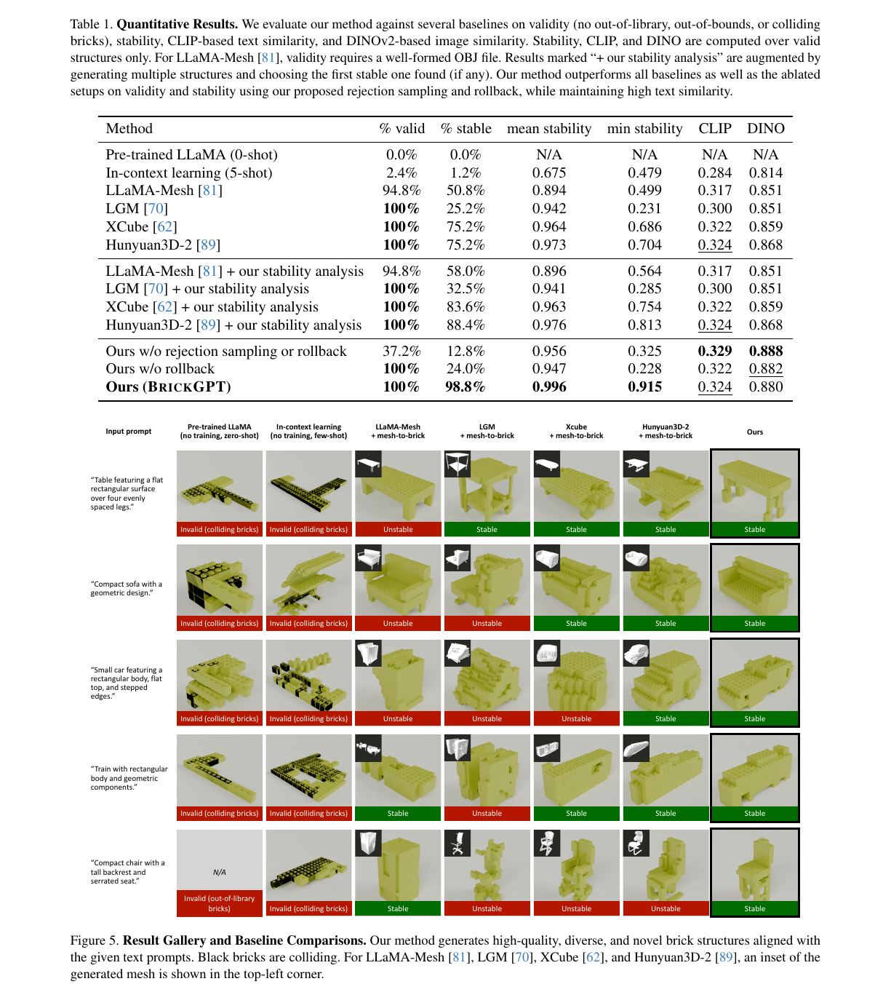

**Table 1.Quantitative.** Results.We evaluate our method against several baselines on validity (no out-of-library, out-of-bounds, or colliding

bricks), stability, CLIP-based text similarity, and DINOv2-based image similarity. Stability, CLIP, and DINO are computed over valid structures only. For LLaMA-Mesh [81], validity requires a well-formed OBJ file. Results marked “+ our stability analysis” are augmented by generating multiple structures and choosing the first stable one found (if any). Our method outperforms all baselines as well as the ablated setups on validity and stability using our proposed rejection sampling and rollback, while maintaining high text similarity. Method % valid % stable mean stability min stability CLIP DINO Pre-trained LLaMA (0-shot) 0.0% 0.0% N/A N/A N/A N/A In-context learning (5-shot) 2.4% 1.2% 0.675 0.479 0.284 0.814 LLaMA-Mesh [81] 94.8% 50.8% 0.894 0.499 0.317 0.851 LGM [70]100%25.2% 0.942 0.231 0.300 0.851 XCube [62]100%75.2% 0.964 0.686 0.322 0.859 Hunyuan3D-2 [89]100%75.2% 0.973 0.704 0.324 0.868 LLaMA-Mesh [81] + our stability analysis 94.8% 58.0% 0.896 0.564 0.317 0.851 LGM [70] + our stability analysis100%32.5% 0.941 0.285 0.300 0.851 XCube [62] + our stability analysis100%83.6% 0.963 0.754 0.322 0.859 Hunyuan3D-2 [89] + our stability analysis100%88.4% 0.976 0.813 0.324 0.868 Ours w/o rejection sampling or rollback 37.2% 12.8% 0.956 0.3250.329 0.888 Ours w/o rollback100%24.0% 0.947 0.228 0.322 0.882 Ours (BRICKGPT) 100% 98.8% 0.996 0.9150.324 0.880 “Small car featuring a rectangular body, flat top, and stepped edges.” “Compact sofa with a geometric design.” “Table featuring a flat rectangular surface over four evenly spaced legs.”

```text
Input prompt OursLLaMA-Mesh
+ mesh-to-brick
In-context learning
(no training, few-shot)
Pre-trained LLaMA
(no training, zero-shot)
LGM
+ mesh-to-brick
“Train with rectangular
body and geometric
components.”
“Compact chair with a
tall backrest and
serrated seat.”
Xcube
+ mesh-to-brick
Hunyuan3D-2
+ mesh-to-brick
Unstable
Stable
Unstable
Unstable
Invalid (colliding bricks)
Invalid (colliding bricks)
Invalid (colliding bricks) Stable
Stable
Stable
Stable
Stable
Stable
Stable
Stable
Unstable
Unstable
Invalid (colliding bricks)
Invalid (colliding bricks)
Invalid (colliding bricks)
Invalid (colliding bricks)
Invalid (colliding bricks)
N/A
Invalid (out-of-library
bricks)
 Invalid (colliding bricks) Unstable Stable
Unstable
Stable
Stable
Unstable
Stable Stable
Stable
Unstable Unstable
```

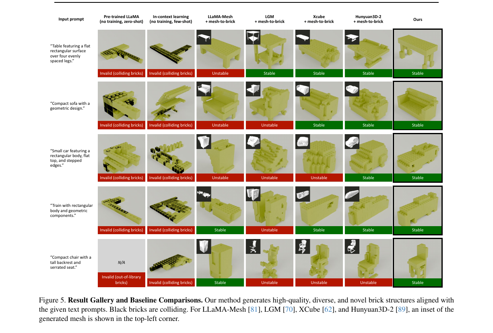

**Figure 5.Result.** Gallery and Baseline Comparisons.Our method generates high-quality, diverse, and novel brick structures aligned with

the given text prompts. Black bricks are colliding. For LLaMA-Mesh [81], LGM [70], XCube [62], and Hunyuan3D-2 [89], an inset of the generated mesh is shown in the top-left corner.

<!-- Page 8 -->

Ours w/o rollbackOurs w/o rejec0on sampling or rollback Ours Invalid (colliding bricks) “Square-seated chair featuring an upright, rectangular backrest and straight legs.” “Boxy vehicle featuring a Bered facade and angular structure.”

```text
Input text
prompt
Unstable Stable
Invalid (colliding bricks)
 Unstable Stable
```

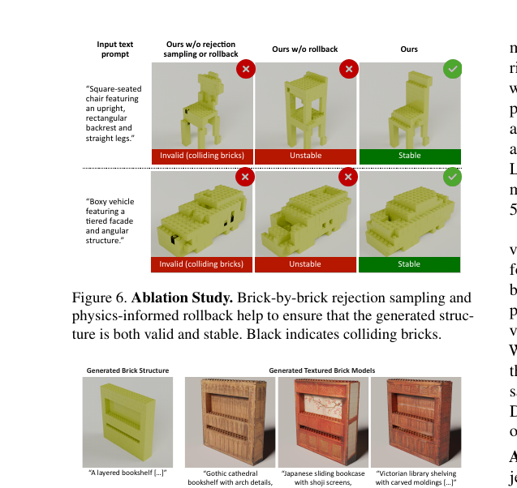

**Figure 6.Ablation.** Study.Brick-by-brick rejection sampling and

physics-informed rollback help to ensure that the generated structure is both valid and stable. Black indicates colliding bricks. “Victorian library shelving with carved moldings […]” “Japanese sliding bookcase with shoji screens, traditional design […]” “Gothic cathedral bookshelf with arch details, medieval style […]” Generated Brick Structure Generated Textured Brick Models “Comfortable lounge chair wrapped in Japanese shibori fabric […]” “Cyberpunk holographic material with neon purple and blue gradients […]” “Rustic farmhouse armchair built from reclaimed wood […]” “A layered bookshelf […]” “A sofa with a rectangular base […]” “Sunburst Les Paul with amber finish […]” “Steel resonator with engraved body […]” “Electric guitar in metallic purple […]” “An asymmetrical six-string guitar […]” Generated Brick Structure Generated Colored Brick Models

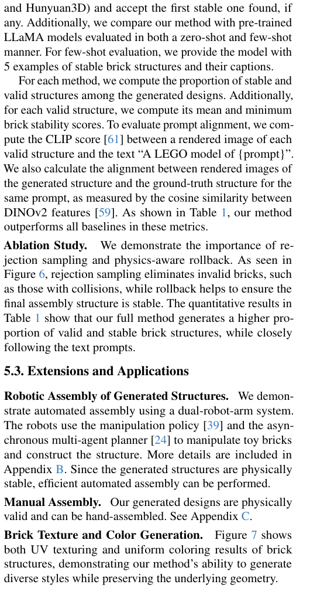

**Figure 7.Brick.** Texture and Color Generation.Our method can

generate diverse textured (top two rows) and colored (bottom) structures based on the same shape with different appearance prompts. the validation dataset. The nonlinear optimization in Eqn. 3

```text
is solved using Gurobi [18]. We set FT = 0.98N with α=
10−3 and β= 10 −6. We allow up to 100 physics-aware
```

rollbacks before accepting the brick structure. The median number of required rollbacks is 2, and the median time to generate one structure is 40.8 seconds.

### 5.2. Brick Structure Generation Results

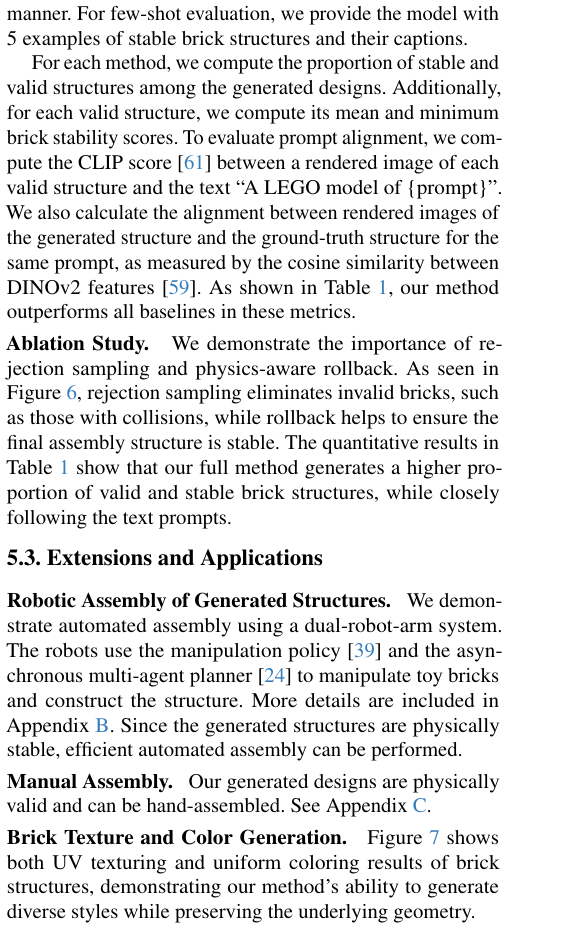

**Figure 5.** shows a gallery of diverse, high-quality brick struc-

tures that closely follow the input prompts. Baseline Comparisons.As baselines, we use LLaMA- Mesh [81], LGM [70], XCube [62], and Hunyuan3D-2 [89] to generate a mesh from each prompt, then convert the meshes to brick structures with our delete-and-rebuild algorithm. To increase the chance of producing a stable structure, we generate multiple different structures for the same output mesh (10 for LLaMA-Mesh and LGM; 100 for XCube and Hunyuan3D) and accept the first stable one found, if any. Additionally, we compare our method with pre-trained LLaMA models evaluated in both a zero-shot and few-shot manner. For few-shot evaluation, we provide the model with

## 5 examples of stable brick structures and their captions.

For each method, we compute the proportion of stable and valid structures among the generated designs. Additionally, for each valid structure, we compute its mean and minimum brick stability scores. To evaluate prompt alignment, we compute the CLIP score [61] between a rendered image of each valid structure and the text “A LEGO model of {prompt}”. We also calculate the alignment between rendered images of the generated structure and the ground-truth structure for the same prompt, as measured by the cosine similarity between DINOv2 features [ 59]. As shown in Table 1, our method outperforms all baselines in these metrics. Ablation Study.We demonstrate the importance of rejection sampling and physics-aware rollback. As seen in

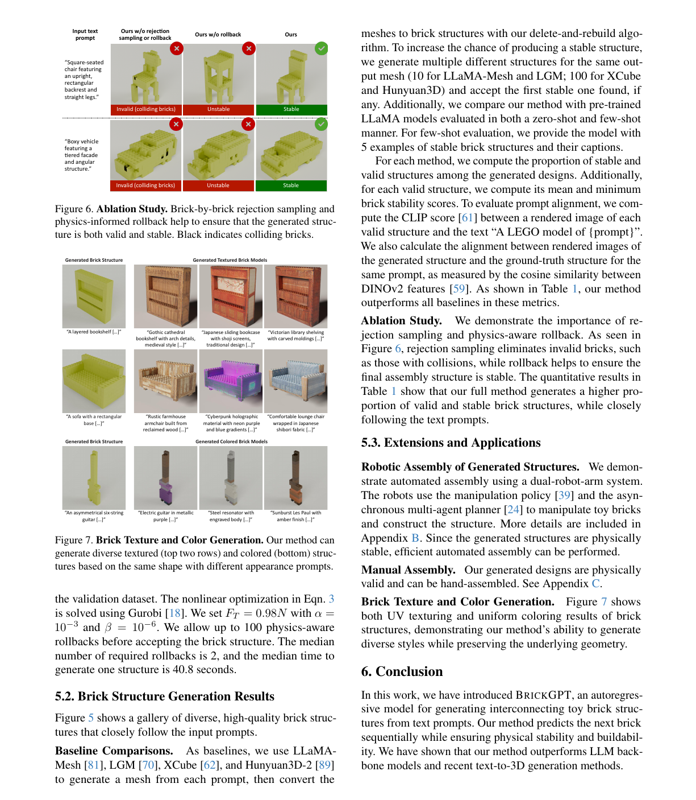

**Figure 6.** , rejection sampling eliminates invalid bricks, such

as those with collisions, while rollback helps to ensure the final assembly structure is stable. The quantitative results in

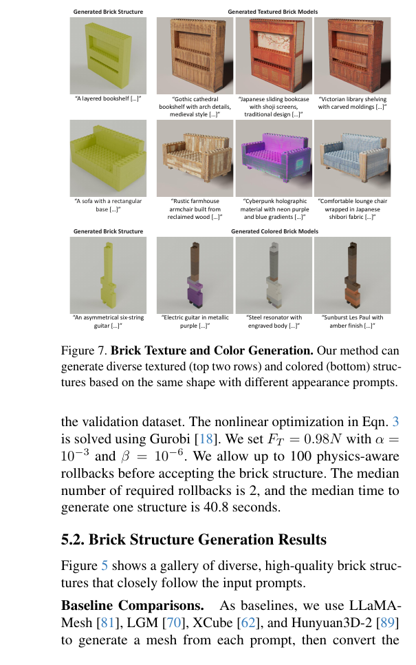

**Table 1.** show that our full method generates a higher pro-

portion of valid and stable brick structures, while closely following the text prompts.

### 5.3. Extensions and Applications

Robotic Assembly of Generated Structures.We demonstrate automated assembly using a dual-robot-arm system. The robots use the manipulation policy [ 39] and the asynchronous multi-agent planner [24] to manipulate toy bricks and construct the structure. More details are included in

### Appendix B. Since the generated structures are physically

stable, efficient automated assembly can be performed. Manual Assembly.Our generated designs are physically valid and can be hand-assembled. See Appendix C. Brick Texture and Color Generation.Figure 7 shows both UV texturing and uniform coloring results of brick structures, demonstrating our method’s ability to generate diverse styles while preserving the underlying geometry.

## 6. Conclusion

In this work, we have introduced BRICKGPT, an autoregressive model for generating interconnecting toy brick structures from text prompts. Our method predicts the next brick sequentially while ensuring physical stability and buildability. We have shown that our method outperforms LLM backbone models and recent text-to-3D generation methods.

<!-- Page 9 -->

## Acknowledgments

We thank Minchen Li, Ken Goldberg, Nupur Kumari, Ruihan Gao, and Yihao Shi for their discussions and help. We also thank Jiaoyang Li, Philip Huang, and Shobhit Aggarwal for developing the bimanual robotic system. This work is partly supported by the Packard Foundation, Cisco Research Grant, and Amazon Faculty Award. This work is also in part supported by the Manufacturing Futures Institute, Carnegie Mellon University, through a grant from the Richard King Mellon Foundation. KD is supported by the Microsoft Research PhD Fellowship.

## References

[1] Josh Achiam, Steven Adler, Sandhini Agarwal, Lama Ahmad, Ilge Akkaya, Florencia Leoni Aleman, Diogo Almeida, Janko Altenschmidt, Sam Altman, Shyamal Anadkat, et al. GPT-4 technical report.arXiv preprint arXiv:2303.08774, 2023. 3, 4 [2] Angel X. Chang, Thomas Funkhouser, Leonidas Guibas, Pat Hanrahan, Qixing Huang, Zimo Li, Silvio Savarese, Manolis Savva, Shuran Song, Hao Su, Jianxiong Xiao, Li Yi, and Fisher Yu. ShapeNet: An Information-Rich 3D Model Repository. Technical Report arXiv:1512.03012 [cs.GR], Stanford University — Princeton University — Toyota Technological Institute at Chicago, 2015. 3, 13 [3] Rui Chen, Yongwei Chen, Ningxin Jiao, and Kui Jia. Fantasia3D: Disentangling geometry and appearance for highquality text-to-3D content creation. InIEEE International Conference on Computer Vision (ICCV), 2023. 2 [4] Sijin Chen, Xin Chen, Anqi Pang, Xianfang Zeng, Wei Cheng, Yijun Fu, Fukun Yin, Yanru Wang, Zhibin Wang, Chi Zhang, Jingyi Yu, Gang Yu, Bin Fu, and Tao Chen. MeshXL: Neural coordinate field for generative 3D foundation models.arXiv preprint arXiv:2405.20853, 2024. 2 [5] Yiwen Chen, Tong He, Di Huang, Weicai Ye, Sijin Chen, Jiaxiang Tang, Xin Chen, Zhongang Cai, Lei Yang, Gang Yu, Guosheng Lin, and Chi Zhang. MeshAnything: Artist-created mesh generation with autoregressive transformers.arXiv preprint arXiv:2406.10163, 2024. [6] Yiwen Chen, Yikai Wang, Yihao Luo, Zhengyi Wang, Zilong Chen, Jun Zhu, Chi Zhang, and Guosheng Lin. MeshAnything V2: Artist-created mesh generation with adjacent mesh tokenization.arXiv preprint arXiv:2408.02555, 2024. 2 [7] Matt Deitke, Ruoshi Liu, Matthew Wallingford, Huong Ngo, Oscar Michel, Aditya Kusupati, Alan Fan, Christian Laforte, Vikram V oleti, Samir Yitzhak Gadre, Eli VanderBilt, Aniruddha Kembhavi, Carl V ondrick, Georgia Gkioxari, Kiana Ehsani, Ludwig Schmidt, and Ali Farhadi. Objaverse-XL: A universe of 10M+ 3D objects. InAdvances in Neural Information Processing Systems (NeurIPS), pages 35799–35813. Curran Associates, Inc., 2023. 15 [8] Kangle Deng, Timothy Omernick, Alexander Weiss, Deva Ramanan, Jun-Yan Zhu, Tinghui Zhou, and Maneesh Agrawala. FlashTex: Fast relightable mesh texturing with LightControl- Net. InEuropean Conference on Computer Vision (ECCV), 2024. 1, 6 [9] Kangle Deng, Hsueh-Ti Derek Liu, Yiheng Zhu, Xiaoxia Sun, Chong Shang, Kiran Bhat, Deva Ramanan, Jun-Yan Zhu, Maneesh Agrawala, and Tinghui Zhou. Efficient autoregressive shape generation via octree-based adaptive tokenization. arXiv preprint arXiv:2504.02817, 2025. 2 [10] Yuan Dong, Qi Zuo, Xiaodong Gu, Weihao Yuan, Zhengyi Zhao, Zilong Dong, Liefeng Bo, and Qixing Huang. GPLD3D: Latent diffusion of 3D shape generative models by enforcing geometric and physical priors. InIEEE Conference on Computer Vision and Pattern Recognition (CVPR), 2024. 3 [11] Abhimanyu Dubey, Abhinav Jauhri, Abhinav Pandey, Abhishek Kadian, Ahmad Al-Dahle, Aiesha Letman, Akhil Mathur, Alan Schelten, Amy Yang, Angela Fan, et al. The Llama 3 herd of models.arXiv preprint arXiv:2407.21783, 2024. 4, 14 [12] Pablo Funes and Jordan Pollack. Evolutionary body building: Adaptive physical designs for robots.Artificial Life, 4(4): 337–357, 1998. 3 [13] Jiahao Ge, Mingjun Zhou, Wenrui Bao, Hao Xu, and Chi- Wing Fu. Creating LEGO figurines from single images.ACM Transactions on Graphics (TOG), 43(4):153:1–153:16, 2024. 2 [14] Jiahao Ge, Mingjun Zhou, and Chi-Wing Fu. Learn to create simple LEGO micro buildings.ACM Transactions on Graphics (TOG), 43(6):249:1–249:13, 2024. 2 [15] Andrew Goldberg, Kavish Kondap, Tianshuang Qiu, Zehan Ma, Letian Fu, Justin Kerr, Huang Huang, Kaiyuan Chen, Kuan Fang, and Ken Goldberg. Blox-Net: Generative designfor-robot-assembly using VLM supervision, physics, simulation, and a robot with reset. InInternational Conference on Robotics and Automation (ICRA). IEEE, 2025. 3 [16] Ian Goodfellow, Jean Pouget-Abadie, Mehdi Mirza, Bing Xu, David Warde-Farley, Sherjil Ozair, Aaron Courville, and Yoshua Bengio. Generative adversarial networks. InAdvances in Neural Information Processing Systems (NeurIPS), 2014. 1 [17] Minghao Guo, Bohan Wang, Pingchuan Ma, Tianyuan Zhang, Crystal Elaine Owens, Chuang Gan, Joshua B. Tenenbaum, Kaiming He, and Wojciech Matusik. Physically compatible 3D object modeling from a single image.arXiv preprint arXiv:2405.20510, 2024. 3 [18] Gurobi Optimization, LLC. Gurobi Optimizer reference manual, 2023. 5, 8 [19] Zekun Hao, David W Romero, Tsung-Yi Lin, and Ming-Yu Liu. Meshtron: High-fidelity, artist-like 3D mesh generation at scale.arXiv preprint arXiv:2412.09548, 2024. 2 [20] Ayaan Haque, Matthew Tancik, Alexei Efros, Aleksander Holynski, and Angjoo Kanazawa. Instruct-NeRF2NeRF: Editing 3D scenes with instructions. InIEEE International Conference on Computer Vision (ICCV), 2023. 2 [21] Fangzhou Hong, Jiaxiang Tang, Ziang Cao, Min Shi, Tong Wu, Zhaoxi Chen, Tengfei Wang, Liang Pan, Dahua Lin, and Ziwei Liu. 3DTopia: Large text-to-3D generation model with hybrid diffusion priors.arXiv preprint arXiv:2403.02234, 2024. 2 [22] Yicong Hong, Kai Zhang, Jiuxiang Gu, Sai Bi, Yang Zhou, Difan Liu, Feng Liu, Kalyan Sunkavalli, Trung Bui, and Hao

<!-- Page 10 -->

Tan. LRM: Large reconstruction model for single image to 3D. InInternational Conference on Learning Representations (ICLR), 2024. 2 [23] Edward J Hu, Yelong Shen, Phillip Wallis, Zeyuan Allen-Zhu, Yuanzhi Li, Shean Wang, Lu Wang, and Weizhu Chen. LoRA: Low-rank adaptation of large language models. InInternational Conference on Learning Representations (ICLR), 2022. 14 [24] Philip Huang, Ruixuan Liu, Shobhit Aggarwal, Changliu Liu, and Jiaoyang Li. Apex-mr: Multi-robot asynchronous planning and execution for cooperative assembly. InRobotics: Science and Systems, 2025. 8, 14 [25] Siyuan Huang, Zan Wang, Puhao Li, Baoxiong Jia, Tengyu Liu, Yixin Zhu, Wei Liang, and Song-Chun Zhu. Diffusionbased generation, optimization, and planning in 3D scenes. InIEEE Conference on Computer Vision and Pattern Recognition (CVPR), 2023. 3 [26] Oren Katzir, Or Patashnik, Daniel Cohen-Or, and Dani Lischinski. Noise-free score distillation. InInternational Conference on Learning Representations (ICLR), 2024. 2 [27] Bernhard Kerbl, Georgios Kopanas, Thomas Leimkühler, and George Drettakis. 3D Gaussian splatting for real-time radiance field rendering. InACM Transactions on Graphics (TOG), 2023. 1 [28] Jungtaek Kim, Hyunsoo Chung, Jinhwi Lee, Minsu Cho, and Jaesik Park. Combinatorial 3D shape generation via sequential assembly.arXiv preprint arXiv:2004.07414, 2020. 2 [29] Jae Woo Kim. Survey on automated LEGO assembly construction. 2014. 2 [30] LDraw.org. Ldraw.org homepage, 2025. 5, 6 [31] Kyle Lennon, Katharina Fransen, Alexander O’Brien, Yumeng Cao, Matthew Beveridge, Yamin Arefeen, Nikhil Singh, and Iddo Drori. Image2Lego: Customized LEGO set generation from images.arXiv preprint arXiv:2108.08477, 2021. 3 [32] Jiahao Li, Hao Tan, Kai Zhang, Zexiang Xu, Fujun Luan, Yinghao Xu, Yicong Hong, Kalyan Sunkavalli, Greg Shakhnarovich, and Sai Bi. Instant3D: Fast text-to-3D with sparse-view generation and large reconstruction model. InInternational Conference on Learning Representations (ICLR), 2024. 2 [33] Muheng Li, Yueqi Duan, Jie Zhou, and Jiwen Lu. Diffusion- SDF: Text-to-shape via voxelized diffusion. InIEEE Conference on Computer Vision and Pattern Recognition (CVPR), 2023. 2 [34] Weiyu Li, Rui Chen, Xuelin Chen, and Ping Tan. Sweet- Dreamer: Aligning geometric priors in 2D diffusion for consistent text-to-3D.arXiv preprint arXiv:2310.02596, 2023. 2 [35] Weiyu Li, Jiarui Liu, Rui Chen, Yixun Liang, Xuelin Chen, Ping Tan, and Xiaoxiao Long. CraftsMan: High-fidelity mesh generation with 3D native generation and interactive geometry refiner.arXiv preprint arXiv:2405.14979, 2024. 2 [36] Chen-Hsuan Lin, Jun Gao, Luming Tang, Towaki Takikawa, Xiaohui Zeng, Xun Huang, Karsten Kreis, Sanja Fidler, Ming- Yu Liu, and Tsung-Yi Lin. Magic3D: High-resolution textto-3D content creation. InIEEE Conference on Computer Vision and Pattern Recognition (CVPR), 2023. 2 [37] Minghua Liu, Chong Zeng, Xinyue Wei, Ruoxi Shi, Linghao Chen, Chao Xu, Mengqi Zhang, Zhaoning Wang, Xiaoshuai Zhang, Isabella Liu, et al. MeshFormer: High-quality mesh generation with 3D-guided reconstruction model.Advances in Neural Information Processing Systems (NeurIPS), 37: 59314–59341, 2025. 2 [38] Ruixuan Liu, Kangle Deng, Ziwei Wang, and Changliu Liu. StableLego: Stability analysis of block stacking assembly. IEEE Robotics and Automation Letters, 9(11):9383–9390, 2024. 3, 5, 13 [39] Ruixuan Liu, Yifan Sun, and Changliu Liu. A lightweight and transferable design for robust LEGO manipulation. International Symposium on Flexible Automation, page V001T07A004, 2024. 8, 14 [40] Ruixuan Liu, Alan Chen, Weiye Zhao, and Changliu Liu. Physics-aware combinatorial assembly sequence planning using data-free action masking.IEEE Robotics and Automation Letters, 10(5):4882–4889, 2025. 2, 14 [41] Steven Liu, Xiuming Zhang, Zhoutong Zhang, Richard Zhang, Jun-Yan Zhu, and Bryan Russell. Editing conditional radiance fields. InIEEE International Conference on Computer Vision (ICCV), pages 5773–5783, 2021. 2 [42] Xueyi Liu, Bin Wang, He Wang, and Li Yi. Few-shot physically-aware articulated mesh generation via hierarchical deformation. InIEEE Conference on Computer Vision and Pattern Recognition (CVPR), 2023. 3 [43] Xiaoxiao Long, Yuan-Chen Guo, Cheng Lin, Yuan Liu, Zhiyang Dou, Lingjie Liu, Yuexin Ma, Song-Hai Zhang, Marc Habermann, Christian Theobalt, et al. Wonder3D: Single image to 3D using cross-domain diffusion. InIEEE Conference on Computer Vision and Pattern Recognition (CVPR), 2024. 2 [44] Ilya Loshchilov and Frank Hutter. Decoupled weight decay regularization. InInternational Conference on Learning Representations (ICLR), 2019. 14 [45] Artem Lukoianov, Haitz Sáez de Ocáriz Borde, Kristjan Greenewald, Vitor Campagnolo Guizilini, Timur Bagautdinov, Vincent Sitzmann, and Justin Solomon. Score distillation via reparametrized DDIM. InAdvances in Neural Information Processing Systems (NeurIPS), 2024. 2 [46] Sheng-Jie Luo, Yonghao Yue, Chun-Kai Huang, Yu-Huan Chung, Sei Imai, Tomoyuki Nishita, and Bing-Yu Chen. Legolization: optimizing LEGO designs.ACM Transactions on Graphics (TOG), 34(6), 2015. 2, 3, 13 [47] Liane Makatura, Michael Foshey, Bohan Wang, Felix Hähn- Lein, Pingchuan Ma, Bolei Deng, Megan Tjandrasuwita, Andrew Spielberg, Crystal Elaine Owens, Peter Yichen Chen, et al. How can large language models help humans in design and manufacturing?arXiv preprint arXiv:2307.14377, 2023. 2 [48] David McAllister, Songwei Ge, Jia-Bin Huang, David W. Jacobs, Alexei A. Efros, Aleksander Holynski, and Angjoo Kanazawa. Rethinking score distillation as a bridge between image distributions. InAdvances in Neural Information Processing Systems (NeurIPS), 2024. 2 [49] Gal Metzer, Elad Richardson, Or Patashnik, Raja Giryes, and Daniel Cohen-Or. Latent-NeRF for shape-guided generation

<!-- Page 11 -->

of 3d shapes and textures. InIEEE Conference on Computer Vision and Pattern Recognition (CVPR), 2023. 2 [50] Mariem Mezghanni, Malika Boulkenafed, Andre Lieutier, and Maks Ovsjanikov. Physically-aware generative network for 3D shape modeling. InIEEE Conference on Computer Vision and Pattern Recognition (CVPR), 2021. 3 [51] Mariem Mezghanni, Théo Bodrito, Malika Boulkenafed, and Maks Ovsjanikov. Physical simulation layer for accurate 3D modeling. InIEEE Conference on Computer Vision and Pattern Recognition (CVPR), 2022. 3 [52] Oscar Michel, Roi Bar-On, Richard Liu, Sagie Benaim, and Rana Hanocka. Text2Mesh: Text-driven neural stylization for meshes. InIEEE Conference on Computer Vision and Pattern Recognition (CVPR), 2022. 2 [53] Ben Mildenhall, Pratul P. Srinivasan, Matthew Tancik, Jonathan T. Barron, Ravi Ramamoorthi, and Ren Ng. NeRF: Representing scenes as neural radiance fields for view synthesis. InEuropean Conference on Computer Vision (ECCV), 2020. 1, 2 [54] Vihaan Misra, Peter Schaldenbrand, and Jean Oh. ShapeShift: Towards text-to-shape arrangement synthesis with content-aware geometric constraints.arXiv preprint arXiv:2503.14720, 2025. 3 [55] Gimin Nam, Mariem Khlifi, Andrew Rodriguez, Alberto Tono, Linqi Zhou, and Paul Guerrero. 3D-LDM: Neural implicit 3D shape generation with latent diffusion models. arXiv preprint arXiv:2212.00842, 2022. 2 [56] Charlie Nash, Yaroslav Ganin, S. M. Ali Eslami, and Peter Battaglia. PolyGen: An autoregressive generative model of 3D meshes. InInternational Conference on Machine Learning (ICML), pages 7220–7229. PMLR, 2020. 2 [57] Junfeng Ni, Yixin Chen, Bohan Jing, Nan Jiang, Bin Wang, Bo Dai, Puhao Li, Yixin Zhu, Song-Chun Zhu, and Siyuan Huang. PhyRecon: Physically plausible neural scene reconstruction. InAdvances in Neural Information Processing Systems (NeurIPS), 2024. 3 [58] Sumiaki Ono, Alexis Andre, Youngha Chang, and Masayuki Nakajima. LEGO builder: Automatic generation of LEGO assembly manual from 3D polygon model.ITE Transactions on Media Technology and Applications, 1:354–360, 2013. 2 [59] Maxime Oquab, Timothée Darcet, Théo Moutakanni, Huy V . V o, Marc Szafraniec, Vasil Khalidov, Pierre Fernandez, Daniel HAZIZA, Francisco Massa, Alaaeldin El-Nouby, Mido Assran, Nicolas Ballas, Wojciech Galuba, Russell Howes, Po- Yao Huang, Shang-Wen Li, Ishan Misra, Michael Rabbat, Vasu Sharma, Gabriel Synnaeve, Hu Xu, Herve Jegou, Julien Mairal, Patrick Labatut, Armand Joulin, and Piotr Bojanowski. DINOv2: Learning robust visual features without supervision. Transactions on Machine Learning Research, 2024. Featured Certification. 8 [60] Ben Poole, Ajay Jain, Jonathan T. Barron, and Ben Mildenhall. DreamFusion: Text-to-3D using 2D diffusion. InInternational Conference on Learning Representations (ICLR), 2023. 1, 2 [61] Alec Radford, Jong Wook Kim, Chris Hallacy, Aditya Ramesh, Gabriel Goh, Sandhini Agarwal, Girish Sastry, Amanda Askell, Pamela Mishkin, Jack Clark, et al. Learning transferable visual models from natural language supervision. InInternational Conference on Machine Learning (ICML), 2021. 8 [62] Xuanchi Ren, Jiahui Huang, Xiaohui Zeng, Ken Museth, Sanja Fidler, and Francis Williams. XCube: Large-scale 3D generative modeling using sparse voxel hierarchies. In IEEE Conference on Computer Vision and Pattern Recognition (CVPR), pages 4209–4219, 2024. 2, 7, 8 [63] Elad Richardson, Gal Metzer, Yuval Alaluf, Raja Giryes, and Daniel Cohen-Or. Texture: Text-guided texturing of 3D shapes. InACM SIGGRAPH, 2023. 1 [64] Robin Rombach, Andreas Blattmann, Dominik Lorenz, Patrick Esser, and Björn Ommer. High-resolution image synthesis with latent diffusion models. InIEEE Conference on Computer Vision and Pattern Recognition (CVPR), 2022. 2 [65] J Ryan Shue, Eric Ryan Chan, Ryan Po, Zachary Ankner, Jiajun Wu, and Gordon Wetzstein. 3D neural field generation using triplane diffusion. InIEEE Conference on Computer Vision and Pattern Recognition (CVPR), 2023. 2 [66] Yawar Siddiqui, Antonio Alliegro, Alexey Artemov, Tatiana Tommasi, Daniele Sirigatti, Vladislav Rosov, Angela Dai, and Matthias Nießner. MeshGPT: Generating triangle meshes with decoder-only transformers. InIEEE Conference on Computer Vision and Pattern Recognition (CVPR), pages 19615–19625, 2024. 2 [67] Jascha Sohl-Dickstein, Eric Weiss, Niru Maheswaranathain, and Surya Ganguli. Deep unsupervised learning using nonequilibrium thermodynamics. InInternational Conference on Machine Learning (ICML), 2015. 1 [68] Jingxiang Sun, Bo Zhang, Ruizhi Shao, Lizhen Wang, Wen Liu, Zhenda Xie, and Yebin Liu. DreamCraft3D: Hierarchical 3D generation with bootstrapped diffusion prior.arXiv preprint arXiv:2310.16818, 2023. 2 [69] Jiaxiang Tang, Zhaoshuo Li, Zekun Hao, Xian Liu, Gang Zeng, Ming-Yu Liu, and Qinsheng Zhang. EdgeRunner: Autoregressive auto-encoder for artistic mesh generation.arXiv preprint arXiv:2409.18114, 2024. 2 [70] Jiaxiang Tang, Zhaoxi Chen, Xiaokang Chen, Tengfei Wang, Gang Zeng, and Ziwei Liu. LGM: Large multi-view gaussian model for high-resolution 3D content creation. InEuropean Conference on Computer Vision (ECCV), pages 1–18, Cham,

## 2025. Springer Nature Switzerland. 2, 7, 8

[71] Romain Pierre Testuz, Yuliy Schwartzburg, and Mark Pauly. Automatic generation of constructable brick sculptures. Technical report, École Polytechnique Fédérale de Lausanne, 2013. 2 [72] Rylee Thompson, Elahe Ghalebi, Terrance DeVries, and Graham W. Taylor. Building LEGO using deep generative models of graphs.arXiv preprint arXiv:2012.11543, 2020. 2 [73] Yunsheng Tian, Jie Xu, Yichen Li, Jieliang Luo, Shinjiro Sueda, Hui Li, Karl D.D. Willis, and Wojciech Matusik. Assemble them all: Physics-based planning for generalizable assembly by disassembly.ACM Transactions on Graphics (TOG), 41(6), 2022. 14 [74] TobyLobster. ImportLDraw - blender add-on for importing LDraw models. https : / / github . com /

<!-- Page 12 -->

TobyLobster/ImportLDraw, 2025. Accessed: 2025- 03-07. 6 [75] Dmitry Tochilkin, David Pankratz, Zexiang Liu, Zixuan Huang, Adam Letts, Yangguang Li, Ding Liang, Christian Laforte, Varun Jampani, and Yan-Pei Cao. TripoSR: Fast 3D object reconstruction from a single image.arXiv preprint arXiv:2403.02151, 2024. 2 [76] Uy Dieu Tran, Minh Luu, Phong Ha Nguyen, Khoi Nguyen, and Binh-Son Hua. Diverse text-to-3D synthesis with augmented text embedding. InEuropean Conference on Computer Vision (ECCV), 2024. 2 [77] Alexander Vilesov, Pradyumna Chari, and Achuta Kadambi. CG3D: Compositional generation for text-to-3D via Gaussian splatting.arXiv preprint arXiv:2311.17907, 2023. 3 [78] Haochen Wang, Xiaodan Du, Jiahao Li, Raymond A. Yeh, and Greg Shakhnarovich. Score Jacobian chaining: Lifting pretrained 2D diffusion models for 3D generation. InIEEE Conference on Computer Vision and Pattern Recognition (CVPR), 2023. 2 [79] Ruocheng Wang, Yunzhi Zhang, Jiayuan Mao, Chin-Yi Cheng, and Jiajun Wu. Translating a visual lego manual to a machine-executable plan. InEuropean Conference on Computer Vision (ECCV), 2022. 2 [80] Zhengyi Wang, Cheng Lu, Yikai Wang, Fan Bao, Chongxuan Li, Hang Su, and Jun Zhu. ProlificDreamer: High-fidelity and diverse text-to-3D generation with variational score distillation. InAdvances in Neural Information Processing Systems (NeurIPS), 2023. 2 [81] Zhengyi Wang, Jonathan Lorraine, Yikai Wang, Hang Su, Jun Zhu, Sanja Fidler, and Xiaohui Zeng. LLaMA-Mesh: Unifying 3D mesh generation with language models.arXiv preprint arXiv:2411.09595, 2024. 2, 7, 8 [82] Haohan Weng, Zibo Zhao, Biwen Lei, Xianghui Yang, Jian Liu, Zeqiang Lai, Zhuo Chen, Yuhong Liu, Jie Jiang, Chunchao Guo, et al. Scaling mesh generation via compressive tokenization.arXiv preprint arXiv:2411.07025, 2024. 2 [83] Qingshan Xu, Jiao Liu, Melvin Wong, Caishun Chen, and Yew-Soon Ong. Precise-physics driven text-to-3D generation. arXiv preprint arXiv:2403.12438, 2024. 3 [84] Yinghao Xu, Hao Tan, Fujun Luan, Sai Bi, Peng Wang, Jiahao Li, Zifan Shi, Kalyan Sunkavalli, Gordon Wetzstein, Zexiang Xu, and Kai Zhang. DMV3D: Denoising multi-view diffusion using 3D large reconstruction model. InInternational Conference on Learning Representations (ICLR), 2024. 2 [85] Yandan Yang, Baoxiong Jia, Peiyuan Zhi, and Siyuan Huang. PhyScene: Physically interactable 3D scene synthesis for embodied AI. InIEEE Conference on Computer Vision and Pattern Recognition (CVPR), 2024. 3 [86] Junliang Ye, Fangfu Liu, Qixiu Li, Zhengyi Wang, Yikai Wang, Xinzhou Wang, Yueqi Duan, and Jun Zhu. Dream- Reward: Text-to-3D generation with human preference. In European Conference on Computer Vision (ECCV), 2024. 2 [87] Ye Yuan, Jiaming Song, Umar Iqbal, Arash Vahdat, and Jan Kautz. PhysDiff: Physics-guided human motion diffusion model. InIEEE Conference on Computer Vision and Pattern Recognition (CVPR), 2023. 3 [88] Longwen Zhang, Ziyu Wang, Qixuan Zhang, Qiwei Qiu, Anqi Pang, Haoran Jiang, Wei Yang, Lan Xu, and Jingyi Yu. CLAY: A controllable large-scale generative model for creating highquality 3D assets. InACM Transactions on Graphics (TOG), 2024. 2 [89] Zibo Zhao, Zeqiang Lai, Qingxiang Lin, Yunfei Zhao, Haolin Liu, Shuhui Yang, Yifei Feng, Mingxin Yang, Sheng Zhang, Xianghui Yang, et al. Hunyuan3D 2.0: Scaling diffusion models for high resolution textured 3D assets generation. arXiv preprint arXiv:2501.12202, 2025. 2, 7, 8 [90] Guyue Zhou, Liyi Luo, Hao Xu, Xinliang Zhang, Haole Guo, and Hao Zhao. Brick yourself within 3 minutes. InInternational Conference on Robotics and Automation (ICRA), pages 6261–6267, 2022. 2 [91] J. Zhou, X. Chen, and Y . Xu. Automatic generation of vivid LEGO architectural sculptures.Computer Graphics Forum, 2019. 2 [92] Linqi Zhou, Yilun Du, and Jiajun Wu. 3D shape generation and completion through point-voxel diffusion. InIEEE International Conference on Computer Vision (ICCV), 2021. 2 [93] Mingjun Zhou, Jiahao Ge, Hao Xu, and Chi-Wing Fu. Computational design of LEGO® sketch art.ACM Transactions on Graphics (TOG), 42(6), 2023. 3

<!-- Page 13 -->

### Appendix

### A. BRICKGPT Implementation Details

Captioning Details.The complete prompt template used

```text
for GPT-4o caption generation is as follows:
```

“This is a rendering of a 3D object built with LEGO bricks with 24 different views. The object belongs to the category of {CATEGORY_NAME}. You will generate five different captions for this {CATEGORY_NAME} that:

## 1. Describes the core object/subject and its key geometric

features

## 2. Focuses on structure, geometry, and layout information

## 3. Uses confident, concrete, and declarative language

## 4. Omits color and texture information

## 5. Excludes medium-related terms (model, render, design)

## 6. Do not describe or reference each view individually.

## 7. Focus on form over function. Describe the physical

appearance of components rather than their purpose.

## 8. Describe components in detail, including size, shape,

and position relative to other components.

## 9. The five captions should be from coarse to fine, with

the first one being the most coarse-grained (e.g., a general description of the object, within 10 words) and the last one being the most fine-grained (e.g., a detailed description of the object, within 50 words). The five captions should be different from each other. Do not include any ordering numbers (e.g., 1, a, etc.).

## 10. Describe the object using the category name "{CATE-

GORY_NAME}" or synonyms of the category name "{CAT- EGORY_NAME}".” StableText2Brick Details.We generate StableText2Brick starting from the objects in ShapeNetCore [ 2]. While ShapeNetCore provides both voxel and mesh representations, we find that working directly with mesh data better preserves geometric details. We voxelize the 3D mesh into a 20×20×20 grid representation and generate its brick structure using a delete-and-rebuild algorithm. This algorithm is similar to that studied in prior work [46]. However, instead of initializing the structure by filling its voxels with 1×1 unit bricks and randomly merging them into larger bricks, we greedily place bricks to fill the voxels layer-by-layer from bottom to top. We use eight commonly available standard

```text
bricks: 1×1 , 1×2 , 1×4 , 1×6 , 1×8 , 2×2 , 2×4 , and
```

2×6 . We prioritize placing 1) bricks that are only partially supported by bricks on the layer below, 2) bricks that touch multiple bricks on the layer below, 3) large bricks, and 4) bricks of the opposite orientation from bricks on the layer below. After initializing the structure, we apply the new stability analysis algorithm [ 38] to iteratively identify weak regions, delete their bricks, and rebuild them by greedily placing bricks, prioritizing 1) bricks that connect multiple Create a LEGO model of the input. Format your response as a list of bricks: <brick dimensions>

```text
<brick posi?on>, where the brick posi?on is (x,y,z).
```

Allowed brick dimensions are 2x4, 4x2, 2x6, 6x2, 1x2, 2x1, 1x4, 4x1, 1x6, 6x1, 1x8, 8x1, 1x1, 2x2. All bricks are 1 unit tall. ### Input: A bench featuring a flat surface for siPng and a ver?cal back support. Each line of your output should be a LEGO brick in the format `<brick dimensions> <brick

```text
posi?on>`. For example:
2x4 (2,1,0)
```

DO NOT output any other text. Only output LEGO bricks. The first brick should have a zcoordinate of 0. Here are some example LEGO models: ### Input: Bed with rectangular base and straight headboard. ### Output: 1x2 (13,18,0) 1x2 (13,2,0) 2x2 (0,18,0) […] […4 more examples omi0ed…] Do NOT copy the examples, but create your own LEGO model for the following input. ### Input: A bench featuring a flat surface for siPng and a ver?cal back support. ### Output: 1x2 (7,4,0) 1x2 (13,4,0) 2x1 (13,2,0) 2x1 (13,0,0) 2x2 (11,4,0) 1x2 (11,2,0) 2x4 (9,14,0) 2x2 (9,2,0) 2x2 (7,4,1) 2x2 (5,4,1) 4x1 (7,18,1) 4x2 (6,18,1) […] LLaMA-3.2-1B-Instruct (pre-trained) User Rendered brick structure

**Figure 8.Few-shot.** Learning.Given a prompt and several example

structures in text format, a pre-trained LLaMA model can generate brick designs with some structure. disconnected components and 2) large bricks. This process is stochastic; we choose weak regions randomly as per [46], and we break ties between two bricks of the same heuristic value randomly. Using this delete-and-rebuild algorithm, we generate two different structures for each object. With our delete-and-rebuild shape-to-brick algorithm, we generate 62,000+ brick structures covering the21 categories with 31,218 unique 3D objects from ShapeNetCore. Among the selected 3D objects, ∼92% (i.e., 28,822) of them have at least one stable brick design, which offer 47,000+ stable layouts. Our StableText2Brick dataset significantly expands upon the previous StableLego dataset [ 38] in several key

```text
aspects: it contains >3× more stable unique 3D objects
with >5× more stable structures compared to 8,000+ in
```

StableLego, spans a diverse set of 21 object categories, and provides detailed geometric descriptions for each shape. Training Details.The full prompt that we use to construct our instruction fine-tuning dataset is as follows: “[SYSTEM]You are a helpful assistant. [USER]Create a LEGO model of the input. Format your

```text
response as a list of bricks: <brick dimensions> <brick posi-
tion>, where the brick position is (x,y,z).
Allowed brick dimensions are 1×1 , 1×2 , 2×1 , 1×4 ,
```

<!-- Page 14 -->

Ours Closest design in dataset (Chamfer distance)

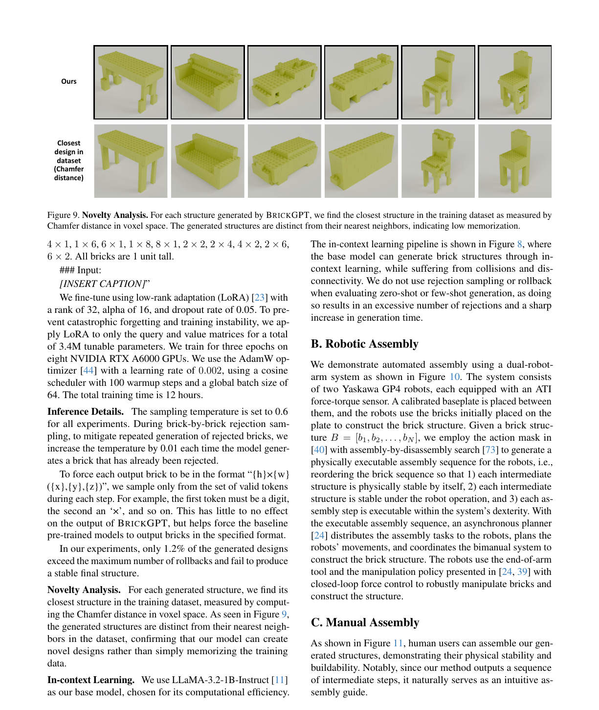

**Figure 9.Novelty.** Analysis.For each structure generated by BRICKGPT, we find the closest structure in the training dataset as measured by

Chamfer distance in voxel space. The generated structures are distinct from their nearest neighbors, indicating low memorization.

```text
4×1 , 1×6 , 6×1 , 1×8 , 8×1 , 2×2 , 2×4 , 4×2 , 2×6 ,
6×2. All bricks are 1 unit tall.
### Input:
[INSERT CAPTION]”
```

We fine-tune using low-rank adaptation (LoRA) [23] with a rank of 32, alpha of 16, and dropout rate of 0.05. To prevent catastrophic forgetting and training instability, we apply LoRA to only the query and value matrices for a total of 3.4M tunable parameters. We train for three epochs on eight NVIDIA RTX A6000 GPUs. We use the AdamW optimizer [44] with a learning rate of 0.002, using a cosine scheduler with 100 warmup steps and a global batch size of

## 64. The total training time is 12 hours.

Inference Details.The sampling temperature is set to 0.6 for all experiments. During brick-by-brick rejection sampling, to mitigate repeated generation of rejected bricks, we increase the temperature by 0.01 each time the model generates a brick that has already been rejected. To force each output brick to be in the format “{h}×{w} ({x},{y},{z})”, we sample only from the set of valid tokens during each step. For example, the first token must be a digit, the second an ‘×’, and so on. This has little to no effect on the output of BRICKGPT, but helps force the baseline pre-trained models to output bricks in the specified format. In our experiments, only 1.2% of the generated designs exceed the maximum number of rollbacks and fail to produce a stable final structure. Novelty Analysis.For each generated structure, we find its closest structure in the training dataset, measured by computing the Chamfer distance in voxel space. As seen in Figure 9, the generated structures are distinct from their nearest neighbors in the dataset, confirming that our model can create novel designs rather than simply memorizing the training data. In-context Learning.We use LLaMA-3.2-1B-Instruct [ 11] as our base model, chosen for its computational efficiency. The in-context learning pipeline is shown in Figure 8, where the base model can generate brick structures through incontext learning, while suffering from collisions and disconnectivity. We do not use rejection sampling or rollback when evaluating zero-shot or few-shot generation, as doing so results in an excessive number of rejections and a sharp increase in generation time.

### B. Robotic Assembly

We demonstrate automated assembly using a dual-robotarm system as shown in Figure 10. The system consists of two Yaskawa GP4 robots, each equipped with an ATI force-torque sensor. A calibrated baseplate is placed between them, and the robots use the bricks initially placed on the plate to construct the brick structure. Given a brick struc-

```text
ture B= [b 1, b2, . . . , bN ], we employ the action mask in
```

[40] with assembly-by-disassembly search [73] to generate a physically executable assembly sequence for the robots, i.e., reordering the brick sequence so that 1) each intermediate structure is physically stable by itself, 2) each intermediate structure is stable under the robot operation, and 3) each assembly step is executable within the system’s dexterity. With the executable assembly sequence, an asynchronous planner [24] distributes the assembly tasks to the robots, plans the robots’ movements, and coordinates the bimanual system to construct the brick structure. The robots use the end-of-arm tool and the manipulation policy presented in [24, 39] with closed-loop force control to robustly manipulate bricks and construct the structure.

## C. Manual Assembly

As shown in Figure 11, human users can assemble our generated structures, demonstrating their physical stability and buildability. Notably, since our method outputs a sequence of intermediate steps, it naturally serves as an intuitive assembly guide.

<!-- Page 15 -->

… … … … … …

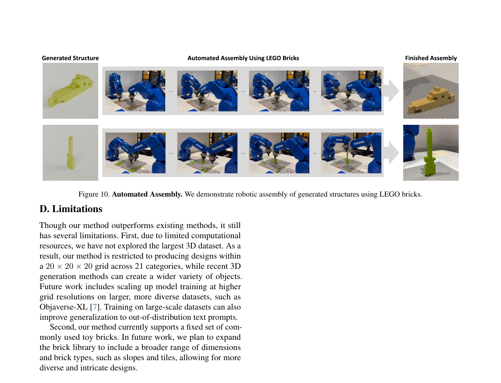

**Figure 10.Automated.** Assembly.We demonstrate robotic assembly of generated structures using LEGO bricks.

### D. Limitations

Though our method outperforms existing methods, it still has several limitations. First, due to limited computational resources, we have not explored the largest 3D dataset. As a result, our method is restricted to producing designs within a 20×20×20 grid across 21 categories, while recent 3D generation methods can create a wider variety of objects. Future work includes scaling up model training at higher grid resolutions on larger, more diverse datasets, such as Objaverse-XL [7]. Training on large-scale datasets can also improve generalization to out-of-distribution text prompts. Second, our method currently supports a fixed set of commonly used toy bricks. In future work, we plan to expand the brick library to include a broader range of dimensions and brick types, such as slopes and tiles, allowing for more diverse and intricate designs.

<!-- Page 16 -->

"A backless bench with armrest." “An acoustic guitar with an hourglass shape […]” "A two-seater bench with a straight backrest and an open rectangular design on the sides, […]" "A rectangular bookshelf featuring three horizontal shelves with open sides, supported by four […]" "A cylindrical bottle with a long, narrow neck tapering upwards to a small opening, and […]" "A sharply contoured guitar with a V-shaped body, featuring an elongated neck and […]" "Chair with cushioned backrest and seat, framed by flat, horizontal armrests supported by four straight legs." "Straight-backed chair with square seat." "The chair features an arched backrest […]" "An elongated L-shaped sofa with a straight backrest, low armrests, and short, sturdy legs." "Sofa with a straight backrest and angular armrests." "Simple table with a flat top and two side supports." "Billiard table featuring a broad, rectangular surface and parallel decorative legs." "Rectangular table with solid flat top and crossbeam reinforced legs." "Square table with four evenly spaced cylindrical legs." "A rectangular table with a slatted surface resting on X-shaped intersecting legs." "A rectangular table featuring an elongated flat top with four intricately carved […]" "Rectangular table featuring four straight legs and a flat surface." "Electric guitar with a curvaceous, double-cutaway body, slender neck […]" “Guitar with an hourglass body and a long neck.” "Jar with spherical body […]" "Long vessel with several tiered decks and twin smokestacks." "Streamlined vessel with prominent upper structure and smooth contours." "This vessel displays a sleek and elongated form, characterized by a central cylindrical tower […]" "This car displays an elongated body, rounded contours, and open-top configuration." "Sleek vintage car featuring a long horizontal body […]" "Rectangular pot with straight, defined sides and open top." "A high-backed chair." "A basic sofa." "A streamlined, elongated vessel." "A rectangular table with four legs." "A classical guitar." "A bookshelf with horizontal tiers." "A classic-style car with a prominent front grille." "A streamlined vessel with a long, narrow hull."

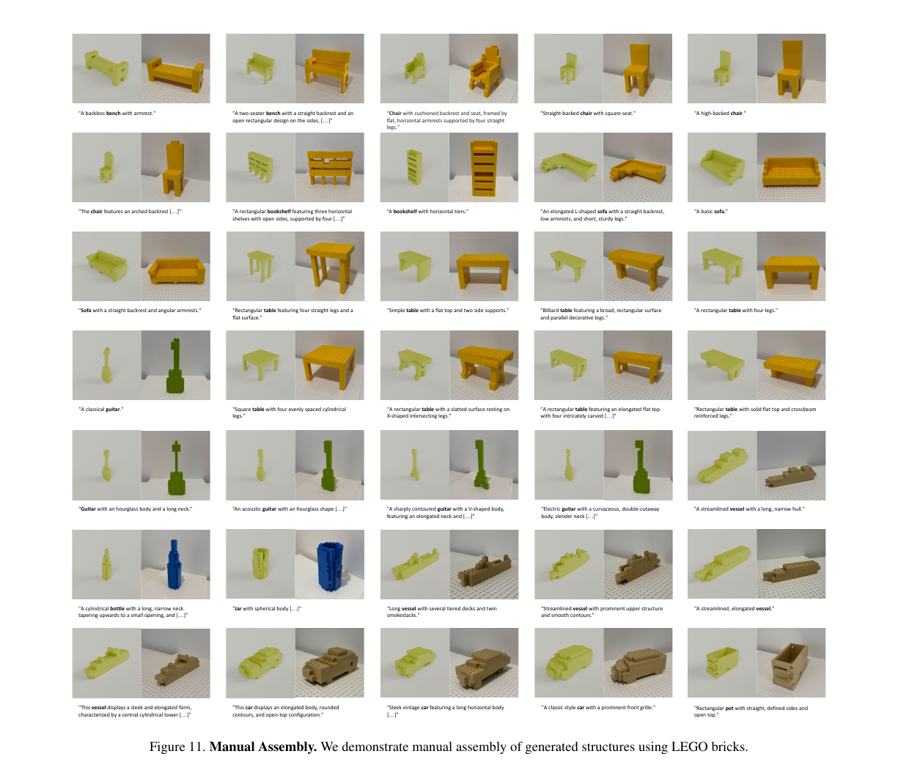

**Figure 11.Manual.** Assembly.We demonstrate manual assembly of generated structures using LEGO bricks.
