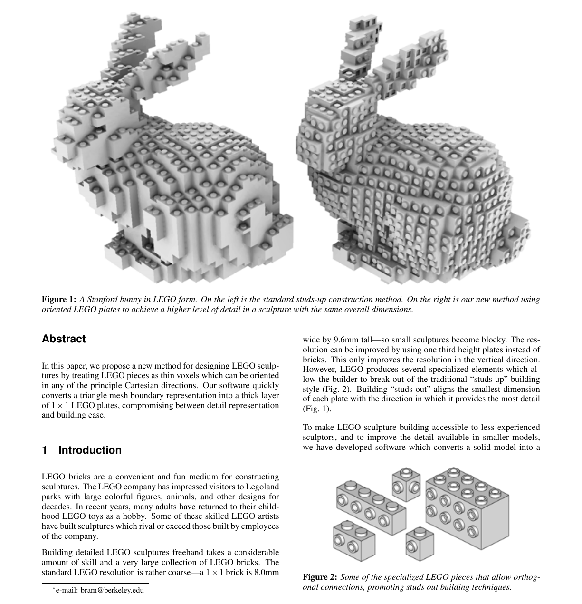
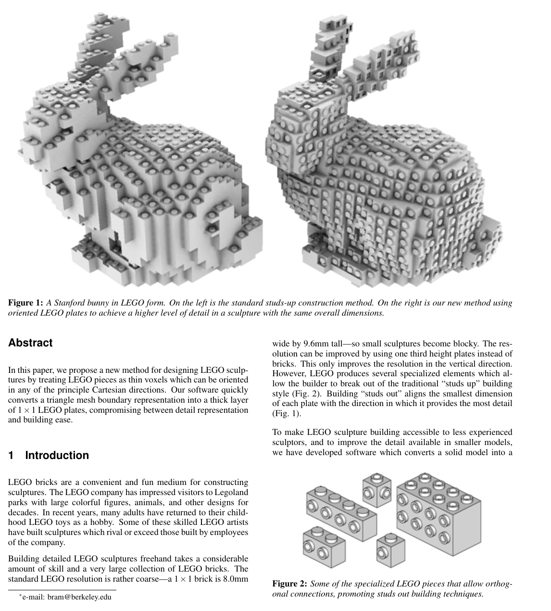
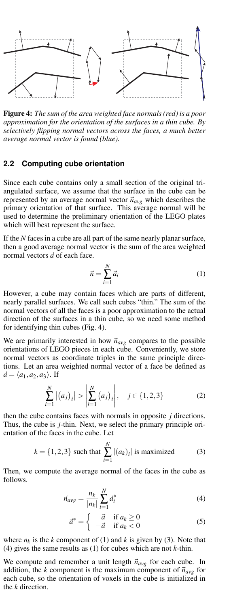
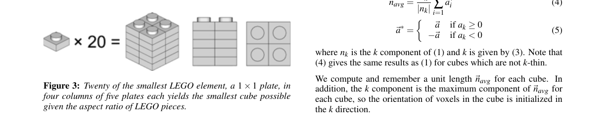
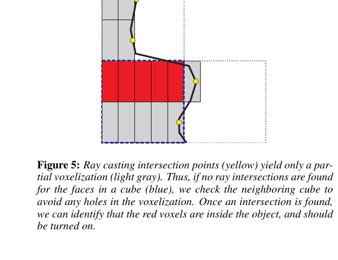
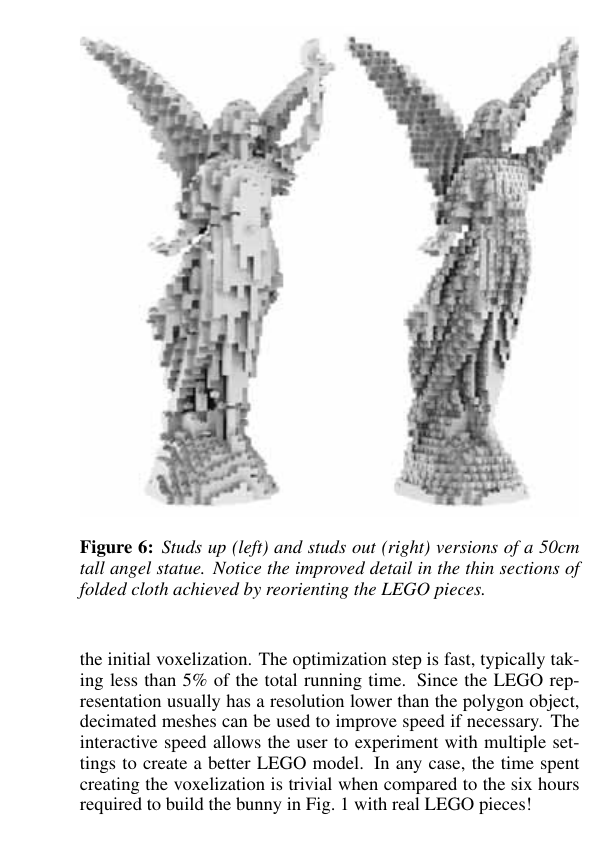
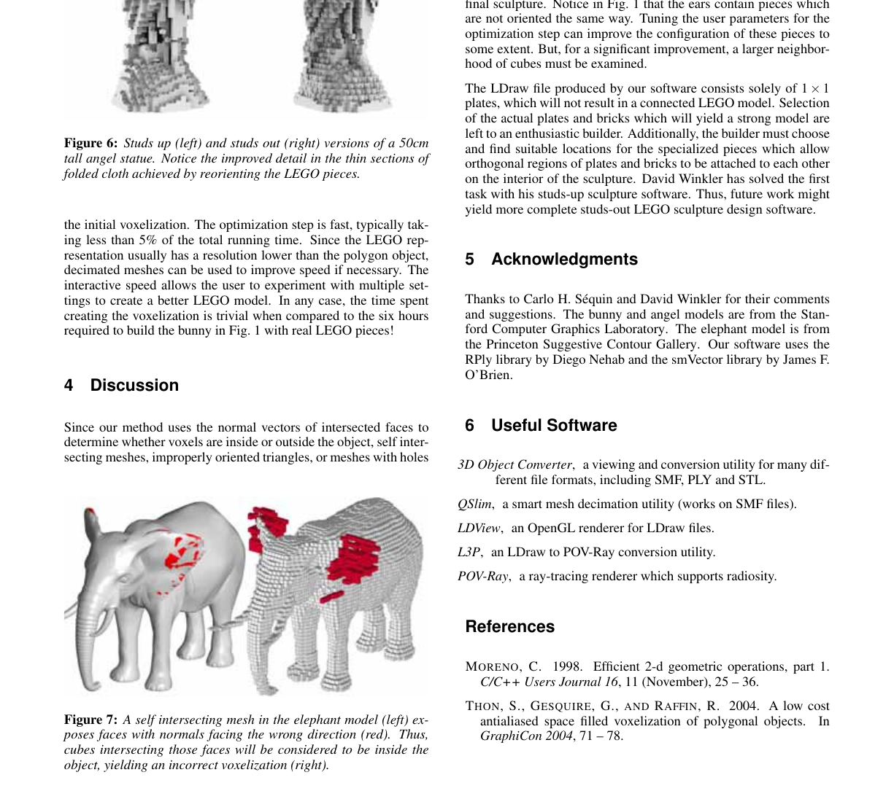

# Voxelization of boundary representations using oriented LEGO®plates

Source PDF: `lambrecht_legovoxels.pdf`

Evidence bundle: `evidence/`

<!-- Page 1 -->

® plates Bram Lambrecht∗ CS284: Computer Aided Geometric Design University of California, Berkeley



**Figure 1.** A Stanford bunny in LEGO form. On the left is the standard studs-up construction method. On the right is our new method using

oriented LEGO plates to achieve a higher level of detail in a sculpture with the same overall dimensions.

## Abstract

In this paper, we propose a new method for designing LEGO sculptures by treating LEGO pieces as thin voxels which can be oriented in any of the principle Cartesian directions. Our software quickly converts a triangle mesh boundary representation into a thick layer of 1 × 1 LEGO plates, compromising between detail representation and building ease.

## 1 Introduction

LEGO bricks are a convenient and fun medium for constructing sculptures. The LEGO company has impressed visitors to Legoland parks with large colorful figures, animals, and other designs for decades. In recent years, many adults have returned to their childhood LEGO toys as a hobby. Some of these skilled LEGO artists have built sculptures which rival or exceed those built by employees of the company. Building detailed LEGO sculptures freehand takes a considerable amount of skill and a very large collection of LEGO bricks. The standard LEGO resolution is rather coarse—a 1 × 1 brick is 8.0mm ∗e-mail: bram@berkeley.edu wide by 9.6mm tall—so small sculptures become blocky. The resolution can be improved by using one third height plates instead of bricks. This only improves the resolution in the vertical direction. However, LEGO produces several specialized elements which allow the builder to break out of the traditional “studs up” building style (Fig. 2). Building “studs out” aligns the smallest dimension of each plate with the direction in which it provides the most detail (Fig. 1). To make LEGO sculpture building accessible to less experienced sculptors, and to improve the detail available in smaller models, we have developed software which converts a solid model into a



**Figure 2.** Some of the specialized LEGO pieces that allow orthog-

onal connections, promoting studs out building techniques.

<!-- Page 2 -->

LEGO representation. The software accepts a triangle mesh input and outputs a LEGO model in LDraw 1 format. Our goal is to create a LEGO representation which is both buildable and detailed. Thus, we must compromise between orienting pieces in the same direction as their neighbors for easy connections, and orienting pieces in the direction that best represents the surface.

## 2 Method

Polygon meshes form the basis of many popular 3D object representation formats. Triangulated data sets are easy to find on the World Wide Web, and can be generated by most computer aided design software. Therefore, our method focuses on voxelizing triangular meshes. We assume that triangle vertices are provided in counter-clockwise order, thus defining an inside and an outside region for each face. Meshes with holes or boundaries are supported, but may create undesirable results. The conversion from an input PL Y or STL boundary representation to a buildable LEGO representation is performed in four steps. First, we partition the input triangular mesh into uniform cubical regions. Next, we identify the average normal direction for each cube. We use the average direction to fill each cube with oriented voxels. Finally, we optimize the configuration of cubes to create large regions of voxels oriented the same way.

### 2.1 Space partitioning

To create a facsimile of a closed polygon object using LEGO plates, the space intersected by the polygonal object must be voxelized. We leave the inside of the voxelization hollow to reduce the number of LEGO pieces required for construction and to leave room for support structures and orthogonal connection pieces. To speed up the voxelization and to ensure that the final surface representation fits together without cracks, the space near the surface is first tessellated into uniform tiles. A convenient uniform tile for tessellating this space is a cube. A cube can be oriented in any of the six principle directions without breaking the tessellation. Furthermore, a cube may be built from a small number of LEGO pieces (Fig. 3). We partition the polygonal object into axis aligned cubes by evaluating the size and location of the axis aligned bounding box of each face in the polygonal object. Each cube is stored as a location and a list of pointers to faces. We iterate through the cubes which the bounding box of a face intersects and add a pointer to the face in each of those cubes. After iterating through every face, we have a list of cubes, each of which contains or intersects a number of faces of the original polygon object. 1LDraw is a popular system of free LEGO -based computer aided design software. Details are available at http://www.ldraw.org/



**Figure 3.** Twenty of the smallest LEGO element, a 1 × 1 plate, in

four columns of five plates each yields the smallest cube possible given the aspect ratio of LEGO pieces.



**Figure 4.** The sum of the area weighted face normals (red) is a poor

approximation for the orientation of the surfaces in a thin cube. By selectively flipping normal vectors across the faces, a much better average normal vector is found (blue).

### 2.2 Computing cube orientation

Since each cube contains only a small section of the original triangulated surface, we assume that the surface in the cube can be represented by an average normal vector ⃗navg which describes the primary orientation of that surface. This average normal will be used to determine the preliminary orientation of the LEGO plates which will best represent the surface. If the N faces in a cube are all part of the same nearly planar surface, then a good average normal vector is the sum of the area weighted normal vectors ⃗a of each face. ⃗n = N ∑

```text
i=1
⃗ai (1)
```

However, a cube may contain faces which are parts of different, nearly parallel surfaces. We call such cubes “thin.” The sum of the normal vectors of all the faces is a poor approximation to the actual direction of the surfaces in a thin cube, so we need some method for identifying thin cubes (Fig. 4). We are primarily interested in how ⃗navg compares to the possible orientations of LEGO pieces in each cube. Conveniently, we store normal vectors as coordinate triples in the same principle directions. Let an area weighted normal vector of a face be defined as ⃗a = ⟨a 1, a2, a3⟩.I f N ∑

```text
i=1
⏐⏐(
a j
)
i
⏐⏐ >
⏐⏐
⏐
⏐⏐
N
∑
i=1
(
a j
)
i
⏐⏐
⏐
⏐⏐, j ∈{ 1, 2, 3} (2)
```

then the cube contains faces with normals in opposite j directions. Thus, the cube is j-thin. Next, we select the primary principle orientation of the faces in the cube. Let

```text
k = {1, 2, 3} such that
N
∑
i=1
|(ak)i| is maximized (3)
```

Then, we compute the average normal of the faces in the cube as follows.

```text
⃗navg = nk
|nk|
N
∑
i=1
⃗a∗
i (4)
⃗a∗ =
{
⃗a if ak ≥ 0
−⃗a if ak < 0 (5)
```

where nk is the k component of (1) and k is given by (3). Note that (4) gives the same results as (1) for cubes which are not k-thin. We compute and remember a unit length ⃗navg for each cube. In addition, the k component is the maximum component of ⃗navg for each cube, so the orientation of voxels in the cube is initialized in the k direction.

<!-- Page 3 -->



**Figure 5.** Ray casting intersection points (yellow) yield only a par-

tial voxelization (light gray). Thus, if no ray intersections are found for the faces in a cube (blue), we check the neighboring cube to avoid any holes in the voxelization. Once an intersection is found, we can identify that the red voxels are inside the object, and should be turned on.

### 2.3 Voxelization

Once an orientation is selected for each cube, we raycast to find actual intersection locations in the cube as in [Thon et al. 2004]. We cast a ray in the chosen axis-aligned direction j along the center of each column of voxels in a cube. Then, we iterate through the faces in the cube and test for intersection with the ray. If a cube is not j-thin, we stop after finding one intersection. Otherwise, we test each face against the ray. In the current implementation, all faces must be triangles. Raytriangle intersection tests are sped up by collapsing the the test to two dimensions by dropping the j coordinate from the triangle vertices and bounding box corners. First we test the ray (now a point) against the bounding rectangle of the triangle. If the point passes, we check if the point is inside the triangle by testing if the point is always on the left or always on the right of all three sides of the sides of the triangle [Moreno 1998]. If the point is inside the triangle, we find the actual point of intersection ⃗p using the normal vector ⃗n of the triangle and one of its vertices⃗v.I f ⃗q is a point on the ray, the j coordinate of the point of intersection ⃗p is p j = q j +⃗n · (⃗v − ⃗q) n j (6) The other components of ⃗p are the same as ⃗q. In addition to storing the intersection point, we also store the direction d, which tells us whether the ray intersects the triangle from the inside or the outside the object.

```text
d = n j
|n j| = ±1 (7)
```

If the ray does not intersect any faces in the given cube, faces in the next and previous cubes in the j direction are tested recursively in order to avoid holes in the final voxelization (Fig. 5). We stopping testing neighboring cubes when an intersection is found, or when there are no more adjacent cubes in the j direction. After all the intersections of a cast ray are found, the cube may be voxelized along the column corresponding to that ray. To do so, we iterate through the intersections ordered by the j component. We turn on all voxels whose centers lie between intersection points which are inside the object. If after casting rays for every column of voxels in a cube, no voxels are turned on, then the orientation of the cube is switched and voxelized in the next direction. If no voxels are turned on in any of the three orientations, then the empty cube is deleted so that it will not affect the optimization.

### 2.4 Cube configuration optimization

After initializing the voxelization in each cube, we wish to optimize the configuration of each cube. Cubes which have the same

```text
orientation j and the same direction d (±1) as neighboring cubes
```

are easier to connect together when building the final representation out of real LEGO pieces. First, we iterate through all cubes and identify which of their six possible face-neighbors exist. Next, we develop an energy functional E which penalizes cubes which do not match their neighbors. E

```text
j,d = α
(
1 −|
(
navg
)
j |
)
+ β B + γ
6
∑
i=1
Hi (8)
B =
{
1i f d ̸=
(navg ) j
|(navg ) j | and cube is not j-thin
```

## 0 otherwise

(9)

```text
H =
{
η if di ̸= d or ji ̸= j
```

## 0 otherwise (10)

The first two terms of E try to keep the cube in the initialized configuration, while the H term adds energy for each neighboring cube i with orientation ji and direction di which does not match the original cube. The energy added η depends on a number of user options which include extra weight for cubes with few neighbors, thin cubes, cubes with the same orientation but different direction, or cubes which share front or back faces with the cube whose energy we wish to compute. The ad hoc default values for the user defined

```text
weights are (α = 0.25, β = 0.25, γ = 0.50, η = 1.0).
```

We compute the current energy functional and the five other possible energies (for the other choices of the orientation j and direction d) for each cube. If the minimum E is less than the current E,w e enqueue the cube with a value ε. ε = E current − Emin (11) After iterating through all cubes, we have a short queue of cubes which can be improved. We remove the cube with the largest ε from the queue and switch its configuration to its minimum energy configuration. Next, we recompute ε for each of the cube’s face neighbors, and update the queue. This process is repeated until the queue is empty or a prescribed maximum number of iterations is reached.

## 3 Results

Our voxelization method produces LEGO sculpture shapes which provide a higher level of detail than the traditional studs-up building method (Fig. 1). Since we make a good approximation of the direction of surfaces, thin sections of input objects will be constructed such that high levels of detail are preserved without sacrificing structural integrity (Fig. 6). The conversion is fast for large meshes. A full Stanford bunny with 69,451 triangles is converted to an LDraw model in less than 500 milliseconds. Almost half this time is spent ray-casting to create

<!-- Page 4 -->



**Figure 6.** Studs up (left) and studs out (right) versions of a 50cm

tall angel statue. Notice the improved detail in the thin sections of folded cloth achieved by reorienting the LEGO pieces. the initial voxelization. The optimization step is fast, typically taking less than 5% of the total running time. Since the LEGO representation usually has a resolution lower than the polygon object, decimated meshes can be used to improve speed if necessary. The interactive speed allows the user to experiment with multiple settings to create a better LEGO model. In any case, the time spent creating the voxelization is trivial when compared to the six hours required to build the bunny in Fig. 1 with real LEGO pieces!

## 4 Discussion

Since our method uses the normal vectors of intersected faces to determine whether voxels are inside or outside the object, self intersecting meshes, improperly oriented triangles, or meshes with holes



**Figure 7.** A self intersecting mesh in the elephant model (left) ex-

poses faces with normals facing the wrong direction (red). Thus, cubes intersecting those faces will be considered to be inside the object, yielding an incorrect voxelization (right). can cause voxels to appear in undesired locations (Fig. 7). Since we are only interested in the surface of the LEGO representation (not the contained volume), other voxelization techniques could be used, and could provide more robust performance. However, care must be taken to avoid unwanted holes or extra voxels regardless of the method used. The current implementation only optimizes the voxelization using information about the orientation of each cubical region containing voxels. The actual voxels appearing in each cube are not analyzed. Thus, the resulting LEGO representation may be poorly connected or structurally unsound. In addition to some analysis of the voxels, using a larger neighborhood beyond the six face neighbors of each cube for the optimization step could further improve connectivity and buildability of the final sculpture. Notice in Fig. 1 that the ears contain pieces which are not oriented the same way. Tuning the user parameters for the optimization step can improve the configuration of these pieces to some extent. But, for a significant improvement, a larger neighborhood of cubes must be examined. The LDraw file produced by our software consists solely of 1 × 1 plates, which will not result in a connected LEGO model. Selection of the actual plates and bricks which will yield a strong model are left to an enthusiastic builder. Additionally, the builder must choose and find suitable locations for the specialized pieces which allow orthogonal regions of plates and bricks to be attached to each other on the interior of the sculpture. David Winkler has solved the first task with his studs-up sculpture software. Thus, future work might yield more complete studs-out LEGO sculpture design software.

## 5 Acknowledgments

Thanks to Carlo H. S ´equin and David Winkler for their comments and suggestions. The bunny and angel models are from the Stanford Computer Graphics Laboratory. The elephant model is from the Princeton Suggestive Contour Gallery. Our software uses the RPly library by Diego Nehab and the smV ector library by James F. O’Brien.

## 6 Useful Software

3D Object Converter, a viewing and conversion utility for many different file formats, including SMF, PL Y and STL. QSlim, a smart mesh decimation utility (works on SMF files). LDView, an OpenGL renderer for LDraw files. L3P, an LDraw to POV -Ray conversion utility. POV-Ray, a ray-tracing renderer which supports radiosity.

## References

MORENO , C. 1998. Efficient 2-d geometric operations, part 1. C/C++ Users Journal 16 , 11 (November), 25 – 36. THON , S., G ESQUIRE , G., AND RAFFIN , R. 2004. A low cost antialiased space filled voxelization of polygonal objects. In GraphiCon 2004,7 1–7 8 .
