# Legolization: Optimizing LEGO Designs

Source PDF: `Legolization.pdf`

Evidence bundle: `evidence/`

<!-- Page 1 -->

Sheng-Jie Luo1∗ Y onghao Y ue2 Chun-Kai Huang1 Y u-Huan Chung1∗ Sei Imai3∗ Tomoyuki Nishita4,5 Bing-Y u Chen1,4 1National Taiwan University 2Columbia University 3The University of Tokyo 4UEI Research 5Hiroshima Shudo University

## 15 cm

(a) Input 3D model (b) V oxelized representation (c) LEGO model (d) Real assembled sculpture

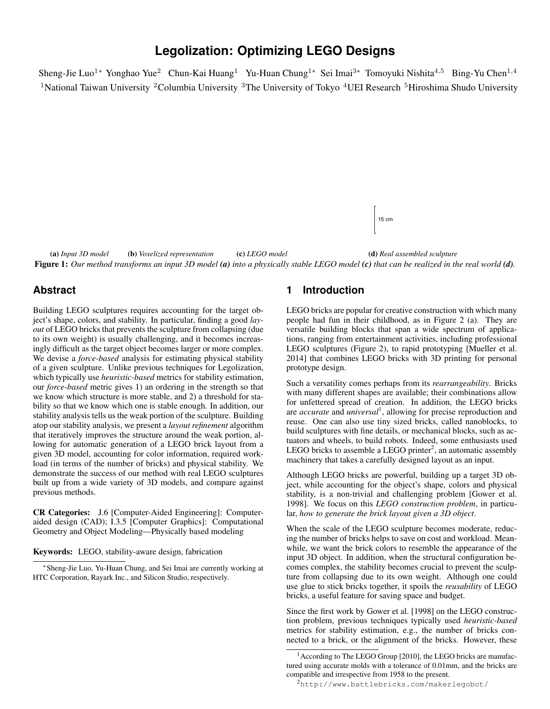

**Figure 1.** Our method transforms an input 3D model (a) into a physically stable LEGO model (c) that can be realized in the real world (d).

## Abstract

Building LEGO sculptures requires accounting for the target object’s shape, colors, and stability. In particular, finding a good layout of LEGO bricks that prevents the sculpture from collapsing (due to its own weight) is usually challenging, and it becomes increasingly difficult as the target object becomes larger or more complex. We devise a force-based analysis for estimating physical stability of a given sculpture. Unlike previous techniques for Legolization, which typically use heuristic-based metrics for stability estimation, our force-based metric gives 1) an ordering in the strength so that we know which structure is more stable, and 2) a threshold for stability so that we know which one is stable enough. In addition, our stability analysis tells us the weak portion of the sculpture. Building atop our stability analysis, we present a layout refinement algorithm that iteratively improves the structure around the weak portion, allowing for automatic generation of a LEGO brick layout from a given 3D model, accounting for color information, required workload (in terms of the number of bricks) and physical stability. We demonstrate the success of our method with real LEGO sculptures built up from a wide variety of 3D models, and compare against previous methods. CR Categories: J.6 [Computer-Aided Engineering]: Computeraided design (CAD); I.3.5 [Computer Graphics]: Computational Geometry and Object Modeling—Physically based modeling

### Keywords: LEGO, stability-aware design, fabrication

∗Sheng-Jie Luo, Y u-Huan Chung, and Sei Imai are currently working at HTC Corporation, Rayark Inc., and Silicon Studio, respectively.

## 1 Introduction

LEGO bricks are popular for creative construction with which many people had fun in their childhood, as in Figure 2 (a). They are versatile building blocks that span a wide spectrum of applications, ranging from entertainment activities, including professional LEGO sculptures (Figure 2), to rapid prototyping [Mueller et al. 2014] that combines LEGO bricks with 3D printing for personal prototype design. Such a versatility comes perhaps from its rearrangeability. Bricks with many different shapes are available; their combinations allow for unfettered spread of creation. In addition, the LEGO bricks are accurate and universal1, allowing for precise reproduction and reuse. One can also use tiny sized bricks, called nanoblocks, to build sculptures with fine details, or mechanical blocks, such as actuators and wheels, to build robots. Indeed, some enthusiasts used LEGO bricks to assemble a LEGO printer 2, an automatic assembly machinery that takes a carefully designed layout as an input. Although LEGO bricks are powerful, building up a target 3D object, while accounting for the object’s shape, colors and physical stability, is a non-trivial and challenging problem [Gower et al. 1998]. We focus on this LEGO construction problem , in particular, how to generate the brick layout given a 3D object . When the scale of the LEGO sculpture becomes moderate, reducing the number of bricks helps to save on cost and workload. Meanwhile, we want the brick colors to resemble the appearance of the

```text
input 3D object. In addition, when the structural configuration be-
```

comes complex, the stability becomes crucial to prevent the sculpture from collapsing due to its own weight. Although one could use glue to stick bricks together, it spoils the reusability of LEGO bricks, a useful feature for saving space and budget. Since the first work by Gower et al. [1998] on the LEGO construction problem, previous techniques typically used heuristic-based metrics for stability estimation, e.g., the number of bricks connected to a brick, or the alignment of the bricks. However, these 1According to The LEGO Group [2010], the LEGO bricks are manufactured using accurate molds with a tolerance of 0.01mm, and the bricks are compatible and irrespective from 1958 to the present. 2http://www.battlebricks.com/makerlegobot/

<!-- Page 2 -->

(a) (b) (c) (d) (e)

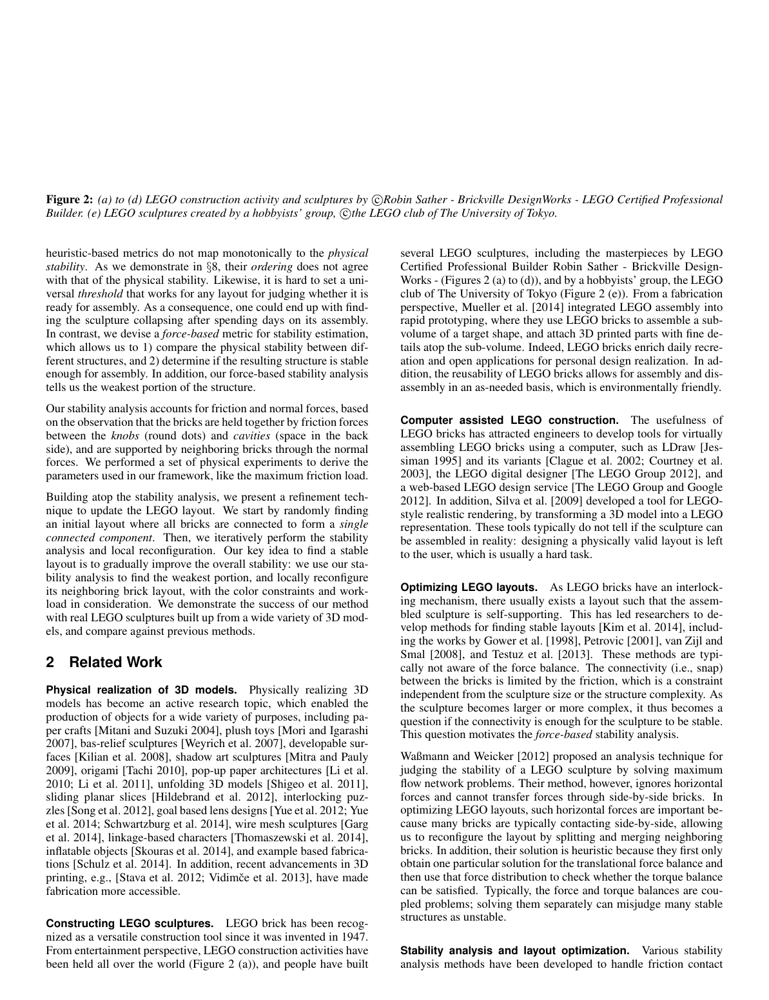

**Figure 2.** (a) to (d) LEGO construction activity and sculptures by c⃝Robin Sather - Brickville DesignWorks - LEGO Certified Professional

Builder . (e) LEGO sculptures created by a hobbyists’ group, c⃝the LEGO club of The University of Tokyo. heuristic-based metrics do not map monotonically to the physical stability. As we demonstrate in §8, their ordering does not agree with that of the physical stability. Likewise, it is hard to set a universal threshold that works for any layout for judging whether it is ready for assembly. As a consequence, one could end up with finding the sculpture collapsing after spending days on its assembly. In contrast, we devise a force-based metric for stability estimation, which allows us to 1) compare the physical stability between different structures, and 2) determine if the resulting structure is stable enough for assembly. In addition, our force-based stability analysis tells us the weakest portion of the structure. Our stability analysis accounts for friction and normal forces, based on the observation that the bricks are held together by friction forces between the knobs (round dots) and cavities (space in the back side), and are supported by neighboring bricks through the normal forces. We performed a set of physical experiments to derive the parameters used in our framework, like the maximum friction load. Building atop the stability analysis, we present a refinement technique to update the LEGO layout. We start by randomly finding an initial layout where all bricks are connected to form a single connected component . Then, we iteratively perform the stability analysis and local reconfiguration. Our key idea to find a stable layout is to gradually improve the overall stability: we use our stability analysis to find the weakest portion, and locally reconfigure its neighboring brick layout, with the color constraints and workload in consideration. We demonstrate the success of our method with real LEGO sculptures built up from a wide variety of 3D models, and compare against previous methods.

## 2 Related Work

Physical realization of 3D models. Physically realizing 3D models has become an active research topic, which enabled the production of objects for a wide variety of purposes, including paper crafts [Mitani and Suzuki 2004], plush toys [Mori and Igarashi 2007], bas-relief sculptures [Weyrich et al. 2007], developable surfaces [Kilian et al. 2008], shadow art sculptures [Mitra and Pauly 2009], origami [Tachi 2010], pop-up paper architectures [Li et al. 2010; Li et al. 2011], unfolding 3D models [Shigeo et al. 2011], sliding planar slices [Hildebrand et al. 2012], interlocking puzzles [Song et al. 2012], goal based lens designs [Y ue et al. 2012; Y ue et al. 2014; Schwartzburg et al. 2014], wire mesh sculptures [Garg et al. 2014], linkage-based characters [Thomaszewski et al. 2014], inflatable objects [Skouras et al. 2014], and example based fabrications [Schulz et al. 2014]. In addition, recent advancements in 3D printing, e.g., [Stava et al. 2012; Vidim ˇce et al. 2013], have made fabrication more accessible. Constructing LEGO sculptures. LEGO brick has been recognized as a versatile construction tool since it was invented in 1947. From entertainment perspective, LEGO construction activities have been held all over the world (Figure 2 (a)), and people have built several LEGO sculptures, including the masterpieces by LEGO Certified Professional Builder Robin Sather - Brickville Design- Works - (Figures 2 (a) to (d)), and by a hobbyists’ group, the LEGO club of The University of Tokyo (Figure 2 (e)). From a fabrication perspective, Mueller et al. [2014] integrated LEGO assembly into rapid prototyping, where they use LEGO bricks to assemble a subvolume of a target shape, and attach 3D printed parts with fine details atop the sub-volume. Indeed, LEGO bricks enrich daily recreation and open applications for personal design realization. In addition, the reusability of LEGO bricks allows for assembly and disassembly in an as-needed basis, which is environmentally friendly. Computer assisted LEGO construction. The usefulness of LEGO bricks has attracted engineers to develop tools for virtually assembling LEGO bricks using a computer, such as LDraw [Jessiman 1995] and its variants [Clague et al. 2002; Courtney et al. 2003], the LEGO digital designer [The LEGO Group 2012], and a web-based LEGO design service [The LEGO Group and Google 2012]. In addition, Silva et al. [2009] developed a tool for LEGOstyle realistic rendering, by transforming a 3D model into a LEGO representation. These tools typically do not tell if the sculpture can be assembled in reality: designing a physically valid layout is left to the user, which is usually a hard task. Optimizing LEGO layouts. As LEGO bricks have an interlocking mechanism, there usually exists a layout such that the assembled sculpture is self-supporting. This has led researchers to develop methods for finding stable layouts [Kim et al. 2014], including the works by Gower et al. [1998], Petrovic [2001], van Zijl and Smal [2008], and Testuz et al. [2013]. These methods are typically not aware of the force balance. The connectivity (i.e., snap) between the bricks is limited by the friction, which is a constraint independent from the sculpture size or the structure complexity. As the sculpture becomes larger or more complex, it thus becomes a question if the connectivity is enough for the sculpture to be stable. This question motivates the force-based stability analysis. Waßmann and Weicker [2012] proposed an analysis technique for judging the stability of a LEGO sculpture by solving maximum flow network problems. Their method, however, ignores horizontal forces and cannot transfer forces through side-by-side bricks. In optimizing LEGO layouts, such horizontal forces are important because many bricks are typically contacting side-by-side, allowing us to reconfigure the layout by splitting and merging neighboring bricks. In addition, their solution is heuristic because they first only obtain one particular solution for the translational force balance and then use that force distribution to check whether the torque balance can be satisfied. Typically, the force and torque balances are coupled problems; solving them separately can misjudge many stable structures as unstable. Stability analysis and layout optimization. V arious stability analysis methods have been developed to handle friction contact

<!-- Page 3 -->

**Algorithm 1.** Legolization

```text
1: L′ ← Layout Initialization
2: L ← Stability Aware Refinement(L′)
```

in computer graphics, including [Baraff 1994; Guendelman et al. 2003; Kaufman et al. 2005; Erleben 2007; Kaufman et al. 2008; Gasc´on et al. 2010; Umetani et al. 2012; Smith et al. 2012]. We adopt a simple friction model for the stability analysis of LEGO sculptures. Layout optimization has also arisen in other design problems, including furniture design [Umetani et al. 2012], masonry structure design [Whiting et al. 2009; V ouga et al. 2012; Whiting et al. 2012; Panozzo et al. 2013] and 3D fabrication [Stava et al. 2012; Pr ´evost et al. 2013]. In contrast to these works, the LEGO layout design problem has a discrete nature; locations, orientations and sizes of LEGO bricks are allowed to take only discrete values, motivating a dedicated method for LEGO layout generation.

## 3 Overview

Problem definition. The input of our method is a polygonal 3D model with colors. We assume that its voxelized representation is given with colors assigned to the surface voxels (the inner voxels can have any color and are labeledIGNORE, as they are not visible). We use Chen and Fang’s algorithm [1998] for this voxelization. By default, we hollow the object to reduce the number of bricks. We keep all voxels that are within 3 voxel-width from the surface voxels (hence preserving the connectivity of the voxelized shape) for all results in this paper. We consider a standard LEGO brick family ,

```text
consisting of 1 × 1, 1 × 2, 1 × 3, 1 × 4, 1 × 6, 1 × 8, 2 × 2, 2 × 3,
```

2 × 4, 2 × 6 and 2 × 8 bricks, all having the same height; bricks with other sizes can be easily incorporated into our method. Our method tries to find a voxel-filling layout 3 that is maximal and physically realizable. We say a layout is maximal if no bricks can be merged to form a new valid brick. By considering maximal layouts, we automatically encourage reducing the number of bricks for a lower workload during assembly. The user can specify the surface colors as hard constraints or as soft constraints allowing for a small deviation. Fundamental observation. The number of maximal voxelfilling layouts grows quickly as the sculpture size gets larger. For example, a fairly small model with voxel dimensions of 4×4×3 has already more than one million maximal layouts, as we demonstrate in the supplementary material. This implies that it is intractable to deterministically enumerate all candidates and check whether they are satisfactory one by one. In addition, randomly generating a layout and hoping it will be satisfactory does not work neither. In general, it is even difficult to find a layout that is single-connected4 via random generation; a layout that has multiple connected components is unsatisfactory because there is at least one connected component floating in the air. Core idea. Our strategy is to iteratively apply local and stochastic reconfigurations (§4) to obtain a series of new maximal layouts that have gradually (and strictly) improved structures. As the number of possible layouts is finite, if 1) there exists a satisfactory maximal 3A LEGO layout where the bricks exactly fill the non-empty voxels. 4A connected component refers to a set of bricks such that between any two bricks in the set, there exists a path of bricks where consecutive bricks are snapped together. We say a layout has a single connected component when the bricks in the layout as a whole is a connected component. 0 100 200 300 400 500 600 700 800 -32.31 -35.29 -72.61 -58.05 -7.083 -16.05 -27.33 -8.054 Blind refinement Stability-aware refinement Opt. time (seconds) Stability metrics (§6) of initial layoutssL R

**Figure 3.** Comparison of run times for blind and stability-aware

refinements for different layouts. Seed points for reconfigurations are chosen randomly in the blind refinement, and are the weakest portions in our stability-aware refinement. Each refinement starts from an unstable layout, with its stability metric sR L (see §6) being negative, and stops when the layout is stable ( sR

```text
L > 0).
```

layout and 2) we can generate any candidate in a non-zero probability, this series would contain a satisfactory layout in principle. In particular, our method consists of two stages (Algorithm 1), namely an initialization step (§5) that generates a single-connected layout, and a stability-aware refinement step ( §6) that updates the layout to improve the stability. We found it beneficial to focus the reconfiguration on regions that are critical to the structure, as it drastically saves on computation time in practice (as in Figure 3). Structural analysis. For each step, we devise a structural analysis technique to obtain 1) a structure metric sL and 2) a structurecritical portion wL to reconfigure. For a good metric, we require it to have two capabilities: being able to 1) determine the ordering for comparing physical properties between different structures, and 2) define a threshold for determining the termination criterion. For the initialization step, our metric sI L is simply the number of connected components ( §5), and the structure-critical portions wI L are those regions with different connected components in their neighborhood. For the stability-aware refinement step, we devise a force-based stability analysis ( §6), with which we build a stability metric sR L and find the weakest portion wR L .

## 4 Layout Reconfiguration

Given the current layout L and its structure-critical region wL, we first identify the reconfiguration region Nk(wL), defined as the union of wL and its k-ring neighbors 5. Our reconfiguration (Algorithm 2) then locally modifies the layout for Nk(wL). If k is large enough to include the entire sculpture, we will always reconfigure the layout from scratch. This choice would allow us to visit any possible maximal layout in a non-zero probability. Thus, if there exists a satisfactory maximal layout, we can eventually find that layout. However, this choice of k is impractical, and usually reconfiguring the close neighborhood of the structure-critical portion is sufficient for a better layout. Therefore, we generally want to keep k small, and only increase it when there is no better layout. As a practical choice, we found it useful to tie this k to the number of successive failures in reconfiguration ( fail count) f as

```text
k =
⌊ f
N
⌋
+ 1, (1)
```

where N is a parameter set to 10 for all the examples in this paper. 5We define 1-ring neighborhoods of bricks as their direct neighboring bricks, and inductively define the k-ring neighborhoods as the union of (k − 1)-ring neighborhoods and their direct neighbors.

<!-- Page 4 -->

**Algorithm 2.** Layout Reconfiguration

```text
Input: layout L, critical portion wL, fail count f
Output: reconfigured layout L′
1: compute k from f using (1)
```

```text
2: Nk(wL) ← k ring neighbor of wL
3: Sk ← split bricks in Nk(wL)
4: L′ ← randomly and repeatedly remerge bricks in Sk
```

To generate a reconfigured layout L′, like previous methods (e.g., [van Zijl and Smal 2008]), we use the following split and repeated remerge operations. The difference between their and our reconfigurations is that we have 1) a varying reconfiguration size and 2) an extended color assignment rule that allows us to incorporate the hard color constraint as well as soft color constraints. Brick split. We first identify the bricks Nk(wL) within the k-ring of the critical portion wL. Next, we split the bricks in Nk(wL) into a set of 1 × 1 bricks, with their colors reset to the input voxel colors. Random repeated remerge. Starting from the split 1 × 1 bricks, we iteratively and randomly merge two neighboring bricks that are mergeable, until no more bricks can be merged, encouraging the use of a smaller number of bricks. Bricks are mergeable if the merged brick still belongs to the standard LEGO brick family, and the merge does not violate the following color assignment rule. Color assignment. When we merge two bricks bi and bj, whose colors are ci and cj, respectively, the color cm of the merged brick bm is decided based on the following rules: Case 1 - Both ci and cj are IGNORE: cm is assigned IGNORE. Case 2 - One of ci and cj is a specific color and the other is IG- NORE: cm is assigned the specific color. Case 3 - ci and cj are the same color: cm is assigned ci. Case 4 - ci and cj are different colors: if the hard color constraint is specified, we discard merging bi and bj. Otherwise, we use an importance sampling strategy to assign either ci or cj to cm, such that it is less likely to violate the color alignment. We first count the number of color-inconsistent voxels, ei and

```text
ej, assuming cm = ci and cm = cj, respectively. Then, we
```

define the probabilities pi and pj to choose ci or cj as

```text
pi = 1/ei
1/ei + 1/ej + wc
, p j = 1/ej
1/ei + 1/ej + wc
,
```

where wc is a parameter (see case study 4 in §8 for details). With the probability pd given by

```text
pd = wc
1/ei + 1/ej + wc
,
```

we discard merging bi and bj; increasing wc recovers the hard constraint.

## 5 Layout Initialization

As summarized in Algorithm 3, we start by placing a 1 × 1 brick at each non-empty voxel in the voxelized representation. Then, we randomly merge the bricks as much as possible (Algorithm 4). Next, to generate a single connected component (Algorithm 5), we iteratively analyze the structure (Algorithm 6) and apply reconfigurations. The concept of using repeated split and remerge

**Algorithm 3.** Layout Initialization

```text
1: L′ ← Generate Initial Maximal Layout
2: L ← Generate Single Connected Component(L′)
```

**Algorithm 4.** Generate Initial Maximal Layout

```text
Input: an initial layout with only 1 × 1 bricks
```

```text
1: P ← all neighboring brick pairs (bi, bj) that are mergeable
2: repeat
3: (bi, bj) ← randomly pop a pair from P
4: bk ← merge bi and bj
```

5: remove any (bi, ·), (bj, ·), (·, bi) and (·, bj) from P 6: append all (bl, bk) to P if bl and bk are mergeable

```text
7: until P = ∅
```

**Algorithm 5.** Generate Single Connected Component

```text
Input: an initial maximal layout L
1: (sI
L, wI
```

```text
L ) ← Component
Analysis (L)
2: f ← 0 ⊿ f : fail count
```

```text
3: while sI
```

```text
L > 1 ∧ f < failMAX do ⊿ §8 for failMAX
4: L′ ← Layout
Reconfiguration (L, wI
L , f)
5: (sI
L′ , wI
L′ ) ← Component
Analysis (L′)
```

```text
6: if sI
L′ < s I
L then
7: L ← L′, sI
```

```text
L ← sI
L′ , wI
L ← wI
L′ , f ← 0
8: elsef ← f + 1
9: end if
10: end while
```

```text
11: if f ≥ failMAX then return no solution
12: else return L
13: end if
```

is shared by most previous techniques (like Testuz et al. [2013]) for the LEGO construction problem. Random merge (Algorithm 4). We start by initializing a list with all neighboring brick pairs that are mergeable. During the repeat loop, we randomly pop a pair (bi, bj) from the list, and merge the bricks bi and bj to form a new brick bk. Next, we update the list by first removing each brick pair which has bi or bj in its entry. Then, for each brick bl neighboring bk, we add a pair (bk, bl) if bk and bl are mergeable. The random merge is continued until the list becomes empty (i.e., no more bricks can be merged). Analyze connected component (Algorithm 6). The connectivity of the bricks can be represented as a graph: each brick represents a node, and the nodes are connected if the corresponding bricks are snapped together through the knobs and cavities. The number of connected components can be computed (lines 4-23) using a depth first search in linear time with respect to the number of nodes and edges [Hopcroft and Tarjan 1973]. Meanwhile, we assign the component ID to each brick bi. The number of connected components is used as the structure metric sI

## L. To identify the crit-

ical portion wI L (lines 24-29), for each brick bi, we enumerate its 1-ring neighbors N1(bi), and count the number ni of distinctive component IDs in N1(bi) that are different from the component ID of bi. Then, we randomly pick a brick bi according to the proba-

```text
bility pi = ni/ ∑
```

j nj, and return bi as the critical portion wI L .

## 6 Stability-Aware Refinement

We summarize our stability-aware refinement in Algorithm 7. Our objective is the stability metric sR

```text
L (= CM ) from Algorithm 8, and
```

<!-- Page 5 -->

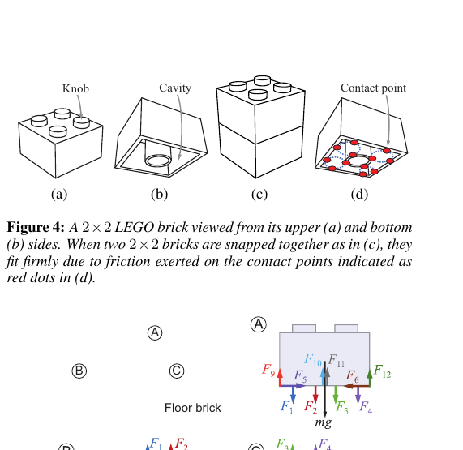

**Algorithm 6.** Component Analysis

```text
Input: layout L
Output: structure metric sI
L, critical portion wI
L
1: for each brick bi do
2: mark bi as unvisited
3: end for
```

```text
4: A ← 0 ⊿ A: number of connected components; component ID
```

```text
5: for each brick bi do
6: if bi is marked as visited then
7: continue
8: end if
```

```text
9: B ← ∅ ⊿ B: stack of bricks to check
10: push-back bi to B
11: repeat
12: pop-back brick bj from B
```

13: assign A as component ID to bj, and mark bj as visited

```text
14: N1(bj) ← 1-ring neighbor of bj
```

```text
15: for each brick bk in N1(bj) do
16: if bk is snapped to bj and bk unvisited then
17: push-back bk to B
18: end if
19: end for
```

```text
20: until B = ∅
21: A ← A + 1
22: end for
23: sI
L ← A
```

```text
24: for each brick bi do
```

```text
25: N1(bi) ← 1-ring neighbor of bi
26: ni ← (#distinctive component IDs in N1(bi) ∪ bi) −1
27: end for
28: select brick bi according to the probability pi = ni/ ∑
j nj
29: wI
L ← bi
```

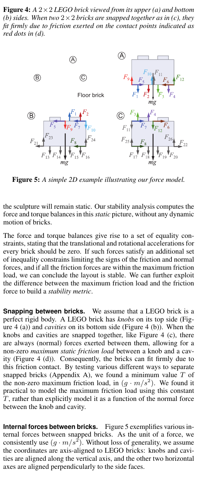

**Algorithm 7.** Stability Aware Refinement

```text
Input: single connected layout L
1: (sR
L , wR
```

```text
L ) ← Stability
Analysis (L)
2: f ← 0 ⊿ f : fail count
```

```text
3: while sR
```

```text
L ≤ 0 ∧ f < failMAX do ⊿ §8 for failMAX
4: L′ ← Layout
Reconfiguration (L, wR
L , f)
```

```text
5: if L′ is not single connected then
6: f ← f + 1
7: continue
8: end if
9: (sR
L′ , wR
```

```text
L′ ) ← Stability
Analysis (L′)
```

```text
10: if sR
L′ > s R
L then
11: L ← L′, sR
```

```text
L ← sR
L′ , wR
L ← wR
L′ , f ← 0
```

```text
12: else f ← f + 1
13: end if
14: end while
15: if f ≥ failMAX then return no solution
16: else return L
17: end if
we set sR
```

```text
L > 0 as a termination criterion (it is possible to set a
```

higher threshold for a more stable structure). There is a minor difference with the algorithmic structure of the initialization step: if the candidate is not a single connected component, we discard it immediately. Basic concept of our stability analysis. Suppose that the bricks are placed according to the layout. The gravity will then induce forces and torques on the bricks. If the static friction and normal forces are able to perfectly counteract the gravity forces, Knob Cavity Contact point (a) (b) (c) (d)

**Figure 4.** A 2×2 LEGO brick viewed from its upper (a) and bottom

(b) sides. When two 2×2 bricks are snapped together as in (c), they fit firmly due to friction exerted on the contact points indicated as red dots in (d). Floor brick A B C

**Figure 5.** A simple 2D example illustrating our force model.

the sculpture will remain static. Our stability analysis computes the force and torque balances in this static picture, without any dynamic motion of bricks. The force and torque balances give rise to a set of equality constraints, stating that the translational and rotational accelerations for every brick should be zero. If such forces satisfy an additional set of inequality constrains limiting the signs of the friction and normal forces, and if all the friction forces are within the maximum friction load, we can conclude the layout is stable. We can further exploit the difference between the maximum friction load and the friction force to build a stability metric. Snapping between bricks. We assume that a LEGO brick is a perfect rigid body. A LEGO brick has knobs on its top side (Figure 4 (a)) and cavities on its bottom side (Figure 4 (b)). When the knobs and cavities are snapped together, like Figure 4 (c), there are always (normal) forces exerted between them, allowing for a non-zero maximum static friction load between a knob and a cavity (Figure 4 (d)). Consequently, the bricks can fit firmly due to this friction contact. By testing various different ways to separate snapped bricks (Appendix A), we found a minimum value T of the non-zero maximum friction load, in (g · m/s2). We found it practical to model the maximum friction load using this constant T , rather than explicitly model it as a function of the normal force between the knob and cavity. Internal forces between bricks. Figure 5 exemplifies various internal forces between snapped bricks. As the unit of a force, we consistently use (g · m/s2). Without loss of generality, we assume the coordinates are axis-aligned to LEGO bricks: knobs and cavities are aligned along the vertical axis, and the other two horizontal axes are aligned perpendicularly to the side faces.

<!-- Page 6 -->

First, there is a set of friction forces Ff working in the vertical direction between the knobs and cavities at the contact points (Figure 4 (d)). F1 ∼ F4 and F13 ∼ F20 shown in Figure 5 illustrate these forces. The direction of these forces are taken to be outward

```text
from the brick: for Fi ∈ F f , Fi ≥ 0. If ∀Fi ∈ F f in addition
satisfies Fi < T , then the sculpture can remain static.
```

Second, the knobs and cavities are also responsible for repelling horizontal forces. Because the location of a force parallel to the contact plane between two bricks does not have any contribution to the translational and rotational accelerations, we can assign a single force, called support force, for each pair of attached bricks, to account for the sum of the horizontal forces exerted at the knobs and cavities between the pair of bricks. F5, F6, F21 and F22 shown in Figure 5 illustrate such horizontal support forces Fs. Assuming the knobs will never fracture, these forces can take any value, i.e.,

```text
for Fi ∈ F s, Fi ∈ R.
```

Next, we assign the normal forces Fn at the corner points of the contact plane where two bricks are attached. The direction of these forces (F7 ∼ F12 and F23 ∼ F26 in Figure 5) are taken to be inward to the brick. Assuming a brick will never fracture, the normal forces

```text
can take any non-negative value, i.e., for Fi ∈ F n, Fi ≥ 0.
```

Force balance. For each brick bj, we want the brick to satisfy the translational equilibrium constraint ctT (bj), given by ctT (bj) : ∑

```text
⃗Fi∈Fbj
⃗Fi + mbj ⃗ g= ⃗0, (2)
```

where ⃗Fi is the vector representation of a force Fi, Fbj is the set of forces working on the brick bj, mbj is the mass of the brick bj, and ⃗ gis the gravity. In addition, we want the brick to satisfy the rotational equilibrium constraint ctR(bj), given by ctR(bj) : ∑

```text
⃗Fi∈Fbj
⃗Li × ⃗Fi = ⃗0, (3)
```

where × is the cross product operator, and ⃗Li is the arm vector, pointing from the center of the brick to the position where the force is assigned. Non-negativity condition. While the support force can take any value, the friction and normal forces should satisfy non-negativity constraints:

```text
ctFf (i) : 0 ≤ Fi ∈ F f , (4)
ctFn (i) : 0 ≤ Fi ∈ F n. (5)
Capacities. For a friction force Fi ∈ F f , we consider its capac-
ity Ci defined as Ci = T − Fi. If Ci > 0, the corresponding
point can still accept additional forces. We define Cm = min i Ci
```

to indicate the smallest (weakest) capacity. Stability analysis. As long as the forces can be redistributed to

```text
make Cm > 0, the LEGO sculpture remains stable. We take this
```

concept of force redistribution one step further to estimate what is the highest Cm we can get. Namely, we find a force distribution {F M k } (where F M

```text
k ∈ F and F = Ff ∪ Fs ∪ Fn) that maximizes
```

**Algorithm 8.** Stability Analysis

```text
Input: single connected layout L
Output: stability metric sR
L , weakest portion wR
L
1: compute {F M
```

k } that maximizes the smallest capacity using (6) 2: compute the maximum capacity CM using (7) 3: sR

```text
L ← CM
```

4: find the weakest contact point i via (8) 5: wR

```text
L ← the two bricks sharing i
```

the smallest capacity Cm subject to the linear equality and inequality constraints discussed above 6: {F M

```text
k } = argmax
{Fk∈F }
Cm = argmax
{Fk∈F }
( min
Fi∈Ff
(T − Fi)) (6)
subject to: ctT (bj), ∀bj ⊿translational equilibriums
ctR(bj), ∀bj ⊿rotational equilibriums
ctFf (i), ∀Fi ∈ F f ⊿non-negativity constraints
ctFn (i), ∀Fi ∈ F n ⊿non-negativity constraints
```

We used a QP library called Gurobi (http://www.gurobi.com/) and employed the interior point method for solving (6). With this force distribution {F M i }, we can compute the maximum capacity CM as

```text
CM = min
Fi∈Ff
(T − F M
i ). (7)
The unit of CM , T and F M
i are all g · m/s2. CM represents how
much additional force the model can accept (for the case CM ≥ 0)
or how much the forces are overflowing (for the case CM < 0),
```

giving us an ordering in the stability: a larger CM is more stable. Hence, we can use CM to compare the stability between different

```text
layouts. In addition, CM > 0 naturally serves as a threshold for
```

the stability7, because it means there is a way to redistribute forces to make all capacities positive. Therefore, we can use CM as the stability metric sR L for the layout L. Furthermore, we can compute F w

```text
i = argmin
Fi∈Ff
(T − F M
i ), (8)
```

and identify the two bricks that share the contact point corresponding to F w i . These two bricks are the weakest portion wR L of the LEGO sculpture. Remark. One key idea here is to pose the relationships between the maximum friction load and the friction forces as the objective function, rather than inequality constraints. If we pose them as inequality constraints, there will be no solution for unstable cases, preventing us for comparing different unstable structures. With our formulation, we are able to assess the stability metric for both stable and unstable structures, enabling us to guide the layout refinement from an unstable structure towards a stable one.

## 7 Extensions

Our method can be extended to account for a maximum number of bricks and for external forces, which we elaborate below. 6Maximizing the sum of capacities does not work, since the smallest capacity can still be negative, which is an unstable configuration. 7This is a conservative estimation: a real LEGO sculpture could sometimes still stand by itself with a small negative CM ; but the bricks might not fit firmly and the structure could be fragile.

<!-- Page 7 -->


**Table 1.** The weights of different types of LEGO bricks. F or each

type, we measured five times, and averaged the values.

```text
Brick type 1 × 1 1 × 2 1 × 3 1 × 4 1 × 6 1 × 8
```

Brick weight 0.44g 0.78g 1.18g 1.74g 2.23g 3.08g

```text
Brick type 2 × 2 2 × 3 2 × 4 2 × 6 2 × 8
Brick weight 1.18g 1.78g 2.20g 3.28g 4.40g
```

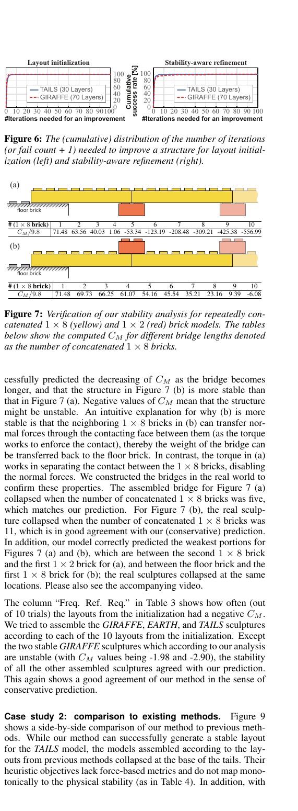

**Table 2.** The statistics on how often the assembled sculptures re-

main stable or collapse, built according to the layouts from our layout initialization. “Init. Neg. ” and “Init. Pos. ” indicate the number of initialized layouts that had negative and positive CM values, respectively. Models Init. Neg. Stable Collapsed Init. Pos. Stable Collapsed GIRAFFE 9 2 7 1 1 0 EARTH 0 0 0 10 10 0 TAILS 4 0 4 6 6 0 Maximum number of bricks. We can handle the case where we have a limited number of bricks of a certain type or color, by keeping a brick number count for each brick type or color. When we merge two bricks in the random repeated remerge operation in §4, if more bricks than prescribed are required, the merging can be discarded to not exceed the limit. External forces. When we account for the force balance in our stability analysis (in §6), we can easily specify a location in the LEGO sculpture and impose (fixed) external forces (or weights). This feature is useful for making certain parts of the sculpture stronger. For instance, we can assign external forces on top of a

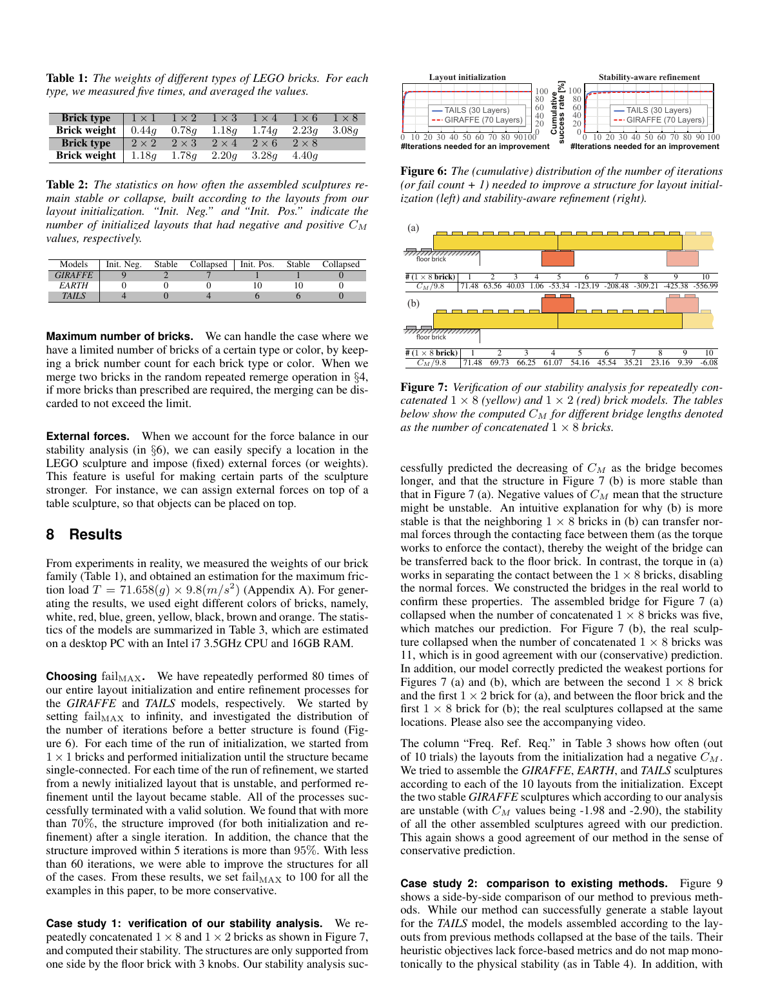

**table sculpture.** , so that objects can be placed on top.

## 8 Results

From experiments in reality, we measured the weights of our brick family (Table 1), and obtained an estimation for the maximum fric-

```text
tion load T = 71 .658(g) × 9.8(m/s2) (Appendix A). For gener-
```

ating the results, we used eight different colors of bricks, namely, white, red, blue, green, yellow, black, brown and orange. The statistics of the models are summarized in Table 3, which are estimated on a desktop PC with an Intel i7 3.5GHz CPU and 16GB RAM. Choosing failMAX. We have repeatedly performed 80 times of our entire layout initialization and entire refinement processes for the GIRAFFE and TAILS models, respectively. We started by setting failMAX to infinity, and investigated the distribution of the number of iterations before a better structure is found (Figure 6). For each time of the run of initialization, we started from 1 × 1 bricks and performed initialization until the structure became single-connected. For each time of the run of refinement, we started from a newly initialized layout that is unstable, and performed refinement until the layout became stable. All of the processes successfully terminated with a valid solution. We found that with more than 70%, the structure improved (for both initialization and refinement) after a single iteration. In addition, the chance that the structure improved within 5 iterations is more than 95%. With less than 60 iterations, we were able to improve the structures for all of the cases. From these results, we set failMAX to 100 for all the examples in this paper, to be more conservative. Case study 1: verification of our stability analysis. We repeatedly concatenated 1 × 8 and 1 × 2 bricks as shown in Figure 7, and computed their stability. The structures are only supported from one side by the floor brick with 3 knobs. Our stability analysis suc- 0 20 40 60 80 100 0 10 20 30 40 50 60 70 80 90 100 #Iterations needed for an improvement TAILS (30 Layers) GIRAFFE (70 Layers) 0 20 40 60 80 100 0 10 20 30 40 50 60 70 80 90 100 #Iterations needed for an improvement TAILS (30 Layers) GIRAFFE (70 Layers) Cumulative success rate [%] Layout initialization Stability-aware refinement

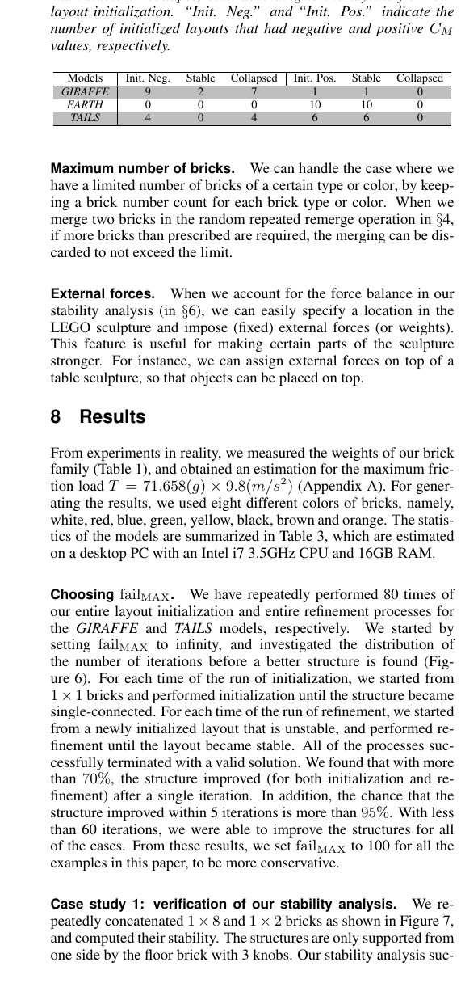

**Figure 6.** The (cumulative) distribution of the number of iterations

(or fail count + 1) needed to improve a structure for layout initialization (left) and stability-aware refinement (right). (a) /f_loor brick 

```text
# (1 × 8 brick) 1 2 3 4 5 6 7 8 9 10
```

CM /9.8 71.48 63.56 40.03 1.06 -53.34 -123.19 -208.48 -309.21 -425.38 -556.99 (b) /f_loor brick 

```text
# (1 × 8 brick) 1 2 3 4 5 6 7 8 9 10
```

CM /9.8 71.48 69.73 66.25 61.07 54.16 45.54 35.21 23.16 9.39 -6.08

**Figure 7.** V erification of our stability analysis for repeatedly con-

catenated 1 × 8 (yellow) and 1 × 2 (red) brick models. The tables below show the computed CM for different bridge lengths denoted

```text
as the number of concatenated 1 × 8 bricks.
```

cessfully predicted the decreasing of CM as the bridge becomes longer, and that the structure in Figure 7 (b) is more stable than that in Figure 7 (a). Negative values of CM mean that the structure might be unstable. An intuitive explanation for why (b) is more stable is that the neighboring 1 × 8 bricks in (b) can transfer normal forces through the contacting face between them (as the torque works to enforce the contact), thereby the weight of the bridge can be transferred back to the floor brick. In contrast, the torque in (a) works in separating the contact between the 1 × 8 bricks, disabling the normal forces. We constructed the bridges in the real world to confirm these properties. The assembled bridge for Figure 7 (a) collapsed when the number of concatenated 1 × 8 bricks was five, which matches our prediction. For Figure 7 (b), the real sculpture collapsed when the number of concatenated 1 × 8 bricks was 11, which is in good agreement with our (conservative) prediction. In addition, our model correctly predicted the weakest portions for Figures 7 (a) and (b), which are between the second 1 × 8 brick and the first 1 × 2 brick for (a), and between the floor brick and the first 1 × 8 brick for (b); the real sculptures collapsed at the same locations. Please also see the accompanying video. The column “Freq. Ref. Req.” in Table 3 shows how often (out of 10 trials) the layouts from the initialization had a negative CM . We tried to assemble the GIRAFFE, EARTH, and TAILS sculptures according to each of the 10 layouts from the initialization. Except the two stable GIRAFFE sculptures which according to our analysis are unstable (with CM values being -1.98 and -2.90), the stability of all the other assembled sculptures agreed with our prediction. This again shows a good agreement of our method in the sense of conservative prediction. Case study 2: comparison to existing methods. Figure 9 shows a side-by-side comparison of our method to previous methods. While our method can successfully generate a stable layout for the TAILS model, the models assembled according to the layouts from previous methods collapsed at the base of the tails. Their heuristic objectives lack force-based metrics and do not map monotonically to the physical stability (as in Table 4). In addition, with

<!-- Page 8 -->

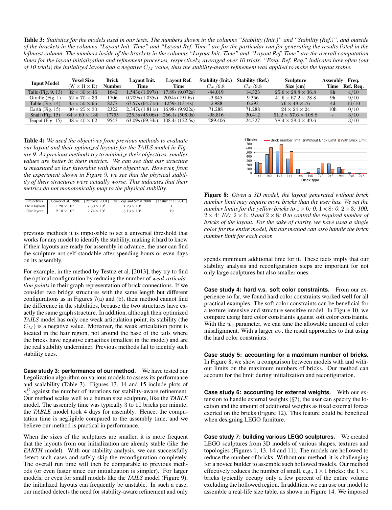

**Table 3.** Statistics for the models used in our tests. The numbers shown in the columns “Stability (Init.)” and “Stability (Ref.)”, and outside

of the brackets in the columns “Layout Init. Time” and “Layout Ref. Time” are for the particular run for generating the results listed in the leftmost column. The numbers inside of the brackets in the columns “Layout Init. Time” and “Layout Ref. Time” are the overall computation times for the layout initialization and refinement processes, respectively, averaged over 10 trials. “Freq. Ref. Req. ” indicates how often (out of 10 trials) the initialized layout had a negative CM value, thus the stability-aware refinement was applied to make the layout stable.

```text
Input Model V oxel Size Brick Layout Init. Layout Ref. Stability (Init.) Stability (Ref.) Sculpture Assembly Freq.
```

(W × H × D) Number Time Time CM /9.8 CM /9.8 Size [cm] Time Ref. Req.

```text
Tails (Fig. 9, 13) 32 × 30 × 46 1642 1.543s (1.097s) 17.89s (9.072s) -44.019 14.323 25.6 × 28.8 × 36.8 8h 4/10
Giraffe (Fig. 1) 52 × 70 × 36 1706 0.709s (1.035s) 2054s (191.6s) -3.845 9.356 41.6 × 67.2 × 28.8 9h 9/10
Table (Fig. 14) 95 × 50 × 95 8277 67.57s (64.71s) 1259s (1314s) -2.988 0.293 76 × 48 × 76 4d 10/10
Earth (Fig. 15) 30 × 25 × 30 2322 2.347s (1.811s) 16.98s (9.922s) 71.288 71.288 24 × 24 × 24 10h 0/10
Snail (Fig. 15) 64 × 60 × 136 17755 225.3s (45.06s) 266.1s (508.0s) -98.816 30.412 51.2 × 57.6 × 108.8 - 3/10
Teapot (Fig. 15) 98 × 40 × 62 9543 63.09s (69.34s) 108.4s (122.5s) -289.406 24.327 78.4 × 38.4 × 49.6 - 3/10
```

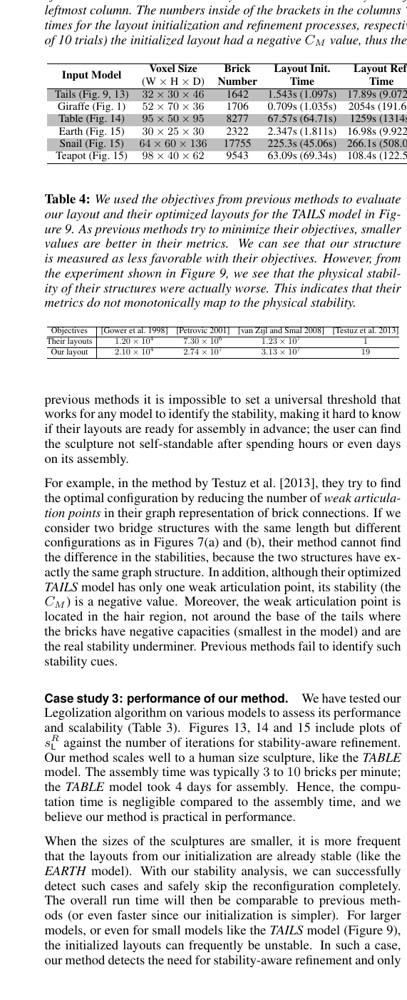

**Table 4.** We used the objectives from previous methods to evaluate

our layout and their optimized layouts for the TAILS model in Figure 9. As previous methods try to minimize their objectives, smaller values are better in their metrics. We can see that our structure is measured as less favorable with their objectives. However , from the experiment shown in Figure 9, we see that the physical stability of their structures were actually worse. This indicates that their metrics do not monotonically map to the physical stability. Objectives [Gower et al. 1998] [Petrovic 2001] [van Zijl and Smal 2008] [Testuz et al. 2013]

```text
Their layouts 1.20 × 104 7.30 × 106 1.23 × 107 1
Our layout 2.10 × 104 2.74 × 107 3.13 × 107 19
```

previous methods it is impossible to set a universal threshold that works for any model to identify the stability, making it hard to know

```text
if their layouts are ready for assembly in advance; the user can find
```

the sculpture not self-standable after spending hours or even days on its assembly. For example, in the method by Testuz et al. [2013], they try to find the optimal configuration by reducing the number of weak articulation points in their graph representation of brick connections. If we consider two bridge structures with the same length but different configurations as in Figures 7(a) and (b), their method cannot find the difference in the stabilities, because the two structures have exactly the same graph structure. In addition, although their optimized TAILS model has only one weak articulation point, its stability (the CM ) is a negative value. Moreover, the weak articulation point is located in the hair region, not around the base of the tails where the bricks have negative capacities (smallest in the model) and are the real stability underminer. Previous methods fail to identify such stability cues. Case study 3: performance of our method. We have tested our Legolization algorithm on various models to assess its performance and scalability (Table 3). Figures 13, 14 and 15 include plots of sR L against the number of iterations for stability-aware refinement. Our method scales well to a human size sculpture, like the TABLE model. The assembly time was typically 3 to 10 bricks per minute; the TABLE model took 4 days for assembly. Hence, the computation time is negligible compared to the assembly time, and we believe our method is practical in performance. When the sizes of the sculptures are smaller, it is more frequent that the layouts from our initialization are already stable (like the EARTH model). With our stability analysis, we can successfully detect such cases and safely skip the reconfiguration completely. The overall run time will then be comparable to previous methods (or even faster since our initialization is simpler). For larger models, or even for small models like the TAILS model (Figure 9), the initialized layouts can frequently be unstable. In such a case, our method detects the need for stability-aware refinement and only 0 100 200 300 400 500 600 700 1x1 1x2 1x3 1x4 1x6 1x8 2x2 2x3 2x4 2x6 2x8 #Bricks Brick type Without Brick Limit With Brick LimitBrick number limit

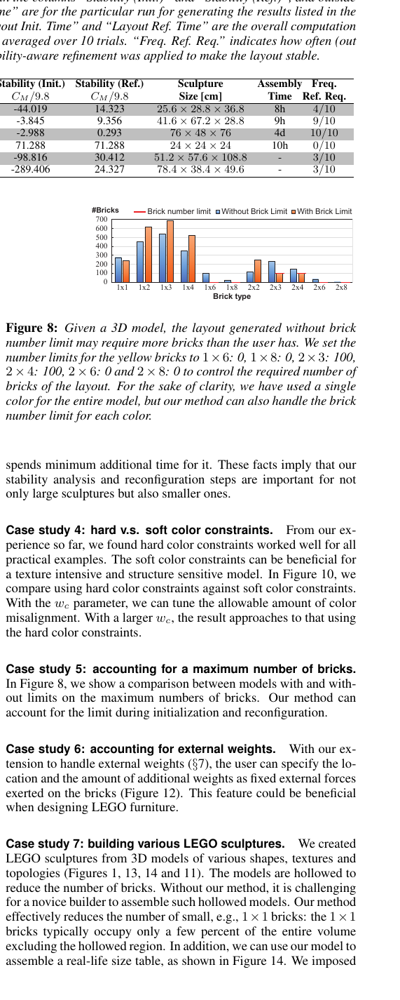

**Figure 8.** Given a 3D model, the layout generated without brick

number limit may require more bricks than the user has. We set the number limits for the yellow bricks to 1 × 6: 0, 1 × 8: 0, 2 × 3: 100,

```text
2 × 4: 100, 2 × 6: 0 and 2 × 8: 0 to control the required number of
```

bricks of the layout. F or the sake of clarity, we have used a single color for the entire model, but our method can also handle the brick number limit for each color . spends minimum additional time for it. These facts imply that our stability analysis and reconfiguration steps are important for not only large sculptures but also smaller ones. Case study 4: hard v.s. soft color constraints. From our experience so far, we found hard color constraints worked well for all practical examples. The soft color constraints can be beneficial for a texture intensive and structure sensitive model. In Figure 10, we compare using hard color constraints against soft color constraints. With the wc parameter, we can tune the allowable amount of color misalignment. With a larger wc, the result approaches to that using the hard color constraints. Case study 5: accounting for a maximum number of bricks. In Figure 8, we show a comparison between models with and without limits on the maximum numbers of bricks. Our method can account for the limit during initialization and reconfiguration. Case study 6: accounting for external weights. With our extension to handle external weights ( §7), the user can specify the location and the amount of additional weights as fixed external forces exerted on the bricks (Figure 12). This feature could be beneficial when designing LEGO furniture. Case study 7: building various LEGO sculptures. We created LEGO sculptures from 3D models of various shapes, textures and topologies (Figures 1, 13, 14 and 11). The models are hollowed to reduce the number of bricks. Without our method, it is challenging for a novice builder to assemble such hollowed models. Our method effectively reduces the number of small, e.g., 1 × 1 bricks: the 1 × 1 bricks typically occupy only a few percent of the entire volume excluding the hollowed region. In addition, we can use our model to assemble a real-life size table, as shown in Figure 14. We imposed

<!-- Page 9 -->

Our method [Gower et al. 1998] [Petrovic 2001] [van Zijl and Smal 2008] [Testuz et al. 2013] C M

```text
= 14.323 C
M
= -40.694 C
M
= -8.376 C
M
= -116.741 C
M
= -8.054
```

21.48 -46.690 35.27 -8.3760 0 -116.744.99 0 32.33 -8.0540

```text
#AP = 1
V oxelized model
AP
```

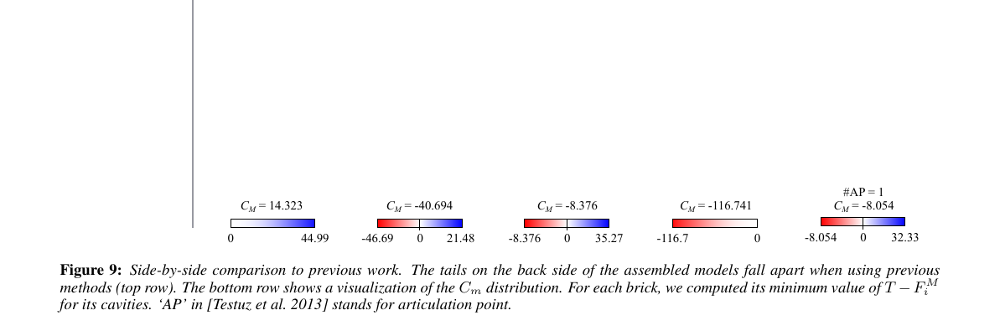

**Figure 9.** Side-by-side comparison to previous work. The tails on the back side of the assembled models fall apart when using previous

methods (top row). The bottom row shows a visualization of the Cm distribution. F or each brick, we computed its minimum value of T − F M i for its cavities. ‘AP’ in [Testuz et al. 2013] stands for articulation point.

```text
(a) Input model (b) Hard constraint (c) wc = 1 (d) wc = 100 (e) wc = 10000
42m57s 15m19s 32m13s 1h17m6s
```

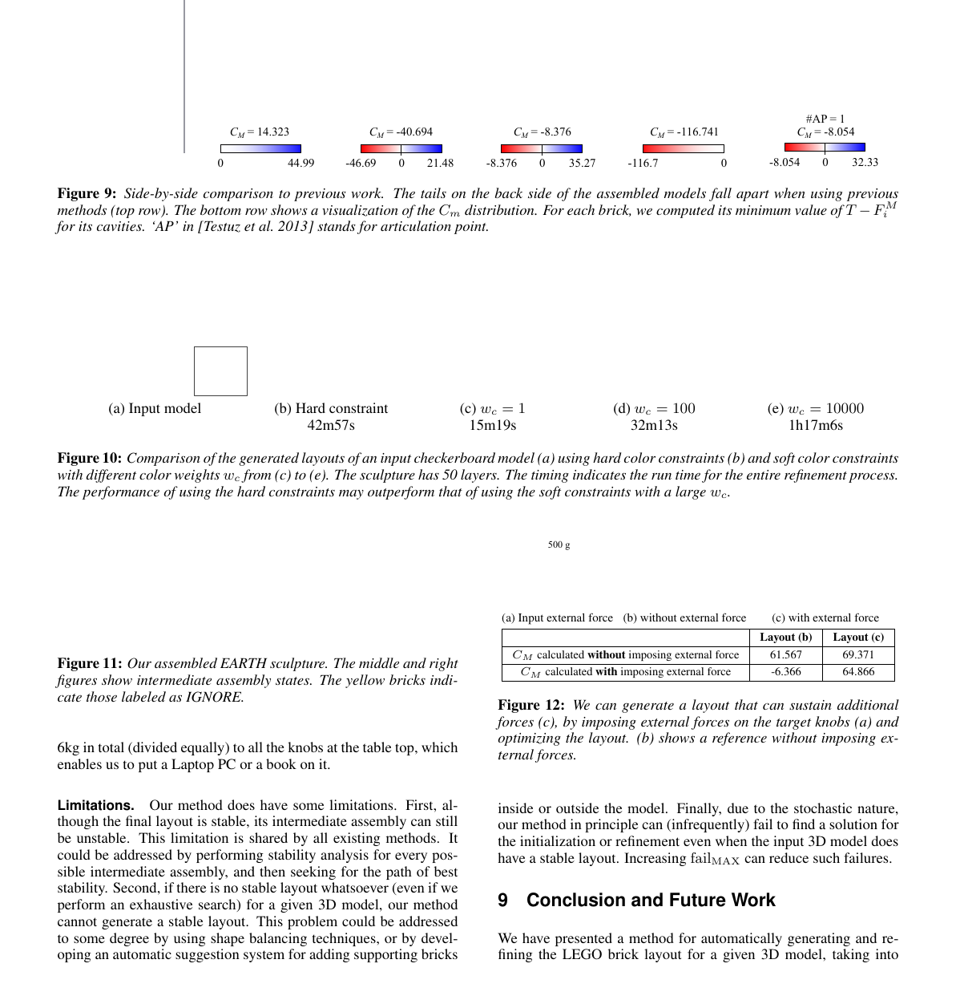

**Figure 10.** Comparison of the generated layouts of an input checkerboard model (a) using hard color constraints (b) and soft color constraints

with different color weights wc from (c) to (e). The sculpture has 50 layers. The timing indicates the run time for the entire refinement process. The performance of using the hard constraints may outperform that of using the soft constraints with a large wc.

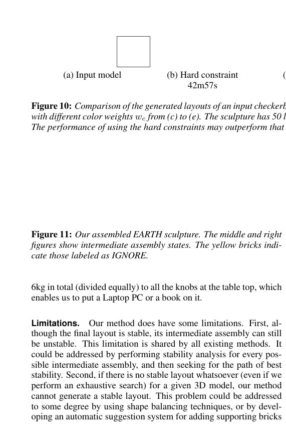

**Figure 11.** Our assembled EARTH sculpture. The middle and right

figures show intermediate assembly states. The yellow bricks indicate those labeled as IGNORE. 6kg in total (divided equally) to all the knobs at the table top, which enables us to put a Laptop PC or a book on it. Limitations. Our method does have some limitations. First, although the final layout is stable, its intermediate assembly can still be unstable. This limitation is shared by all existing methods. It could be addressed by performing stability analysis for every possible intermediate assembly, and then seeking for the path of best stability. Second, if there is no stable layout whatsoever (even if we perform an exhaustive search) for a given 3D model, our method cannot generate a stable layout. This problem could be addressed to some degree by using shape balancing techniques, or by developing an automatic suggestion system for adding supporting bricks 500 g (a) Input external force (b) without external force (c) with external force Layout (b) Layout (c) CM calculated without imposing external force 61.567 69.371 CM calculated with imposing external force -6.366 64.866

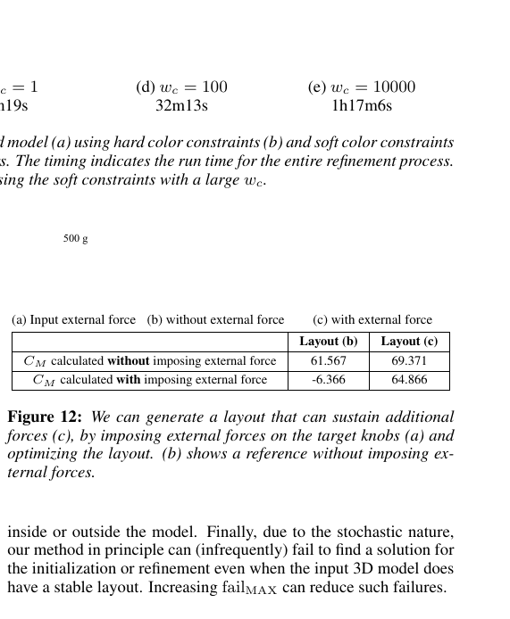

**Figure 12.** We can generate a layout that can sustain additional

forces (c), by imposing external forces on the target knobs (a) and optimizing the layout. (b) shows a reference without imposing external forces. inside or outside the model. Finally, due to the stochastic nature, our method in principle can (infrequently) fail to find a solution for the initialization or refinement even when the input 3D model does have a stable layout. Increasing failMAX can reduce such failures.

## 9 Conclusion and Future Work

We have presented a method for automatically generating and refining the LEGO brick layout for a given 3D model, taking into

<!-- Page 10 -->

## 15 cm

-50 -40 -30 -20 -10 0 10 20 #Iterations 0 1 2 CM

```text
Input model c⃝SEGA V oxelized model LEGO model Real sculpture Layout refinement process
```

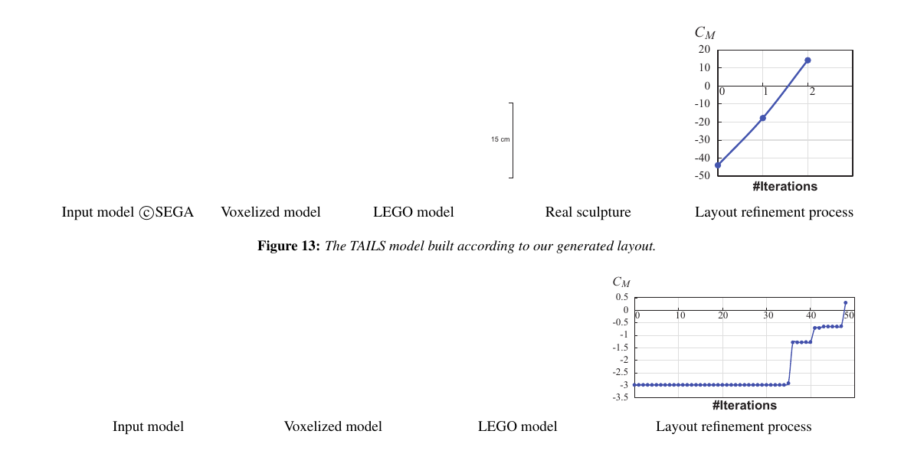

**Figure 13.** The TAILS model built according to our generated layout.

-3.5 -3 -2.5 -2 -1.5 -1 -0.5 0 0.5 #Iterations 0 10 20 30 40 50 CM

```text
Input model V oxelized model LEGO model Layout refinement process
```

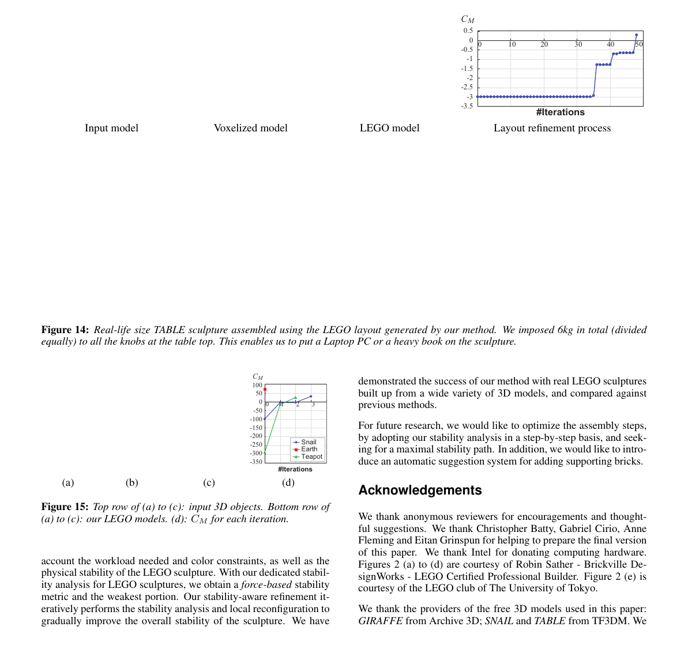

**Figure 14.** Real-life size TABLE sculpture assembled using the LEGO layout generated by our method. We imposed 6kg in total (divided

equally) to all the knobs at the table top. This enables us to put a Laptop PC or a heavy book on the sculpture. -350 -300 -250 -200 -150 -100 -50 0 50 100 #Iterations Snail Earth Teapot 0 3 CM 1 2 (a) (b) (c) (d)

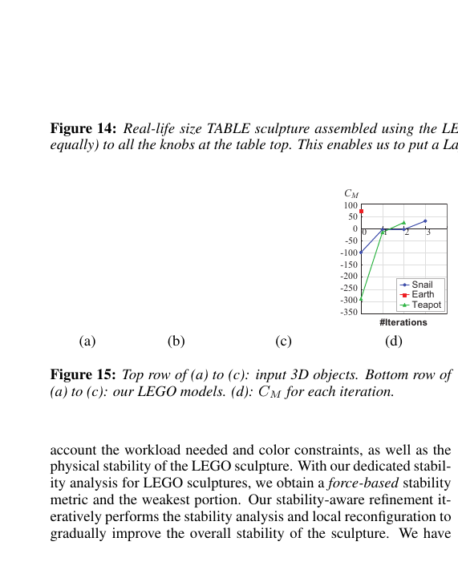

**Figure 15.** Top row of (a) to (c): input 3D objects. Bottom row of

(a) to (c): our LEGO models. (d): CM for each iteration. account the workload needed and color constraints, as well as the physical stability of the LEGO sculpture. With our dedicated stability analysis for LEGO sculptures, we obtain a force-based stability metric and the weakest portion. Our stability-aware refinement iteratively performs the stability analysis and local reconfiguration to gradually improve the overall stability of the sculpture. We have demonstrated the success of our method with real LEGO sculptures built up from a wide variety of 3D models, and compared against previous methods. For future research, we would like to optimize the assembly steps, by adopting our stability analysis in a step-by-step basis, and seeking for a maximal stability path. In addition, we would like to introduce an automatic suggestion system for adding supporting bricks.

## Acknowledgements

We thank anonymous reviewers for encouragements and thoughtful suggestions. We thank Christopher Batty, Gabriel Cirio, Anne Fleming and Eitan Grinspun for helping to prepare the final version of this paper. We thank Intel for donating computing hardware. Figures 2 (a) to (d) are courtesy of Robin Sather - Brickville DesignWorks - LEGO Certified Professional Builder. Figure 2 (e) is courtesy of the LEGO club of The University of Tokyo. We thank the providers of the free 3D models used in this paper: GIRAFFE from Archive 3D; SNAIL and TABLE from TF3DM. We

<!-- Page 11 -->

thank student volunteers from National Taiwan University for helping to build the LEGO sculptures: Chin-Y u Chien, Chi-Hao Hsieh, Tsung-Hung Wu, Kang Jao, Jia-Y u Tsai, Che-Chun Hsu, Fan Wang, Wei-Tse Lee, Y ung-Ta Lin, Li-Ming Y ang, Long-Fei Lin, Xiao- Feng Jian, Kai-Han Chang, and Ming-Shiuan Chen. We thank Wei- Ting Lin for helping to capture the photos and videos. We used Mitsuba [Jakob 2010] for rendering synthesized images. This work was supported in part by the JSPS Postdoctoral Fellowships for Research Abroad, Ministry of Science and Technology (MOST103-2218-E-002-030, MOST103-2221-E-002-158- MY3) and Intel.

## References

BARAFF , D. 1994. Fast contact force computation for nonpenetrating rigid bodies. In Proc. ACM SIGGRAPH 1994, 23–34. CHEN , H., AND FANG , S. 1998. Fast voxelization of threedimensional synthetic objects. J. Graph. Tools 3, 4, 33–45. CLAGUE , K., A GULLO , M., AND HASSING , L. 2002. LEGO software power tools: with LDraw, MLCad, and LPub . Syngress. COURTNEY , T., B LISS , S., AND HERRERA , A. 2003. Virtual LEGO: the official LDraw.org guide to LDraw tools for Windows. No Starch Press. ERLEBEN , K. 2007. V elocity-based shock propagation for multibody dynamics animation. ACM Trans. Graph. 26 , 2, 12:1– 12:20. GARG , A., S AGEMAN -F URNAS , A. O., D ENG , B., Y UE, Y., GRINSPUN , E., P AULY, M., AND WARDETZKY , M. 2014. Wire mesh design. ACM Trans. Graph. (Proc. SIGGRAPH 2014) 33 , 4, 66:1–66:12. GASC ´ON, J., Z URDO , J. S., AND OTADUY, M. A. 2010. Constraint-based simulation of adhesive contact. In Proc. SCA 2010, 39–44. GOWER , R., H EYDTMANN , A., AND PETERSEN , H. 1998. LEGO: automated model construction. In Proc. 32nd European Study Group with Industry , 81–94. GUENDELMAN , E., B RIDSON , R., AND FEDKIW , R. 2003. Nonconvex rigid bodies with stacking. ACM Trans. Graph. (Proc. SIGGRAPH 2003) 22, 3, 871–878. HILDEBRAND , K., B ICKEL , B., AND ALEXA , M. 2012. crdbrd: shape fabrication by sliding planar slices. Comput. Graph. F orum (Proc. EUROGRAPHICS 2012) 31, 2-3, 583–592. HOPCROFT , J., AND TARJAN , R. 1973. Efficient algorithms for graph manipulation. Communications of the ACM 16 , 6, 372– 378. JAKOB , W. 2010. Mitsuba renderer . http://www.mitsubarenderer.org. JESSIMAN , J. 1995. LDraw, LEGO CAD software package . http://beta.ldraw.org/. KAUFMAN , D. M., E DMUNDS , T., AND PAI, D. K. 2005. Fast frictional dynamics for rigid bodies. ACM Trans. Graph. (Proc. SIGGRAPH 2005) 24, 3, 946–956. KAUFMAN , D. M., S UEDA , S., J AMES , D. L., AND PAI, D. K.

## 2008. Staggered projections for frictional contact in multibody

systems. ACM Trans. Graph. (Proc. SIGGRAPH Asia 2008) 27 , 5, 164:1–164:11. KILIAN , M., F L ¨ORY, S., C HEN , Z., M ITRA , N. J., S HEFFER , A., AND POTTMANN , H. 2008. Curved folding. ACM Trans. Graph. (Proc. SIGGRAPH 2008) 27 , 3, 75:1–75:9. KIM, J.-W., K ANG , K.-K., AND LEE, J.-H. 2014. Survey on automated LEGO assembly construction. In Proc. WSCG 2014, 89–96. LI, X.-Y., S HEN , C.-H., H UANG , S.-S., J U, T., AND HU, S.- M. 2010. Popup: automatic paper architectures from 3D models. ACM Trans. Graph. (Proc. SIGGRAPH 2010) 29 , 4, 111:1– 111:9. LI, X.-Y., J U, T., G U, Y., AND HU, S.-M. 2011. A geometric study of v-style pop-ups: theories and algorithms. ACM Trans. Graph. (Proc. SIGGRAPH 2011) 30 , 4, 98:1–98:10. MITANI , J., AND SUZUKI , H. 2004. Making papercraft toys from meshes using strip-based approximate unfolding. ACM Trans. Graph. (Proc. SIGGRAPH 2004) 23 , 3, 259–263. MITRA , N. J., AND PAULY, M. 2009. Shadow art. ACM Trans. Graph. (Proc. SIGGRAPH Asia 2009) 28 , 5, 156:1–156:7. MORI , Y., AND IGARASHI , T. 2007. Plushie: an interactive design system for plush toys. ACM Trans. Graph. (Proc. SIGGRAPH 2007) 26, 3, 45:1–45:8. MUELLER , S., M OHR , T., G UENTHER , K., F ROHNHOFEN , J., AND BAUDISCH , P. 2014. faBrickation: fast 3D printing of functional objects by integrating construction kit building blocks. In Proc. SIGCHI 2014, 3827–3834. PANOZZO , D., B LOCK , P., AND SORKINE -H ORNUNG , O. 2013. Designing unreinforced masonry models. ACM Trans. Graph. (Proc. SIGGRAPH 2013) 32 , 4, 91:1–91:12. PETROVIC , P. 2001. Solving the LEGO brick layout problem using evolutionary algorithms. In Proc. NIK 2001. PR ´EVOST , R., W HITING , E., L EFEBVRE , S., AND SORKINE - HORNUNG , O. 2013. Make it stand: Balancing shapes for 3D fabrication. ACM Trans. Graph. (Proc. SIGGRAPH 2013) 32, 4, 81:1–81:10. SCHULZ , A., S HAMIR , A., L EVIN , D. I. W., S ITTHI -AMORN , P., AND MATUSIK , W. 2014. Design and fabrication by example. ACM Trans. Graph. (Proc. SIGGRAPH 2014) 33, 4, 62:1–62:11. SCHWARTZBURG , Y., T ESTUZ , R., T AGLIASACCHI , A., AND PAULY, M. 2014. High-contrast computational caustic design. ACM Trans. Graph. (Proc. SIGGRAPH 2014) 33, 4, 74:1–74:11. SHIGEO , T., W U, H.-Y., S AW, S. H., L IN, C.-C., AND YEN, H.-C. 2011. Optimized topological surgery for unfolding 3D meshes. Comput. Graph. F orum (Proc. Pacific Graphics 2011) 30, 7, 2077–2086. SILVA, L. F., P AMPLONA , V. F., AND COMBA , J. L. 2009. Legolizer: a real-time system for modeling and rendering LEGO representations of boundary models. In Proc. SIBGRAPI 2009 , 17–23. SKOURAS , M., T HOMASZEWSKI , B., K AUFMANN , P., G ARG , A., B ICKEL , B., G RINSPUN , E., AND GROSS , M. 2014. Designing inflatable structures. ACM Trans. Graph. (Proc. SIG- GRAPH 2014) 33 , 4, 63:1–63:10. SMITH , B., K AUFMAN , D. M., V OUGA , E., T AMSTORF , R., AND GRINSPUN , E. 2012. Reflections on simultaneous impact. ACM Trans. Graph. (Proc. SIGGRAPH 2012) 31 , 4, 106:1–106:12.

<!-- Page 12 -->

SONG , P., F U, C.-W., AND COHEN -O R, D. 2012. Recursive interlocking puzzles. ACM Trans. Graph. (Proc. SIGGRAPH Asia 2012) 31, 6, 128:1–128:10. STAVA, O., V ANEK , J., B ENES , B., C ARR , N., AND M ˇECH , R.

## 2012. Stress relief: Improving structural strength of 3D printable

objects. ACM Trans. Graph. (Proc. SIGGRAPH 2012) 31 , 4, 48:1–48:11. TACHI , T. 2010. Origamizing polyhedral surfaces. IEEE TVCG 16, 2, 298–311. TESTUZ , R., S CHWARTZBURG , Y., AND PAULY, M. 2013. Automatic generation of constructable brick sculptures. In Eurographics 2013 Short papers , 81–84. THE LEGO G ROUP , AND GOOGLE . 2012. Build with Chrome . http://www.buildwithchrome.com/static/map/. THE LEGO G ROUP . 2010. Company profile: an introduction to The LEGO Group 2010 . THE LEGO G ROUP . 2012. LEGO digital designer . http:// ldd.lego.com/. THOMASZEWSKI , B., C OROS , S., G AUGE , D., M EGARO , V., GRINSPUN , E., AND GROSS , M. 2014. Computational design of linkage-based characters. ACM Trans. Graph. (Proc. SIG- GRAPH 2014) 33, 4, 64:1–64:9. UMETANI , N., I GARASHI , T., AND MITRA , N. J. 2012. Guided exploration of physically valid shapes for furniture design. ACM Trans. Graph. (Proc. SIGGRAPH 2012) 31 , 4, 86:1–86:11. VAN ZIJL , L., AND SMAL , E. 2008. Cellular automata with cell clustering. In Proc. Automata 2008, 425–440. VIDIM ˇCE, K., W ANG , S.-P., R AGAN -K ELLEY , J., AND MA- TUSIK , W. 2013. OpenFab: A programmable pipeline for multimaterial fabrication. ACM Trans. Graph. (Proc. SIGGRAPH 2013) 32, 4, 136:1–136:12. VOUGA , E., H ¨OBINGER , M., W ALLNER , J., AND POTTMANN , H.

## 2012. Design of self-supporting surfaces. ACM Trans. Graph.

(Proc. SIGGRAPH 2012) 31 , 4, 87:1–87:11. WAßMANN , M., AND WEICKER , K. 2012. Maximum flow networks for stability analysis of LEGO structures. In Proceedings of the 20th Annual European Conference on Algorithms , 813– 824. WEYRICH , T., D ENG , J., B ARNES , C., R USINKIEWICZ , S., AND FINKELSTEIN , A. 2007. Digital bas-relief from 3D scenes. ACM Trans. Graph. (Proc. SIGGRAPH 2007) 26 , 3, 32:1–32:8. WHITING , E., O CHSENDORF , J., AND DURAND , F. 2009. Procedural modeling of structurally-sound masonry buildings. ACM Trans. Graph. (Proc. SIGGRAPH Asia 2009) 28, 5, 112:1–112:9. WHITING , E., S HIN , H., W ANG , R., O CHSENDORF , J., AND DU- RAND , F. 2012. Structural optimization of 3D masonry buildings. ACM Trans. Graph. (Proc. SIGGRAPH Asia 2012) 31 , 6, 159:1–159:11. YUE, Y., I WASAKI , K., C HEN , B.-Y., D OBASHI , Y., AND NISHITA , T. 2012. Pixel art with refracted light by rearrangeable sticks. Comput. Graph. F orum (Proc. EUROGRAPHICS 2012) 31, 2-3, 575–582. YUE, Y., I WASAKI , K., C HEN , B.-Y., D OBASHI , Y., AND NISHITA , T. 2014. Poisson-based continuous surface generation for goal-based caustics. ACM Trans. Graph. (Presented at SIGGRAPH 2014) 33, 3, 31:1–31:7. 1 1 brick 1 3 brick 2 4 brick

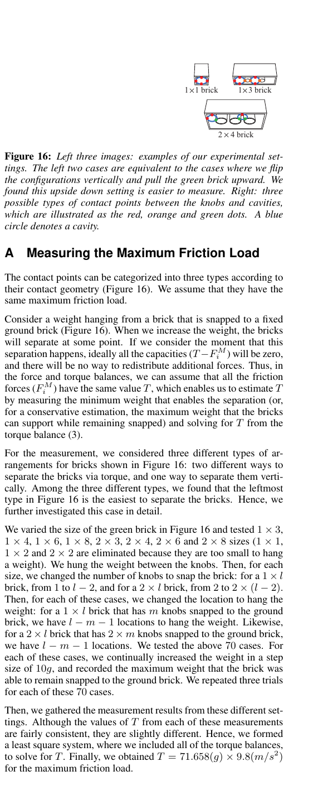

**Figure 16.** Left three images: examples of our experimental set-

tings. The left two cases are equivalent to the cases where we flip the configurations vertically and pull the green brick upward. We found this upside down setting is easier to measure. Right: three possible types of contact points between the knobs and cavities, which are illustrated as the red, orange and green dots. A blue circle denotes a cavity. A Measuring the Maximum Friction Load The contact points can be categorized into three types according to their contact geometry (Figure 16). We assume that they have the same maximum friction load. Consider a weight hanging from a brick that is snapped to a fixed ground brick (Figure 16). When we increase the weight, the bricks will separate at some point. If we consider the moment that this separation happens, ideally all the capacities (T −F M i ) will be zero, and there will be no way to redistribute additional forces. Thus, in the force and torque balances, we can assume that all the friction forces (F M i ) have the same value T , which enables us to estimate T by measuring the minimum weight that enables the separation (or, for a conservative estimation, the maximum weight that the bricks can support while remaining snapped) and solving for T from the torque balance (3). For the measurement, we considered three different types of arrangements for bricks shown in Figure 16: two different ways to separate the bricks via torque, and one way to separate them vertically. Among the three different types, we found that the leftmost type in Figure 16 is the easiest to separate the bricks. Hence, we further investigated this case in detail. We varied the size of the green brick in Figure 16 and tested 1 × 3,

```text
1 × 4, 1 × 6, 1 × 8, 2 × 3, 2 × 4, 2 × 6 and 2 × 8 sizes (1 × 1,
```

1 × 2 and 2 × 2 are eliminated because they are too small to hang a weight). We hung the weight between the knobs. Then, for each size, we changed the number of knobs to snap the brick: for a 1 × l brick, from 1 to l − 2, and for a 2 × l brick, from 2 to 2 × (l − 2). Then, for each of these cases, we changed the location to hang the weight: for a 1 × l brick that has m knobs snapped to the ground brick, we have l − m − 1 locations to hang the weight. Likewise, for a 2 × l brick that has 2 × m knobs snapped to the ground brick, we have l − m − 1 locations. We tested the above 70 cases. For each of these cases, we continually increased the weight in a step size of 10g, and recorded the maximum weight that the brick was able to remain snapped to the ground brick. We repeated three trials for each of these 70 cases. Then, we gathered the measurement results from these different settings. Although the values of T from each of these measurements are fairly consistent, they are slightly different. Hence, we formed a least square system, where we included all of the torque balances,

```text
to solve for T . Finally, we obtained T = 71 .658(g) × 9.8(m/s2)
for the maximum friction load.
```
