# Original file was jvis_final.tex

Source PDF: `Legorization from silhouette-fitted voxelization.pdf`

Evidence bundle: `evidence/`

<!-- Page 1 -->

KSII TRANSACTIONS ON INTERNET AND INFORMATION SYSTEMS VOL. 12, NO. 6, Jun. 2018 2782 Copyright ⓒ 2018 KSII The early version of this paper was presented at Computer Graphics International 2017 as a short paper. http://doi.org/10.3837/tiis.2018.06.0 19 ISSN : 1976-7277 Legorization from silhouette-fitted voxelization Kyungha Min1, Cheolseong Park1, Heekyung Yang1 and Grim Yun2

## 1 Dept. of Computer Science, Graduate School, Sangmyung Univ.,

Hongji-dong, Jongro-gu, Seoul, Korea [e-mail: minkh@smu.ac.kr, tjd4987|yhk775206@naver.com]

## 2 Dept. of Computer Science, Sangmyung Univ.,

Hongji-dong, Jongro-gu, Seoul, Korea [e-mail: rmfla0214@naver.com] *Corresponding author: Grim Yun Received September 21, 2017; revised December 15, 2017; revised February 9, 2018; accepted February 18, 2018; published June 30, 2018

## Abstract

We present a legorization framework that produces a LEGO model from user -specified 3D mesh model. Our framework is composed of two stages: voxelization and legorization. In the voxelization, input 3D mesh is co nverted to a voxel model. To preserve the shape of the 3D mesh, we devise a silhouette fitting process for the initial voxel model. For legorization, we propose three objectives: stability, aesthetics and efficiency. These objectives are expressed in a tiling equation, which builds a LEGO model using layer-by-layer approach. We legorize five models including characters and buildings to prove the excellence of our framework.

### Keywords: legorization, LEGO, voxelization

<!-- Page 2 -->

KSII TRANSACTIONS ON INTERNET AND INFORMATION SYSTEMS VOL. 12, NO. 6, June 2018 2783

## 1. Introduction

LEGO is a well-known assembly toy from the LEGO company in Denmark. The LEGO consists of colorful interlocking plastic bricks with many other parts such as gears and minifeatures. The most commonly used bricks are of rectangular shape with various lengths, widths and heights. Sometimes, many LEGO users have a desire to assemble their own models, whose assembly diagram is not provided by the company. Only highly experienced LEGO users design their own diagram to build a LEGO model for their desired models. Recent progress of digital contents such as games or animations accelerates the desire to build a LEGO model for their favorite characters, e.g. Eevee of Pokémon. We present a framework to build an assembly diagram for a user -selected 3D mesh model that guides users to build their LEGO model using commercial LEGO bricks. Our framework is composed of two stages: voxelization and legorization. Many existing legorization works start from a voxel model which is converted from a 3D mesh. Like these works, we employ an existing slice-based voxelization scheme to produce an initial voxel model. Furthermore, we present a silhouette -based fitting scheme for the initial voxel model to achieve a voxel model whose shape is as similar as possible to the input 3D mesh. Legorization is defined as a process that tiles the voxel model using a series of bricks. We employ a layer -based approach that fills the voxel model layer by layer using appropriate LEGO bricks. Unlike other frameworks, we include bricks whose height is more than one layer. We have three objectives for legorization: stability, aesthetics and efficiency. We define a tiling equation that covers these objectives and find the solution of the equation using a heuristic search algorithm. Our framework is distinguished in these points:

## 1. Shape-preserving voxelization: To preserve the shape of an input 3D mesh, we design

a voxelization process that modifies the initial voxel model by fitting the silhouette of an initial voxel model to that of the input 3D mesh.

## 2. Objective-driven legorization : We pursue three objectives including stability for a

stable structure, aesthetics for a balanced layout and efficiency for using multi-height bricks. Multi-height bricks have not been considered in the existing works.

## 3. Efficient data struc ture and implementation : We devise a two -colored graph that

represents the adjacency and stability information of a LEGO model. Our legorization is composed of tiling process on each layer, which is implemented using a heuristic search algorithm. We illustrate the overview of our algorithm in Fig. 1. An input 3D model is converted to an initial voxel model, which is further adjusted to the input model using our silhouette fitting scheme. Each layer of the voxel model is tiled through the LEGO bricks using an energy minimization scheme that optimizes users’ aimed targets such as stability, aesthetics and efficiency.

<!-- Page 3 -->

## 2784 Kyungha Min et al.: Legorization from silhouette-fitted voxelization

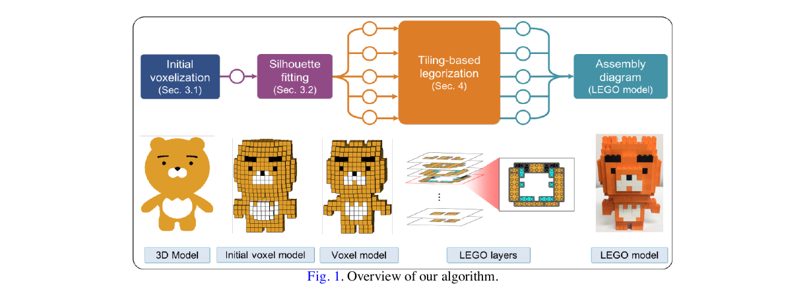

**Fig. 1..** Overview of our algorithm.

## 2. Related Work

### 2.1 Voxelization techniques

Voxelization techniques are originated from 1980s. Kaufman et al. presented a voxelization algorithm that converts continuous geometric objects into an array of voxels in 3D discrete space while preserving their shapes [1, 2]. The progress of GPU motivates an acceleration scheme for voxelization algorithms using the GPUs. Fang and Chen [3, 4] presented a scheme that reconstructs volume model from the sliced image, which is created by intersecting an input 3D model with a clipping plane using GPU computation. Karabassi et al. [5] also presented a voxelization scheme employing GPU and a depth-buffer supported by OpenGL library. Passalis et al. [6] added a stencil buffer to the scheme in [5] to present a lossless voxelization scheme for an arbitrary surface model. Eisemann and Decoret [7] presented an accelerated scene vo xelization scheme using GPU. They defined an ambient lattice on a rendered scene from a viewpoint. Furthermore, the depth information is stored in the RGBA channel to reduce the computation time for shade rendering and reflection rendering. They [8] also presented a single pass approach for voxelizing the inside of a watertight model, which guarantees real-time voxelization for high -resolutional models. There are also several voxelization schemes that do not rely on GPU. Silva et al. [9] presented a scheme that renders a mesh model as a voxelized model using a point sampling scheme that segments the edges of a triangular mesh according to the user-initiated resolution. Nooruddin and Turk [10] employ a ray casting to count the number of intersection points on a target model and a parity counting to build a voxelized model. Finally, they modify the voxel model using a series of morphological operators. Recently, real-time voxelization algorithms using GPU acceleration are presented for high-resolutional models. Hong et al. [11] reduce the inefficient computation on the empty voxels lying inside of a surface model by constructing an octree structure. Schwarz and Seidel [12] presented a sparse voxel octree(SVO) structure to voxelize a solid model.

<!-- Page 4 -->

KSII TRANSACTIONS ON INTERNET AND INFORMATION SYSTEMS VOL. 12, NO. 6, June 2018 2785

### 2.2 Legorization techniques

#### 2.2.1 Early techniques

Gower et al. [13] pioneered a computerized framework for generating a LEGO model from a polygonal model. They define several heuristics for designing LEGO model and propose a minimization scheme for a penalty function using simulated annealing. The heuristics they define include cover ratio, big brick, perpendicularity, vertical boundary, T -shaped joining, and covered edge by center (See Appendix for an explanation). Their framework, however, has not been implemented in their paper. Petrovic [14] employed a genetic algorithm to resolve the LEGO construction problem and van Zijl and Smal [15] used cell clustering strategy to merge 1 ×1 bricks to design a LEGO layout. Later, Smal [16] improved this scheme by applying a beam search algorithm. These works use primitive data structure such as a list ([14]) and a grid ([15, 16]).

#### 2.2.2 Recent techniques without physical stability

Testuz al. [17] presented a graph-based randomized greedy algorithm to merge 1× 1 bricks to general LEGO bricks of diverse scales. A LEGO model is organized as a graph whose vertex corresponds to the brick and edge to the connectivity. Therefore, an articulation point of the graph represents a brick where many parts of the model are connected. Their strategy is to build a biconnected graph where an articulation point does not exist. They do not go into physical problem considering the weights of the bricks and gravity. Ono et al. [18] presented a graph-based greedy merging algorithm for build a LEGO desig n. Their strategy resembles Testuz et al.’s work [17]. Their merging algorithm includes the heuristics defined by Gower et al. [13] such as big brick and cover ratio. Their algorithm, however, has several degenerate cases for connecting the bricks. Zhang et al. [19] presented a construction scheme for planar LEGO model using pattern tiling. An input image is pixelized and the neighboring pixels of similar colors are merged to form various LEGO bricks. Kim et al. [20] surveyed the existing LEGO representation schemes and their construction algorithms. Lee et al. [21] combined a greedy algorithm and a genetic algorithm to improve the layout of LEGO bricks. Zhang et al. [22] proposed a random merge scheme considering stability, symmetry and color separation. This scheme may take a lot of computation time due to their randomized merging strategy. Stephenson [23] proposed a four-phase search algorithm to build a LEGO model. The phases include arrangement according to the direction, edge reduction, brick recombination and building single component. Since each merging step takes four-phase search, this scheme suffers from a long computation time. Zhang et al. [24] improved their previous layer-by-layered assembly approach, which i s not appropriate for over -hanging bl ocks. Instead of legorizing a polygonal model, they proposed an alternative approach that assembles the pre-built components. Hong et al. [25] improved Testuz et al.’s greedy approach [17] by adjusting the centroid of the bricks These works commonly employed a merging approach that merges 1 ×1-sized bricks into bricks of various sizes. These merging approac hes, however, leave 1×1 bricks very frequently and the final layout fails to present balanced and aesthetic visualization. Therefore, we employ a tiling approach that tiles various sized bricks at their appropriate locations, which prevents small-sized bricks and global visualization considerations.

<!-- Page 5 -->

## 2786 Kyungha Min et al.: Legorization from silhouette-fitted voxelization

#### 2.2.3 Recent techniques with physical stability

Luo et al. [26] presented a LEGO model generation framewor k that considers physical stability using force-based analysis, where the vertical and horizontal friction force of a brick are considered with maximum friction load of the brick. They aim to build a singly connected component of the graph representation of the LEGO model. In the merging process, the force loaded on each brick is computed and the stability is checked. This approach sometimes cannot find a physically stable LEGO model from input 3D mesh models. Kozaki et al. [27] presented a LEGO model generation scheme using photographs taken from a physical object in various angles. They also proposed an energy minimization scheme for LEGO model generation. Their energy function includes momentum, which provides physical stability of the model. To build a light-weighted model for portability, they devised a hollowing process to empty the inside of the model. We do not consider the physical computation in our approach, since most of the 3D models such as characters and buildings we test are balanced. Some unbalanced characters are the target of our future work.

## 3. Voxelization

### 3.1 Initial voxelization

We start our voxelization process from a user-specified 3D mesh by rendering the mesh using the rendering pipeline of OpenGL library [4]. By controlling a clipping plane of the rendering pipeline, we extract a series of slice images, which are mapped into a layer information of our voxel model. This layer information is stacked to form our initial voxel model. Since the resolution of the voxelization is limited, the shape of the initial voxel model can be far from the shape of the 3D mesh. To fit the initial voxel model as accurate as possible, we propose a silhouette fitting process, which carves the silhouette of the initial voxel model to fit that of the input 3D mesh. We extract the silhouettes of the initial voxel model and the input 3D mesh by rendering them using a color distinguishable from their background. The rendered image stored in a framebuffer is bi-colored, which distinguishes the inside and outside of a silhouette. We visit the boundary of the model using a chain code algorithm to build a silhouette curve [28]. We build a signed distance map on the silhouette voxels from the silhouette curve. The distance is estimated as the closest distance between the center of the silhouette voxel and the closest point on the curve. We illustrate the distance estimation process in Fig. 2. Furthermore, we accelerate the distance estimation using jump flooding algorithm [29]. The distance value d(v) stored at a voxel v is estimated as follows: )( curve silhouette a is where, if, )(if, )(if, )( 1 00 0 0 C C(v) vCd vCd vd       

<!-- Page 6 -->

KSII TRANSACTIONS ON INTERNET AND INFORMATION SYSTEMS VOL. 12, NO. 6, June 2018 2787

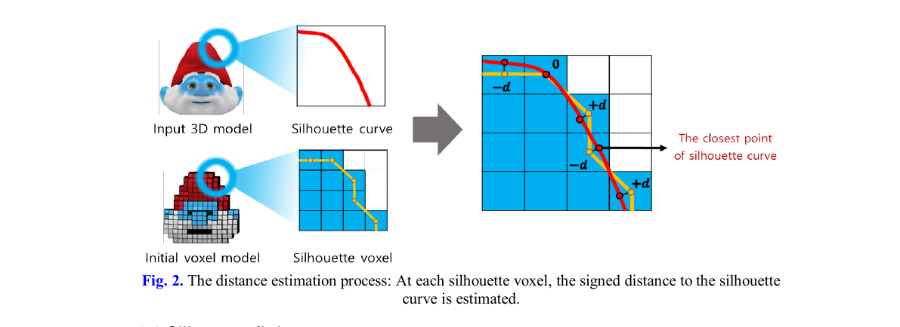

**Fig. 2..** The distance estimation process: At each silhouette voxel, the signed distance to the silhouette

curve is estimated.

### 3.2 Silhouette fitting

#### 3.2.1 Approximation of differentiation

To fit the initial voxel model to the input 3D mesh, we match the silhouette voxels of the initial voxel model to its closest silhouette pixel of the 3D mesh. After matching, we estimate the first -order differentiations ( t(vi)) and the second -order differentiations (g(vi)) at the matching voxels. We use a central difference approximation for the differentiation. Since the v is an approximation estimated on a silhouette curve, unwanted anomaly may appear. To remedy this, we sample three candidates for the differentiat ion: one -ring neighborhood difference ( vi−1 and vi+1), two -ring neighborhood difference ( vi−2 and vi+2) and three -ring neighborhood difference ( vi−3 and vi+3). t(vi) and g(vi) are determined by averaging three candidate values.

#### 3.2.2 Energy function

The energy function that defines the shape difference between the silhouettes of the voxel model and the input 3D mesh is defined as follows: )( ))),()(())()((),((),( 211 v Vv v SvSvSvdSVE ggtt    where V is the voxel model, S is the 3D mesh model, and Sv is a pixel on a chain code from the

```text
3D mesh silhouette, which is closest to v ∈ V . ∙ is an inner product operator. The distance of v
```

from the 3D mesh silhouette, denoted as d(v, Sv), is defined as follows: )( :)(?))((),( 300 vdvdSvd v  The first term of Eqn (2), d(v, S), becomes zero, if the voxel is not outside of the silhouette. This term may lead to a shrunk voxel model. To avoid this, we add the second term, 1 – t(v) ∙ t(Sv), and the third term, 1 – g(v) ∙ g(Sv). These terms estimate the difference of the tangents and gradients of the models, respectively. The second term becomes zero, if the tangents from both models are identical, and the third term becomes zero, if the gradients are identical. We illustrate this in Fig. 3.

<!-- Page 7 -->

## 2788 Kyungha Min et al.: Legorization from silhouette-fitted voxelization

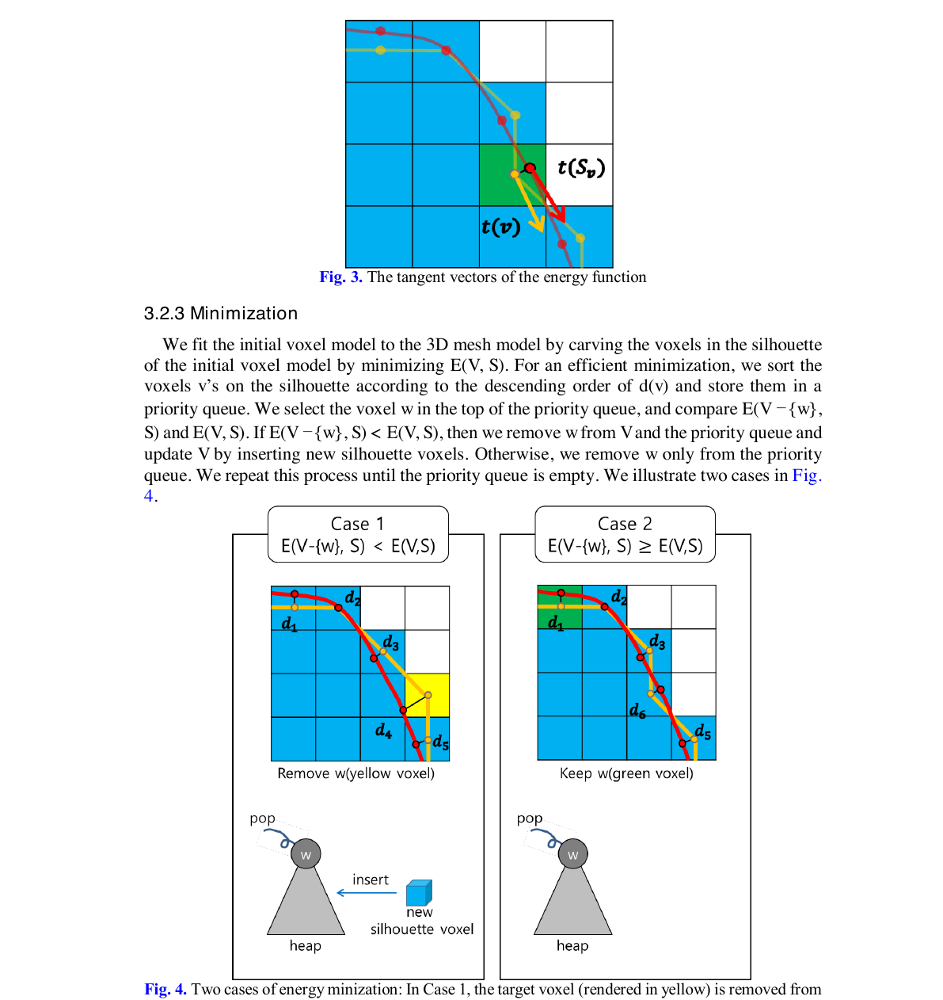

**Fig. 3..** The tangent vectors of the energy function

#### 3.2.3 Minimization

We fit the initial voxel model to the 3D mesh model by carving the voxels in the silhouette of the initial voxel model by minimizing E(V, S). For an efficient minimization, we sort the voxels v’s on the silhouette according to the descending order of d(v) and store them in a priority queue. We select the voxel w in the top of the priority queue, and compare E(V − {w},

```text
S) and E(V, S). If E(V − {w}, S) < E(V, S), then we remove w from V and the priority queue and
```

update V by inserting new silhouette voxels. Otherwise, we remove w only from the priority queue. We repeat this process until the priority queue is empty. We illustrate two cases in Fig. 4.

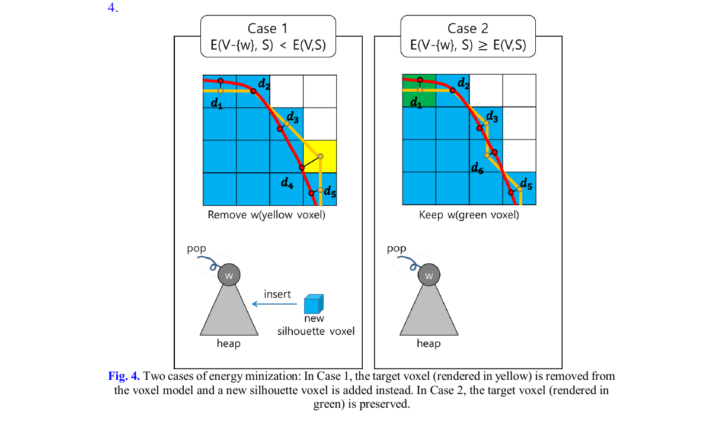

**Fig. 4..** Two cases of energy minization: In Case 1, the target voxel (rendered in yellow) is removed from

the voxel model and a new silhouette voxel is added instead. In Case 2, the target voxel (rendered in green) is preserved.

<!-- Page 8 -->

KSII TRANSACTIONS ON INTERNET AND INFORMATION SYSTEMS VOL. 12, NO. 6, June 2018 2789 The pseudo code for the energy minimization is presented below: We present our voxelization results in Fig. 5.

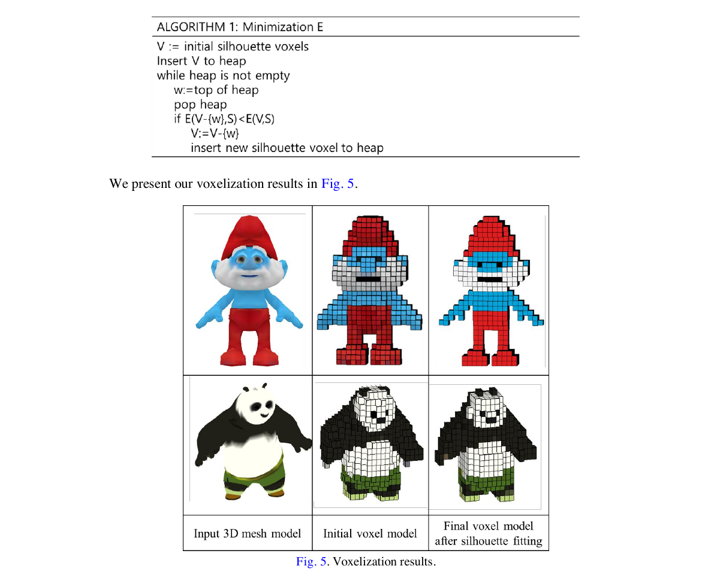

**Fig. 5..** Voxelization results.

## 4. Legorization

### 4.1 Model representation

#### 4.1.1 Model definition

Since Testuz et al. [17] employed a graph structure to represent a LEGO model, some researchers followed this approach [27, 21, 26]. In these approaches, a brick is mapped to a vertex and the combined bricks are to an edge. Therefore, two bricks in the same layer are not connected by an edge. By employing a graph structure, evaluating physical feasibility and

<!-- Page 9 -->

## 2790 Kyungha Min et al.: Legorization from silhouette-fitted voxelization

stability of a LEGO model becomes the well -studied graph problems such as checking connected component or finding an articulation point. A graph for a LEGO model separated by several parts is disconnected, and a brick where too heavy weight is loaded is an articulation point. Therefore, they merge 1 ×1 bricks repeatedly to avoid these problems. Since their approaches use a merging strategy, the adjacent bricks in a layer can be identified by a simple index-based scheme. Since we employ a tiling approach, we cannot employ the graph structure used by the existing research We propose a two -colored graph to represent o ur graph model. The key principle of our approach is to represent the adjacent bricks in the same layer as well as the combined bricks in the incident layer. Our two-colored graph is defined as follows:

## 1. Vertex: A brick is represented as a vertex.

## 2. Red edge: If two bricks are combined together in a LEGO model, then their

corresponding vertices are connected by a red edge. A multi-height brick is represented as bricks of single height connected by a red edge.

## 3. Blue edge: If two bricks in a layer are adjacent, then their corresponding vertices are

connected by a blue edge

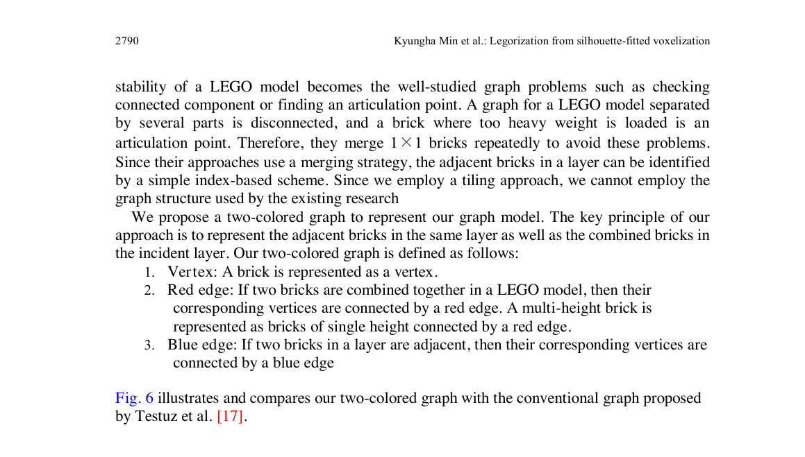

**Fig. 6.** illustrates and compares our two-colored graph with the conventional graph proposed

by Testuz et al. [17].

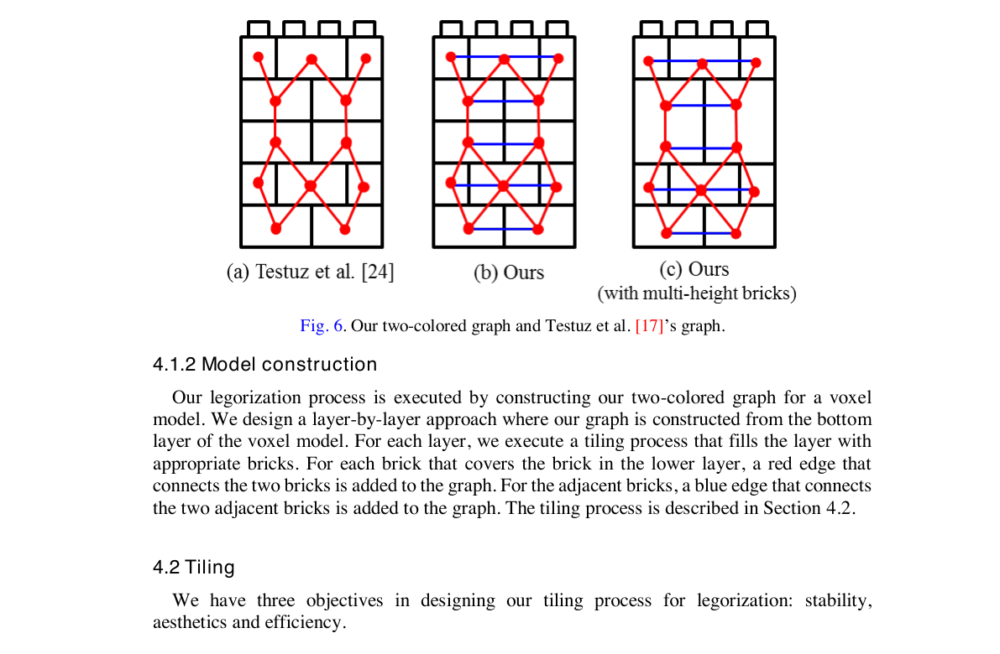

**Fig. 6..** Our two-colored graph and Testuz et al. [17]’s graph.

#### 4.1.2 Model construction

Our legorization process is executed by constructing our two -colored graph for a voxel model. We design a layer-by-layer approach where our graph is constructed from the bottom layer of the voxel model. For each layer, we execute a tiling process that fills the layer with appropriate bricks. For each brick that covers the brick in the lower layer, a red edge that connects the two bricks is added to the graph. For the adjacent bricks, a blue edge that connects the two adjacent bricks is added to the graph. The tiling process is described in Section 4.2.

### 4.2 Tiling

We have three objectives in designing our tiling process for legorization: stability, aesthetics and efficiency.

<!-- Page 10 -->

KSII TRANSACTIONS ON INTERNET AND INFORMATION SYSTEMS VOL. 12, NO. 6, June 2018 2791

## 1. Stability is the most fundamental objective, which has been pursued from Gower et al.

[13]. It means the constructed LEGO model is physically feasible and all the bricks in the model are combined

## 2. Aesthetics is the objective we pursue distinctively. A layer tiled by a LEGO artist is

distinguished from automatically tiled layer by its balance, symmetry and accuracy. The bricks arranged aesthetically present greater interest than the bricks arbitrarily tiled

## 3. Efficiency is the time and cost requested to complete the target LEGO model. We

pursue users to save their time and budget

#### 4.2.1 Stability

We pursue the stability during the construction process of our two -colored graph using layer-by-layer approach. Gower et al. [13] proposed an edge cover heuristic to cover the edges in the lower layer with a brick to combine them tight and Testuz et al. [17] and other researchers [21, 26, 18] proposed a connected component test and an articulation point search to check whether their LEGO model is stable or not. These schemes, however, restrict the freedom of choosing various tilings. We propose a red-edge distance estimation on the two-colored graph for the stability. We estimate the distance of the adjacent bricks which are connected by a blue-edge only along

```text
red-edges (See Fig. 7). The red-edge distance, which is denoted as γ, reveals the minimum
```

distance between the adjacent bricks and their combined point in a lower layer. According to the red-edge distance, we determine the priority for covering the adjacent bricks as follows:

## 1. Red-edge distance (γ) ≤ T : The combined point of the adjacent bricks is not far,

which means that the priority for covering is low.

## 2. Red-edge distance (γ) > T: The combined point of the adjacent brick is far, which

means that the priority for covering is high.

## 3. Red-edge distance (γ) = ∞: The adjacent bricks are not connected, which means

that the priority for covering is highest.

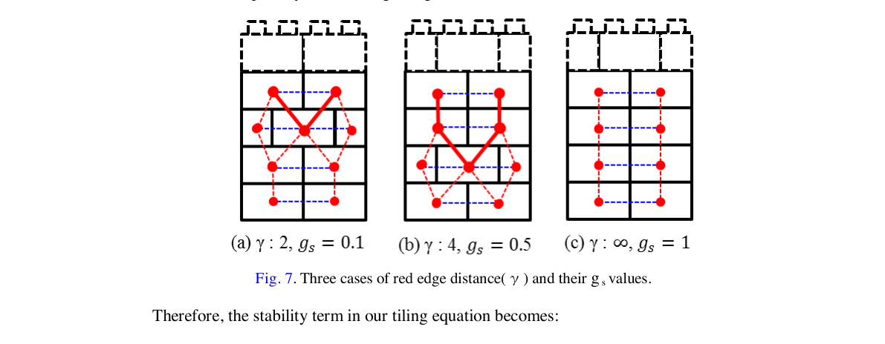

**Fig. 7..** Three cases of red edge distance(γ) and their g s values.

Therefore, the stability term in our tiling equation becomes:

<!-- Page 11 -->

## 2792 Kyungha Min et al.: Legorization from silhouette-fitted voxelization

)( otherwise),( if,)( if,)( f,)( )(where),( 41 3 2 1 1             ic pic Tpic Tipic ipipmg m i s    ,where m denotes the number of blue-edges in the previous layer. c(i) is 1, if the i-th blue edge is not covered, and 0, otherwise. In our implementation, we set T as the height of our multi-height brick. p1 is set as 0.1, p2 as 0.5, p3 as 1.0, T as 2 in this paper. Each priority is stored at blue -edges in our two-colored graph. Fig. 7 illustrates three cases of red edge distances and their gs values. We compare the LEGO models produced by Gower et al. [13], by Testuz et al. [17] and ours in Fig. 8. The model presented in Fig. 8 (a) satisfies the heuristics proposed by Gower et al. [13] and (b) satisfies the heuristics from Testuz et al. [17] . From edge cover in [13], each edge is covered by the bricks in the above layer. Also the LEGO graph from [17] is a biconnected graph. Fig. 8 (c) presents our result. In tiling 4th layer, we estimate the red-edge distance and determine that the edges in the 3rd layer do not have a high priority to be covered. In tiling 5th layer, the red-edge distance increases, and the edges in the 4th layer have a higher priority to be covered. Therefore, we tile bricks in 5th layer to cover the edges in 4th layer. We can replace the consecutive bricks in 3rd and 4th layers to a multi-height brick.

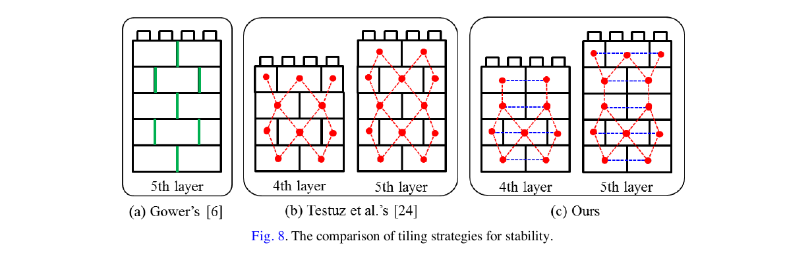

**Fig. 8..** The comparison of tiling strategies for stability.

#### 4.2.2 Aesthetics

Tiling LEGO bricks in a layer in a well-organized layout is a rarely pursued objective by the existing works. Zhang et al. [22] considered a symmetric layout of bricks, which constrains the bricks to be arranged along the axis of the model. We propose a balanced tiling for aesthetics. As a preprocessing, we extract a central axis of the layer. Since our model is aligned with standard xyz -axis, we assume that each layer is aligned with the standard xyz -axis. Since z-axis is orthogonal to the lay er, our axis is either x-axis or y -axis or both. Therefore, we estimate the balance for the three cases. A brick is balanced, if the axis passes through the center of the brick or there is a partner brick in the reflected coordinate for the axis. The term for the aesthetics is defined as follows:

<!-- Page 12 -->

KSII TRANSACTIONS ON INTERNET AND INFORMATION SYSTEMS VOL. 12, NO. 6, June 2018 2793       )( otherwise, balancedisbrickthif,where, 51 01 1 ibbng i n i ia

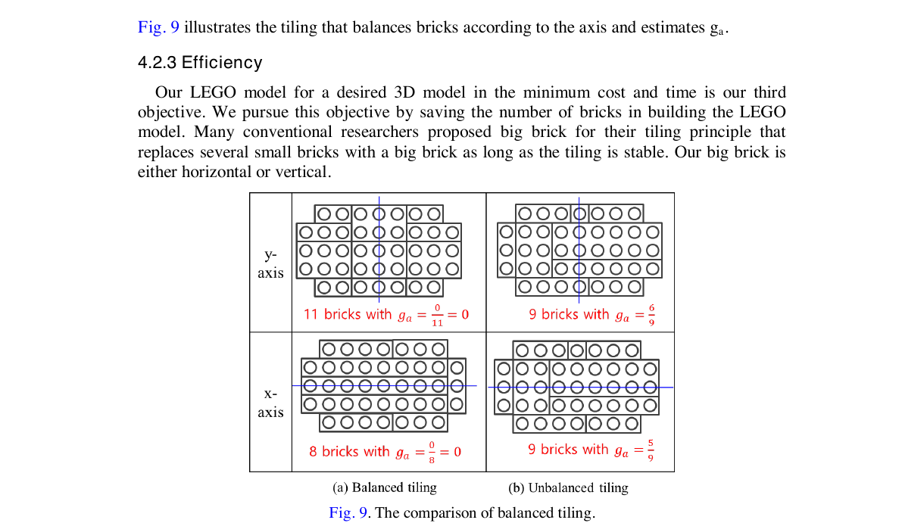

**Fig. 9.** illustrates the tiling that balances bricks according to the axis and estimates ga.

#### 4.2.3 Efficiency

Our LEGO model for a desired 3D model in the minimum cost and time is our third objective. We pursue this objective by saving the number of bricks in building the LEGO model. Many conventional researchers proposed big brick for their tiling principle that replaces several small bricks with a big brick as long as the tiling is stable. Our big brick is either horizontal or vertical.

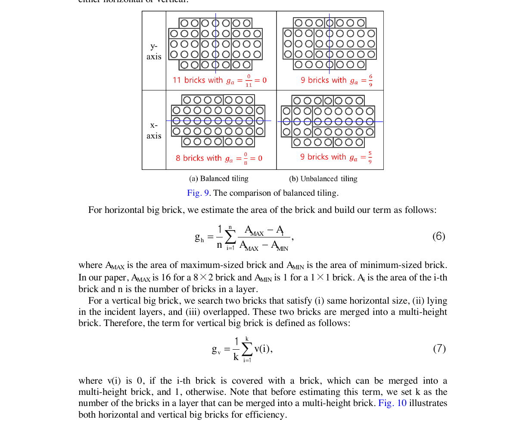

**Fig. 9..** The comparison of balanced tiling.

```text
For horizontal big brick, we estimate the area of the brick and build our term as follows:
)(                                                    , 61
1

 

n
i MINMAX
iMAX
h
AA
AA
ng
```

where AMAX is the area of maximum-sized brick and AMIN is the area of minimum-sized brick. In our paper, AMAX is 16 for a 8×2 brick and AMIN is 1 for a 1×1 brick. Ai is the area of the i-th brick and n is the number of bricks in a layer. For a vertical big brick, we search two bricks that satisfy (i) same horizontal size, (ii) lying in the incident layers, and (iii) overlapped. These two bricks are merged into a multi -height brick. Therefore, the term for vertical big brick is defined as follows: )( ,)( 71 1    k i v ivkg where v(i) is 0, if the i-th brick is covered with a brick, which can be merged into a multi-height brick, and 1, otherwise. Note that before estimating this term, we set k as the number of the bricks in a layer that can be merged into a multi-height brick. Fig. 10 illustrates both horizontal and vertical big bricks for efficiency.

<!-- Page 13 -->

## 2794 Kyungha Min et al.: Legorization from silhouette-fitted voxelization

#### 4.2.4 Tiling equation

Our tiling equation for a k-th layer is the weighted sum of the terms defined in Eqn. (4) ~ (7) we have defined: )( ,)( 8vvhhaassk gwgwgwgwLG  where Lk is the set of bricks covering k-th layer.

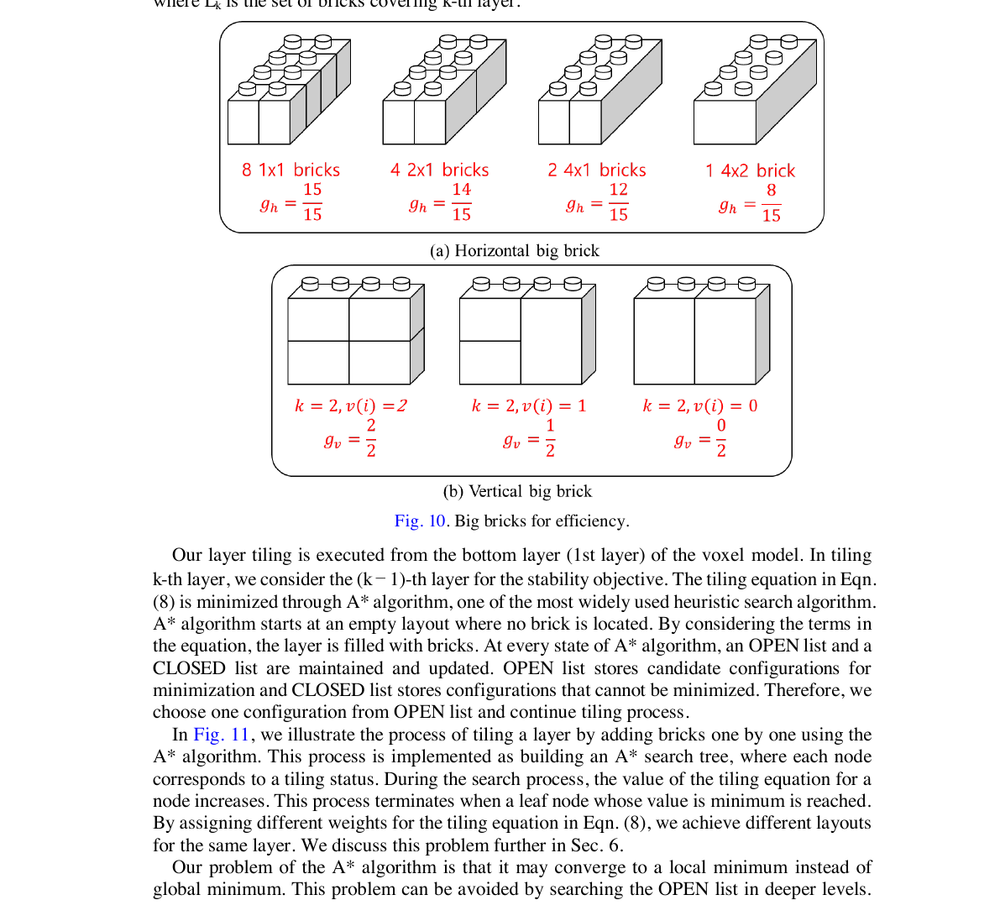

**Fig. 10..** Big bricks for efficiency.

Our layer tiling is executed from the bottom layer (1st layer) of the voxel model. In tiling k-th layer, we consider the (k − 1)-th layer for the stability objective. The tiling equation in Eqn. (8) is minimized through A* algorithm, one of the most widely used heuristic search algorithm. A* algorithm starts at an empty layout where no brick is located. By considering the terms in the equation, the layer is filled with bricks. At every state of A* algorithm, an OPEN list and a CLOSED list are maintained and updated. OPEN list stores candidate configurations for minimization and CLOSED list stores configurations that cannot be minimized. Therefore, we choose one configuration from OPEN list and continue tiling process. In Fig. 11, we illustrate the process of tiling a layer by adding brick s one by one using the A* algorithm. This process is implemented as building an A* search tree, where each node corresponds to a tiling status. During the search process, the value of the tiling equation for a node increases. This process terminates when a leaf node whose value is minimum is reached. By assigning different weights for the tiling equation in Eqn. (8), we achieve different layouts for the same layer. We discuss this problem further in Sec. 6. Our problem of the A* algorithm is that it may converge to a local minimum instead of global minimum. This problem can be avoided by searching the OPEN list in deeper levels.

<!-- Page 14 -->

KSII TRANSACTIONS ON INTERNET AND INFORMATION SYSTEMS VOL. 12, NO. 6, June 2018 2795 However, this strategy requires heavy computational time for tiling. Fortunately, the tiling executed in our samples did not show a problem of converting to a local minimum. Another problem of the A* algorithm is that the la yout of global minimum may not be unique. Therefore, different layouts can be reached using the A* algorithm. In this case, we choose one of the layout as our solution (See Fig. 12).

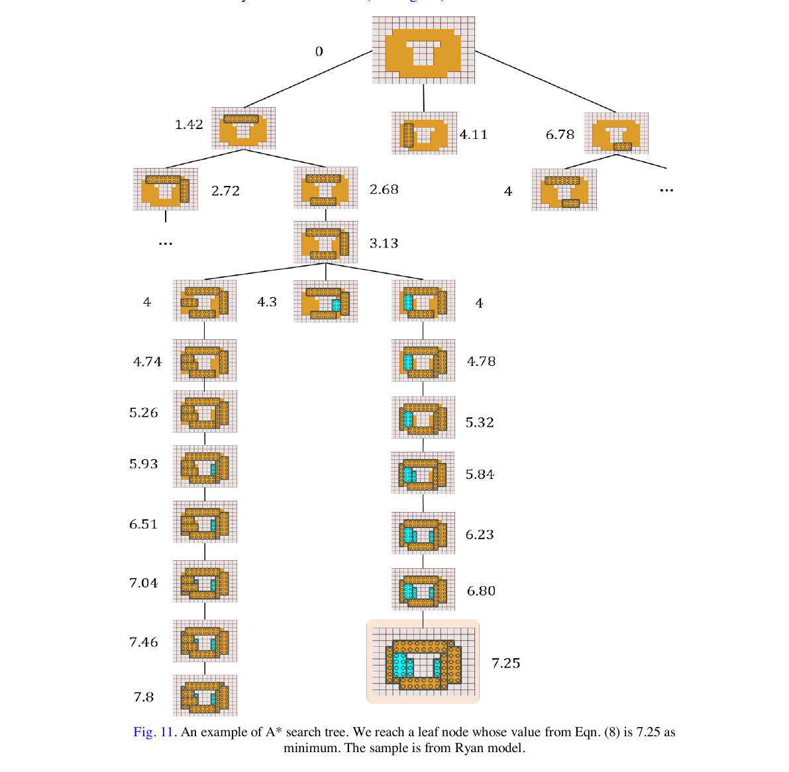

**Fig. 11..** An example of A* search tree. We reach a leaf node whose value from Eqn. (8) is 7.25 as

minimum. The sample is from Ryan model.

<!-- Page 15 -->

## 2796 Kyungha Min et al.: Legorization from silhouette-fitted voxelization

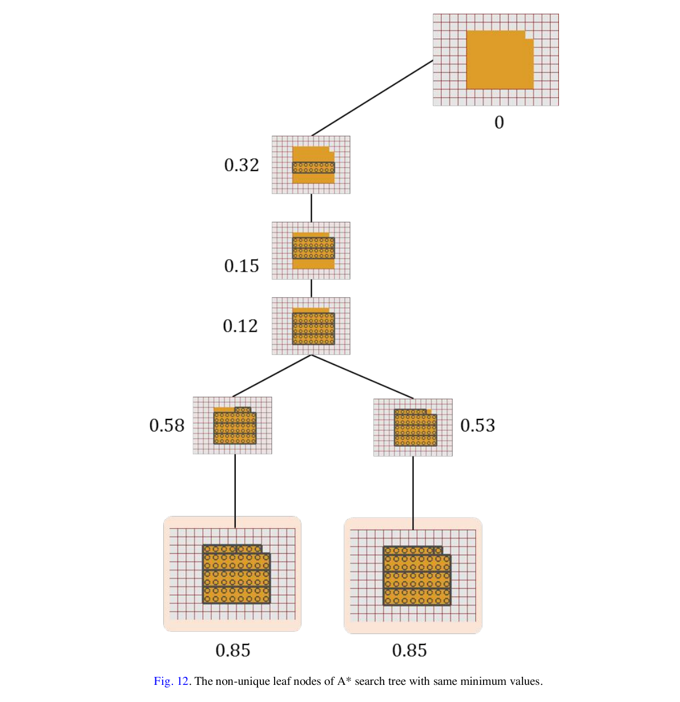

**Fig. 12..** The non-unique leaf nodes of A* search tree with same minimum values.

<!-- Page 16 -->

KSII TRANSACTIONS ON INTERNET AND INFORMATION SYSTEMS VOL. 12, NO. 6, June 2018 2797

#### 4.2.5 Comparison with different objectives

We pursue four different objectives and compare their resulting layouts: (i) balancing three objectives, (ii) stability -oriented, (iii) aesthetics-oriented, and (iv) efficiency -oriented. The weights of the tiling equation in Eqn. (8) are suggested in Fig. 13 . The resulting objective values in Eqn. (8) and the number of bricks used in the layout are also suggested in the same figure.

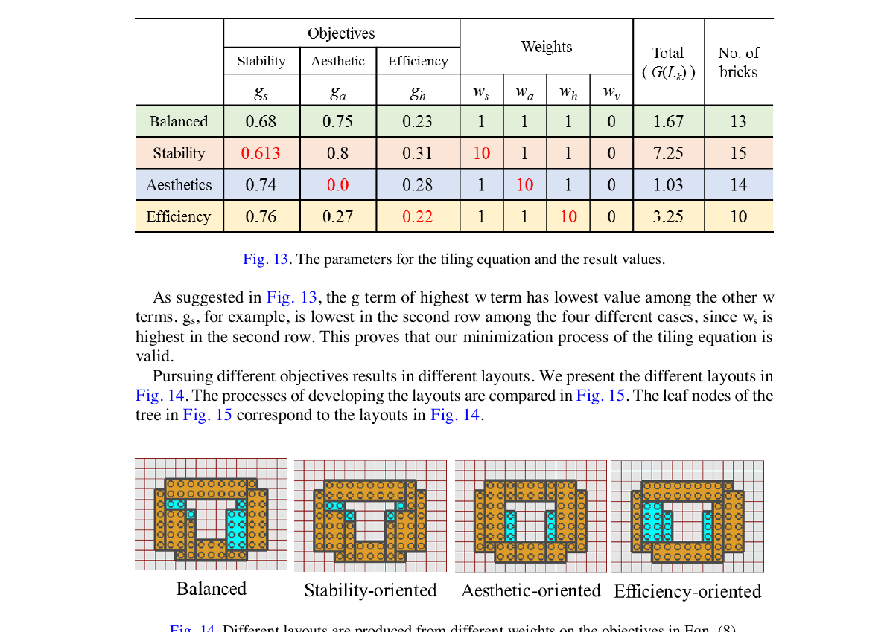

**Fig. 13..** The parameters for the tiling equation and the result values.

As suggested in Fig. 13, the g term of highest w term has lowest value among the other w terms. gs, for example, is lowest in the second row among the four different cases, since ws is highest in the second row. This proves that our minimization process of the tiling equation is valid. Pursuing different objectives results in different layouts. We present the different layouts in


**Fig. 14..** The processes of developing the layouts are compared in Fig. 15. The leaf nodes of the

tree in Fig. 15 correspond to the layouts in Fig. 14.

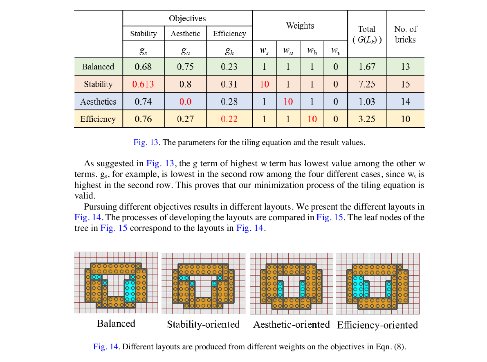

**Fig. 14..** Different layouts are produced from different weights on the objectives in Eqn. (8).

<!-- Page 17 -->

## 2798 Kyungha Min et al.: Legorization from silhouette-fitted voxelization

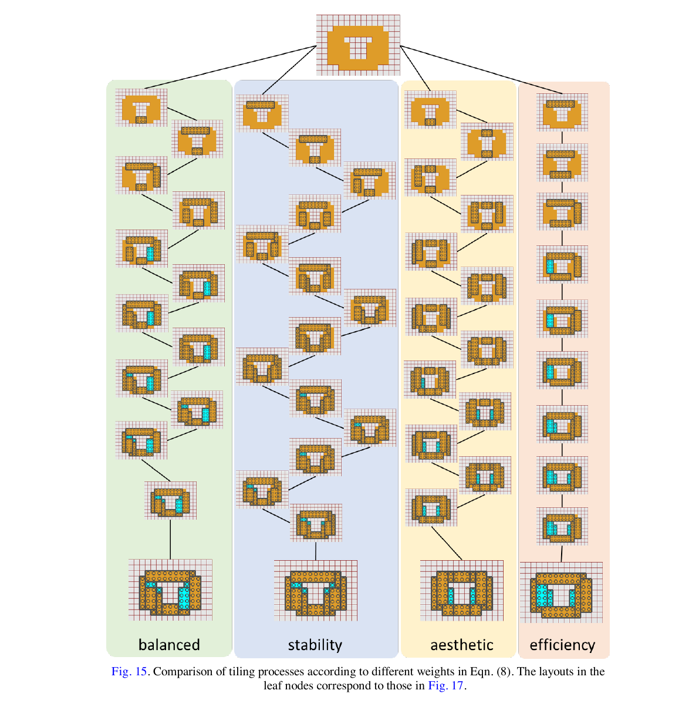

**Fig. 15..** Comparison of tiling processes according to different weights in Eqn. (8). The layouts in the

leaf nodes correspond to those in Fig. 17.

<!-- Page 18 -->

KSII TRANSACTIONS ON INTERNET AND INFORMATION SYSTEMS VOL. 12, NO. 6, June 2018 2799

## 5. Implementation and results

We have implemented our legorization algorithm on a PC with Pentium i7 CPU and 16 GByte main memory. We test our algorithm on five models and produce their assembly maps. The information about our legorization is suggested in Fig. 1 6. The input models are illustrated in Fig. 17 and their results are illustrated in Fig. 18. In building the LEGO models, we sometimes needed a supporter bricks for the empty inside area of the castle model.

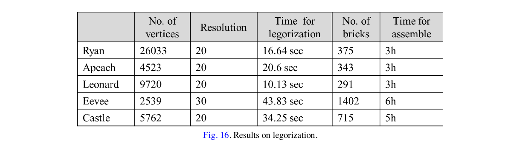

**Fig. 16..** Results on legorization.

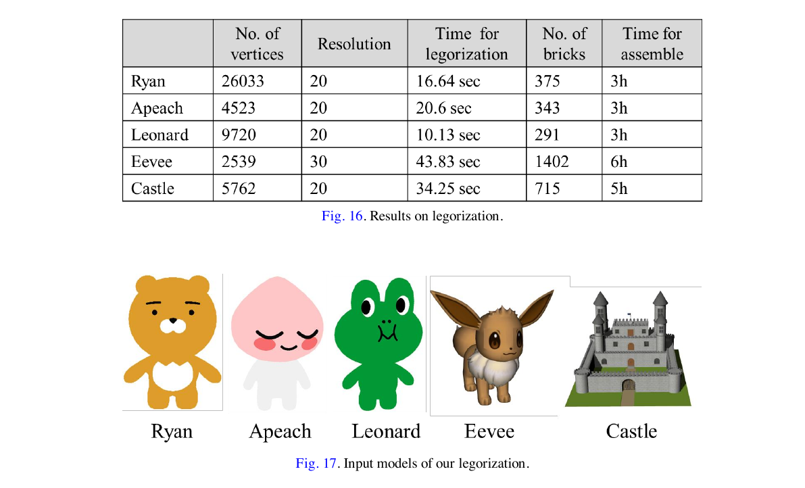

**Fig. 17..** Input models of our legorization.

<!-- Page 19 -->

## 2800 Kyungha Min et al.: Legorization from silhouette-fitted voxelization

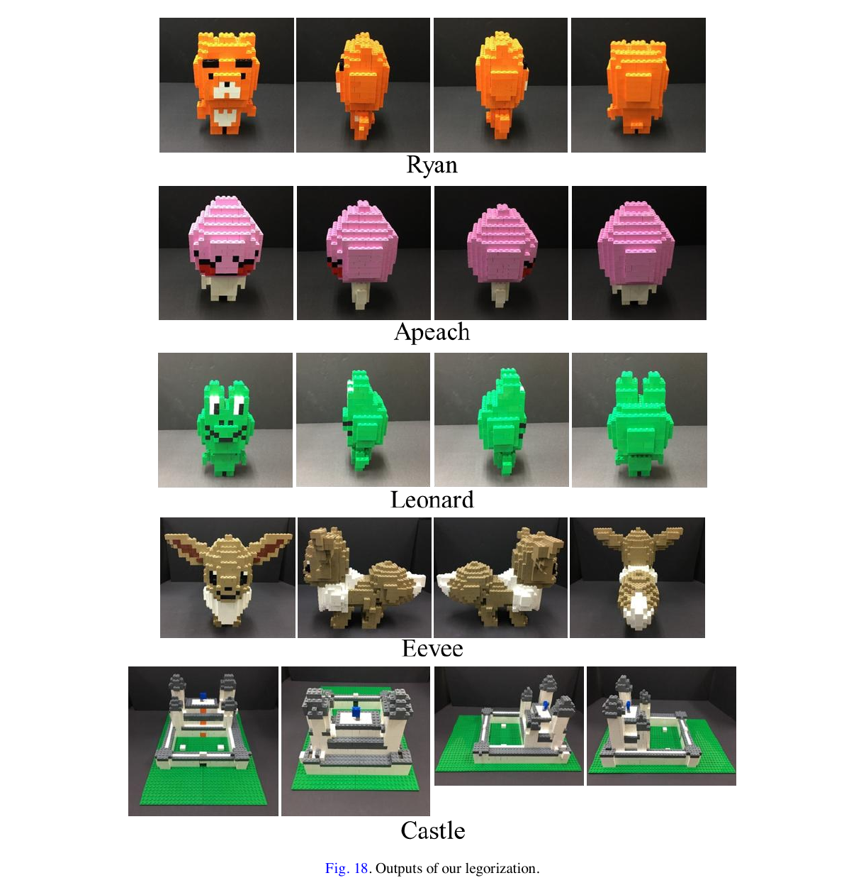

**Fig. 18..** Outputs of our legorization.

<!-- Page 20 -->

KSII TRANSACTIONS ON INTERNET AND INFORMATION SYSTEMS VOL. 12, NO. 6, June 2018 2801

## 6. Comparison and discussion

We compare our legorization objectives with the legorization heuristics presented by Gower et al. [13] and Petrovic [14]. For the comparison, we quantify the stability, aesthetics and efficiency of the layouts from ours and other two heurist ics for the 99 layers of five models. We summarize the results of comparison in Fig. 19 and illustrate the results in Fig. 20. According to the comparison, our approach shows better stability, aesthetics and efficiency than the widely-used two legorization heuristics.

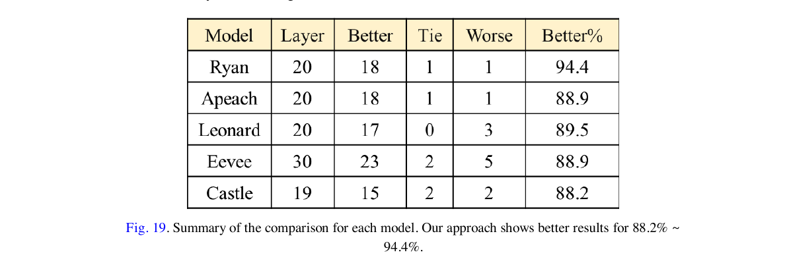

**Fig. 19..** Summary of the comparison for each model. Our approach shows better results for 88.2% ∼

94.4%.

## 7. Conclusion and future work

We have presented a legorization framework that converts a 3D mesh into a LEGO model by producing its ass embly diagram. Our framework preserves the shape of input model by proposing a silhouette-fitting scheme and presents a legorization scheme satisfying stability, aesthetics and efficiency. Our framework allows multi -height bricks which improve the efficiency of the model. We have tested our scheme for five models including characters and buildings. As a future work, we plan to build a legorization framework that uses special bricks as well as various multi -height bricks. Furthermore, we are going to include estimating loads on a brick using our two-colored graph model.

## Acknowledgement

This research was supported by a research grant from Sangmyung Univ. in 2015.

<!-- Page 21 -->

## 2802 Kyungha Min et al.: Legorization from silhouette-fitted voxelization

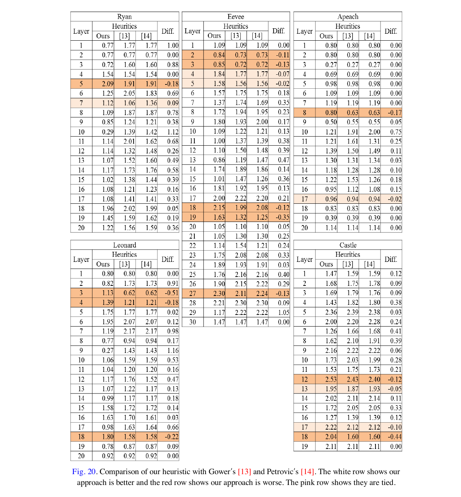

**Fig. 20..** Comparison of our heuristic with Gower’s [13] and Petrovic’s [14]. The white row shows our

approach is better and the red row shows our approach is worse. The pink row shows they are tied.

<!-- Page 22 -->

KSII TRANSACTIONS ON INTERNET AND INFORMATION SYSTEMS VOL. 12, NO. 6, June 2018 2803 Reference [1] A. Kaufman, “Efficient algorithms for 3d scan -conversion of parametric curves, surfaces, and volumes,” ACM Computer Graphics, 171–179, 21 (4), 1987. Article (CrossRef Link) [2] H. A. Kaufman, and E. Shimony, “3d scan-conversion algorithms for voxel-based graphics,” in Proc. of Interactive 3D graphics 1986, pp. 45–75, 1986. Article (CrossRef Link) [3] H. Chen, and S. Fang, “Fast voxelization of three -dimensional synthetic objects, ” Journal of Graphics Tools, pp. 33–45, 3 (4), 1998. Article (CrossRef Link) [4] S. Fang, and H. Chen, “Hardware accelerated voxelization,” Computers & Graphics, pp. 433–442, 24 (3), 2000. Article (CrossRef Link) [5] E.-A. Karabassi , G. Papaioannou, and T. Theoharis, “A fast depth -buffer-based voxelization algorithm,” Journal of Graphics Tools, pp. 5–10, 4 (4), 1999. Article (CrossRef Link) [6] G. Passalis, I. A. Kakadiaris, and T. Theoharis, “Efficient hardware voxelization,” in Proc. of CGI 2004, pp. 374–377, 2004,. Article (CrossRef Link) [7] E. Eisemann, and X. Decoret, “Fast scene voxelization and applications,” in Proc. of Interactive 3D graphics and games 2006, pp. 71–78, 2006. Article (CrossRef Link) [8] E. Eisemann, and X. Decoret, “Single-pass GPU solid voxelization for real-time applications,” in Proc. of Graphics Interface 2008, pp. 73–80, 2008. Article (CrossRef Link) [9] L. Silva, V. Pamplona, and J. Comba, “Legolizer: A realtime system for modeling and rendering lego represe ntations o f boundary models, ” in Proc. of Brazilian Symposium on Computer Graphics and Image Processing 2009, pp. 17–23, 2009. Article (CrossRef Link) [10] F. S. Nooruddin, and G. Turk, “Simplification and repair of polygonal models using volumetric techniques,” IEEE Transactions on Visualization and Computer Graphics, pp. 191–205, 9(2),

## 2003. Article (CrossRef Link)

[11] F. Q. W. Hong, and A. Kaufman, “Gpu-based object-order ray-casting for large datasets,” in Proc. of 4th International Workshop on Volume Graphics 2005, pp. 177–185, 2005. Article (CrossRef Link) [12] M. Schwarz, H. P. Seide l, “Fast parallel surface and solid voxelization on GPUs,” ACM Transactions on Graphics, pp. 179, 29 (6), 2010. Article (CrossRef Link) [13] R. Gower, A. Heydtmann, and H. Petersen, “Lego: Automated model construction,” in Proc. of 32nd European Study Group with Industry 1998, pp. 81–94, 1998. Article (CrossRef Link) [14] P. Petrovic, “Solving lego brick layout problem using evolutionary algorit hms,” in Proc. of Norwegian Conference on Computer Science, pp. 87–97, 2001. [15] L. van Zijl, and E. Smal, “Cellular automata with cell clustering,” in Proc. Of Automata 2008, pp. 425–440, 2008. [16] E. Smal, “Automated brick sculpture construction, Ph.D. thesis, ” Stellenbosch: Stellenbosch University, 2008. Article (CrossRef Link) [17] R. Testuz, Y. Schwartzburg, and M. Pau ly, “Automatic generation of con structable brick sculptures,” in Proc. of Eurographics (Short Papers) 2013, pp. 81–84, 2013. Article (CrossRef Link) [18] S. Ono, A. Andre, and Y. Chang, “Automatic generation of lego from the polygonal data,” in Proc. of International workshop on advanced image technology 2013, pp. 262–267, 2013. Article (CrossRef Link) [19] M. Zhang, J. Mitani, Y. Kanamori, and Y. Fukui, “Blocklizer: Interactive design of stable mini block artwork,” in Proc. of ACM SIGGRAPH 2014 Posters, p. 18, 2014. Article (CrossRef Link) [20] J. W. Kim, K. K. Kang, and J. H. Lee, “Survey on automated lego assembly construction,” in Proc. of WSCG 2014, pp. 89–96, 2014. [21] S. Lee, J. Kim, J. W. Kim, B. and R. Moon, “Finding an optimal lego® brick layout of voxelized 3d object using a genetic algorithm, ” in Proc. of the 2015 Annual Conference on Genetic and Evolutionary Computation, pp. 1215–1222, 2015. Article (CrossRef Link)

<!-- Page 23 -->

## 2804 Kyungha Min et al.: Legorization from silhouette-fitted voxelization

[22] M. Zhang, Y. Igarashi, Y. Kanamori, and J. Mitani, “Designing mini block artwork from colored mesh,” in Proc. of Smart Graphics 2015, p. 2, 2015. Article (CrossRef Link) [23] B. Stephenson, “A multi-phase search approach to the lego construction problem,” in Proc. of Ninth Annual Symposium on Combinatorial Search 2016, pp. 89–97, 2016. [24] M. Zhang, Y. Igarashi, Y. Kanamori, and J. Mitani, “Component-based building instructions for block assembly,” in Proc. of Computer -Aided Design and Applications 2016, pp. 55 –59, 2016. Article (CrossRef Link) [25] J. Hong, D. Way, Z. Shih, W. Tai, and C. C. Chang, “Inner engraving for the creation of a balanced lego sculpture,” The Visual Computer, pp. 569–578, 32 (5), 2016. Article (CrossRef Link) [26] S. J. Luo, Y. Yue, C. K. Huang, Y. H. Chung, S. Imai, T. Nishita, and B. Y. Chen, “Legolization: Optimizing lego designs,” ACM Transactions on Graphics, pp. 222, 34 (6), 2015. Article (CrossRef Link) [27] T. Kozaki, H. Tedenuma, and T. Maekawa, “Automatic generation of lego building instructions from multiple photographic images of real objects, ” Computer-Aided Design, pp. 13–22, 70 (C),

## 2016. Article (CrossRef Link)

[28] H. Freeman, “Computer processing of line drawing images,” ACM Computing Surveys, pp. 57–97, 6 (1), 1974. Article (CrossRef Link) [29] G. Rong and T. Tan, “Jump flooding in gpu with applications to voronoi diagram and distance transform,” in Proc. of ACM Symposium on Interactive 3D graphics and Games , pp. 109 –116,

## 2006. Article (CrossRef Link)

### Appendix

The list of heuristics proposed by Gower et al. [13] is as follows:

## 1. Cover ratio: The ratio of the cells covered by the bricks in the incident layer to all

cells in a layer.

## 2. Big brick: The bigger brick is favored to the smaller bricks. It can be estimated as the

number of bricks per the area covered by the bricks.

## 3. Perpendicularity: The number of bricks perpendicular to the bricks in the incident

layer.

## 4. Vertical boundary: The edge covered by the bricks in the incident layer.

5. T-shaped joining: The distance between an edge and the center of its adjacent brick in the same layer.

## 6. Covered edge by center: The distance between an edge and the center of its covering

brick in the incident layer.

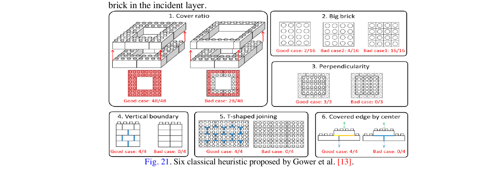

**Fig. 21..** Six classical heuristic proposed by Gower et al. [13].

<!-- Page 24 -->

KSII TRANSACTIONS ON INTERNET AND INFORMATION SYSTEMS VOL. 12, NO. 6, June 2018 2805 Kyungha Min received his MS in Computer Science from KAIST in 1992. He received his BS and Ph.D in Computer Science and Engineering from POSTECH in 1994 and 2000, respectively. His main research interests are computer graphics and image processing. Cheolseong Park received his B.S. degree from Sangmyung University, Seoul, Korea, in

## 2016. He is currently a graduate student in the same college. His research interests are

computer graphics. He is also interested in image processing, 3D-mesh processing and deep learning. Heekyung Yang received her B.S. degree and M.S. degree from Sangmyung University, Seoul, Korea, in 2010 and 2012, respectively. She is currently a Ph.D. student in the same college. Her research interests are computer graphics, especially NPR (non-photorealistic rendering). She is also interested in image processing, 3D -mesh processing, and deep learning. Grim Yun received her B.S. degree and M.S. degree from Sangmyung University, Seoul, Korea, in 2017. Her research interests are computer graphics. She is also interested in image processing, 3D-mesh processing and deep learning.
