# Alma Mater Studiorum Università di Bologna Archivio istituzionale della ricerca

Source PDF: `Models and algorithms for optimising two-dimensional LEGO constructions.pdf`

Evidence bundle: `evidence/`

<!-- Page 1 -->

## 08 July 2026

Kollsker, T., Malaguti, E. (2021). Models and algorithms for optimising two-dimensional LEGO constructions. EUROPEAN JOURNAL OF OPERATIONAL RESEARCH, 289(1), 270-284 [10.1016/j.ejor.2020.07.004]. Published Version: Models and algorithms for optimising two-dimensional LEGO constructions Published: DOI: http://doi.org/10.1016/j.ejor.2020.07.004 Terms of use: (Article begins on next page) Some rights reserved. The terms and conditions for the reuse of this version of the manuscript are specified in the publishing policy. For all terms of use and more information see the publisher's website. Availability: This version is available at: https://hdl.handle.net/11585/850081 since: 2024-02-27 This is the final peer-reviewed author’s accepted manuscript (postprint) of the following publication: This item was downloaded from IRIS Università di Bologna (https://cris.unibo.it/). When citing, please refer to the published version.

<!-- Page 2 -->

Models and algorithms for optimising two-dimensional LEGO constructions Torkil Kollskera, Enrico Malaguti b,∗ aTechnical University of Denmark, Produktionstorvet, building 424, room 225 DK-2800 Kgs. Lyngby, Denmark. bDEI, University of Bologna, Viale Risorgimento 2, I-40136 Bologna, Italy.

## Abstract

The LEGO Construction Problem is the problem of deciding which bricks to place where in a predefined LEGO construction. The input consists of coloured voxels that each correspond to the size of a LEGO unit, such that all LEGO bricks are multiples of this LEGO unit. A solution to the LEGO Construction Problem is feasible if all bricks are within the design domain, the bricks do not overlap, the bricks satisfy the colour constraints, and all bricks connect into a stable construction. In this article, we propose an automated approach for optimising LEGO constructions, and in particular, we focus on 2D constructions. We introduce mathematical programming formulations of the problem as well as a fast constructive heuristic algorithm that is very efficient for constructing regular walls. Further, we integrate the models and the heuristic into a matheuristic algorithm, where the heuristic algorithm defines most of the construction. In particular, large elements that require regular patterns, and the mathematical models are used to tackle critical parts of the construction and to ensure the overall stability of the result. The article concludes with computational experiments on regular and irregular constructions showing the efficacy of the proposed algorithm when compared with two recent approaches from the literature.

### Keywords: Cutting, LEGO Construction Problem, Mathematical Models, Matheuristic,

Structural Integrity . ∗Corresponding author Email addresses: toko@dtu.dk (Torkil Kollsker), enrico.malaguti@unibo.it (Enrico Malaguti) Preprint submitted to European Journal of Operational Research July 2, 2020

<!-- Page 3 -->

## 1. Introduction

LEGO bricks are well-known building elements that are used by kids for creating houses, spacecraft, animals, castles, vehicles, and many other things. Bricks also allow for obtaining large-scale constructions to be placed in public areas. In the case of large constructions, the number of involved bricks, the time spent in building and issues related to construction stability are such that a systematic approach is desirable. Obtaining a construction in bricks is a process that asks for 4 phases: first, the artwork is created by a designer, which defines a 2D/3D picture of the element. Second, we discretise the artwork into coloured voxels corresponding to 1 × 1 LEGO bricks, but we have not yet decided which bricks should fill which voxels. The third phase is the one we are interested in this article and is called the LEGO construction problem: deciding which bricks to use to fill the coloured voxels. The last phase is the manual construction of the element, for which the output of the third phase defines the building instructions. The cost of the construction and the building time are strongly correlated to the number of bricks used, which is the main parameter to be optimised. More formally, the LEGO construction problem is the problem of deciding which bricks (or plates) to place where in a predefined 2D/3D construction. The input consists of coloured voxels that each correspond to the size of a LEGO unit, such that all LEGO bricks (or plates) are multiples of this LEGO unit. Since we mainly focus on the 2D case, we consider a set of available bricks containing rectangular LEGO bricks. Figure 1 shows the set of white bricks and plates that are available. However, the set of available bricks may vary depending on the colour. Note that we use two types of LEGO bricks: bricks and plates. A LEGO brick has the same height as three LEGO plates. Plates: Bricks:

```text
1 × 1 1 × 2 1 × 3 1 × 4 1 × 6 1 × 8 1 × 10
```

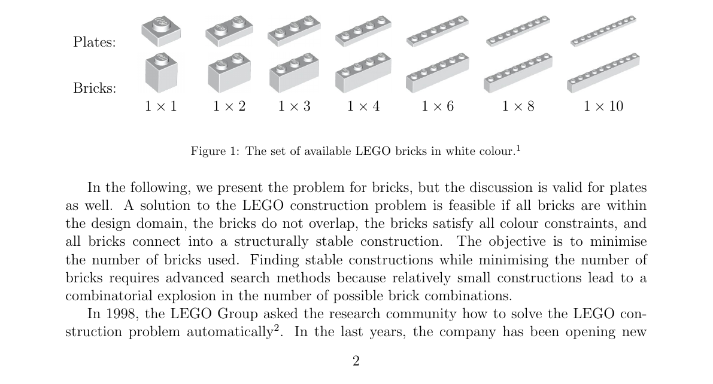

**Figure 1.** The set of available LEGO bricks in white colour. 1

In the following, we present the problem for bricks, but the discussion is valid for plates as well. A solution to the LEGO construction problem is feasible if all bricks are within the design domain, the bricks do not overlap, the bricks satisfy all colour constraints, and all bricks connect into a structurally stable construction. The objective is to minimise the number of bricks used. Finding stable constructions while minimising the number of bricks requires advanced search methods because relatively small constructions lead to a combinatorial explosion in the number of possible brick combinations. In 1998, the LEGO Group asked the research community how to solve the LEGO construction problem automatically 2. In the last years, the company has been opening new 2

<!-- Page 4 -->

shops and parks, where (very large) constructions and sculptures are one of the main attractions. As a consequence, the demand for large elements made by bricks has risen, renewing the company interest for the automatic design of the building instructions. This article discusses strategies for solving the problem. In particular, we will focus on how to build 2D brick elements, generically denoted as walls. According to the typology by W¨ ascher et al. (2007) for cutting and packing problems, we thus classify this problem as a two-dimensional single large object placement problem . We propose an optimisation method, based on the integration of a mathematical programming formulation and fast heuristic algorithms, that ensures a feasible solution. Because of its hybrid nature, our method is a matheuristic algorithm (Maniezzo et al., 2009). The methodology we propose is described for the 2D case because this allows for a more straightforward development. However, some of the ideas we present remain valid or can be extended with limited conceptual effort to the 3D case, although the associated computational effort can grow very fast in this case. Hence, when discussing the extension to the 3D case, we will also consider its applicability in practice.

### 1.1. Literature overview

Gower et al. (1998) were the first to introduce the LEGO construction problem. Since then, the literature has proposed many different approaches including beam search, local search, evolutionary algorithms and large neighbourhood search. We refer the reader to the survey by Kim et al. (2014) for a general overview of these approaches. The most popular approach for finding a solution to the problem was proposed by van Zijl and Smal (2008). They initialised the brick layout with 1 × 1 bricks after which they iteratively found all bricks to merge in a local neighbourhood and used a fast objective function to choose the best possible merge. Most approaches in the literature use rules of thumb to define the objective function. The major difficulty throughout all approaches has been to analyse the structural integrity of a LEGO construction in the optimisation process. In the following, we describe two recent approaches in the literature for dealing with this issue. Luo et al. (2015) initialised the brick layout with 1 × 1 bricks after which they repeatedly merged adjacent bricks randomly until they could no longer merge any more bricks. They then performed two subsequent analyses: a connected component analysis and a static equilibrium analysis. These analyses determined the critical bricks if the construction was disconnected or if the construction was not in static equilibrium. They picked critical bricks along with nearby bricks and split these bricks into 1 × 1 bricks. Afterwards, they repeated the previous steps until they reached a feasible solution. Kozaki et al. (2016) also initialised the brick layout with 1×1 bricks. They defined three local search operators: merge, split and remove. The merge operator randomly selected a brickb in the current configuration and a brick s in the set of available bricks. They placed s at the bottom left corner of b and removed all bricks within s. The split operator split a 1The LEGO Group presented the problem at the Technical University of Denmark to the 32nd European Study Group with Industry - see www.maths-in-industry.org/past/ESGI/32/. 2Retrieved from www.brickset.com. 3

<!-- Page 5 -->

randomly selected brick into two bricks. The remove operator randomly removed a brick. They evaluated the structural integrity after each operation using a function that is fast to compute. This function uses a linear combination of connectivity, bending moment and hollowing approximations. They used simulated annealing to advance the search. The literature on cutting and packing problems also proposed methods for estimating structural integrity. Instead of LEGO bricks, these methods considered boxes. Unlike the LEGO bricks that have knobs and cavities, these boxes have smooth surfaces. De Castro Silva et al. (2003) proposed two conditions for structural integrity. First, each box must either stand on the floor (1a), have a centre of gravity that lies directly on the surface of another box (1b) or connect to other boxes in two opposite corners of the box (1c). Second, the sum of moments for all boxes about point O must equal 0, where O is the centre of gravity for the entire set of boxes. They calculated the moment of each box by multiplying the weight force of the box with the distance from O to the centre of gravity for the box. Ramos et al. (2016) also used these conditions. They improved condition 1c by computing a support polygon. They furthermore realised that each box must satisfy condition 2 as opposed to having one condition for the entire set of boxes. They used a method known as the force method for determining the distribution of forces between the boxes. De Queiroz and Miyazawa (2014) used a method called the three-moment equation method . Starting from the upper-left box, they transmitted forces to adjacent boxes and continued to the next box in a top-down and left-right order until reaching the floor. If the calculated moment of a box did not equal 0, they assumed the packing to be unstable. These methods are not directly compatible for LEGO constructions, because they solely transmit the forces downwards towards the floor. Because of the knobs and cavities, LEGO bricks may also transmit forces upwards.

### 1.2. Contribution and structure

The scope of this article is to propose a fully automated approach for optimising twodimensional brick walls. Section 2 introduces a mathematical programming formulation that minimises the number of bricks subject to static equilibrium constraints. Our formulation comes at the price of being computationally expensive. Hence, Section 3 introduces a novel constructive heuristic based on brick bonding rules to be able to perform fast computations. Furthermore, this approach can handle a limited set of available bricks. The downside of this approach is that it does not handle the stability requirements. Section 4 introduces a hybridisation of our mathematical programming formulation with a metaheuristic that enables us to perform fast computations on simple constructions and intensify our search on regions affected by structural instability. Section 5 performs various computational experiments. We examine how the inputs affect the solution quality of our matheuristic algorithm and two recent approaches from the literature. The inputs consist of different sets of available bricks, colour constraints, and constructions containing overhang and thus having a limited amount of stable solutions. Section 6 concludes. To the best of our knowledge, there are at least two completely new contributions in the present article: 4

<!-- Page 6 -->

• No previous article has yet formulated the problem using mathematical programming. We are going to show the strengths and weaknesses of this approach. • All authors in the literature include the 1 × 1 brick in the set of available bricks. This unit brick . simplifies the problem of filling the construction with bricks. We discuss how to find solutions, even if the layout is very constrained, and the types of available bricks are limited. In addition, we think that the idea of using a simple and fast heuristic, in combination with a method for solving critical parts of a construction, is a methodology that could be extended to similar problems in cutting and packing, or in design applications.

## 2. Mathematical programming formulation

This section presents mathematical programming formulations to optimise the LEGO Construction Problem for 2D constructions. Initially, we discuss models considering the optimisation of the number of bricks (Section 2.1) and stability issues (Section 2.2) separately. Then these two features of the problem are jointly optimised (Sections 2.3 and 2.4).

### 2.1. Set-partitioning formulation

We formulate the LEGO construction problem as a Mixed-Integer Linear Program (MILP) through a set-partitioning formulation. To this aim, we need to define two sets of parameters. First, set V represents all voxels in the layout that have to be covered by a brick. A voxel has the dimensions of the smallest 1 × 1 unit brick. Second, set B contains all feasible

```text
brick placements. A brick placement b ∈ B denotes a brick of a specific size and colour
```

that covers a set of adjacent voxels Vb and is feasible only if the brick colour matches the

```text
colour of all voxels in Vb.We define a binary variablexb for eachb ∈ B, denoting if the brick
```

placement is selected. Appendix A gives an example of how to enumerate all feasible brick placements (variables) for a small construction. The following MILP formulation optimises the LEGO construction problem.

```text
min z =
∑
b∈B
xb (1)
s.t.
∑
b∈B
abvxb = 1 ∀v ∈ V (2)
xb ∈ {0, 1} ∀ b ∈ B (3)
```

Equation (1) minimises the number of brick placements, that corresponds to the number of used bricks. Constraints (2) describe the set-partitioning constraints. They are defined for

```text
each voxel v ∈ V , stating that voxel v has to be covered by exactly one brick (placement).
Hence, for each v ∈ V , the corresponding row of matrix A keeps track of which brick
```

placements cover v. In other words, abv is 1 if a brick placement b covers voxel v, and

## 0 otherwise. Constraints (3) impose that the brick placement variables are binary. This

5

<!-- Page 7 -->

article considers instances where the size of set V ranges from 100 to 300 , 000. The size of set B increases exponentially with the size of set V. However, the complexity of the LEGO construction problem does not necessarily rely on these quantities. Instead, the complexity heavily relies on finding a set of bricks that satisfy the stability conditions.

### 2.2. Static limit analysis

A fundamental requirement for a LEGO construction is its structural integrity. We evaluate this requirement using a static limit analysis. While structural integrity ideally accounts for all types of external loads, this analysis exclusively considers the weights of the bricks, i.e., the dead load. It can also handle live loads (e.g. for simulating transportation of the construction), by adding a set of external forces. This subsection assumes that we have a solution x∗ from model (1)–(3) containing a subset Bx∗ of selected brick placements. A set of static equilibrium constraints can thus reveal whether the construction is in equilibrium. We model the collapse of a construction as the violation of the force capacity between two or more bricks. Furthermore, we show how to incorporate the equilibrium constraints into a MILP model as a hard constraint, to be satisfied by a stable construction, or as a soft constraint, to be optimised during the definition of a feasible solution to the problem. Although we give details for a static limit analysis for a 2D construction, this analysis can extend to the 3D case by adding one more dimension. Properties of the LEGO brick. The standard LEGO brick contains knobs on its top and cavities on its bottom. Figure 2 shows an example of two bricks that connect. Vertical contact forces act between the bricks (see Figure 2b). Furthermore, friction occurs between the knobs of the lower brick and the cavities of the upper brick (see Figure 2c). The surfaces exert vertical friction forces and horizontal normal forces. The presence of knobs and cavities allow the bricks to stick together without any use of glue or mortar. Modelling the forces occurring between the knobs and cavities is thus crucial for getting a reliable model. Modelling the forces acting on the bricks. We define the forces using the Cartesian coordinate system oriented to the right (x-axis) and upwards (y-axis). We thus represent a force by its

```text
xy-components: ⃗F = [Fx,F y]. We model the forces acting on the bricks by using three sets
of forces, Fn, Fs and Ff, where
```

Fn - is the set of contact forces that act between the bricks. Figure 2b illustrates the forces acting between two bricks in contact. Zio lo et al. (2012) proposed to simplify these forces by placing one vertical contact force at each corner of the interface between each pair of vertically adjacent bricks. Forces F9,...,F 12, F19,...,F 22 in Figure 3 illustrate how to place these vertical contact forces. Luo et al. (2015) furthermore proposed to add one horizontal contact force at each corner of the interface between each pair of horizontally adjacent bricks. ForcesF7 andF8 in Figure 3 illustrate how to place these 6

<!-- Page 8 -->

1.6mm 8mm 4.8mm (a) (b) Contact forces (c) Friction forces

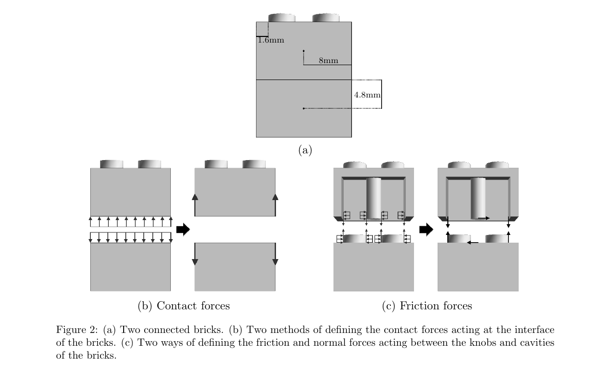

**Figure 2.** (a) Two connected bricks. (b) Two methods of defining the contact forces acting at the interface

of the bricks. (c) Two ways of defining the friction and normal forces acting between the knobs and cavities of the bricks. 7

<!-- Page 9 -->

horizontal contact forces. The values of these forces are bounded as [0 0 ]

```text
≤ ⃗Fi ≤
[ 0
Tn
]
, ∀i ∈ F (v+)
n ,
[ 0
−Tn
]
≤ ⃗Fi ≤
[0
0
]
, ∀i ∈ F (v−)
n ,
[0
0
]
≤ ⃗Fi ≤
[Tn
0
]
, ∀i ∈ F (h+)
n ,
[−Tn
0
]
≤ ⃗Fi ≤
[0
0
]
, ∀i ∈ F (h−)
n ,
(4)
where Tn is a large number, F (v+)
n and F (v−)
```

n are the set of vertical forces pointing in the positive and negative directions, respectively, and F (h+) n and F (h−) n are the set of horizontal forces pointing in the positive and negative directions, respectively. Fs - is the set of normal forces acting horizontally between the knobs and cavities. Luo et al. (2015) named them support forces. Figure 2c illustrates how they simplified these forces by adding a single force for each pair of connected bricks. Forces F5,F 6,F 17 and F18 in Figure 3 illustrate how to place these horizontal support forces. Because the support forces do not have a specific direction, the values of these forces are bounded as [−Tn 0 ]

```text
≤ ⃗Fi ≤
[Tn
0
]
, ∀i ∈ F s, (5)
where Tn is a large number.
```

Ff - is the set of friction forces acting vertically between the knobs and cavities to prevent the bricks from disconnecting. We propose to add two friction forces for each pair of connected bricks as opposed to Luo et al. (2015), who add two friction forces for each pair of connected knob and cavity. Figure 2c illustrates that we place these forces at each endpoint of the knobs. Forces F1,...,F 4,F 13, ..., F16 in Figure 3 also illustrate how to place these vertical friction forces. The values of these forces are bounded as [0 0 ]

```text
≤ ⃗Fi ≤
[ 0
Ti
]
, ∀i ∈ F +
f ,
[ 0
−Ti
]
≤ ⃗Fi ≤
[0
0
]
, ∀i ∈ F−
f , (6)
```

whereTi is the friction capacity of force i and F + f and F− f are the set of friction forces pointing in the positive and negative directions, respectively. We define the friction capacity later.

```text
Static equilibrium of forces. Each placed brick b ∈ B∗ has to be in static equilibrium given
that Fb = Ff ∪ Fn ∪ Fs is the set of forces acting on b, mb is the mass of b, ⃗ g= (0, −g)
```

and g is the gravitational constant. Constraints (7) express the static equilibrium of forces (Krenk and Høgsberg, 2013, chapter 1).

```text
Static equilibrium of moments. Each placed brickb ∈ B∗ has to be in rotational equilibrium
given that Fb = Ff ∪ F n ∪ F s is the set of forces acting on the brick and ⃗Li is the
```

position vector of force i from the centre of brick b. We thus calculate the moment as the cross product between vectors ⃗Li and ⃗Fi, i.e., ⃗Li × ⃗Fi. Constraints (8) express the static equilibrium of moments (Krenk and Høgsberg, 2013, chapter 1). 8

<!-- Page 10 -->

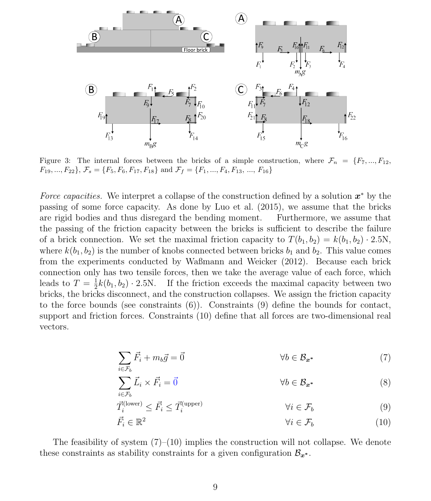

**Figure 3.** The internal forces between the bricks of a simple construction, where Fn = {F7,...,F 12,

```text
F19,...,F 22}, Fs = {F5,F 6,F 17,F 18} and Ff = {F1,...,F 4,F 13, ..., F16}
```

Force capacities. We interpret a collapse of the construction defined by a solution x∗ by the passing of some force capacity. As done by Luo et al. (2015), we assume that the bricks are rigid bodies and thus disregard the bending moment. Furthermore, we assume that the passing of the friction capacity between the bricks is sufficient to describe the failure

```text
of a brick connection. We set the maximal friction capacity to T (b1,b 2) = k(b1,b 2) · 2.5N,
```

wherek(b1,b 2) is the number of knobs connected between bricksb1 andb2. This value comes from the experiments conducted by Waßmann and Weicker (2012). Because each brick connection only has two tensile forces, then we take the average value of each force, which

```text
leads to T = 1
```

2k(b1,b 2) · 2.5N. If the friction exceeds the maximal capacity between two bricks, the bricks disconnect, and the construction collapses. We assign the friction capacity to the force bounds (see constraints (6)). Constraints (9) define the bounds for contact, support and friction forces. Constraints (10) define that all forces are two-dimensional real vectors. ∑

```text
i∈Fb
⃗Fi +mb⃗ g=⃗0 ∀b ∈ B x∗ (7)
∑
i∈Fb
⃗Li × ⃗Fi =⃗0 ∀b ∈ B x∗ (8)
⃗T (lower)
i ≤ ⃗Fi ≤ ⃗T (upper)
i ∀i ∈ F b (9)
⃗Fi ∈ R2 ∀i ∈ F b (10)
```

The feasibility of system (7)–(10) implies the construction will not collapse. We denote these constraints as stability constraints for a given configuration Bx∗. 9

<!-- Page 11 -->

Relaxing the stability conditions Constraints (7)–(10) can be imposed to check the stability of a LEGO construction, but their violation would not provide any indication on where and how an unstable construction would collapse. To obtain information on the weak components of a construction, we exploit the idea of introducing artificial links connecting the bricks of a construction into large bricks. Specifically, we add an artificial link between the interface of each pair of horizontally adjacent bricks and we denote the artificial forces acting on brick b over these links as Fl. An optimisation model that penalises the use of forces Fl would thus activate these links only when this would ensure a static equilibrium, as in the following quadratic programming (QP) model.

```text
min q =
∑
i∈Fl
⃗F 2
i (11)
s.t.
∑
i∈Fb∪Fl
⃗Fi +mb⃗ g=⃗0 ∀b ∈ B x∗ (12)
∑
i∈Fb∪Fl
⃗Li × ⃗Fi =⃗0 ∀b ∈ B x∗ (13)
⃗T (lower)
i ≤ ⃗Fi ≤ ⃗T (upper)
i ∀i ∈ F b (14)
⃗Fi ∈ R2 ∀i ∈ F b ∪ Fl (15)
```

Equation (11) describes the objective function that minimises the use of artificial link

```text
forces ⃗F ∈ F l. Static indeterminacy occurs to this system when the equilibrium constraints
```

are not sufficient for determining a unique solution. It thus leads to an infinite number of different solutions to the force distribution. By using a quadratic objective function, our formulation simultaneously minimises the use of artificial link forces and distributes the force values amongst all critical links. This approach was used by, e.g., Whiting et al. (2012) to account for the indeterminacy of brick masonry constructions. Constraints (12)–(15) are a reformulation of constraints (7)–(10), such that we now include the artificial link forces. A stable configuration x∗ would define a feasible system (7)–(10) and a solution to (11)–

```text
(15) of null cost ( q = 0). An unstable configuration x∗ would define an infeasible system
(7)–(10) and a solution to (11)–(15) of strictly positive cost (q >0). In this case, the positive
```

values of the artificial link forces define the critical areas of the construction.

### 2.3. Closed-form formulation

This section proposes a closed-form formulation that defines a stable configuration of bricks globally, by imposing stability as a hard constraint. The main idea is to model each brick as a set of 1 × 1 voxels defined by V. We thus change all forces to act on the voxels instead of the bricks. To represent the material strength of a brick, we add forces at the interface of each pair of adjacent voxels of the same colour. We denote the forces between each pair of adjacent voxels as links, that are activated/deactivated by a suited set of variables. Figure 4 shows how (a) two vertical forces ( F1 and F2) and two horizontal 10

<!-- Page 12 -->

(a) (b)

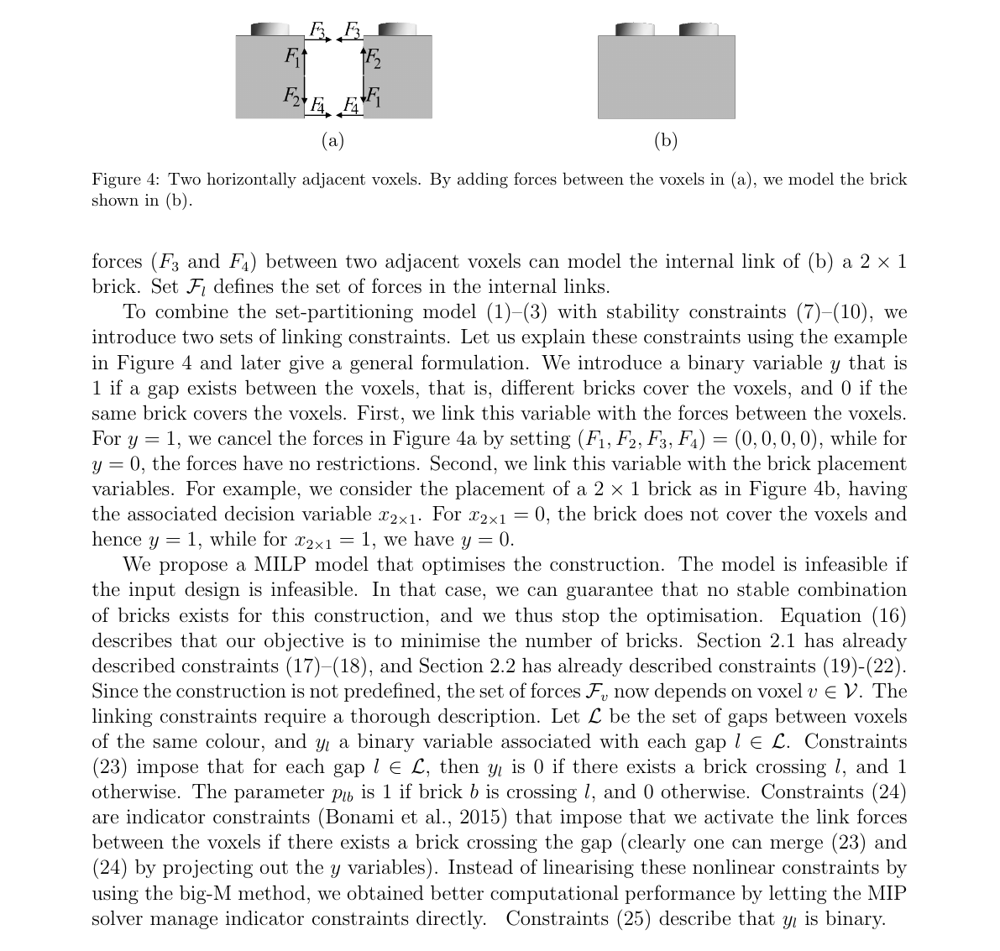

**Figure 4.** Two horizontally adjacent voxels. By adding forces between the voxels in (a), we model the brick

shown in (b). forces (F3 and F4) between two adjacent voxels can model the internal link of (b) a 2 × 1 brick. Set Fl defines the set of forces in the internal links. To combine the set-partitioning model (1)–(3) with stability constraints (7)–(10), we introduce two sets of linking constraints. Let us explain these constraints using the example in Figure 4 and later give a general formulation. We introduce a binary variable y that is

## 1 if a gap exists between the voxels, that is, different bricks cover the voxels, and 0 if the

same brick covers the voxels. First, we link this variable with the forces between the voxels.

```text
Fory = 1, we cancel the forces in Figure 4a by setting (F1,F 2,F 3,F 4) = (0, 0, 0, 0), while for
```

y = 0, the forces have no restrictions. Second, we link this variable with the brick placement variables. For example, we consider the placement of a 2 × 1 brick as in Figure 4b, having

```text
the associated decision variable x2×1. For x2×1 = 0, the brick does not cover the voxels and
hence y = 1, while for x2×1 = 1, we have y = 0.
```

We propose a MILP model that optimises the construction. The model is infeasible if the input design is infeasible. In that case, we can guarantee that no stable combination of bricks exists for this construction, and we thus stop the optimisation. Equation (16) describes that our objective is to minimise the number of bricks. Section 2.1 has already described constraints (17)–(18), and Section 2.2 has already described constraints (19)-(22).

```text
Since the construction is not predefined, the set of forcesFv now depends on voxelv ∈ V . The
```

linking constraints require a thorough description. Let L be the set of gaps between voxels

```text
of the same colour, and yl a binary variable associated with each gap l ∈ L . Constraints
(23) impose that for each gap l ∈ L , then yl is 0 if there exists a brick crossing l, and 1
```

otherwise. The parameter plb is 1 if brick b is crossing l, and 0 otherwise. Constraints (24) are indicator constraints (Bonami et al., 2015) that impose that we activate the link forces between the voxels if there exists a brick crossing the gap (clearly one can merge (23) and (24) by projecting out the y variables). Instead of linearising these nonlinear constraints by using the big-M method, we obtained better computational performance by letting the MIP solver manage indicator constraints directly. Constraints (25) describe that yl is binary. 11

<!-- Page 13 -->

```text
min z =
∑
b∈B
xb (16)
s.t.
∑
b∈B
abvxb = 1 ∀v ∈ V (17)
xb ∈ {0, 1} ∀ b ∈ B (18)∑
i∈Fv∪Fl
⃗Fi +mv⃗ g=⃗0 ∀v ∈ V (19)
∑
i∈Fv∪Fl
⃗Li × ⃗Fi =⃗0 ∀v ∈ V (20)
⃗T (lower)
i ≤ ⃗Fi ≤ ⃗T (upper)
i ∀i ∈ F b (21)
⃗Fi ∈ R2 ∀i ∈ F v ∪ Fl (22)
yl = 1 −
∑
b∈B
plbxb ∀l ∈ L (23)
yl = 1 =⇒ ⃗Fi =⃗0 ∀l ∈ L,i ∈ F l (24)
yl ∈ {0, 1} ∀ l ∈ L (25)
```

### 2.4. Relaxed closed-form formulation

Constructing a solution from scratch using model (16)–(25) can be very time-consuming for constructions containing thousands of bricks. Let us instead assume that part of the construction is given and fixed (e.g., because it was pre-computed by a heuristic algorithm), and we only have to decide how to cover the remaining subset of voxels. Since the given and fixed part of the construction can lead to an infeasible model, we relax the model to make it feasible for any given fixed subset of voxels. We denote the part of the construction to optimise as free, and the given part as fixed. Bfixed is the set of placed bricks that defines the fixed part. The free part is not yet defined but contains a set of voxels Vfree. We generate a set of brick placements Bfree containing all possible placements in the free part. The MILP model (26)–(39) optimises the free part, while using the fixed bricks to satisfy stability conditions of the overall construction. The model includes three types of binary decision variables. Variables xb, b ∈ Bfree define the bricks of the free part. Variables yl, l ∈ L free ∪ Lfixed, for both the free and the fixed part, define whether a gap exists between two voxels and prevent any force from acting across a gap. Because the combination of fixed and free parts does not necessarily allow for a solution satisfying the stability conditions, variablessl, l ∈ Lfree ∪ Lfixed define artificial link forces at the interface of pairs of adjacent bricks, both in the free and the fixed part. A configuration is thus in static equilibrium only if these artificial variables, or equivalently, the associated artificial forces, are null. 12

<!-- Page 14 -->

```text
min z =
∑
b∈Bfree
xb +M
∑
l∈L
sl (26)
s.t.
∑
b∈Bfree
abvxb = 1 ∀v ∈ Vfree (27)
xb ∈ {0, 1} ∀ b ∈ Bfree (28)∑
i∈Fv∪Fl(v)
⃗Fi +mv⃗ g=⃗0 ∀v ∈ Vfree (29)
∑
i∈Fv∪Fl(v)
⃗Li × ⃗Fi =⃗0 ∀v ∈ Vfree (30)
∑
i∈Fb∪Fl(b)
⃗Fi +mb⃗ g=⃗0 ∀b ∈ Bfixed (31)
∑
i∈Fb∪Fl(b)
⃗Li × ⃗Fi =⃗0 ∀b ∈ Bfixed (32)
⃗T (lower)
i ≤ ⃗Fi ≤ ⃗T (upper)
i ∀i ∈ F b (33)
⃗Fi ∈ R2 ∀i ∈ F b ∪ Fv ∪ Fl (34)
yl +sl = 1 −
∑
b∈Bfree
plbxb ∀l ∈ Lfree (35)
yl +sl = 1 ∀l ∈ Lfixed (36)
yl = 1 =⇒ ⃗Fi =⃗0 ∀l ∈ Lfree ∪ Lfixed,i ∈ F l (37)
sl ∈ {0, 1} ∀ l ∈ Lfree ∪ Lfixed (38)
yl ∈ {0, 1} ∀ l ∈ Lfree ∪ Lfixed (39)
```

Equation (26) describes the objective function that is to minimise the number of bricks and the number of activated artificial links, which are heavily penalised by the large constant

### M. Constraints (27)–(28) are the set-partitioning constraints for the free part. Constraints

(29)–(34) are the stability conditions that apply for the free part and the fixed part. Constraints (35)–(39) are the linking constraints. Constraints (35), defined for each possible gap

```text
between two bricks in the free part, impose that, either no force is transmitted ( yl = 1),
or an artificial force is active ( sl = 1). When there is no gap (i.e., a brick covers l), both
```

sl and yl are null in any optimal solution. These constraints simplify to (36) for the fixed part, where they are defined only for the actual (fixed) gaps. If a configuration of the free part exists such that the fixed and free parts satisfy the stability conditions, then variables

```text
sl, l ∈ Lfree ∪ Lfixed all take the value 0 in an optimal solution.
```

### 2.5. Issues using mathematical programming

This section proposed a mathematical programming model combining a set-partitioning formulation with stability conditions (model (16)–(25)). However, this formulation encounters three significant issues. (i) Generating all possible brick placement variables is very 13

<!-- Page 15 -->

time-consuming for constructions containing thousands of bricks. (ii) The brick placement variables create symmetry issues in the MILP model. (iii) The static equilibrium constraints (19)–(22) are very time-consuming to satisfy for constructions containing thousands of bricks. These three issues indicate that this model is not scalable. However, we have also presented a mathematical programming model that allows for completing a partially given construction to optimality (model (26)–(39)). This allows us to split the construction into two parts, where this model handles the part that is difficult to solve with heuristic algorithms.

## 3. Constructive heuristic algorithm

This section presents a greedy algorithm inspired by a strategy commonly used to construct brick walls. The purpose of this algorithm is to quickly fill large regular parts of a LEGO construction by regular and stable patterns. It replicates brick bonding strategies used in practice by iteratively selecting the best brick to place in the construction using a novel cost function.

### 3.1. Brick bonding

Brick bonding aims at systematically arranging bricks, such that all of the brick connections ensure strong and stable constructions. Hancock (1990) made an interesting chapter about the guidelines for building brick walls. One of the most common types of bonds typically used for constructing brick walls is the stretcher bond. The objective of this bond is to lay the bricks in the orientation of the wall while spreading all external loads amongst the bricks. Figure 5a shows a perfect stretcher bond that distributes the connections equally between the bricks. Figure 5b shows a stack bond containing fewer bricks stacked on top of each other. This example shows that our two objectives sometimes are conflicting. On the one hand, maximising the strength of the stretcher bond can lead to a large number of bricks used. On the other hand, exclusively minimising the number of bricks can result in weak or even disconnected constructions. Finding a balance between these two objectives is paramount. 14

<!-- Page 16 -->

(a) (b)


**Figure 5.** The two objectives are conflicting. (a) Maximising the strength of the stretcher bond results in

nine bricks. (b) Minimising the number of bricks results in this case in a stack bond containing six bricks.

### 3.2. Constructive heuristic

The constructive heuristic algorithm is an adaptation of the well-known bottom-left heuristic algorithm for 2D cutting problems (Chazelle, 1983) applied to the LEGO construction problem. In each step, it chooses the next brick to place according to a best-fit strategy, and it evaluates the fit through a heuristic cost function. In detail, the algorithm follows a simple sequential strategy. It builds one layer at a time, randomly choosing to build in either a top-down or a bottom-up order, and randomly choosing to build in either a left-first or a right-first order. The algorithm then starts covering the layers with bricks. For each decision about the next brick to place, it considers all available bricks satisfying the colour constraints and chooses the best placement amongst these bricks. The best placement is defined based on the value found by the greedy cost function described in Section 3.2.1.

#### 3.2.1. Cost function

This section presents the cost function that is used by the constructive algorithm for iteratively deciding the next brick to place while filling a layer. The next brick is the one of minimum cost, among those that are feasible. The function approximates our objective, which is to minimise the number of bricks while ensuring a structurally stable construction.

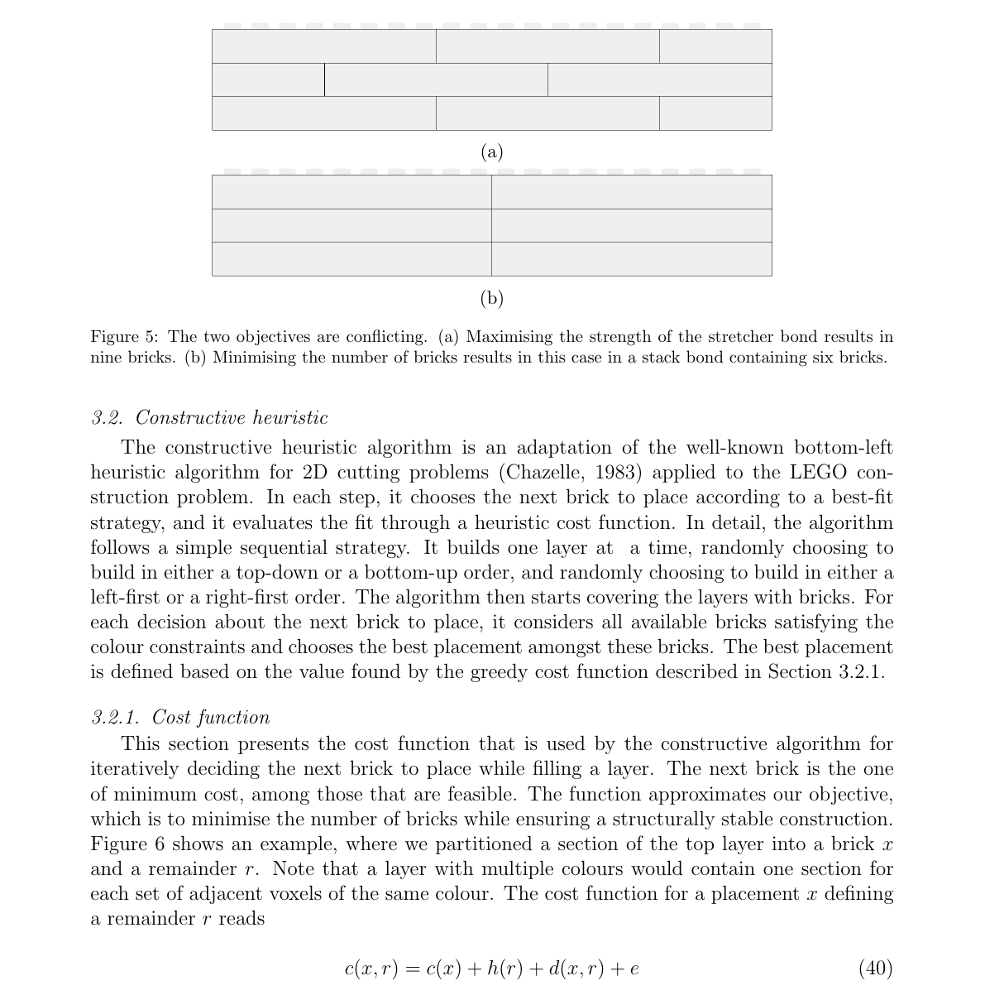

**Figure 6.** shows an example, where we partitioned a section of the top layer into a brick x

and a remainder r. Note that a layer with multiple colours would contain one section for each set of adjacent voxels of the same colour. The cost function for a placement x defining a remainder r reads

```text
c(x,r ) =c(x) +h(r) +d(x,r ) +e (40)
15
```

<!-- Page 17 -->

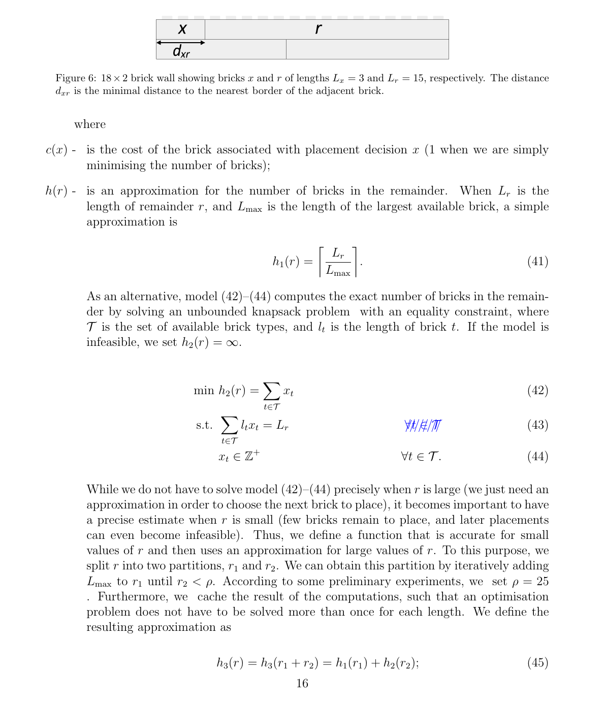

**Figure 6.** 18 ×2 brick wall showing bricksx andr of lengthsLx = 3 andLr = 15, respectively. The distance

dxr is the minimal distance to the nearest border of the adjacent brick. where c(x) - is the cost of the brick associated with placement decision x (1 when we are simply minimising the number of bricks); h(r) - is an approximation for the number of bricks in the remainder. When Lr is the length of remainder r, and Lmax is the length of the largest available brick, a simple approximation is

```text
h1(r) =
⌈ Lr
Lmax
⌉
. (41)
```

As an alternative, model (42)–(44) computes the exact number of bricks in the remainder by solving an unbounded knapsack problem with an equality constraint, where T is the set of available brick types, and lt is the length of brick t. If the model is

```text
infeasible, we set h2(r) = ∞.
min h2(r) =
∑
t∈T
xt (42)
s.t.
∑
t∈T
ltxt =Lr ∀t ∈ T/ / / / / / / / (43)
xt ∈ Z+ ∀t ∈ T . (44)
```

```text
While we do not have to solve model (42)–(44) precisely whenr is large (we just need an
```

approximation in order to choose the next brick to place), it becomes important to have a precise estimate when r is small (few bricks remain to place, and later placements can even become infeasible). Thus, we define a function that is accurate for small values of r and then uses an approximation for large values of r. To this purpose, we splitr into two partitions,r1 andr2. We can obtain this partition by iteratively adding

```text
Lmax to r1 until r2 < ρ. According to some preliminary experiments, we set ρ = 25
```

. Furthermore, we cache the result of the computations, such that an optimisation problem does not have to be solved more than once for each length. We define the resulting approximation as

```text
h3(r) =h3(r1 +r2) =h1(r1) +h2(r2); (45)
16
```

<!-- Page 18 -->

d(x,r ) - with this term, we try to maximise the distance between the gaps of the bricks on adjacent layers, as prescribed by the brick bonding rules. Figure 6, where we are constructing layers bottom-up and left-right, shows the minimum distance, from the right border of the brick to be placed, to a gap on the bottom layer (clearly the distance from the left border of the brick is fixed by the position of the previously placed brick). Equation (46) proposes an exponential function that gives high penalties for low values of dxr, and then the penalties decrease quickly as dxr increases. According to some

```text
preliminary computational experiments, we set (α1,α 2) = (4.0, 0.8).
d(x,r ) =α1 exp(−α2dxr); (46)
```

e - is a perturbation we include in the cost function, similar to what was proposed by Charon and Hudry (1993). This perturbation is useful because the cost function does not necessarily reflect our true objective and can thus allow for diverse solutions. Valuee is randomly generated in the interval [0,e max]. According to some preliminary

```text
computational experiments, we set emax = 1.0.
```

#### 3.2.2. Incomplete construction method

According to the proximate optimality principle described in e.g. Fleurent and Glover (1999), imperfections introduced during the constructive phase of a layer can lead to other imperfections in the next layers. Figure 7a illustrates an extreme case of using too many bricks in the second layer. To avoid propagating these bad decisions to the third layer, we apply an improvement step after completing each layer. This improvement step is similar to the large neighbourhood search by Shaw (1998). We remove all pairs of adjacent bricks having a combined length less than the largest brick length that is available,Lmax. Figure 7b gives an example. We invert the building orientation to avoid making the same mistake again. For instance, if we constructed the layer using a left-first order, then we invert to a right-first order. We fill the empty areas in the inverse order. If the new solution contains fewer bricks, then we keep it, and otherwise, we discard it. Figure 7c shows an example of this. 17

<!-- Page 19 -->

(a) (b) (c)

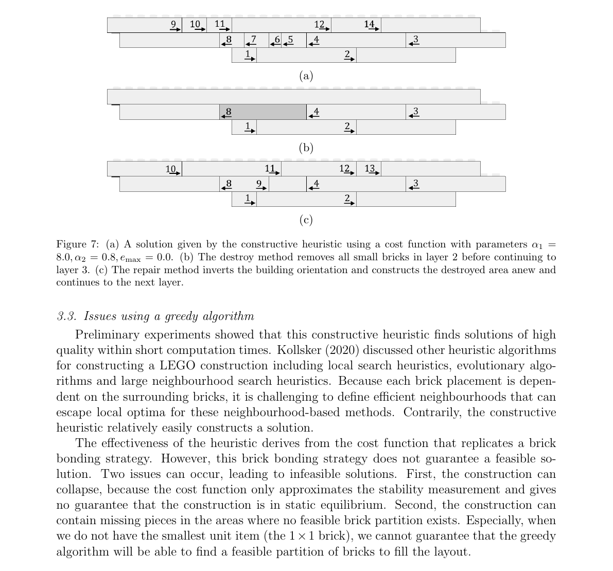

**Figure 7.** (a) A solution given by the constructive heuristic using a cost function with parameters α1 =

```text
8.0,α 2 = 0.8,e max = 0.0. (b) The destroy method removes all small bricks in layer 2 before continuing to
```

layer 3. (c) The repair method inverts the building orientation and constructs the destroyed area anew and continues to the next layer.

### 3.3. Issues using a greedy algorithm

Preliminary experiments showed that this constructive heuristic finds solutions of high quality within short computation times. Kollsker (2020) discussed other heuristic algorithms for constructing a LEGO construction including local search heuristics, evolutionary algorithms and large neighbourhood search heuristics. Because each brick placement is dependent on the surrounding bricks, it is challenging to define efficient neighbourhoods that can escape local optima for these neighbourhood-based methods. Contrarily, the constructive heuristic relatively easily constructs a solution. The effectiveness of the heuristic derives from the cost function that replicates a brick bonding strategy. However, this brick bonding strategy does not guarantee a feasible solution. Two issues can occur, leading to infeasible solutions. First, the construction can collapse, because the cost function only approximates the stability measurement and gives no guarantee that the construction is in static equilibrium. Second, the construction can contain missing pieces in the areas where no feasible brick partition exists. Especially, when we do not have the smallest unit item (the 1×1 brick), we cannot guarantee that the greedy algorithm will be able to find a feasible partition of bricks to fill the layout.

## 4. Matheuristic

This section proposes a matheuristic algorithm that combines the mathematical models described in Section 2 with the constructive heuristic algorithm described in Section 3. On the one hand, mathematical programming formulations ensure optimal solutions, but the computation time can be too time-consuming for large-scale constructions. On the other hand, the constructive heuristic finds solutions very quickly, but cannot guarantee feasibility. 18

<!-- Page 20 -->

The main idea of this matheuristic is to combine the strengths of the two approaches by splitting the problem into two parts. The constructive heuristic algorithm defines a large part of the construction, in particular, large elements that require regular patterns. After performing a static limit analysis, the mathematical model is used to tackle critical parts of the construction, and to ensure the overall stability of the result.

**Algorithm 1.**

```text
1: procedure Matheuristic(α1,α 2,e max,β 0,γ,ϵ )
2: i = 0
3: x ← Constructive-Heuristic(α1,α 2,e max)
4: q ← solve (11)–(15)
```

```text
5: while q >0 do
6: qe
```

```text
max ← strongest artificial link
7: remove all bricks adjacent to a link with value qe ≥ (βi −ϵ) ·qe
max.
8: Bfree ← generate all bricks in the destroyed area
9: Bfixed ← all remaining bricks are fixed
```

```text
10: if Bfixed = ∅ then
```

```text
11: x ← solve (16)–(25)
```

```text
12: return x
13: else
```

```text
14: xfree ← solve (26)–(39)
15: x = xfixed + xfree
16: end if
```

```text
17: if |sl|> 0 then
```

```text
18: q′ ← solve (11)–(15)
```

```text
19: else
20: q′ = 0
21: end if
22: if q′ ≥q then
```

```text
23: i =i + 1,βi =β0 ·γi
24: end if
25: q =q′
26: end while
```

```text
27: return x
28: end procedure
```

**Algorithm 1.** describes our matheuristic. Lines 2–4 find an initial solution and determine

```text
theq value. Parametersα1,α 2,e max affect the cost function used in the constructive heuristic.
```

Lines 5–26 iteratively remove a set of critical bricks and repair the associated area using a mathematical model. This procedure continues until either we have reached a feasible

```text
solution (i.e., q = 0) or if we have solved the full model (see lines 10–12).
```

The number of bricks to remove at each iteration is vital to determine carefully. Lines 6-9 split the problem into a fixed part and a free part. On the one hand, removing too 19

<!-- Page 21 -->

(a) (b) (c) (d)

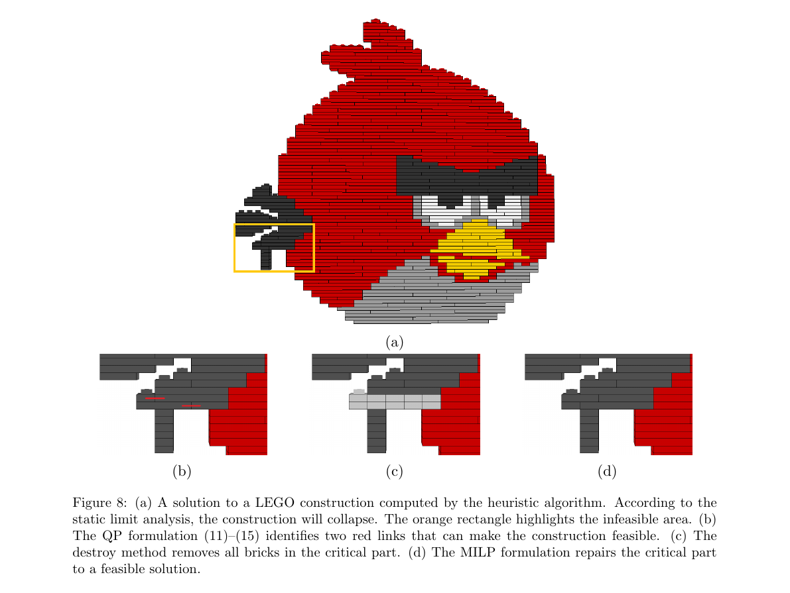

**Figure 8.** (a) A solution to a LEGO construction computed by the heuristic algorithm. According to the

static limit analysis, the construction will collapse. The orange rectangle highlights the infeasible area. (b) The QP formulation (11)–(15) identifies two red links that can make the construction feasible. (c) The destroy method removes all bricks in the critical part. (d) The MILP formulation repairs the critical part to a feasible solution. 20

<!-- Page 22 -->

many bricks creates a free part that can be too large for the model to solve. On the other hand, removing too few bricks creates a free part that has too few possibilities, and thus no

```text
improvement can be made. Parameters β0, γ and ϵ control the number of bricks to remove
at each iteration, such that the number is increasing. Parameter β is a value in the interval
[0, 1] that determines which links to consider as critical, γ is a decay factor in the interval
]0, 1[, and ϵ is a small value that ensures that once β → 0, then we remove all of the bricks.
```

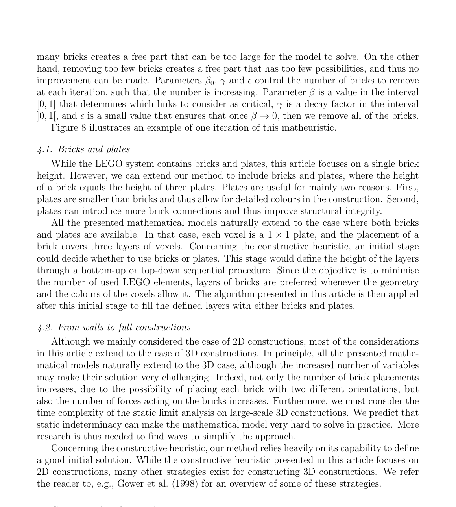

**Figure 8.** illustrates an example of one iteration of this matheuristic.

### 4.1. Bricks and plates

While the LEGO system contains bricks and plates, this article focuses on a single brick height. However, we can extend our method to include bricks and plates, where the height of a brick equals the height of three plates. Plates are useful for mainly two reasons. First, plates are smaller than bricks and thus allow for detailed colours in the construction. Second, plates can introduce more brick connections and thus improve structural integrity. All the presented mathematical models naturally extend to the case where both bricks and plates are available. In that case, each voxel is a 1 × 1 plate, and the placement of a brick covers three layers of voxels. Concerning the constructive heuristic, an initial stage could decide whether to use bricks or plates. This stage would define the height of the layers through a bottom-up or top-down sequential procedure. Since the objective is to minimise the number of used LEGO elements, layers of bricks are preferred whenever the geometry and the colours of the voxels allow it. The algorithm presented in this article is then applied after this initial stage to fill the defined layers with either bricks and plates.

### 4.2. From walls to full constructions

Although we mainly considered the case of 2D constructions, most of the considerations in this article extend to the case of 3D constructions. In principle, all the presented mathematical models naturally extend to the 3D case, although the increased number of variables may make their solution very challenging. Indeed, not only the number of brick placements increases, due to the possibility of placing each brick with two different orientations, but also the number of forces acting on the bricks increases. Furthermore, we must consider the time complexity of the static limit analysis on large-scale 3D constructions. We predict that static indeterminacy can make the mathematical model very hard to solve in practice. More research is thus needed to find ways to simplify the approach. Concerning the constructive heuristic, our method relies heavily on its capability to define a good initial solution. While the constructive heuristic presented in this article focuses on 2D constructions, many other strategies exist for constructing 3D constructions. We refer the reader to, e.g., Gower et al. (1998) for an overview of some of these strategies.

## 5. Computational experiments

In this section, we present the computational experiments that we have conducted for our approach. The scope of these experiments is twofold: first, we use a diverse set of input constructions to examine how this affects our models and algorithms. Since no instances 21

<!-- Page 23 -->

are available in the literature for the LEGO construction problem, we generated a set of instances of increasing complexity, starting from regular monochromatic walls and ending at irregular figures with colours and overhangs 3. Second, we are interested in comparing our approach with two recent methods from the literature, Luo et al. (2015) and Kozaki et al. (2016). We base this comparison on our implementations of their algorithms. Note that in these experiments, we are only considering a 2D variant of the LEGO construction problem, i.e., the construction of brick walls and other 2D constructions. Our comparison is thus strictly valid for these types of constructions.

### 5.1. Computational settings

We performed all experiments on a laptop equipped with an Intel R⃝ CoreTM i7-7820HQ processor at 2.90 GHz and 16 GB RAM, under the Windows operating system. As MIP solver, we used IBM-CPLEX version 12.8.0. We used the following parameter settings for our computational experiments. For the

```text
constructive heuristic, we set α1 = 4.0,α 2 = 0.8,e max = 1.0. For the matheuristic, we set
β0 = 0.8,γ = 0.5,ϵ = 0.05, CPLEX time limit: 60s. We changed the CPLEX time limit to
600s in Section 5.4. For the static limit analysis, we set the brick weight to mb⃗ g=k(b) · 1N
and the friction capacity to T (b1,b 2) = k(b1,b 2) · 2.5N, where k(b) is the number of voxels
```

in brick b and k(b1,b 2) is the number of voxels between bricks b1 and b2.

### 5.2. Regular walls

This section examines the performance of the constructive heuristic presented in Section 3.2 and the closed-form MILP model presented in Section 2.3 on rectangular monochromatic regular walls fixed to the ground. Notice that the matheuristic algorithm would immediately stop after the first call to the constructive heuristic since rectangular walls fixed to the ground do not have stability issues. Regular walls are thus ideal for testing how efficient the constructive heuristic is to minimise the number of bricks in the construction.

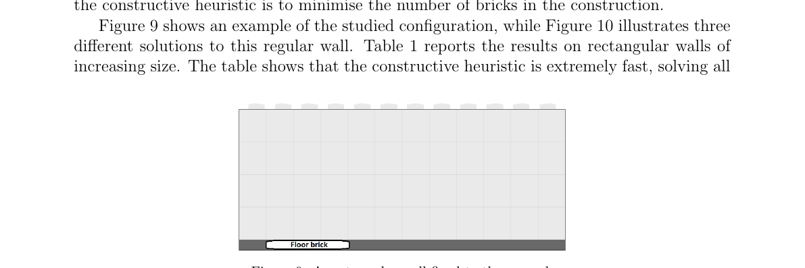

**Figure 9.** shows an example of the studied configuration, while Figure 10 illustrates three

different solutions to this regular wall. Table 1 reports the results on rectangular walls of increasing size. The table shows that the constructive heuristic is extremely fast, solving all

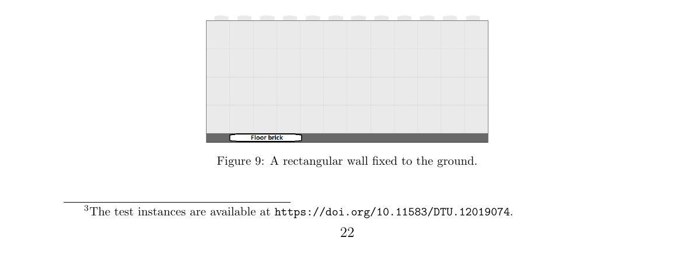

**Figure 9.** A rectangular wall fixed to the ground.

3The test instances are available at https://doi.org/10.11583/DTU.12019074. 22

<!-- Page 24 -->

Constructive Closed-form formulation heuristic Input sizes Solutions Wall size No. CPU No. No. No. CPU bricks time (s) rows columns bricks time (s)

```text
20 × 6 15.0 0.30 470 1,653 12 0.12
55 × 15 106.1 0.40 3,444 12,849 105 0.66
301 × 25 819.9 0.28 31,873 122,252 775 29.3
13 × 492 1,004.6 0.10 27,066 89,618 984 33.7
376 × 89 3,386.4 0.31 144,269 552,295 3,382 587.6
282 × 184 5,435.4 0.40 223,956 856,322 5,336 1424.6
975 × 73 7,231.4 0.46 306,057 1,176,270 7,227 2597.6
337 × 400 14,276.6 0.56 582,839 2,230,351 Out of memory
665 × 221 15,050.9 0.56 635,457 2,437,616 Out of memory
398 × 398 17,392.7 0.59 685,248 2,623,882 Out of memory
786 × 281 22,208.9 0.70 955,417 3,666,473 Out of memory
748 × 366 29,910.8 0.88 1,184,366 4,544,997 Out of memory
```

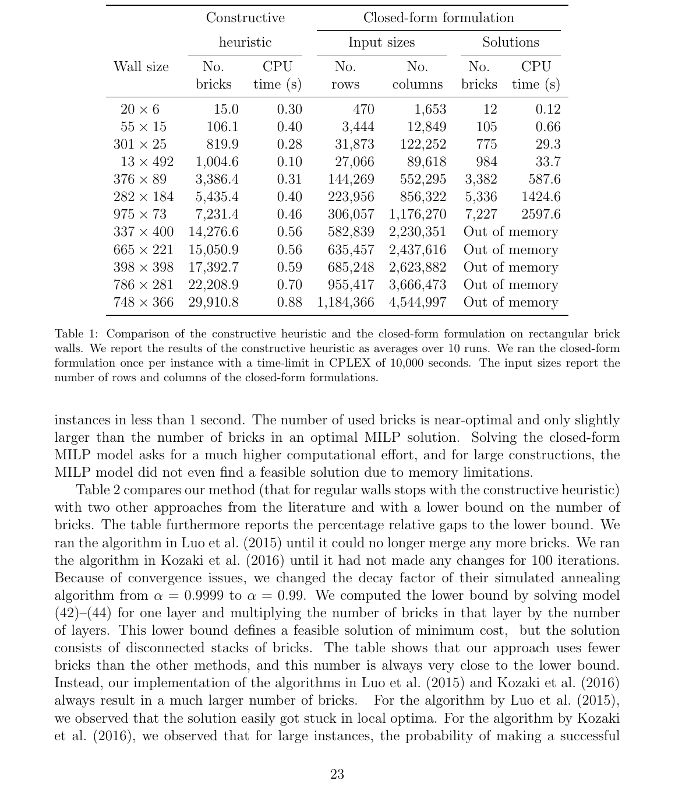

**Table 1.** Comparison of the constructive heuristic and the closed-form formulation on rectangular brick

walls. We report the results of the constructive heuristic as averages over 10 runs. We ran the closed-form formulation once per instance with a time-limit in CPLEX of 10,000 seconds. The input sizes report the number of rows and columns of the closed-form formulations. instances in less than 1 second. The number of used bricks is near-optimal and only slightly larger than the number of bricks in an optimal MILP solution. Solving the closed-form MILP model asks for a much higher computational effort, and for large constructions, the MILP model did not even find a feasible solution due to memory limitations.

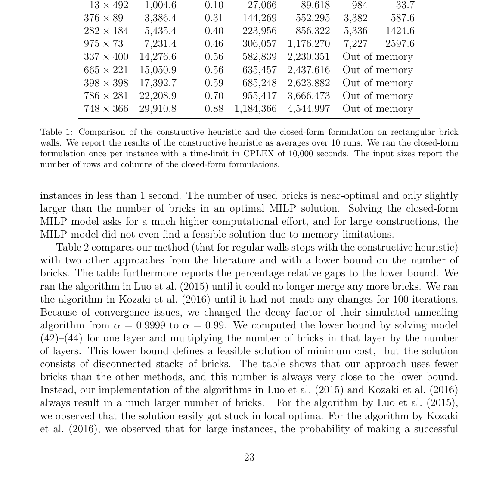

**Table 2.** compares our method (that for regular walls stops with the constructive heuristic)

with two other approaches from the literature and with a lower bound on the number of bricks. The table furthermore reports the percentage relative gaps to the lower bound. We ran the algorithm in Luo et al. (2015) until it could no longer merge any more bricks. We ran the algorithm in Kozaki et al. (2016) until it had not made any changes for 100 iterations. Because of convergence issues, we changed the decay factor of their simulated annealing

```text
algorithm from α = 0.9999 to α = 0.99. We computed the lower bound by solving model
```

(42)–(44) for one layer and multiplying the number of bricks in that layer by the number of layers. This lower bound defines a feasible solution of minimum cost, but the solution consists of disconnected stacks of bricks. The table shows that our approach uses fewer bricks than the other methods, and this number is always very close to the lower bound. Instead, our implementation of the algorithms in Luo et al. (2015) and Kozaki et al. (2016) always result in a much larger number of bricks. For the algorithm by Luo et al. (2015), we observed that the solution easily got stuck in local optima. For the algorithm by Kozaki et al. (2016), we observed that for large instances, the probability of making a successful 23

<!-- Page 25 -->

Lower Constructive Luo et al. Kozaki et al. bound heuristic (2015) (2016) Wall size No. No. Gap No. Gap No. Gap bricks bricks (%) bricks (%) bricks (%)

```text
20 × 6 12 15.0 20.00 23.6 49.2 17.3 30.6
55 × 15 105 106.1 1.04 158.2 33.6 135.7 22.6
301 × 25 775 819.9 5.48 1,362.9 43.1 1,196.0 35.2
13 × 492 984 1,004.6 2.05 1,323.6 25.7 1,288.5 23.6
376 × 89 3,382 3,386.4 0.13 6,055.5 44.1 5,513.0 38.7
282 × 184 5,336 5,435.4 1.83 9,386.9 43.2 8,839.5 39.6
975 × 73 7,227 7,231.4 0.06 12,797.9 43.5 10,973.7 34.1
337 × 400 14,000 14,276.6 1.94 24,331.5 42.5 22,336.6 37.3
665 × 221 15,028 15,050.9 0.15 26,487.4 43.3 29,312.0 48.7
398 × 398 15,920 17,392.7 8.47 28,635.2 44.4 26,697.6 40.4
786 × 281 22,199 22,208.9 0.04 39,770.9 44.2 63,021.3 64.8
748 × 366 27,450 29,910.8 8.23 49,283.2 44.3 114,407.8 76.0
```

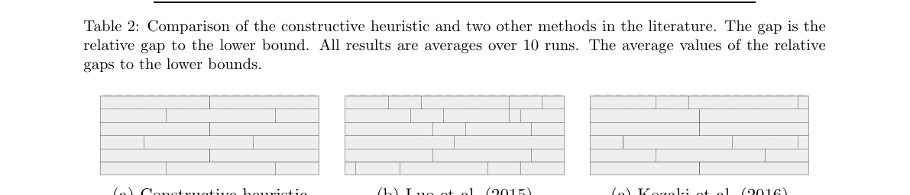

**Table 2.** Comparison of the constructive heuristic and two other methods in the literature. The gap is the

relative gap to the lower bound. All results are averages over 10 runs. The average values of the relative gaps to the lower bounds. (a) Constructive heuristic (b) Luo et al. (2015) (c) Kozaki et al. (2016)


**Figure 10.** Three solutions to a 20 × 6 wall using three different methods.

local search operation decreased significantly.

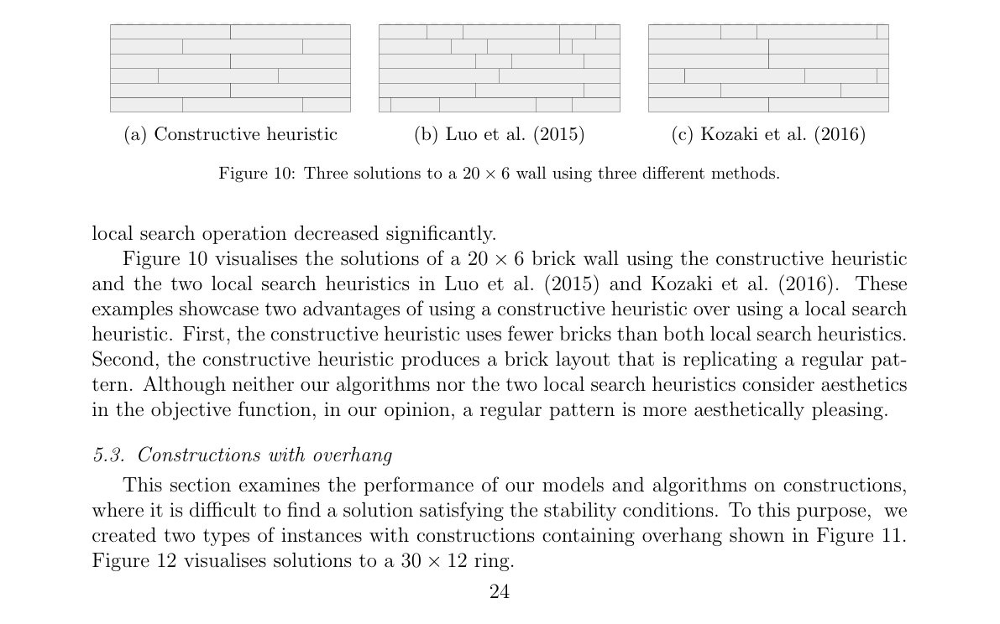

**Figure 10.** visualises the solutions of a 20 × 6 brick wall using the constructive heuristic

and the two local search heuristics in Luo et al. (2015) and Kozaki et al. (2016). These examples showcase two advantages of using a constructive heuristic over using a local search heuristic. First, the constructive heuristic uses fewer bricks than both local search heuristics. Second, the constructive heuristic produces a brick layout that is replicating a regular pattern. Although neither our algorithms nor the two local search heuristics consider aesthetics in the objective function, in our opinion, a regular pattern is more aesthetically pleasing.

### 5.3. Constructions with overhang

This section examines the performance of our models and algorithms on constructions, where it is difficult to find a solution satisfying the stability conditions. To this purpose, we created two types of instances with constructions containing overhang shown in Figure 11.

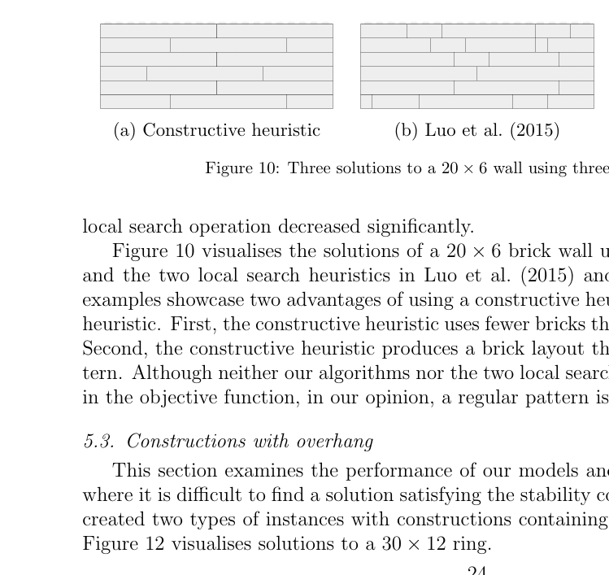

**Figure 12.** visualises solutions to a 30 × 12 ring.

24

<!-- Page 26 -->

```text
(a) Cantilever (20 × 6)
 (b) Ring (30 × 12)
```


**Figure 11.** Two constructions containing overhang. The black voxels define the boundary.

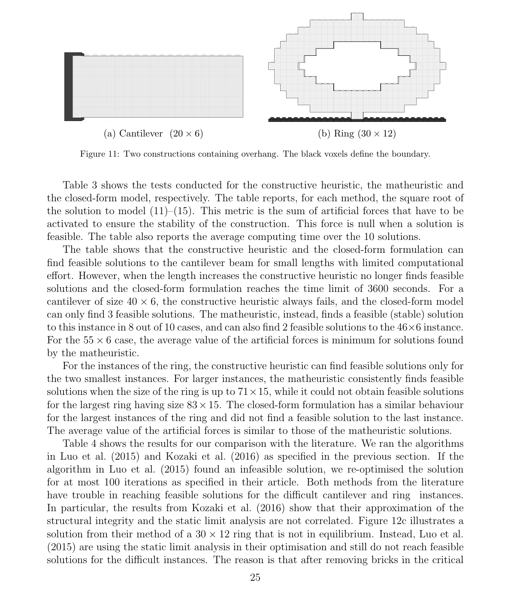

**Table 3.** shows the tests conducted for the constructive heuristic, the matheuristic and

the closed-form model, respectively. The table reports, for each method, the square root of the solution to model (11)–(15). This metric is the sum of artificial forces that have to be activated to ensure the stability of the construction. This force is null when a solution is feasible. The table also reports the average computing time over the 10 solutions. The table shows that the constructive heuristic and the closed-form formulation can find feasible solutions to the cantilever beam for small lengths with limited computational effort. However, when the length increases the constructive heuristic no longer finds feasible solutions and the closed-form formulation reaches the time limit of 3600 seconds. For a cantilever of size 40 × 6, the constructive heuristic always fails, and the closed-form model can only find 3 feasible solutions. The matheuristic, instead, finds a feasible (stable) solution to this instance in 8 out of 10 cases, and can also find 2 feasible solutions to the 46×6 instance. For the 55 × 6 case, the average value of the artificial forces is minimum for solutions found by the matheuristic. For the instances of the ring, the constructive heuristic can find feasible solutions only for the two smallest instances. For larger instances, the matheuristic consistently finds feasible solutions when the size of the ring is up to 71×15, while it could not obtain feasible solutions for the largest ring having size 83 ×15. The closed-form formulation has a similar behaviour for the largest instances of the ring and did not find a feasible solution to the last instance. The average value of the artificial forces is similar to those of the matheuristic solutions.


**Table 4.** shows the results for our comparison with the literature. We ran the algorithms

in Luo et al. (2015) and Kozaki et al. (2016) as specified in the previous section. If the algorithm in Luo et al. (2015) found an infeasible solution, we re-optimised the solution for at most 100 iterations as specified in their article. Both methods from the literature have trouble in reaching feasible solutions for the difficult cantilever and ring instances. In particular, the results from Kozaki et al. (2016) show that their approximation of the structural integrity and the static limit analysis are not correlated. Figure 12c illustrates a solution from their method of a 30 × 12 ring that is not in equilibrium. Instead, Luo et al. (2015) are using the static limit analysis in their optimisation and still do not reach feasible solutions for the difficult instances. The reason is that after removing bricks in the critical 25

<!-- Page 27 -->

Matheuristic Constructive heuristic Closed-form formulation

```text
Cantilever √q Feasible CPU √q Feasible CPU √q Feasible CPU
```

beam size (N) solution (s) (N) solution (s) (N) solution (s)

```text
24 × 6 0.0 10/10 0.38 18.6 7/10 0.23 0.0 10/10 0.32
30 × 6 0.0 10/10 0.29 0.0 10/10 0.26 0.0 10/10 0.12
37 × 6 0.0 10/10 106.3 305.9 0/10 0.25 0.0 10/10 19.5
40 × 6 32.9 8/10 131.1 198.0 0/10 0.26 261.6 3/10 3601
46 × 6 113.8 2/10 516.0 445.8 0/10 0.26 360.7 0/10 3601
55 × 6 492.4 0/10 555.7 855.7 0/10 0.36 1,196.7 0/10 3601
Ring size
30 × 15 0.0 10/10 0.39 0.0 10/10 0.36 0.0 10/10 6.1
36 × 15 0.0 10/10 0.48 5.9 9/10 0.36 0.0 10/10 5.5
52 × 15 0.0 10/10 12.0 231.5 0/10 0.24 0.0 10/10 228.0
60 × 15* 0.0 10/10 93,5 359.1 0/10 0.29 0.0 10/10 3601
71 × 15* 136.3 8/10 2005 1,114.8 0/10 0.34 350.5 6/10 3601
83 × 15* 1,632.4 0/10 6505 1,806.4 0/10 0.34 1,427.1 0/10 3601
```

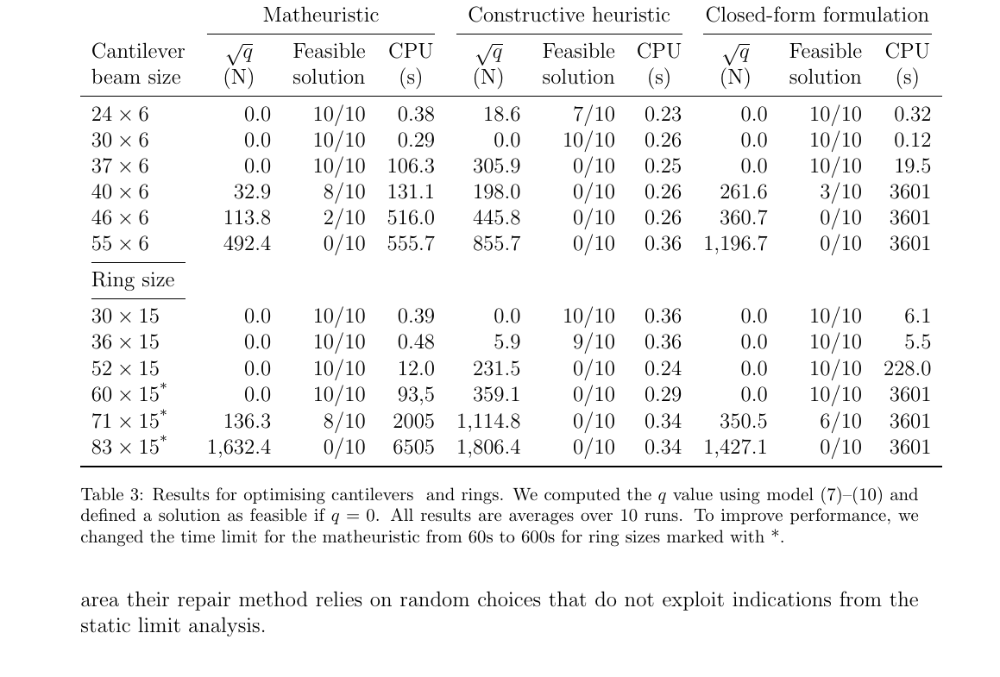

**Table 3.** Results for optimising cantilevers and rings. We computed the q value using model (7)–(10) and

```text
defined a solution as feasible if q = 0. All results are averages over 10 runs. To improve performance, we
```

changed the time limit for the matheuristic from 60s to 600s for ring sizes marked with *. area their repair method relies on random choices that do not exploit indications from the static limit analysis. 26

<!-- Page 28 -->

Matheuristic Luo et al. (2015) Kozaki et al. (2016)

```text
Cantilever √q Feasible √q Feasible √q Feasible
```

beam size (N) solution (N) solution (N) solution

```text
24 × 6 0.0 10/10 0.0 10/10 202.8 1/10
30 × 6 0.0 10/10 39.1 7/10 286.2 0/10
37 × 6 0.0 10/10 202.6 1/10 523.5 0/10
40 × 6 32.9 8/10 266.2 0/10 582.2 0/10
46 × 6 113.8 2/10 567.6 0/10 833.2 0/10
55 × 6 492.4 0/10 1,066.8 0/10 1,410.7 0/10
Ring size
30 × 15 0.0 10/10 0.0 10/10 875.9 0/10
36 × 15 0.0 10/10 0.0 10/10 561.5 0/10
52 × 15 0.0 10/10 78.9 1/10 1,409.4 0/10
60 × 15 0.0 10/10 244.3 3/10 2,009.4 0/10
71 × 15 136.3 8/10 1,167.0 0/10 3,282.3 0/10
83 × 15 1,632.4 0/10 3,114.3 0/10 4,740.8 0/10
```

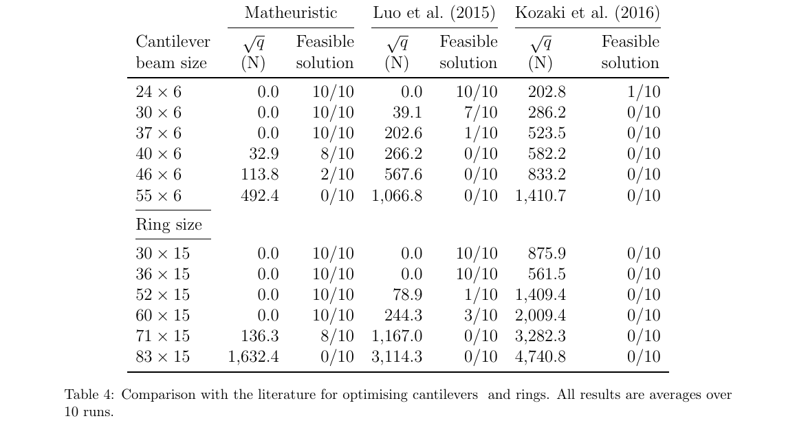

**Table 4.** Comparison with the literature for optimising cantilevers and rings. All results are averages over

## 10 runs.

(a) Matheuristic (b) Luo et al. (2015) (c) Kozaki et al. (2016)

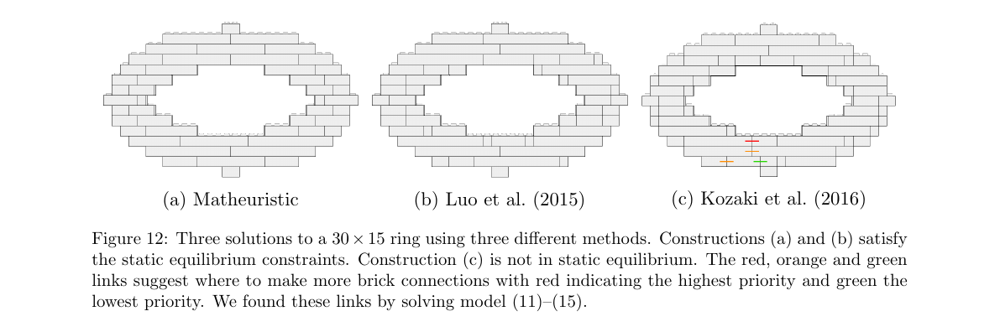

**Figure 12.** Three solutions to a 30 × 15 ring using three different methods. Constructions (a) and (b) satisfy

the static equilibrium constraints. Construction (c) is not in static equilibrium. The red, orange and green links suggest where to make more brick connections with red indicating the highest priority and green the lowest priority. We found these links by solving model (11)–(15). 27

<!-- Page 29 -->

### 5.4. Colour constraints and a limited set of available bricks

LEGO offers a wide range of coloured bricks. Colour constraints are thus a natural part of the LEGO construction problem. Furthermore, the set of available bricks depends on the colour. This section examines how our method handles colour constraints and in particular, how it handles a limited set of available bricks.

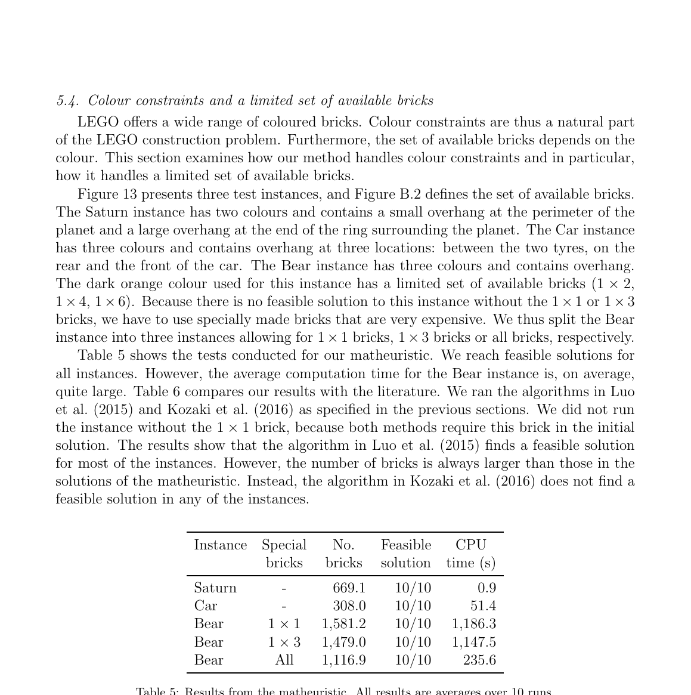

**Figure 13.** presents three test instances, and Figure B.2 defines the set of available bricks.

The Saturn instance has two colours and contains a small overhang at the perimeter of the planet and a large overhang at the end of the ring surrounding the planet. The Car instance has three colours and contains overhang at three locations: between the two tyres, on the rear and the front of the car. The Bear instance has three colours and contains overhang. The dark orange colour used for this instance has a limited set of available bricks (1 × 2, 1 × 4, 1 × 6). Because there is no feasible solution to this instance without the 1 × 1 or 1 × 3 bricks, we have to use specially made bricks that are very expensive. We thus split the Bear instance into three instances allowing for 1 × 1 bricks, 1 × 3 bricks or all bricks, respectively.

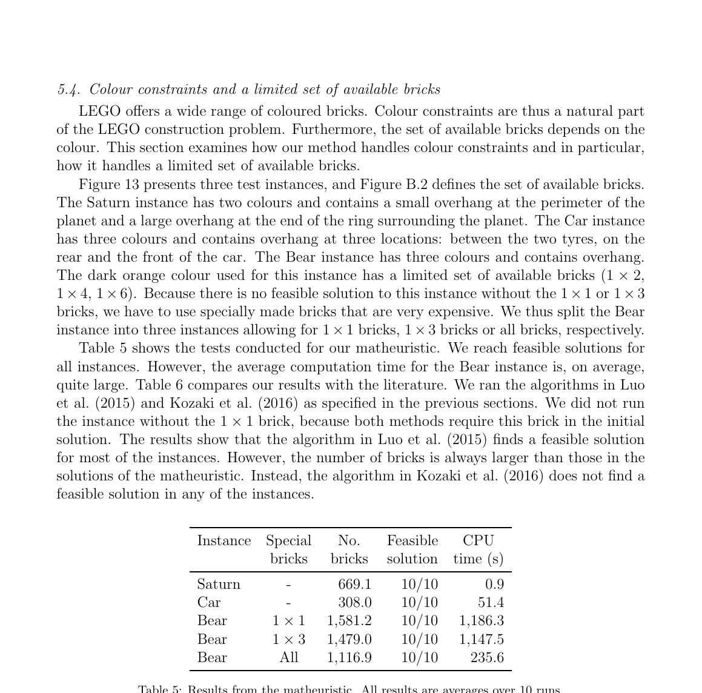

**Table 5.** shows the tests conducted for our matheuristic. We reach feasible solutions for

all instances. However, the average computation time for the Bear instance is, on average, quite large. Table 6 compares our results with the literature. We ran the algorithms in Luo et al. (2015) and Kozaki et al. (2016) as specified in the previous sections. We did not run the instance without the 1 × 1 brick, because both methods require this brick in the initial solution. The results show that the algorithm in Luo et al. (2015) finds a feasible solution for most of the instances. However, the number of bricks is always larger than those in the solutions of the matheuristic. Instead, the algorithm in Kozaki et al. (2016) does not find a feasible solution in any of the instances. Instance Special No. Feasible CPU bricks bricks solution time (s) Saturn - 669.1 10/10 0.9 Car - 308.0 10/10 51.4

```text
Bear 1 × 1 1,581.2 10/10 1,186.3
Bear 1 × 3 1,479.0 10/10 1,147.5
Bear All 1,116.9 10/10 235.6
```

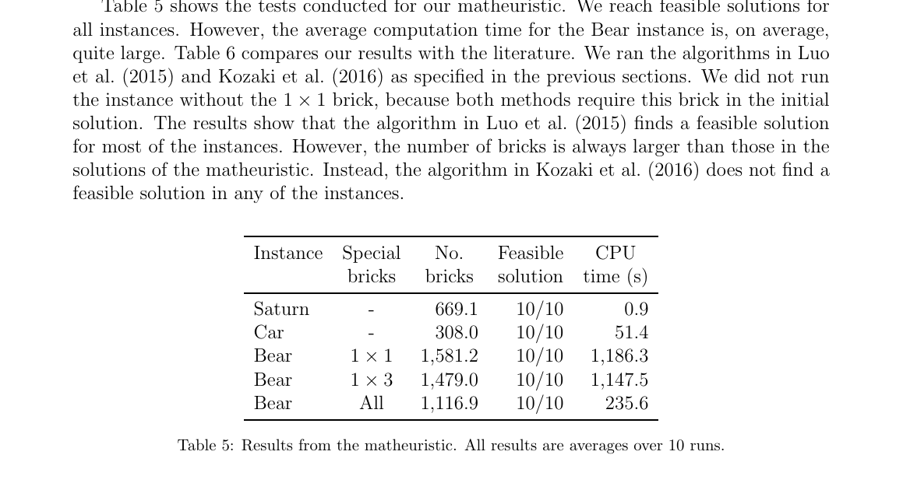

**Table 5.** Results from the matheuristic. All results are averages over 10 runs.

4For creating these instances, we used models from www.free3d.com as inspiration. 28

<!-- Page 30 -->

```text
(a) Saturn (107 × 67)
 (b) Car (98 × 31)
 (c) Bear (120 × 100)
```

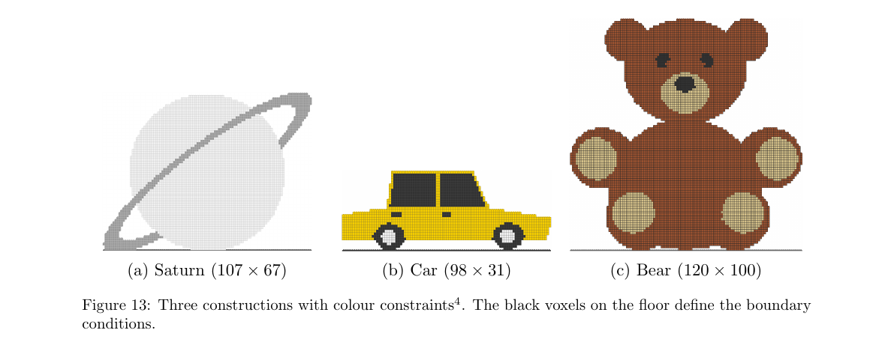

**Figure 13.** Three constructions with colour constraints 4. The black voxels on the floor define the boundary

conditions. Matheuristic Luo et al. (2015) Kozaki et al. (2016) Instance Special No. Feasible No. Feasible No. Feasible bricks bricks solution bricks solution bricks solution Saturn - 669.1 10/10 927.4 9/10 1,028.1 0/10 Car - 308.0 10/10 399.0 6/10 417.6 0/10

```text
Bear 1 × 1 1,581.2 10/10 2,451.5 5/10 1,746.9 0/10
Bear 1 × 3 1,479.0 10/10 n/a n/a n/a n/a
```

Bear All 1,116.9 10/10 1,550.3 9/10 1,779.3 0/10

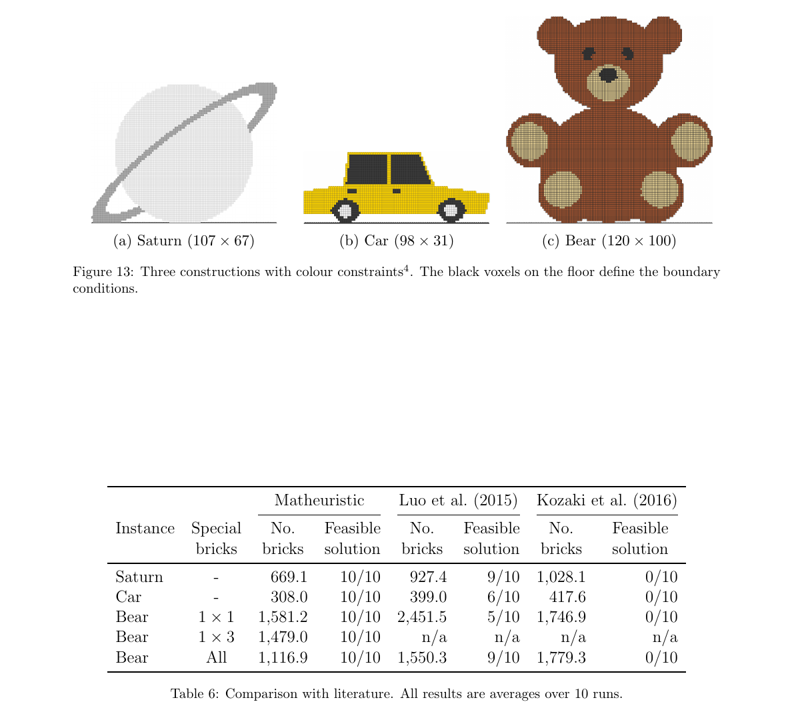

**Table 6.** Comparison with literature. All results are averages over 10 runs.

29

<!-- Page 31 -->

## 6. Concluding remarks

In this article, we have proposed an automated approach for optimising LEGO constructions, and in particular 2D brick constructions. We have introduced mathematical programming formulations of the problem that minimise the number of bricks subject to static equilibrium constraints, as well as a fast constructive heuristic algorithm that is very efficient for the construction of regular walls. We integrated these two alternative approaches into a matheuristic algorithm, where the constructive heuristic algorithm defines most of the construction, in particular, large elements that require regular patterns. After performing a static limit analysis, the mathematical model is used to tackle critical parts of the construction, and to ensure the overall stability of the construction. This way, we obtain the best of the two alternative approaches: fast computations and regular shapes for large parts of the construction, and the power (and computational cost) of mathematical programming formulations, when needed. To the best of our knowledge, this is the first contribution that tackles the LEGO construction problem through mathematical programming techniques and the first to consider the limitations in the shapes of available bricks explicitly. Computational experiments on regular and irregular constructions show the efficacy of the proposed algorithm when compared with two recent approaches from the literature. The experiments also showed that the proposed approach could define building solutions for regular and irregular 2D LEGO constructions with up-to 1,000 bricks in some minutes of computing time. Scalability of the matheuristic algorithm strictly relates to the presence of critical components, irregular shapes and overhangs. While the heuristic component of the algorithm scales linearly, and could easily solve regular walls of hundreds of thousands or even millions of bricks, the solution of hard optimisation models is limited to few hundreds of bricks. Although we have mainly focused on 2D brick constructions, most of the ideas described in this article apply or can be extended to the 3D case. However, when moving from 2D to 3D, scalability would be even further limited by the difficulty in solving optimisation models. Indeed, the number of brick placements and the forces to consider in the static equilibrium constraints grow very fast with the size of the construction. Future developments shall then consider the case of three-dimensional LEGO constructions in detail, to answer to these issues.

## Acknowledgements

This work is partly funded by the Innovation Fund Denmark (IFD) under File No. 5189- 00095A and partly funded by LEGO System A/S. The authors are grateful to Thomas Stidsen and Mathias Stolpe for several helpful discussions on stability, modelling and algorithmic issues, and to the anonymous referees for their comments that helped significantly improve the paper. 30

<!-- Page 32 -->

### Appendix A. The set of feasible brick placements

The set B defines all feasible brick placements. We generate these placements (and the associated variables) by using an algorithm that, for each voxel, enumerates all possible placements where a brick covers the voxel of the same colour with its left side, and the consecutive voxels on the right match the brick colour as well. Figure A.1 gives a simple example of how to find all possible placements (variables) for one layer of a brick wall. The algorithm generates 11 brick placement variables for this example.

```text
x1 +x4 +x6 = 1
x1 +x2 +x4 +x5 +x6 = 1
x2 +x3 +x4 +x5 +x6 = 1
x3 +x5 +x6 = 1
x7 = 1
x8 = 1
x9 +x11 = 1
x9 +x10 +x11 = 1
x10 +x11 = 1
x1,...,x 11 ∈ {0, 1}
(a) Voxelised design domain
(b) Available bricks
(c) Two feasible solutions
 (d) Brick placement variables
```

Figure A.1: An example of a simple 9 × 1 layout with colour constraints. Given the set of available bricks and the voxelised design domain, we generated 11 brick placement variables named x1,...,x 11. The setpartitioning model contains two feasible solutions. 31

<!-- Page 33 -->

### Appendix B. Set of available colours

Figure B.2 defines the set of available bricks used in this article. We retrieved this data set in 2019. Medium stone grey: Black: Bright yellow: Brick yellow: Dark orange:

```text
1 × 1 1 × 2 1 × 3 1 × 4 1 × 6 1 × 8 1 × 10
```

Figure B.2: The set of available LEGO bricks in various colours.

## References

Bonami, P., Lodi, A., Tramontani, A., and Wiese, S. (2015). On mathematical programming with indicator constraints. Mathematical Programming, 151, 191–223. de Castro Silva, J., Soma, N., and Maculan, N. (2003). A greedy search for the three-dimensional bin packing problem: the packing static stability case. International Transactions in Operational Research , 10, 141–153. Charon, I., and Hudry, O. (1993). The noising method: a new method for combinatorial optimization. Operations Research Letters, 14, 133–137. Chazelle, B. (1983). The bottomn-left bin-packing heuristic: An efficient implementation.IEEE Transactions on Computers , (pp. 697–707). Fleurent, C., and Glover, F. (1999). Improved constructive multistart strategies for the quadratic assignment problem using adaptive memory. INFORMS Journal on Computing , 11, 198–204. Gower, R., Heydtmann, A., and Petersen, H. (1998). LEGO: automated model construction. Study Group Report (32nd European Study Group with Industry). Hancock, D. (1990). Rules of bonding. In Brick Bonding: The Rules of Bonding and 100 + Advanced Craft Questions with Answers (pp. 1–32). Macmillan Education UK. Kim, J. W., Kang, K. K., and Lee, J. H. (2014). Survey on automated LEGO assembly construction. In WSCG 2014 Conference on Computer Graphics, Visualization and Computer Vision (pp. 89–96). Kollsker, T. (2020). Mathematical Models and Algorithms for Optimisation of the LEGO Construction Problem. Ph.D. thesis Technical University of Denmark. Kozaki, T., Tedenuma, H., and Maekawa, T. (2016). Automatic generation of LEGO building instructions from multiple photographic images of real objects. Computer-Aided Design , 70, 13–22. 32

<!-- Page 34 -->

Krenk, S., and Høgsberg, J. (2013). Statics and Mechanics of Structures . Springer Science and Business Media. Luo, S.-J., Yue, Y., Huang, C.-K., Chung, Y.-H., Imai, S., Nishita, T., and Chen, B.-Y. (2015). Legolization: optimizing LEGO designs. ACM Transactions on Graphics (TOG) , 34, 222. Maniezzo, V., St¨ utzle, T., and Voß, S. (2009).Matheuristics: Hybridizing Metaheuristics and Mathematical Programming. (1st ed.). Springer. de Queiroz, T. A., and Miyazawa, F. K. (2014). Order and static stability into the strip packing problem. Annals of Operations Research , 223, 137–154. Ramos, A. G., Oliveira, J. F., and Lopes, M. P. (2016). A physical packing sequence algorithm for the container loading problem with static mechanical equilibrium conditions. International Transactions in Operational Research, 23, 215–238. Shaw, P. (1998). Using constraint programming and local search methods to solve vehicle routing problems. In International Conference on Principles and Practice of Constraint Programming (pp. 417–431). Springer. W¨ ascher, G., Haußner, H., and Schumann, H. (2007). An improved typology of cutting and packing problems. European Journal of Operational Research , 183, 1109–1130. Waßmann, M., and Weicker, K. (2012). Maximum flow networks for stability analysis of LEGOR⃝ structures. In European Symposium on Algorithms (pp. 813–824). Springer. Whiting, E., Shin, H., Wang, R., Ochsendorf, J., and Durand, F. (2012). Structural optimization of 3D masonry buildings. ACM Transactions on Graphics (TOG) , 31, 159. van Zijl, L., and Smal, E. (2008). Cellular automata with cell clustering. In Automata (pp. 425–441). Zio lo, P., Kulesza, K., Skorski, M., Zaj¸ ac, M., Fr¸ aszczak, M., Bu lkowski, M., Lyczek, K., Piekart, P., Paj¸ ak, M., Kaczmarek, K., Klimek, A., Wi´ sniewska, J., Demidowski, T., and Ociepka, T. (2012).Extensive study of the LEGO construction problem . Technical Report (Centre for Industrial Applications of Mathematics and Systems Engineering, Warsaw, Poland). 33
