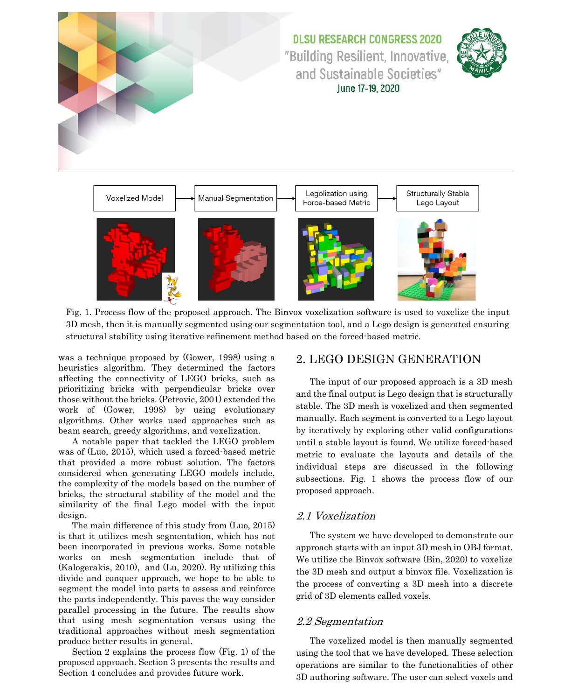
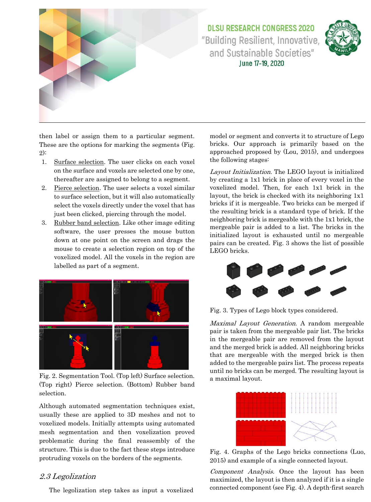
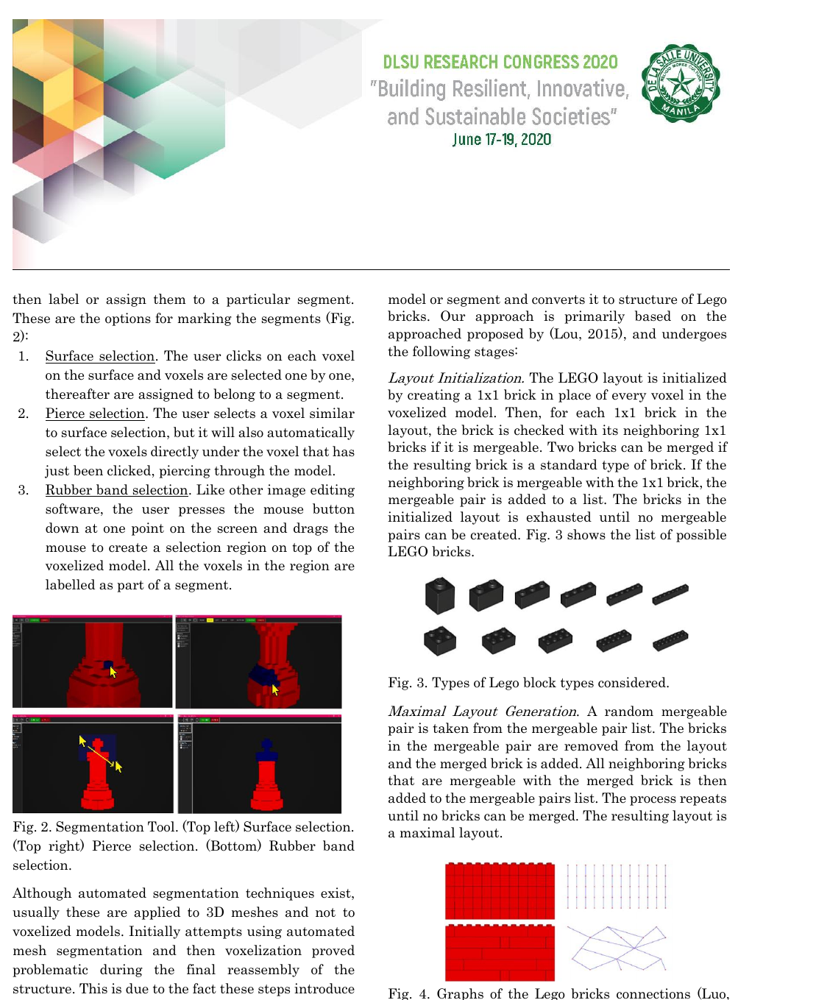
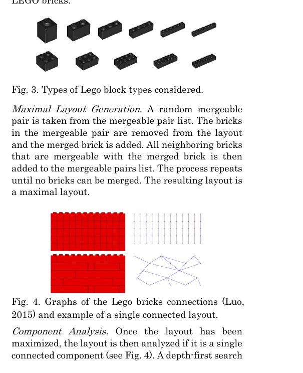
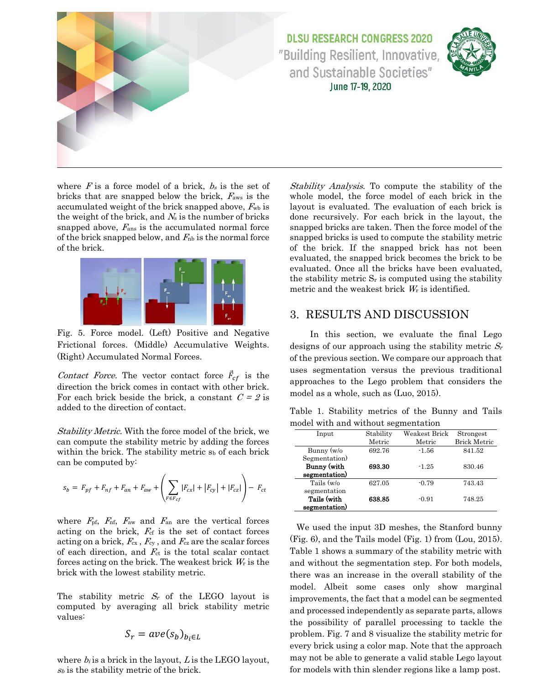
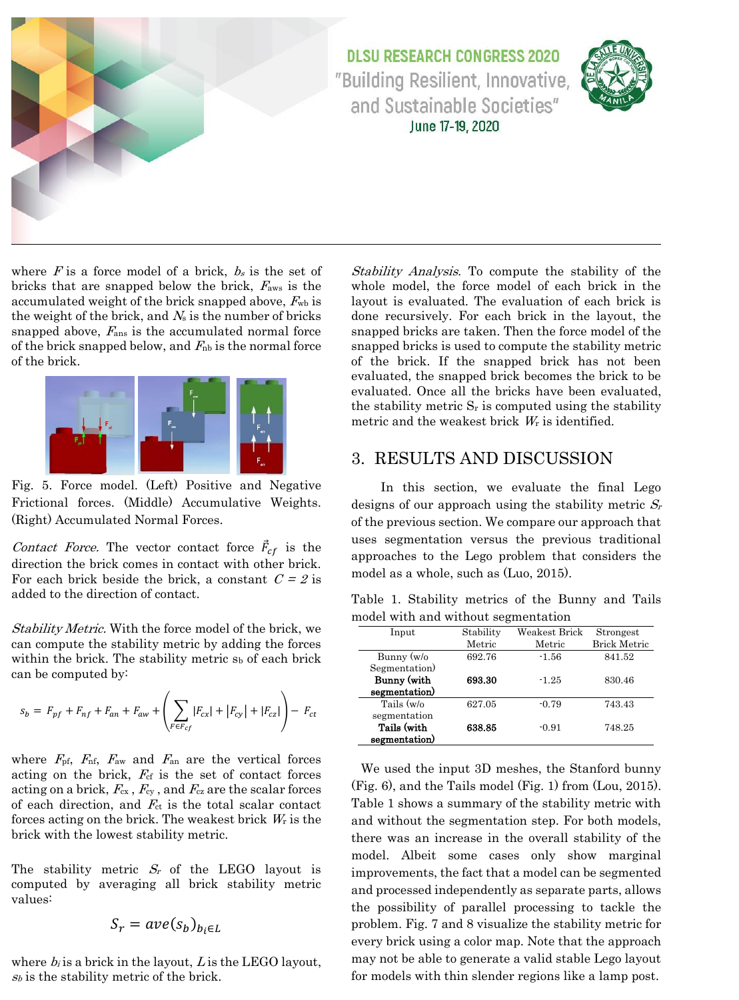
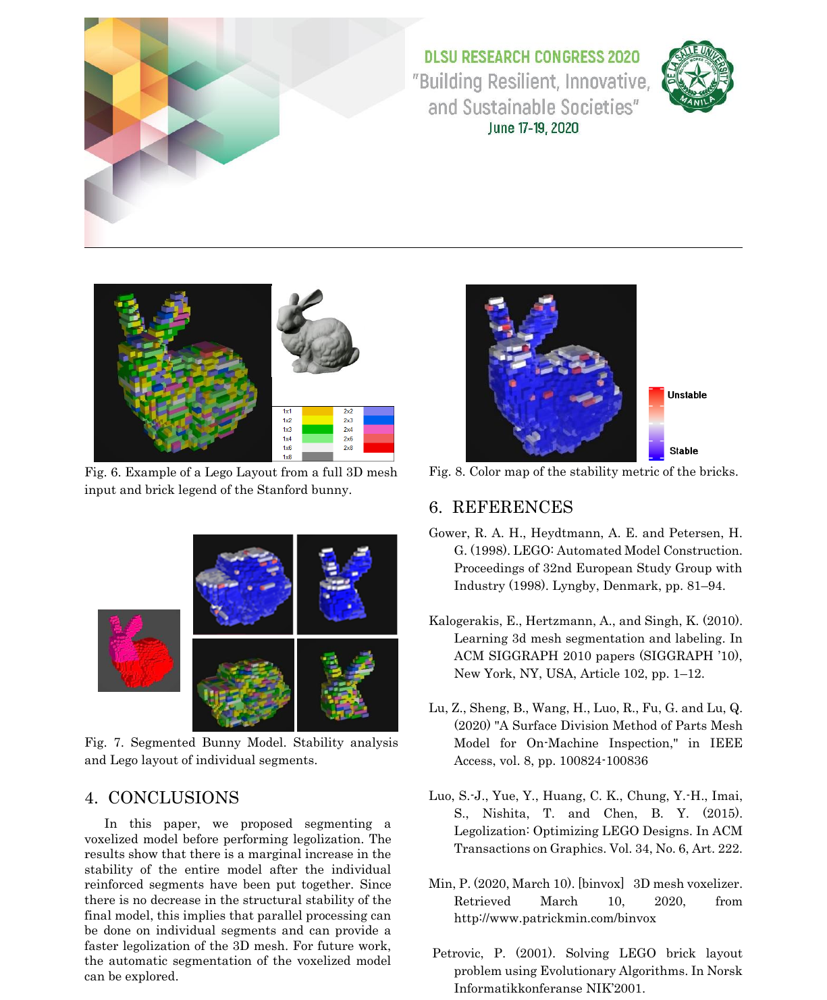

# Reinforcing LEGO Generated Models by Applying Force Based Metrics

Source PDF: `Reinforcing LEGO Generated Models by Applying Force Based Metrics.pdf`

Evidence bundle: `evidence/`

<!-- Page 1 -->

on Segmented Meshes Stephen B. Hsiao1, Clark Jason S. Kong1, Patrick Allen Q. Sy1, Conrado R. Ruiz Jr. 1,2,* and Jennifer Ureta1

## 1 College of Computer Studies, De La Salle University, Manila, Philippines

## 2 La Salle Campus, Universitat Ramon Llull, Barcelona, Spain

*Corresponding Author: conrado.ruiz@salle.url.edu

### Abstract: The LEGO problem is a well -studied problem that investigates how a 3D

model can be converted to a LEGO structure. Since the 1990s, several approaches have been proposed, such as using heuristics, evolutionary algorithms, beam search, and voxelization. Although these approaches produce acceptable results , usually the y do not consider the structural stability of the LEGO structure. In this paper, we adopt a force-based metric for evaluating the structural s tability of a LEGO design and apply it to segmented meshes. Previous approaches have not included a segmentation phase, we believe that this step will provide more insight into the structure of the model and that this divide-and-conquer approach will allow future work to utilize parallel processing. Our proposed system starts by voxelizing and segmenting the mesh , then each segment is evaluated based on the metric and iteratively refined by searching for a more stable configuration. We measure the stability metrics of the layout using an unsegmented full model, versus using segmentation first and then legolization of its parts. Results show t hat Lego desig ns that were generated with segmentation in general produce more stable layouts. Key Words: 3D mesh, Lego, segmentation, physical construction, force-based metrics

## 1. INTRODUCTION

LEGO bricks are interlocking plastic bricks that are primarily used by children to build simple models such as houses or make -shift objects. Representing objects using LEGO bricks also has applications in the construction and engineering industry which can be used for visualization and prototyping. Computationally, an i nteresting problem was proposed, exploring the possibility of automatically generating LEGO designs from 3D models. This is known as the LEGO problem (Grower, 199 8). The LEGO problem is primarily an optimization problem. Its goal is to find a way to generate a valid LEGO bricks model from a given digital 3D mesh. One of the first approaches to the LEGO problem

<!-- Page 2 -->

was a technique proposed by (Gower, 1998) using a heuristics algorithm. The y determined the factors affecting the connectivity of LEGO bricks, such as prioritizing bricks with perpendicular bricks over those without the bricks. (Petrovic, 2001) extended the work of (Gower, 1998) by using evolutionary algorithms. Other works used approaches such as beam search, greedy algorithms, and voxelization. A notable paper that tackled the LEGO problem was of (Luo, 2015), which used a forced -based metric that provided a more robust solution. The factors considered when generating LEGO models include, the complexity of the models based on the number of bricks, the structural stability of the model and the similarity of the final Lego model with the input design. The main difference of this study from (Luo, 2015) is that it utilizes mesh segmentation, which has not been incorporated in previous works . Some notable works on mesh segmentation include that of (Kalogerakis, 2010), and (Lu, 2020). By utilizing this divide and conquer approach, we hope to be able to segment the model into parts to assess and reinforce the parts independently. This paves the way consider parallel processing in the future . The results show that using mesh segmentation versus using the traditional approaches without mesh segmentation produce better results in general. Section 2 explains the process flow (Fig. 1) of the proposed approach. Section 3 presents the results and Section 4 concludes and provides future work.

## 2. LEGO DESIGN GENERATION

The input of our proposed approach is a 3D mesh and the final output is Lego design that is structurally stable. The 3D mesh is voxelized and then segmented manually. Each segment is converted to a Lego layout by iteratively by exploring other valid configurations until a stable layout is found. We utilize forced-based metric to evaluate the layouts and details of the individual steps are discus sed in the following subsections. Fig. 1 shows the process flow of our proposed approach.

### 2.1 Voxelization

The system we have developed to demonstrate our approach starts with an input 3D mesh in OBJ format. We utilize the Binvox software (Bin, 2020) to voxelize the 3D mesh and output a binvox file. Voxelization is the process of converting a 3D mesh into a discrete grid of 3D elements called voxels.

### 2.2 Segmentation

The voxelized model is then manually segmented using the tool that we have developed. These selection operations are similar to the functionalities of other 3D authoring software. The user can select voxels and



**Fig. 1..** Process flow of the proposed approach. The Binvox voxelization software is used to voxelize the input

3D mesh, then it is manually segmented using our segmentation tool, and a Lego design is generated ensuring structural stability using iterative refinement method based on the forced-based metric.

<!-- Page 3 -->

then label or assign them to a particular segment. These are the options for marking the segments (Fig. 2):

## 1. Surface selection. The user clicks on each voxel

on the surface and voxels are selected one by one, thereafter are assigned to belong to a segment.

## 2. Pierce selection. The user selects a voxel similar

to surface selection, but it will also automatically select the voxels directly under the voxel that has just been clicked, piercing through the model.

## 3. Rubber band selection. Like other image editing

software, the user presses the mouse button down at one point on the screen and drags the mouse to create a select ion region on top of the voxelized model. All the voxels in the region are labelled as part of a segment.



**Fig. 2..** Segmentation Tool. (Top left) Surface selection.

(Top right) Pierce selection. (Bottom) Rubber band selection. Although automated segmentation techniques exist, usually these are applied to 3D meshes and not to voxelized models. Initially attempts using automated mesh segmentation and then voxelization proved problematic during the final reassembly of the structure. This is due to the fact these steps introduce protruding voxels on the borders of the segments.

### 2.3 Legolization

The legolization step takes a s input a voxelized model or segment and converts it to structure of Lego bricks. Our approach is primarily based on the approached proposed by (Lou, 2015) , and undergoes the following stages: Layout Initialization. The LEGO layout is initialized by creating a 1x1 brick in place of every voxel in the voxelized model. Then, for each 1x1 brick in the layout, the brick is checked with its neighboring 1x1 bricks if it is mergeable. Two bricks can be merged if the resulting brick is a standard type of brick. If the neighboring brick is mergeable with the 1x1 brick, the mergeable pair is added to a list. The bricks in the initialized layout is exhausted until no mergeable pairs can be created. Fig. 3 shows the list of possible LEGO bricks.



**Fig. 3..** Types of Lego block types considered.

Maximal Layout Generation . A random mergeable pair is taken from the mergeable pair list. The bricks in the mergeable pair are removed from the layout and the merged brick is added. All neighboring bricks that are merg eable with the merged brick is then added to the mergeable pairs list. The process repeats until no bricks can be merged. The resulting layout is a maximal layout.



**Fig. 4..** Graphs of the Lego bricks connections (Luo,

2015) and example of a single connected layout. Component Analysis. Once the layout has been maximized, the layout is then analyzed if it is a single connected component (see Fig. 4). A depth-first search

<!-- Page 4 -->

algorithm is used to count the number of graphs in the LEGO layout. The number of graphs in the layout becomes the structure metric Si of the layout. The critical portion brick Wi is randomly picked from a

```text
probability p i = n i / ∑nj, where n i is the number of
distinct components in each brick, and ∑nj is the total
```

number of distinct components from each brick in the layout. Generate Single Connected Component. To generate a single connected component, the layout is reconfigured until there is only a single graph connecting all the bricks in the layout. The current layout is first analyzed using the component analysis algorithm. If the structure metric Sl is more than 1, the layout goes through a reconfiguration loop. The layout is reconfigured, based on its critical portion Wl. Then the reconfigured layout is analyzed for its structure metric and critical portion. If the structure metric of the reconfigured layout is lower than the current layout, the reconfigured layout is now the current layout and the fail count is reset. Otherwise, the fail count f is increased. This pr ocess continues until the resulting layout’s structure metric is 1 or the fail count f reaches fMAX . If it reaches fMAX , a valid Lego layout cannot be generated, and the input model may have floating parts. Layout Reconfiguration. Given the evaluated structure metric and critical portion of the layout, the reconfiguration region Nk(Wl) is defined as the union of Wl and its k-ring neighbors. The 1-ring neighbors are the adjacent bricks in all directions , and k-ring neighbors of a brick are then defined as the union of (k-1) -ring neighbors of a brick and their neighbors. N is then used as a region for local reconfiguration on the algorithm.

### 2.4 Stability Aware Refinement

The stability-aware refinement algorithm used in this paper is also based on (Luo, 2015)'s algorithm. The algorithm iteratively reconfigures the layout until the LEGO layout is deemed stable. First, the current layout is analyzed using the stability analysis algorithm. Once, the stabili ty metric Sr and weakest brick Wr is identified, the layout is reconfigured by exploring other possible valid brick configurations on the region around the weakest brick. If the value of the lowest brick stability metric in the layout is less than 0, the layout goes through a refinement loop. The layout is then reconfigured on the weakest brick region. If the reconfigured layout is not a single connected layout, the fail count is increased, and the layout is reconfigured again. If the reconfigured layout successfully created a single connected layout, the reconfigured layout will be analyzed by the stability analysis algorithm. If the stability metric of the reconfigured layout is more tha n the current layout, the reconfigured layout is now the current layout and the fail count is reset; else, the fail count f is increased, and the current layout is reconfigured again. This process continues until the lowest stability metric of the layout is more than 0 or the fail count reaches fMAX, which we set to 80.

### 2.5 Forced-based Metric

The force model we have utilized is also adapted based on the formulation of (Lu o, 2015) , as well as most of the value s of the constants . There is a set of forces that work in all direction of the brick and these are as follows: Frictional Forces. The positive frictional force (Fpf) is and negative frictional forces (Fnf ) are computed as: 𝐹𝑝𝑓 = ∑ (𝑇 − 𝑤𝑏) 𝑁𝑠𝐹∈𝑏𝑠 𝑎𝑛𝑑 𝐹𝑛𝑓 = ∑ 𝑁𝑘 × 𝑁𝑝 × −𝐹𝑎𝑛 𝑁𝑠𝐹∈𝑏𝑠 where F is a force model of a brick, b s is the set of bricks snapped above the brick, T is the maximum friction load, wb is the weight of the brick , Ns is the number of bricks that are snapped above , Nk is the number of connected knobs on the cavity of the brick, Np is the number of contact points on each cavity, Fan is the negative accumulated normal forces of the snapped brick below. Accumulated Weight and Forces . The accumulated weight Faw and accumulated normal forces Fan are computed as: 𝐹𝑎𝑤 = ∑ 𝐹𝑎𝑤𝑠×𝐹𝑤𝑏 𝑁𝑠𝐹∈𝑏𝑠 𝑎𝑛𝑑 𝐹𝑎𝑛 = ∑ 𝐹𝑎𝑛𝑠×𝐹𝑛𝑏 𝑁𝑠𝐹∈𝑏𝑠

<!-- Page 5 -->

where F is a force model of a brick, bs is the set of bricks that are snapped below the brick, Faws is the accumulated weight of the brick snapped above, Fwb is the weight of the brick, and Ns is the number of bricks snapped above, Fans is the accumulated normal force of the brick snapped below, and Fnb is the normal force of the brick.



**Fig. 5..** Force model. (Left) Positive and Negative

Frictional forces. (Middle) Accumulative Weights. (Right) Accumulated Normal Forces. Contact Force. The vector contact force 𝐹⃗𝑐𝑓 is the direction the brick comes in contact with other brick.

```text
For each brick beside the brick, a constant C = 2 is
added to the direction of contact.
```

Stability Metric. With the force model of the brick, we can compute the stability metric by adding the forces within the brick. The stability metric s b of each brick can be computed by: 𝑠𝑏 = 𝐹𝑝𝑓 + 𝐹𝑛𝑓 + 𝐹𝑎𝑛 + 𝐹𝑎𝑤 + ( ∑ |𝐹𝑐𝑥| + |𝐹𝑐𝑦| + |𝐹𝑐𝑧| 𝐹∈𝐹𝑐𝑓 ) − 𝐹𝑐𝑡 where Fpf, Fnf, Faw and Fan are the vertical forces acting on the brick, Fcf is the set of contact forces acting on a brick, Fcx , Fcy , and Fcz are the scalar forces of each direction, and Fct is the total scalar contact forces acting on the brick. The weakest brick Wr is the brick with the lowest stability metric. The stability metric Sr of the LEGO layout is computed by averaging all brick stability metric values: 𝑆𝑟 = 𝑎𝑣𝑒(𝑠𝑏)𝑏𝑖∈𝐿 where bi is a brick in the layout, L is the LEGO layout, sb is the stability metric of the brick. Stability Analysis . To compute the stability of the whole model, the force model of each brick in the layout is evaluated. The evaluation of each brick is done recursively. For each brick in the layout, the snapped bricks are taken. Then the force model of the snapped bricks is used to compute the stability metric of the brick. If the snapped brick has not been evaluated, the snapped brick becomes the brick to be evaluated. Once all the bricks have been evalu ated, the stability metric Sr is computed using the stability metric and the weakest brick Wr is identified.

## 3. RESULTS AND DISCUSSION

In this section, we evaluate the final Lego designs of our approach using the stability metric Sr of the previous section. We compare our approach that uses segmentation versus the previous traditional approaches to the Lego problem that considers the model as a whole, such as (Luo, 2015).



**Table 1..** Stability metrics of the Bunny and Tails

model with and without segmentation

```text
Input Stability
Metric
Weakest Brick
Metric
Strongest
 Brick Metric
Bunny (w/o
Segmentation)
692.76 -1.56 841.52
Bunny (with
segmentation)
693.30 -1.25 830.46
Tails (w/o
segmentation
627.05 -0.79 743.43
Tails (with
segmentation)
638.85 -0.91 748.25
```

We used the input 3D meshes, the Stanford bunny (Fig. 6), and the Tails model (Fig. 1) from (Lou, 2015).

**Table 1.** shows a summary of the stability metric with

and without the segmentation step. For both models, there was an increase in the overall stability of the model. Albeit some cases only show marginal improvements, the fact that a model can be segmented and processed independently as separate parts, allows the possibility of parallel processing to tackle the problem. Fig. 7 and 8 visualize the stability metric for every brick using a color map. Note that the approach may not be able to generate a valid stable Lego layout for models with thin slender regions like a lamp post.

<!-- Page 6 -->


**Fig. 6..** Example of a Lego Layout from a full 3D mesh

```text
input and brick legend of the Stanford bunny.
```



**Fig. 7..** Segmented Bunny Model. Stability analysis

and Lego layout of individual segments.

## 4. CONCLUSIONS

In this paper, we proposed segmenting a voxelized model before performing l egolization. The results show that there is a marginal increase in the stability of the entire model after the individual reinforced segments have been put together. Since there is no decrease in the structural stability of the final model, this implies that parallel processing can be done on individual segments and can provide a faster legolization of the 3D mesh. For future work, the automatic segmentation of the voxelized model can be explored.

**Fig. 8..** Color map of the stability metric of the bricks.

## 6. REFERENCES

Gower, R. A. H., Heydtmann, A. E. and Petersen, H. G. (1998). LEGO: Automated Model Construction. Proceedings of 32nd European Study Group with Industry (1998). Lyngby, Denmark, pp. 81–94. Kalogerakis, E., Hertzmann, A., and Singh, K. (2010). Learning 3d mesh segmentation and labeling. In ACM SIGGRAPH 2010 papers (SIGGRAPH ’10), New York, NY, USA, Article 102, pp. 1–12. Lu, Z., Sheng, B., Wang, H., Luo, R., Fu, G. and Lu, Q. (2020) "A Surface Division Method of Parts Mesh Model for On -Machine Inspection," in IEEE Access, vol. 8, pp. 100824-100836 Luo, S.-J., Yue, Y., Huang, C. K., Chung, Y. -H., Imai, S., Nishita, T. and Chen, B. Y. (2015). Legolization: Optimizing LEGO Designs. In ACM Transactions on Graphics. Vol. 34, No. 6, Art. 222. Min, P. (2020, March 10). [binvox] 3D mesh voxelizer. Retrieved March 10, 20 20, from http://www.patrickmin.com/binvox Petrovic, P. (2001). Solving LEGO brick layout problem using Evolutionary Algorithms. In Norsk Informatikkonferanse NIK’2001.
