# Split-and-Merge-Based Genetic Algorithm (SM-GA) for LEGO Brick Sculpture Optimization | IEEE Journals & Magazine | IEEE Xplore

Source PDF: `Split-and-Merge-Based Genetic Algorithm (SM-GA) for LEGO Brick Sculpture Optimization _ IEEE Journals & Magazine _ IEEE Xplore.pdf`

Evidence bundle: `evidence/`

<!-- Page 1 -->

```text
Journals & Magazines >IEEE Access >Volume: 6
```

Split-and-Merge-Based Genetic Algorithm (SM-GA) for LEGO Brick SculptureOptimization Publisher: IEEECite This PDF Seung-Mok Lee ; Jae Woo Kim; Hyun Myung All Authors 11Cites inPapers 1Cites inPatent 1285FullText Views Open AccessComment(s)      Abstract:This paper proposes a split-and-merge-based genetic algorithm (SM-GA) for converting a given 3-D voxel model intoan LEGO brick sculpture using a minimal number of bricks. The proposed SM-GA is designed to always generate a feasible brick layout in accordance with a given voxel model considering the stability and connectivity between layouts.A novel split-and-merge operator to find the optimal layout is also proposed. To evaluate the effectiveness of the proposed approach, computational and physical experiments are performed. In the computational experiments, theperformance of the proposed approach is compared with that of the most recent conventional GA approach. Also, the result of a 3-D physical sculpture made of real LEGO bricks is presented. Compared with the conventional GA-basedapproach, it is shown that the proposed SM-GA is more effective in finding the near optimal solution to the LEGO brick layout problem.  This figure shows a flowchart describing the overall process including the Split-and-Merge-based Genetic Algorithm (SM-GA) to obtain a 3D LEGO brick sculpture. Published in: IEEE Access ( Volume: 6) Page(s): 40429 - 40438 Date of Publication: 25 July 2018  Electronic ISSN: 2169-3536 DOI: 10.1109/ACCESS.2018.2859039 Publisher: IEEE Funding Agency: SECTION I. PDF Help 7/22/25, 5:03 PM Split-and-Merge-Based Genetic Algorithm (SM-GA) for LEGO Brick Sculpture Optimization | IEEE Journals & Magazine | IEEE Xplore https://ieeexplore.ieee.org/

## abstract

/document/8419684 1/16

<!-- Page 2 -->

Introduction LEGO is one of the most popular toys in the world. Various kinds of LEGO bricks can be assembled in many ways to construct such objects as sculptures, buildings, and vehicles. It is, however, very difficult for ordinaryusers to assemble a desired sculpture without instructions. To create a desired brick sculpture, the stability and connectivity between layers should be considered and the bricks also should be assembled compactly. Inthis light, there is a demand for a software program that automatically generates an assembly manual to users for a given model [1]– [5]. Generally, the software program performs the processes of approximating a real-world model into a polygonal model and transforming the polygonal model into a voxel model. Conventional approachesdivide the voxel model into horizontal 2D layers. The LEGO brick construction problem then simplifies to a series of brick layout problems. The solution to each layer can be stacked together togenerate a final LEGO brick sculpture. In this process, the algorithm should provide a feasible solution to each layout. The feasible solution means that there is no conflict between bricks. Also, all filled voxels shouldbe replaced with bricks, and the empty voxel does not have any bricks. This paper proposes a novel split-and-merge-based genetic algorithm (SM-GA) to create a stable sculpture made of LEGO bricks. To improve the performance of the GA, we propose a new chromosomerepresentation, its initialization method, and a new fitness function considering the connectivity and stability of sculptures. A novel split-and-merge operator is also proposed to effectively reduce the number of bricksand eventually to find a near optimal solution. The proposed SM-GA is designed to always produce feasible solutions in accordance with a given voxel model; i.e., the proposed genetic operators such as crossoverand split-and-merge operator always make the solutions feasible during the whole process of the algorithm. To evaluate the effectiveness of the proposed approach, computational and physical experiments areperformed. In the computational experiments, the performance of the proposed SM-GA approach is compared with that of the conventional GA approach proposed in [6]. Also, the results of the physicalexperiments are presented. A preliminary version of this paper was presented in [7] with only a simulation result for a single layer. This paper provides more detailed description of the proposed split-and-merge mutation operator withrigorous analysis. This paper also provides a new fitness function with a necessary condition for the weight coefficients to minimize the number of bricks as the number of generation increases. The rest of this paper is organized as follows. Section II reviews the previous approaches to LEGO brick construction problem, and Section III presents the description of the LEGO brick layout problem. SectionIV describes the details of the proposed SM-GA to provide an assembly manual to users, and Section V presents simulation results and shows actual sculptures from the produced manual. Finally, conclusions arepresented in Section VI. 3D 3D3D3D 3D2D3D 3D 2D 3D SECTION II. Related Works To deal with the brick layout problem, greedy algorithm-based approaches were proposed in [8] and [9]. Inthe proposed approaches, each voxel is filled with a unit brick and then the bricks are merged into larger bricks using a greedy approach. The key drawback of the greedy algorithm-based approaches is that thestability of the whole sculpture is not considered because the fitness is evaluated for each brick individually by considering only its size and connectivity with the bricks directly connected to it. Some researchers have studied the possibility of applying evolutionary algorithms (EAs) to solve the bricklayout problem because they are very effective for combinatorial optimization problems [4], [6], [7], [10]– [13]. The genetic algorithm (GA)-based method proposed by Petrovic [6] is the most recently developed EAto solve the LEGO brick layout problem. The proposed GA is advantageous for enhancing the sculpture stability because each chromosome represents the overall brick placement for each layer. Thus, the fitness is PDF Help 7/22/25, 5:03 PM Split-and-Merge-Based Genetic Algorithm (SM-GA) for LEGO Brick Sculpture Optimization | IEEE Journals & Magazine | IEEE Xplore https://ieeexplore.ieee.org/

## abstract

/document/8419684 2/16

<!-- Page 3 -->

evaluated for each layer, not for each brick. However, the crossover and mutation operators proposed in the conventional GA [6] are not effective in improving the fitness of the chromosomes because the operatorssometimes increase the number of bricks in the layout or produce infeasible brick layouts during the GA’s evolutionary process. An EA combined with a randomized greedy algorithm was also proposed in [4]. The initial brick layoutsolutions are generated by the randomized greedy algorithm, and the initial solutions are improved by the evolutionary process. During this process, the fitness is evaluated by considering only the number of bricksused in constructing LEGO sculpture and the number of bricks connected with upper and lower layers. A cellular automata (CA) approach with a cell clustering operation was presented in [3]. The proposed cell clustering operation is to combine small bricks into a larger brick with substantially less memory andexecution time. 3D SECTION III. Problem Description The general procedure of automatic brick sculpture generation is as follows: step 1) produce a polygonal model for a given structure; step 2) transform the polygonal model into a voxel model for each layer; step3) represent the voxel model by a brick sculpture and produce an assembly manual for each layer. The tasks of step 1) and step 2) can be easily done by polygon voxelization and ray-tracing algorithms [1], [8], [14].However, step 3) is not easy to handle because it is a combinatorial optimization problem in which the stability of the sculpture should be taken into account while using the least number of bricks. This problem isdefined as the brick layout problem throughout this paper. Although it appears to be simple, the brick layout problem is, in fact, quite complicated because the solution to the problem should maintain the stability andconnectivity using a minimal number of bricks [15]. If the model size is sufficiently large, then a large number of bricks are required, because its interior space should be filled with the bricks. It takes too much time and effort for assembling the model. Thus, it requires aprocess that deletes voxels in the interior space for saving the bricks. The thickness of the shell should remain properly to keep the stability of the sculpture, considering its size. In fact, if the interior space of the model is fully occupied by voxels, it is easy to ensure both the connectivityof bricks and the stability of the whole sculpture. Thus, the problem can be solved easily. If the model has a hollow space, however, it is difficult to ensure the stability because the connectivity between layers becomesloose. Therefore, there is a need to find a series of optimal brick layouts, considering the overall stability of the LEGO sculpture and connectivity between layers. Finally, the brick layout problem can be summarized as follows: find a series of 2D brick layouts, which can guarantee the stability over the sculpture, considering the connectivity between layers that has a hollowspace with the least number of bricks. The solution also should be provided within a reasonable time. 3D3D 2D 3D SECTION IV. The Proposed Split-and-Merge-BasedGenetic Algorithm (SM-GA) This section proposes a novel SM-GA to deal with the brick layout problem. The overall process to obtain a stable LEGO brick sculpture can be summarized as follows: divide a given voxel model into multiplelayers, which are represented by voxel layouts. After that, perform the proposed SM-GA for each layer. The proposed SM-GA finds an optimized brick layout, considering the connectivity with its lower layer. Byrepeating this process layer-by-layer, from bottom to top layer, the voxel model can be transformed into a stable sculpture composed of LEGO bricks. Fig. 1 shows a flowchart describing the overall process 3D2D 3D PDF Help 7/22/25, 5:03 PM Split-and-Merge-Based Genetic Algorithm (SM-GA) for LEGO Brick Sculpture Optimization | IEEE Journals & Magazine | IEEE Xplore https://ieeexplore.ieee.org/

## abstract

/document/8419684 3/16

<!-- Page 4 -->

including the SM-GA to obtain a LEGO brick sculpture. The proposed SM-GA introduces several new schemes to improve the performance of the conventional GA proposed in [6]. The details are given in thefollowing subsections.

### A. Chromosome Representation Scheme

We let a chromosome (i.e., candidate solution) contain the brick information for each layer. Each bricklayout is encoded by an unordered list of quadruplets , where is the position of the upperleft corner of a brick and is the dimension of available brick with rows and columns. Fig. 2shows several brick types used in this paper. These are the standard LEGO brick types, which have the same brick height. Consequently, each layer can be represented by a list of quadruples.

### B. Initialization From Voxel Layout

3D

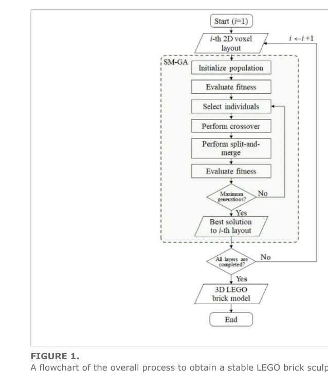

**FIGURE 1.A.** flowchart of the overall process to obtain a stable LEGO brick sculpture.



```text
(x,y,m,n) (x,y)(m×n) m n
```

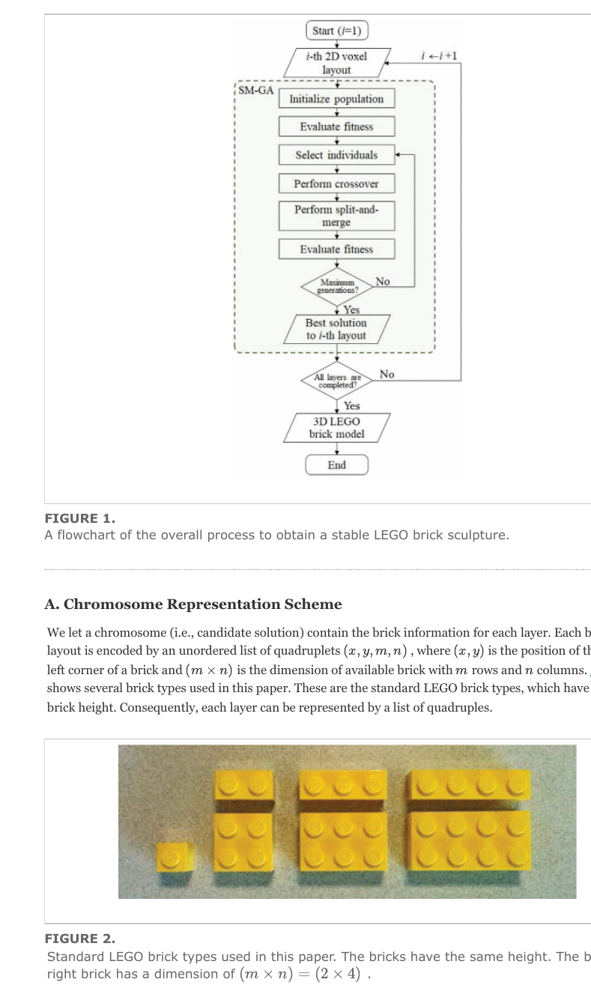

**FIGURE 2.Standard.** LEGO brick types used in this paper. The bricks have the same height. The bottomright brick has a dimension of .



```text
(m×n)=(2×4)
2D
PDF
Help
```

7/22/25, 5:03 PM Split-and-Merge-Based Genetic Algorithm (SM-GA) for LEGO Brick Sculpture Optimization | IEEE Journals & Magazine | IEEE Xplore https://ieeexplore.ieee.org/

## abstract

/document/8419684 4/16

<!-- Page 5 -->

The initial population is randomly generated. Given a voxel layout, each chromosome is initialized by the following procedure: Step 1: Randomly select a location that is not yet covered by other bricks, and choose a certain direction(i.e., from top to bottom and left to right). Step 2: Select one of the bricks that can be inserted at this location, with a larger brick having higherprobability to be selected. The selection probability of brick is defined as View Source where and are the numbers of rows and columns of brick , respectively; and is the set of the bricks that can be inserted at the location. Step 3: Repeat Step 1 and Step 2 until all voxels are covered by bricks. This initialization method can always provide feasible solutions, which correspond to the given voxellayout.

## C. Evaluation and Selection

```text
For the connectivity and stability of the  model, most of the previous works [6], [8], [14], [16] designedthe fitness function based on the following factors: (1) the use of the minimum number of bricks; (2)
```

maximizing overlap area of each brick with other bricks in the layers above and below; (3) alternatingdirectionality of the bricks in successive layers. In this paper, the fitness function is designed to evaluate the fitness of each layer by referring to the three factors as follows: View Source where is the number of all bricks in the current layer; is the number of bricks in the lower layer that is connected to the brick; and is the number of bricks that cover the lower layer perpendicularly. The bricksare perpendicular each other if a pair of bricks has opposite directions, i.e., one brick has a vertical direction ( ) and the other brick has a horizontal direction ( ). Only bricks of rectangular types cancontribute to the variable . Generally, a smaller value of and larger values of and improve the stability of the LEGO brick sculpture, as reported in [6] and [16]. Thus, the fitness function (2) is designedto minimize and maximize and . , , and are the positive weight coefficients for the three variables, respectively.

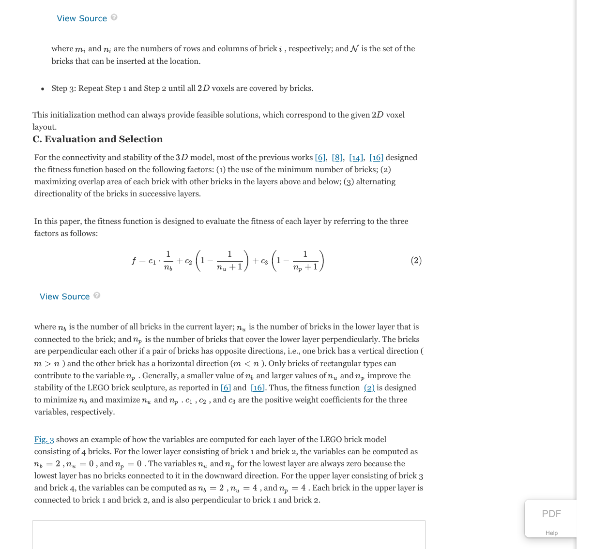

**Fig. 3.** shows an example of how the variables are computed for each layer of the LEGO brick modelconsisting of 4 bricks. For the lower layer consisting of brick 1 and brick 2, the variables can be computed as

, , and . The variables and for the lowest layer are always zero because thelowest layer has no bricks connected to it in the downward direction. For the upper layer consisting of brick 3 and brick 4, the variables can be computed as , , and . Each brick in the upper layer isconnected to brick 1 and brick 2, and is also perpendicular to brick 1 and brick 2. 2D i

```text
,×mi ni
×∑∀j∈Nmj nj (1)
mi ni i N
2D
2D
3D
f= ⋅ + (1− )+ (1− )c1 1nb c2 1+1nu c3 1+1np (2)
nb nu
np
m>n m<nnp nb nu np
nb nu np c1 c2 c3
=2nb =0nu =0np nu np
=2nb =4nu =4np
PDF
Help
```

7/22/25, 5:03 PM Split-and-Merge-Based Genetic Algorithm (SM-GA) for LEGO Brick Sculpture Optimization | IEEE Journals & Magazine | IEEE Xplore https://ieeexplore.ieee.org/

## abstract

/document/8419684 5/16

<!-- Page 6 -->

Minimizing the value of is generally the most effective way to enhance the stability. Thus, a smaller should be prioritized rather than increases in and at each generation. Based on the fitness function (2), this can be represented by the following condition: View Source If the coefficients , , and satisfy the condition (3), the fitness value increases regardless of and , even though just one brick is reduced for one generation. Since and , the fitness function (2) satisfies the following inequality: View Source Based on (3) and (4), a necessary condition that the decrease in takes priority over the increases in and can be represented as follows: View Source

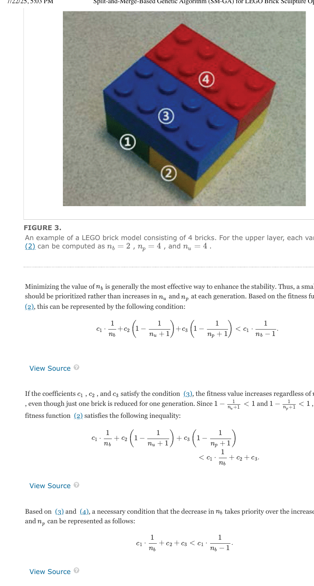

**FIGURE 3..**

An example of a LEGO brick model consisting of 4 bricks. For the upper layer, each variable in(2) can be computed as , , and . 

```text
=2nb =4np =4nu
nb nb
nu np
⋅ + (1− )+ (1− )< ⋅ .c1 1nb c2 1+1nu c3 1+1np c1 1−1nb
(3)
c1 c2 c3 nu np
1− <11+1nu 1− <11+1np
⋅ + (1− )+ (1− )c1 1nb c2 1+1nu c3 1+1np
   < ⋅ + + .c1 1nb c2 c3 (4)
nb nu
np
⋅ + + < ⋅ .c1 1nb c2 c3 c1 1−1nb (5) PDF
Help
```

7/22/25, 5:03 PM Split-and-Merge-Based Genetic Algorithm (SM-GA) for LEGO Brick Sculpture Optimization | IEEE Journals & Magazine | IEEE Xplore https://ieeexplore.ieee.org/

## abstract

/document/8419684 6/16

<!-- Page 7 -->

The above condition can be represented as follows: View Source

```text
If  , then the condition that  is always satisfied. Finally, a necessary condition for
 ,  , and  can be obtained as follows:
View Source
```

The weight condition (7) should be satisfied to find the near optimal solution using a minimal number ofbricks. Based on the individual’s fitness, a new population is selected to be reproduced in the next generation. This paper uses a rank-based selection method because it was found that this method works better than othermethods such as roulette-wheel selection and binary tournament methods for the brick layout problem [6]. In the rank-based selection method, the chromosomes are ordered according to their fitness values. Theselection probability of a chromosome is then assigned according to its rank.

### D. Crossover

A one-point crossover operator is adopted and modified to fit into the brick layout problem. Referring to Fig.4, the modified one-point crossover procedure is as follows: Step 1: Select two parent chromosomes at random from the population. Step 2: Select a crossover direction (horizontal or vertical) and a crossover point. Step 3: Divide each parent chromosome into two parts based on the crossover direction and crossover point. The bricks which belong to both parts are included in the upper or left part for convenience. Afterthat, swap the two parts between the parents. Step 4: If there are conflicts between bricks, remove the bricks and fill the empty space with random bricks. Similar to the initialization process, a larger brick has a higher probability of being selected.

```text
+ < ( − ).c2 c3 c1 1−1nb
1nb (6)
≥2nb 0< − ≤0.51−1nb
1nb
c1 c2 c3
>2⋅( + ).c1 c2 c3 (7)
```

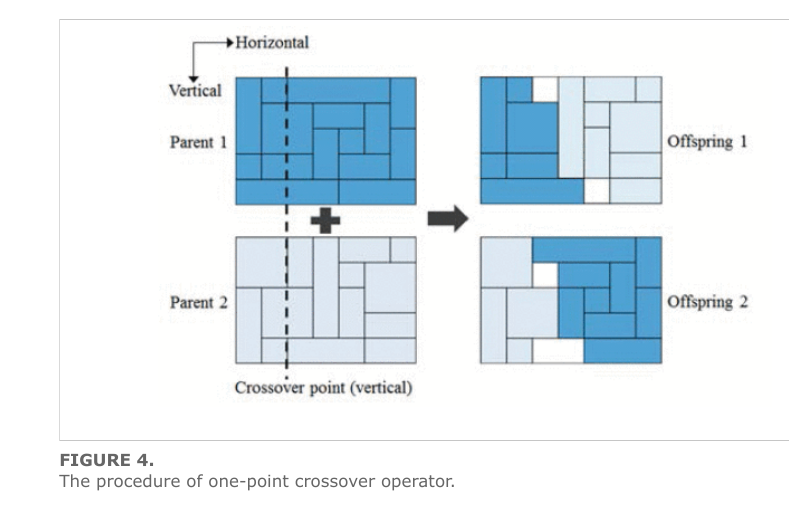

**FIGURE 4.The.** procedure of one-point crossover operator.

 PDF Help 7/22/25, 5:03 PM Split-and-Merge-Based Genetic Algorithm (SM-GA) for LEGO Brick Sculpture Optimization | IEEE Journals & Magazine | IEEE Xplore https://ieeexplore.ieee.org/

## abstract

/document/8419684 7/16

<!-- Page 8 -->

Note that the crossover operator may not improve the fitness because the number of bricks remains the same, or increases, during the process of dividing and swapping between two parent chromosomes. The crossoveroperator, however, is effective to explore other possible candidate solutions.

### E. Split-and-Merge Operator

Conventional genetic algorithms generally use a mutation operator to maintain genetic diversity from one generation of a population to the next [17]. Generally, a mutation flips one or more gene values of achromosome, thereby entirely changing its fitness. In [6], several mutation operators that can be applied to the brick layout problem were proposed, for example, replacing a brick by another random brick, extending abrick by 1 unit in a random direction, shifting a brick by 1 unit in a random direction, eliminating a random brick, merging neighboring bricks into a larger brick, and so on. However, these conventional mutation operators are not suitable for the chromosome representationintroduced in Section IV-A. The mutation operators cannot contribute to increasing the fitness value of the chromosome because they increase the number of bricks in the layer. Fig. 5 shows an example of theconventional shift mutation operator. Applying the shift mutation operator to the layout given in Fig. 5, the conflicts occur between bricks. Thus, all bricks that are located on the way would be eliminated. If we removesome of the bricks to resolve the conflicts, empty space occurs, and the number of bricks increases eventually, in the process of filling in the empty space. As the other conventional mutations such as replacing andextending a brick also produce the conflicts between bricks, the number of bricks increases, in the process of resolving the conflicts. The merge operator does not produce the conflicts between bricks. However, in thecase of the brick layout given in Fig. 5(a), any bricks cannot be merged into a larger brick by the conventional merge operator. In order to improve the fitness value of chromosomes, a split-and-merge operator is newly proposed, asdescribed in Fig. 6. The proposed split-and-merge operator is as follows: Step 1: Select a brick randomly from a chromosome. Step 2: Split the selected brick into bricks. Step 3: Select another brick randomly. Step 4: Merge the selected brick with the largest brick type that can be merged with the neighboring bricks.

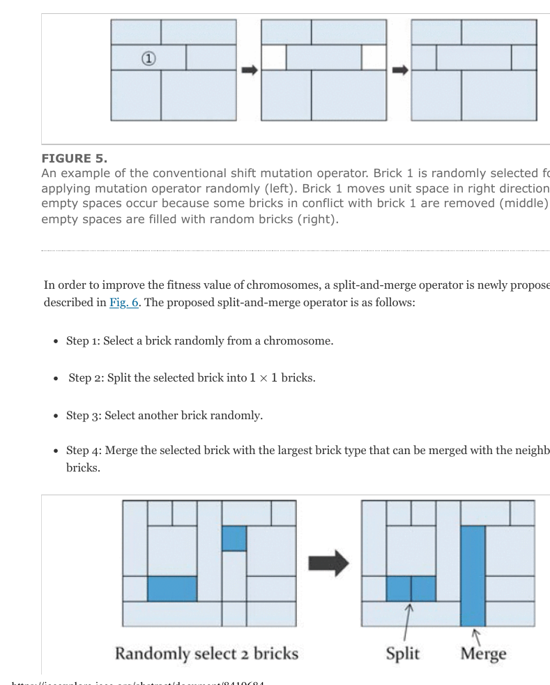

**FIGURE 5.An.** example of the conventional shift mutation operator. Brick 1 is randomly selected forapplying mutation operator randomly (left). Brick 1 moves unit space in right direction, and twoempty spaces occur because some bricks in conflict with brick 1 are removed (middle). Theempty spaces are filled with random bricks (right).



```text
1×1
PDF
Help
```

7/22/25, 5:03 PM Split-and-Merge-Based Genetic Algorithm (SM-GA) for LEGO Brick Sculpture Optimization | IEEE Journals & Magazine | IEEE Xplore https://ieeexplore.ieee.org/

## abstract

/document/8419684 8/16

<!-- Page 9 -->

At the -th generation, the probability of the split-and-merge operator, , is determined as follows: View Source where and are the upper and lower bounds for ; is the maximum number of generations.The probability of the split-and-merge operator linearly decreases to maintain a balance between the global exploration and the local exploitation as the number of generation increases. The proposed split-and-merge operator splits one random brick into bricks and then merges another random brick with neighboring bricks. The split-and-merge operator can reduce the number of bricks in thebrick layout. Also, the bricks can be replaced with other types of brick that can increase and . Thus, the proposed split-and-merge operator effectively improves the fitness of chromosomes.

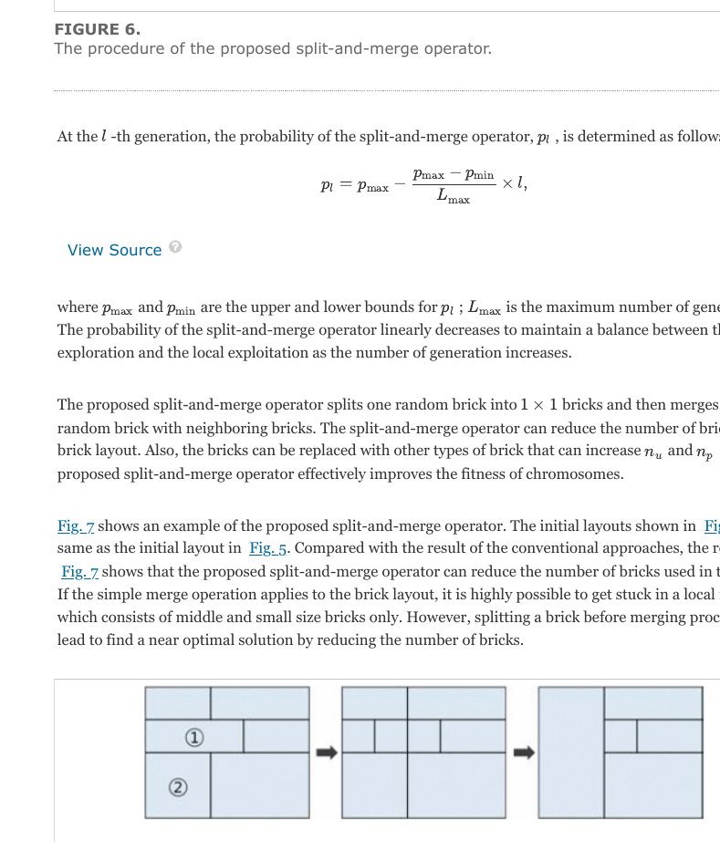

**Fig. 7.** shows an example of the proposed split-and-merge operator. The initial layouts shown in Fig. 7 is thesame as the initial layout in Fig. 5. Compared with the result of the conventional approaches, the result of

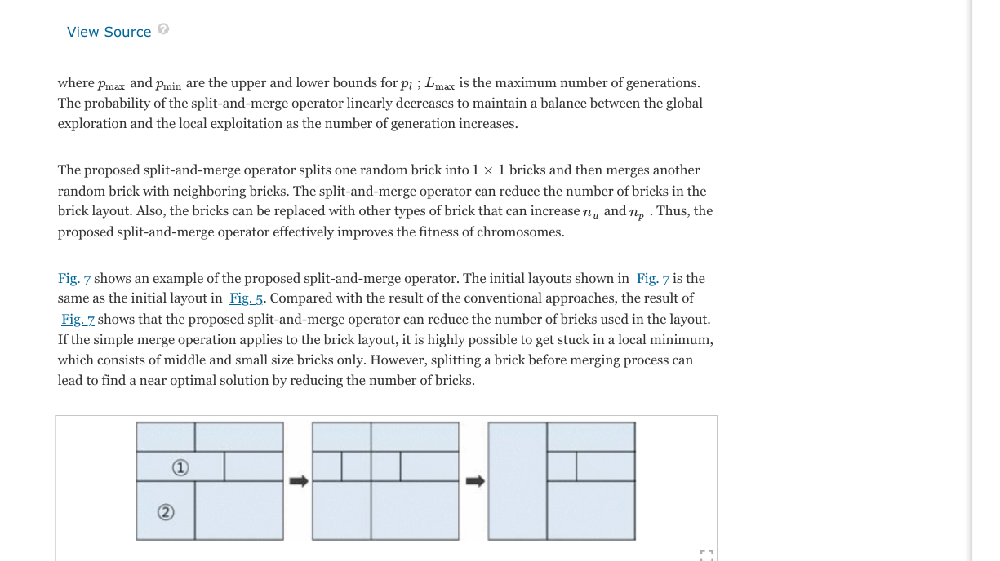

**Fig. 7.** shows that the proposed split-and-merge operator can reduce the number of bricks used in the layout.If the simple merge operation applies to the brick layout, it is highly possible to get stuck in a local minimum,

which consists of middle and small size bricks only. However, splitting a brick before merging process canlead to find a near optimal solution by reducing the number of bricks. In some cases, the proposed split-and-merge operator might be skipped or partially operated. For example, if a unit brick is selected for the split process of Step 1 and Step 2, then the brick is left as it is, because it cannotbe split into smaller bricks any more. Similarly, if the largest brick is selected for the merge process of Step 3 and Step 4, the brick remains unchanged.


**FIGURE 6.The.** procedure of the proposed split-and-merge operator.

 l pl

```text
= − ×l,pl pmax −pmax pmin
Lmax (8)
pmax pmin pl Lmax
1×1
nu np
```

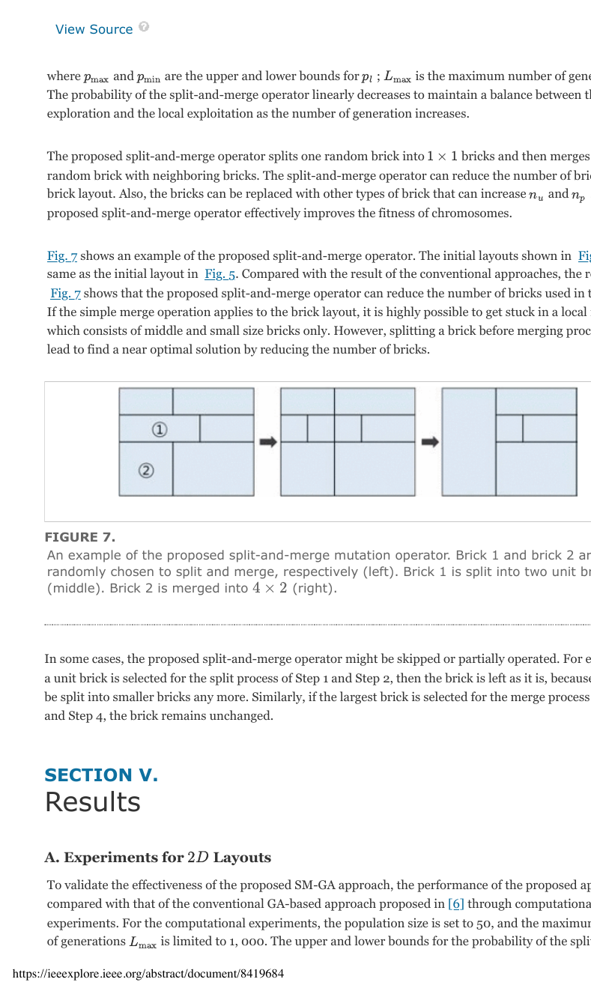

**FIGURE 7.An.** example of the proposed split-and-merge mutation operator. Brick 1 and brick 2 arerandomly chosen to split and merge, respectively (left). Brick 1 is split into two unit bricks(middle). Brick 2 is merged into (right).



```text
4×2
SECTION V.
Results
```

### A. Experiments for Layouts

To validate the effectiveness of the proposed SM-GA approach, the performance of the proposed approach iscompared with that of the conventional GA-based approach proposed in [6] through computational experiments. For the computational experiments, the population size is set to 50, and the maximum numberof generations is limited to 1, 000. The upper and lower bounds for the probability of the split-and- 2D Lmax PDF Help 7/22/25, 5:03 PM Split-and-Merge-Based Genetic Algorithm (SM-GA) for LEGO Brick Sculpture Optimization | IEEE Journals & Magazine | IEEE Xplore https://ieeexplore.ieee.org/

## abstract

/document/8419684 9/16

<!-- Page 10 -->

merge operator in (8) are set to and , respectively. The weight coefficients in (2) are set to , , and , which satisfy the condition (7).

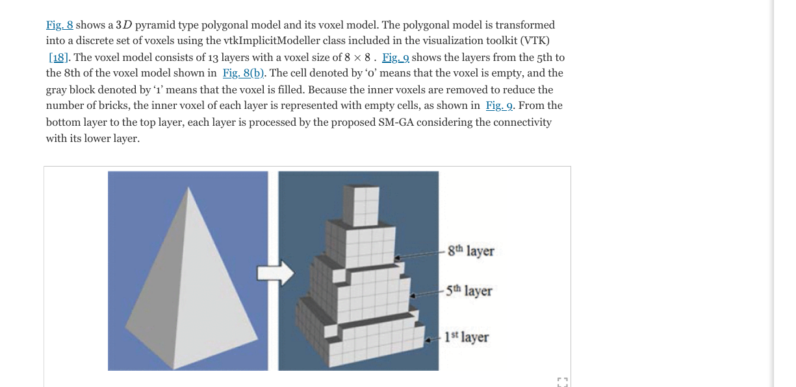

**Fig. 8.** shows a pyramid type polygonal model and its voxel model. The polygonal model is transformedinto a discrete set of voxels using the vtkImplicitModeller class included in the visualization toolkit (VTK)

[18]. The voxel model consists of 13 layers with a voxel size of . Fig. 9 shows the layers from the 5th tothe 8th of the voxel model shown in Fig. 8(b). The cell denoted by ‘0’ means that the voxel is empty, and the gray block denoted by ‘1’ means that the voxel is filled. Because the inner voxels are removed to reduce thenumber of bricks, the inner voxel of each layer is represented with empty cells, as shown in Fig. 9. From the bottom layer to the top layer, each layer is processed by the proposed SM-GA considering the connectivitywith its lower layer. Figs. 10 and 11 show the results from the conventional GA and the proposed SM-GA. From these results, it is found that the layouts produced by the proposed SM-GA are more stable than the results produced by theconventional GA. For example, in Fig. 10(b), brick 1 and brick 2 on the 6th layer are not connected to any other bricks on the 5th layer. Also, brick 3 on the 6th layer is connected with a unit cell of the 5th layer.Although these bricks can be assembled with the upper layer, it will make the overall brick model less stable. However, all bricks on the layouts produced by the proposed SM-GA are directly connected to the lowerlayers.

```text
=0.7pmax =0.1pmin
=5c1 =1c2 =1c3
3D
8×8
```

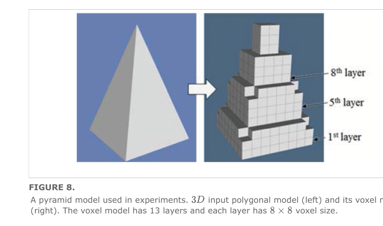

**FIGURE 8..**

A pyramid model used in experiments. input polygonal model (left) and its voxel model(right). The voxel model has 13 layers and each layer has voxel size. 

```text
3D 8×8
```

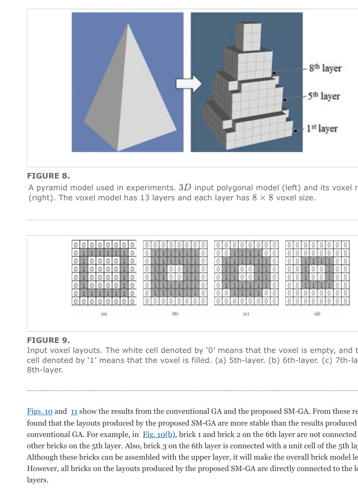

**FIGURE 9.Input.** voxel layouts. The white cell denoted by ‘0’ means that the voxel is empty, and the graycell denoted by ‘1’ means that the voxel is filled. (a) 5th-layer. (b) 6th-layer. (c) 7th-layer. (d)8th-layer.

 PDF Help 7/22/25, 5:03 PM Split-and-Merge-Based Genetic Algorithm (SM-GA) for LEGO Brick Sculpture Optimization | IEEE Journals & Magazine | IEEE Xplore https://ieeexplore.ieee.org/

## abstract

/document/8419684 10/16

<!-- Page 11 -->

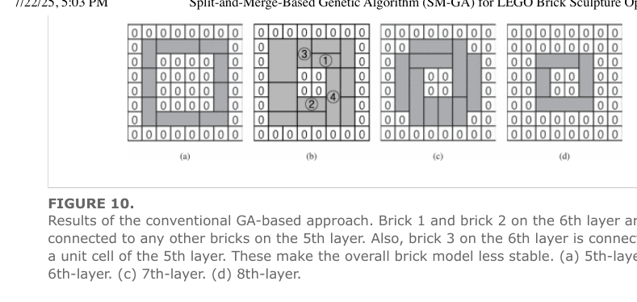

**Fig. 12.** shows the average fitness defined in (2) for 30 runs. The fitness of the conventional GA increasesslightly in the beginning, but it converges before 100 generations. However, the fitness of the proposed SM-

GA converges to a much higher value as the number of generations increases, compared with the conventionalGA approach.

### B. Experiments for Model

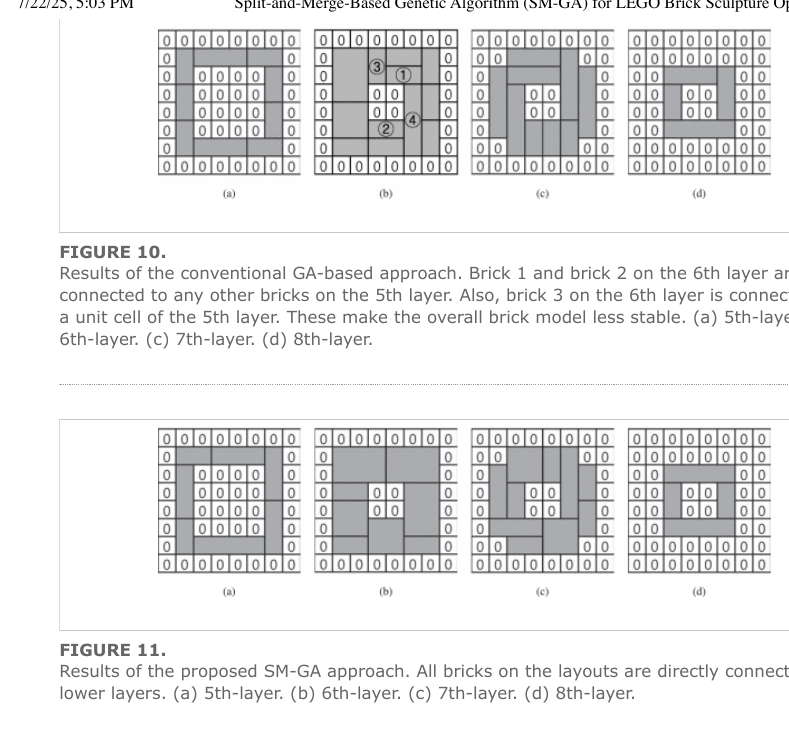

**FIGURE 10.Results.** of the conventional GA-based approach. Brick 1 and brick 2 on the 6th layer are notconnected to any other bricks on the 5th layer. Also, brick 3 on the 6th layer is connected witha unit cell of the 5th layer. These make the overall brick model less stable. (a) 5th-layer. (b)6th-layer. (c) 7th-layer. (d) 8th-layer.



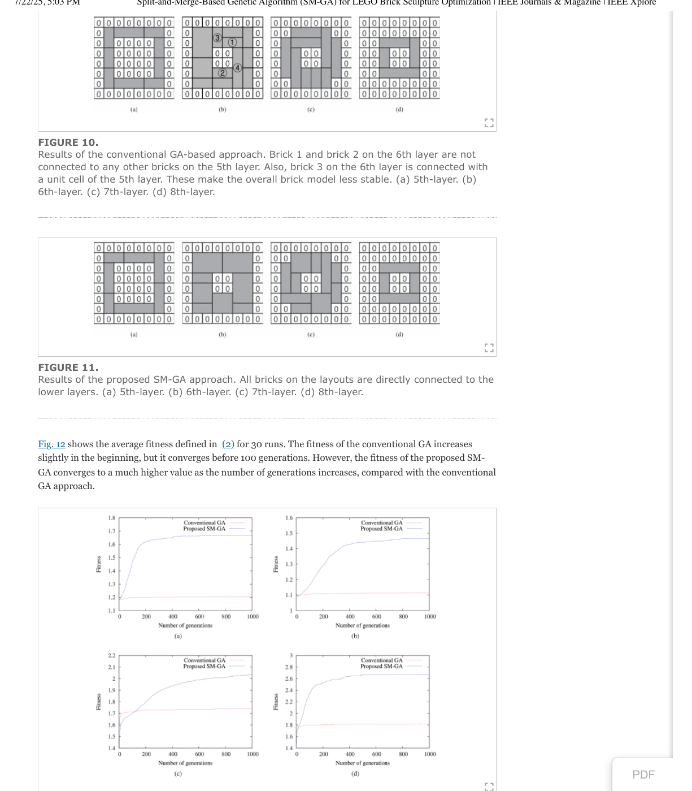

**FIGURE 11.Results.** of the proposed SM-GA approach. All bricks on the layouts are directly connected to thelower layers. (a) 5th-layer. (b) 6th-layer. (c) 7th-layer. (d) 8th-layer.



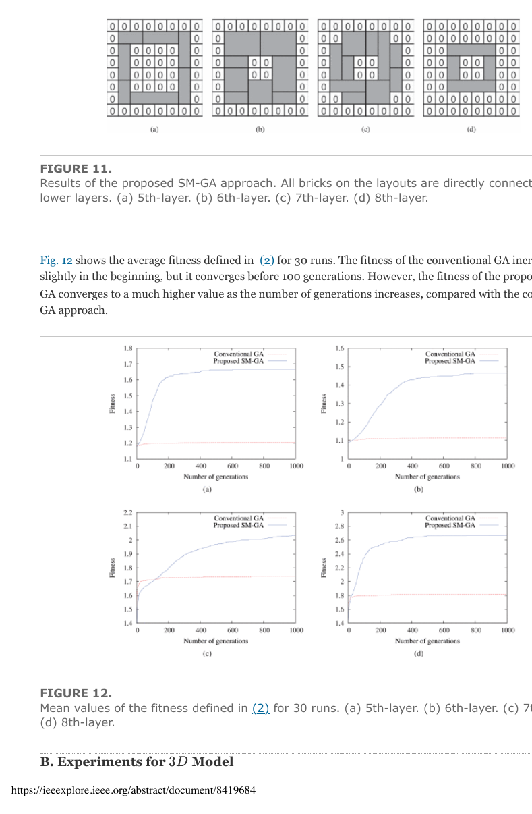

**FIGURE 12.Mean.** values of the fitness defined in (2) for 30 runs. (a) 5th-layer. (b) 6th-layer. (c) 7th-layer.(d) 8th-layer.

 3D PDF Help 7/22/25, 5:03 PM Split-and-Merge-Based Genetic Algorithm (SM-GA) for LEGO Brick Sculpture Optimization | IEEE Journals & Magazine | IEEE Xplore https://ieeexplore.ieee.org/

## abstract

/document/8419684 11/16

<!-- Page 12 -->

A physical experiment is also performed with the pyramid model. Fig. 13 shows the process of building an actual sculpture using real LEGO bricks. The sculpture is constructed based on the layouts generated bythe proposed SM-GA approach. From the physical experiments, it is found that the bricks are well connected with each other and the sculpture is well stabilized. In addition, computational experiments are performed with bigger and various models. Table 1 showsthe dataset used in the experiments, indicating the model name, dimension, and the total number of filled voxels denoted by . Figs. 14– 17 show the LEGO brick sculpture models generated by the proposed SM-GA. Through the computational experiments, we have found that the SM-GA generates feasible solutions that have no conflicts between bricks. 3D

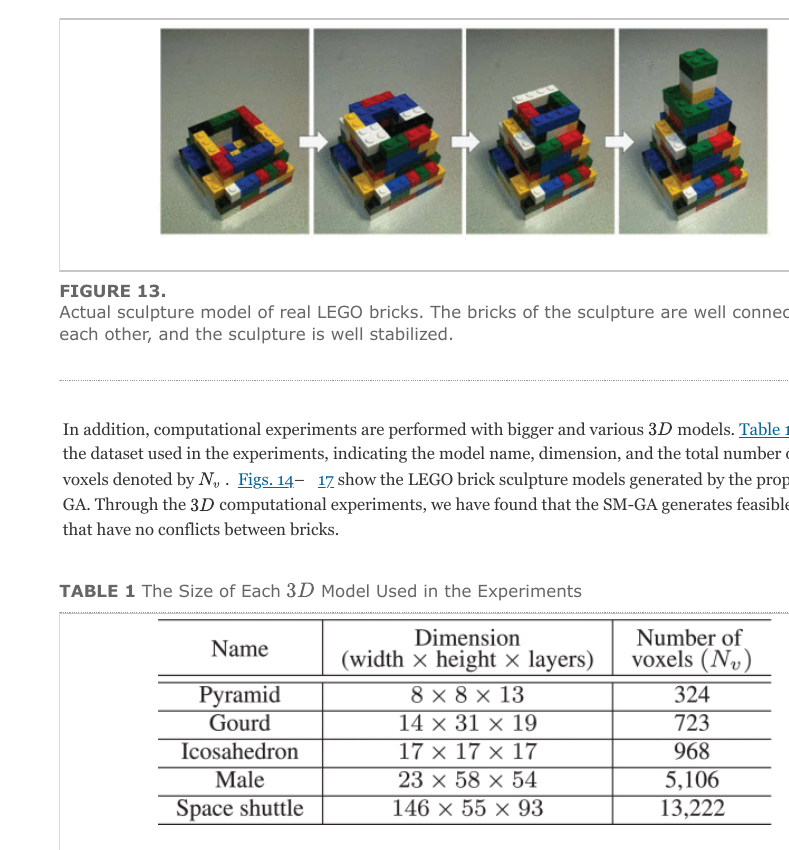

**FIGURE 13.Actual.** sculpture model of real LEGO bricks. The bricks of the sculpture are well connected witheach other, and the sculpture is well stabilized.

 3D Nv 3D


**TABLE 1.** The Size of Each Model Used in the Experiments3D



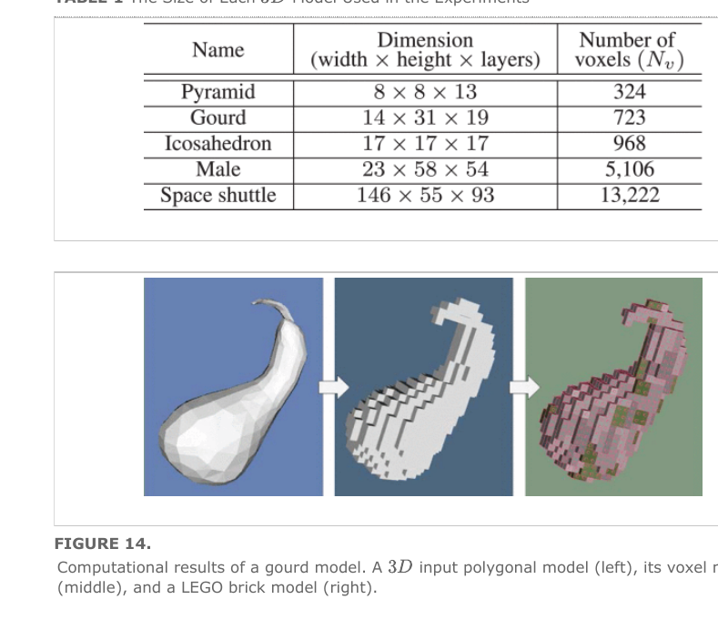

**FIGURE 14..**

Computational results of a gourd model. A input polygonal model (left), its voxel model(middle), and a LEGO brick model (right).  3D PDF Help 7/22/25, 5:03 PM Split-and-Merge-Based Genetic Algorithm (SM-GA) for LEGO Brick Sculpture Optimization | IEEE Journals & Magazine | IEEE Xplore https://ieeexplore.ieee.org/

## abstract

/document/8419684 12/16

<!-- Page 13 -->

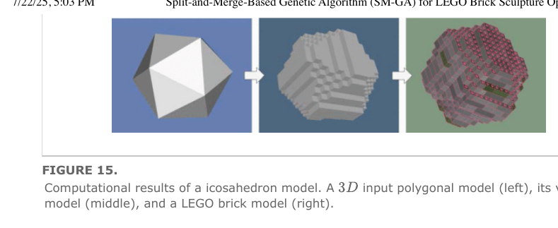

**Table 2.** shows the experimental results including the total number of used bricks, the voxel-to-brick ratio,

and the improvement percentage for each model. The number of used bricks and the value of voxel-to-brick ratio are the mean values for 30 runs. The voxel-to-brick ratio, which is the number of voxels divided by the number of bricks, shows how effective the output layouts are in reducing the number of bricks. The improvement percentage is defined as , where and are the number of bricks generated by the conventional and proposed approaches, respectively. The higher the voxel-to-brick ratio or the improvement percentage, the better the performance.

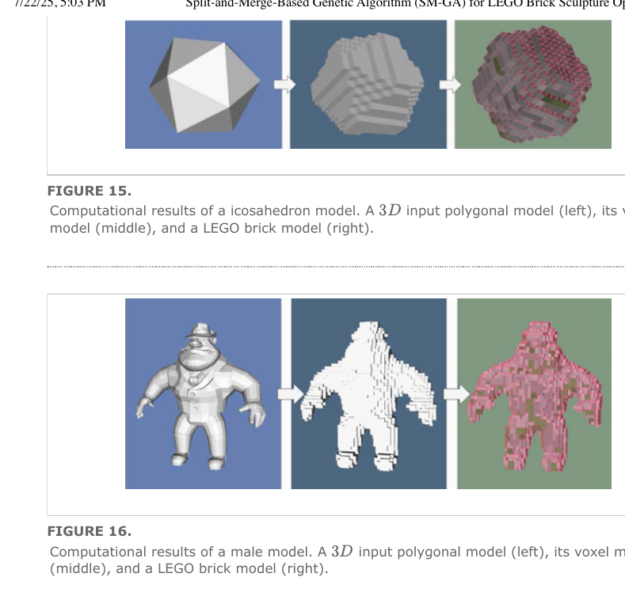

**FIGURE 15..**

Computational results of a icosahedron model. A input polygonal model (left), its voxelmodel (middle), and a LEGO brick model (right).  3D

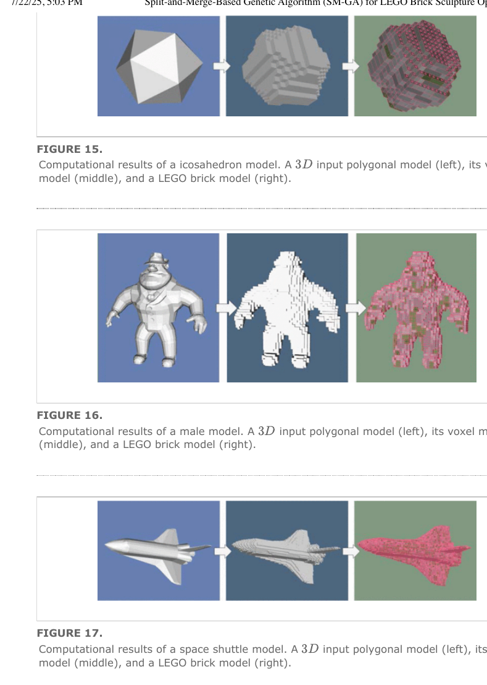

**FIGURE 16..**

Computational results of a male model. A input polygonal model (left), its voxel model(middle), and a LEGO brick model (right).  3D

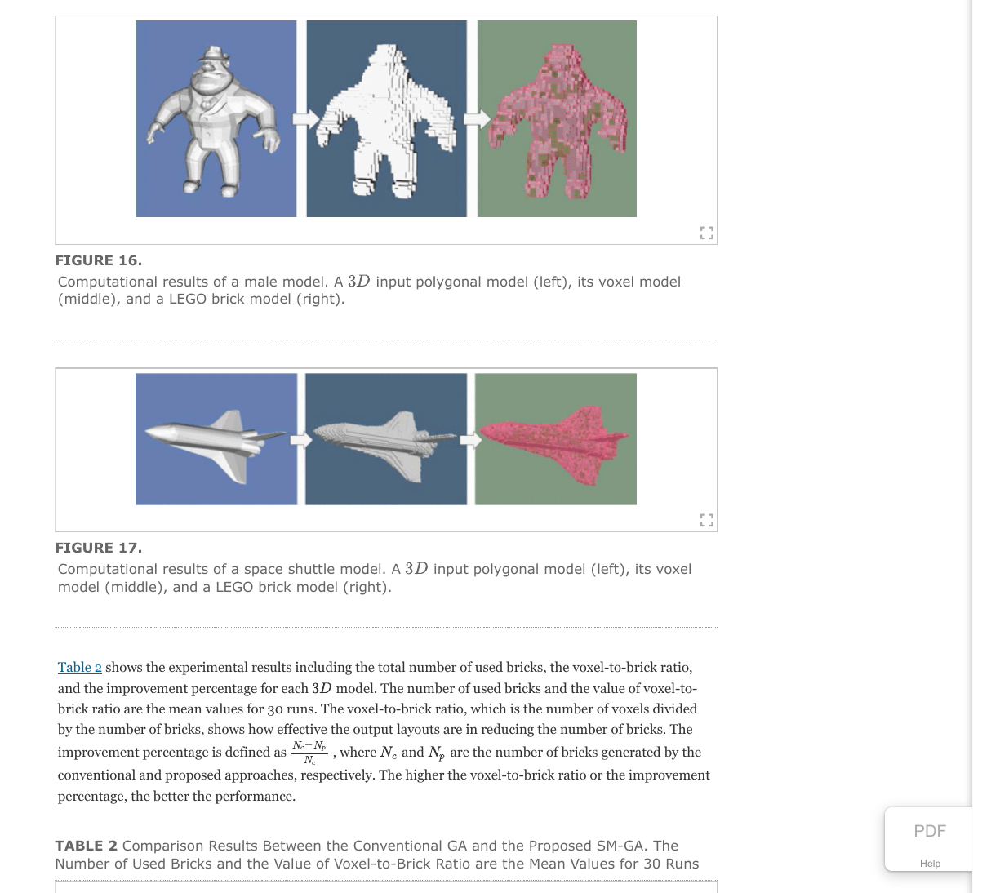

**FIGURE 17..**

Computational results of a space shuttle model. A input polygonal model (left), its voxelmodel (middle), and a LEGO brick model (right).  3D 3D −Nc Np Nc Nc Np


**TABLE 2.** Comparison Results Between the Conventional GA and the Proposed SM-GA. TheNumber of Used Bricks and the Value of Voxel-to-Brick Ratio are the Mean Values for 30 Runs

PDF Help 7/22/25, 5:03 PM Split-and-Merge-Based Genetic Algorithm (SM-GA) for LEGO Brick Sculpture Optimization | IEEE Journals & Magazine | IEEE Xplore https://ieeexplore.ieee.org/

## abstract

/document/8419684 13/16

<!-- Page 14 -->

Authors  Figures 

### References 

Citations 

### Keywords 

Metrics  The results show that the proposed split-and-merge mutation operator uses a small number of bricks to create the LEGO brick sculpture for all given models. The voxel-to-brick ratio value depends on thecomplexity of the layout. Therefore, the space shuttle model shows the highest voxel-to-brick ratio value because of its relatively low complexity, even though the space shuttle model has the largest number ofvoxels among the given five models. This implies that SM-GA can perform well regardless of the size of model. However, the improvement percentage decreases as the voxel number of the model increases. This isbecause the brick size that can be merged at once by the proposed mutation operator is limited to the bricks shown in Fig. 2. The effect of the proposed mutation operator can be large for a small model, but theeffect is relatively small for a large model.  3D 3D 3D 3D3D SECTION VI. Conclusion This paper proposed a novel SM-GA to create a stable sculptures made of LEGO bricks. The purpose of thealgorithm is to automatically generate an assembly manual so that the users can easily assemble desired sculptures. The performance of the proposed SM-GA was verified through computational and physicalexperiments. The main contributions of this paper can be summarized as follows: First, a novel split-andmerge operator was proposed to reduce the number of bricks and to find a near optimal solution. Inparticular, it was shown that the proposed operator is more effective in reducing the number of bricks compared with conventional mutation operators through various computational experiments; second, a newfitness function was proposed with a necessary condition for the weight coefficients to minimize the number of bricks as the number of generation increases. The necessary condition was mathematically proven to beeffective in reducing the number of bricks, and this is a new result not found in other EAs; third, the proposed SM-GA is designed to always generate a feasible brick layout in accordance with a given voxelmodel considering the stability whereas the conventional GA-based approaches produce infeasible brick layouts in most cases. Compared with the most recent conventional GA-based approach, it was shown thatthe proposed SM-GA is more effective in reducing the number of bricks and finding near optimal solutions to the brick layout problem. 3D PDF Help 7/22/25, 5:03 PM Split-and-Merge-Based Genetic Algorithm (SM-GA) for LEGO Brick Sculpture Optimization | IEEE Journals & Magazine | IEEE Xplore https://ieeexplore.ieee.org/

## abstract

/document/8419684 14/16

<!-- Page 15 -->

IEEE Personal Account CHANGE USERNAME/PASSWORD Purchase Details PAYMENT OPTIONS VIEW PURCHASEDDOCUMENTS Profile Information COMMUNICATIONS PREFERENCES PROFESSION AND EDUCATION TECHNICAL INTERESTS Need Help? US & CANADA: +1 800 678 4333 WORLDWIDE: +1 732 981 0060 CONTACT & SUPPORT Follow     About IEEE Xplore | Contact Us | Help | Accessibility | Terms of Use | Nondiscrimination Policy | IEEE Ethics Reporting | Sitemap |IEEE Privacy Policy A public charity, IEEE is the world's largest technical professional organization dedicated to advancing technology for the benefit of humanity. ALSO ON IEEE XPLORE

## 3 months ago1 comment

In recent years, incidentsinvolving unmanned aerialvehicles (UAVs) have … UETT4KUETT4K Anti-UAV: Anti-UAV: A ALargeLarge Scale Scale 4K 4K … … • 5 months ago1 comment This research presents arobust and comprehensiveframework for predicting … AA Computational ComputationalIntelligenceIntelligence … … • 2 months ago1 comment Blockchain technology isrevolutionizing digital assetexchange by eliminating … X-SPIDE:X-SPIDE: An An eXplainable eXplainableMachineMachine Learning Learning … … • 6 months ago1 comment Medical Visual QuestionAnswering (Med-VQA) is amultimodal task that aims … AnswerAnswer Distillation DistillationNetworkNetwork With With … … • 3 months ago1 comment Spiking Neural Networksinspired by the brain’sneuronal information … ResearchResearch on on SNN SNNLearningLearning Algorithms Algorithms • Share BestNewestOldest

## 0 Comments 1Login

LOG IN WITH OR SIGN UP WITH DISQUS Name Email Password This comment platform is hosted by Disqus, Inc. I authorize Disqus and its affiliates to:Use, sell, and share my information to enable me to use its comment services and for marketing purposes, including cross-contextbehavioral advertising, as described in our Terms of Service and Privacy Policy, including supplementing that information withother data about me, such as my browsing and location data.Contact me or enable others to contact me by email with offers for goods or servicesProcess any sensitive personal information that I submit in a comment. See our Privacy Policy for more information S ta rt th e d is c u s s io n … ? → B e th e firs t to c o m m e n t. Subscribe Privacy Do Not Sell My Data G  PDF Help 7/22/25, 5:03 PM Split-and-Merge-Based Genetic Algorithm (SM-GA) for LEGO Brick Sculpture Optimization | IEEE Journals & Magazine | IEEE Xplore https://ieeexplore.ieee.org/

## abstract

/document/8419684 15/16

<!-- Page 16 -->

© Copyright 2025 IEEE - All rights reserved, including rights for text and data mining and training of artificial intelligence and similar technologies. PDF Help 7/22/25, 5:03 PM Split-and-Merge-Based Genetic Algorithm (SM-GA) for LEGO Brick Sculpture Optimization | IEEE Journals & Magazine | IEEE Xplore https://ieeexplore.ieee.org/

## abstract

/document/8419684 16/16
