# StableLego: Stability Analysis of Block Stacking Assembly

Source PDF: `StableLego Stability Analysis of Block Stacking Assembly.pdf`

Evidence bundle: `evidence/`

<!-- Page 1 -->

1 Ruixuan Liu 1, Kangle Deng 1, Ziwei Wang 1 and Changliu Liu 1

### Abstract—Structural stability is a necessary condition for suc-

cessful construction of an assembly. However, designing a stable assembly requires a non-trivial effort since a slight variation in the design could significantly affect the structural stability. To address the challenge, this paper studies the stability of assembly structures, in particular, block stacking assembly. The paper proposes a new optimization formulation, which optimizes over force balancing equations, for inferring the structural stability of 3D block stacking structures. The proposed stability analysis is verified on hand-crafted Lego examples. The experiment results demonstrate that the proposed method can correctly predict whether the structure is stable. In addition, it outperforms the existing methods since it can accurately locate the weakest parts in the design, and more importantly, solve any given assembly structures. To further validate the proposed method, we provide StableLego: a comprehensive dataset including 50k+ 3D objects with their Lego layouts. We test the proposed stability analysis and include the stability inference for each corresponding object in StableLego. Our code and the dataset are available at https://github.com/intelligent-control-lab/StableLego. Index Terms—Assembly; Performance Evaluation and Benchmarking; Robotics and Automation in Construction I. I NTRODUCTION Recent advancements in robotics enable intelligent robots to perform assembly tasks, such as Lego construction [1], [2], [3], toy insertion [4], electronic assembly [5], etc. A good assembly design ( e.g., stable) is necessary for successful construction. However, designing assembly requires a nontrivial effort since a slight variation could significantly influence the task. Fig. 1 showcases examples of both valid and invalid designs. Two valid Lego designs are shown in Figs. 1(1) and 1(4). However, tiny modifications, e.g., adding one brick as depicted in Figs. 1(2) and 1(5), can cause the structures to collapse. Interestingly, the same small adjustment can stabilize collapsing assemblies, as seen in Figs. 1(3) and 1(6). Despite the significant impact, these slight variations are barely perceivable to humans. Conventional approaches leverage rapid prototyping techniques, e.g., Computer-aided Design (CAD), to iteratively improve the design [6]. However, assembly prototyping is usually time-consuming and the iterative process could be expensive. In particular, this paper considers structural stability, which is a key factor that influences the quality of an assembly design. It is important to ensure that the assembly design is stable so that an agent can safely perform the construction. Specifically, this paper focuses on block stacking assembly, This work is in part supported by the Manufacturing Futures Institute, Carnegie Mellon University, through a grant from the Richard King Mellon Foundation. 1Ruixuan Liu, Kangle Deng, Ziwei Wang and Changliu Liu are with Robotics Institute, Carnegie Mellon University, Pittsburgh, PA, 15213, USA. ruixuanl, kangled, ziweiwa2, cliu6@andrew.cmu.edu (1) 19-level Stairs. (2) Adding one level. (3) Valid 20-level Stairs. (4) A lever with 2 pink loads. (5) Adding one load. (6) A valid lever with 3 pink loads.


**Fig. 1.** Examples of valid and invalid Lego designs. The left and right

columns are valid designs and the middle column shows collapsing designs. where people use different blocks to build 3D structures. We will use Lego, which is a more complex type of block stacking assembly, to illustrate the concept. The top left diagram of

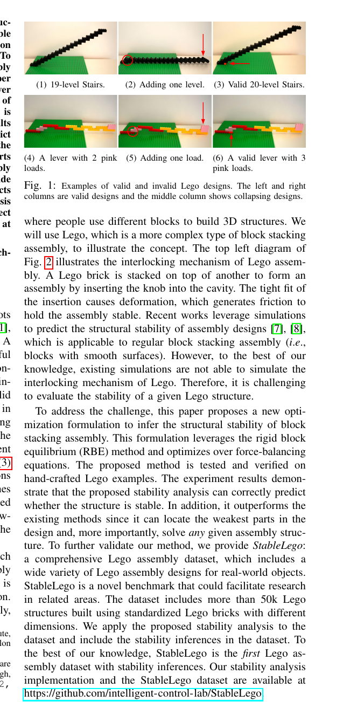

**Fig. 2.** illustrates the interlocking mechanism of Lego assem-

bly. A Lego brick is stacked on top of another to form an assembly by inserting the knob into the cavity. The tight fit of the insertion causes deformation, which generates friction to hold the assembly stable. Recent works leverage simulations to predict the structural stability of assembly designs [7], [8], which is applicable to regular block stacking assembly ( i.e., blocks with smooth surfaces). However, to the best of our knowledge, existing simulations are not able to simulate the interlocking mechanism of Lego. Therefore, it is challenging to evaluate the stability of a given Lego structure. To address the challenge, this paper proposes a new optimization formulation to infer the structural stability of block stacking assembly. This formulation leverages the rigid block equilibrium (RBE) method and optimizes over force-balancing equations. The proposed method is tested and verified on hand-crafted Lego examples. The experiment results demonstrate that the proposed stability analysis can correctly predict whether the structure is stable. In addition, it outperforms the existing methods since it can locate the weakest parts in the design and, more importantly, solve any given assembly structure. To further validate our method, we provide StableLego: a comprehensive Lego assembly dataset, which includes a wide variety of Lego assembly designs for real-world objects. StableLego is a novel benchmark that could facilitate research in related areas. The dataset includes more than 50k Lego structures built using standardized Lego bricks with different dimensions. We apply the proposed stability analysis to the dataset and include the stability inferences in the dataset. To the best of our knowledge, StableLego is the first Lego assembly dataset with stability inferences. Our stability analysis implementation and the StableLego dataset are available at https://github.com/intelligent-control-lab/StableLego. arXiv:2402.10711v2 [cs.RO] 4 Mar 2025

<!-- Page 2 -->

2 Interlocking Mechanism Unit Brick: (1⨉1) 1⨉X Brick: 2⨉X Brick: Force Model Stack for Assembly Brick Force Model Brick: ● Gravity: ● Support: ● Press: ● Drag: ● Pull: ● Horizontal press: ● Knob press: KnobCavity

## 4 Contacting Points

## 3 Contacting Points

● ● ● ● ● Floor Plate Example Structure 1 2 3 4 ● ● ● ● ● ● ● ● ● ● ● ● ● ● ● ● ●

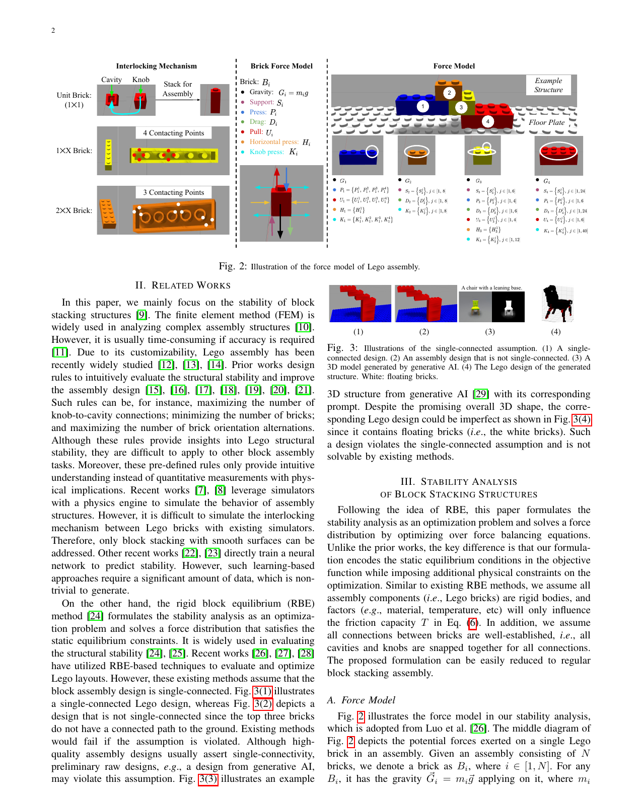

**Fig. 2.** Illustration of the force model of Lego assembly.

II. R ELATED WORKS In this paper, we mainly focus on the stability of block stacking structures [9]. The finite element method (FEM) is widely used in analyzing complex assembly structures [10]. However, it is usually time-consuming if accuracy is required [11]. Due to its customizability, Lego assembly has been recently widely studied [12], [13], [14]. Prior works design rules to intuitively evaluate the structural stability and improve the assembly design [15], [16], [17], [18], [19], [20], [21]. Such rules can be, for instance, maximizing the number of knob-to-cavity connections; minimizing the number of bricks; and maximizing the number of brick orientation alternations. Although these rules provide insights into Lego structural stability, they are difficult to apply to other block assembly tasks. Moreover, these pre-defined rules only provide intuitive understanding instead of quantitative measurements with physical implications. Recent works [7], [8] leverage simulators with a physics engine to simulate the behavior of assembly structures. However, it is difficult to simulate the interlocking mechanism between Lego bricks with existing simulators. Therefore, only block stacking with smooth surfaces can be addressed. Other recent works [22], [23] directly train a neural network to predict stability. However, such learning-based approaches require a significant amount of data, which is nontrivial to generate. On the other hand, the rigid block equilibrium (RBE) method [24] formulates the stability analysis as an optimization problem and solves a force distribution that satisfies the static equilibrium constraints. It is widely used in evaluating the structural stability [24], [25]. Recent works [26], [27], [28] have utilized RBE-based techniques to evaluate and optimize Lego layouts. However, these existing methods assume that the block assembly design is single-connected. Fig. 3(1) illustrates a single-connected Lego design, whereas Fig. 3(2) depicts a design that is not single-connected since the top three bricks do not have a connected path to the ground. Existing methods would fail if the assumption is violated. Although highquality assembly designs usually assert single-connectivity, preliminary raw designs, e.g., a design from generative AI, may violate this assumption. Fig. 3(3) illustrates an example (1) (2) A chair with a leaning base. (3) (4)

**Fig. 3.** Illustrations of the single-connected assumption. (1) A single-

connected design. (2) An assembly design that is not single-connected. (3) A 3D model generated by generative AI. (4) The Lego design of the generated structure. White: floating bricks. 3D structure from generative AI [29] with its corresponding prompt. Despite the promising overall 3D shape, the corresponding Lego design could be imperfect as shown in Fig. 3(4) since it contains floating bricks ( i.e., the white bricks). Such a design violates the single-connected assumption and is not solvable by existing methods. III. S TABILITY ANALYSIS OF BLOCK STACKING STRUCTURES Following the idea of RBE, this paper formulates the stability analysis as an optimization problem and solves a force distribution by optimizing over force balancing equations. Unlike the prior works, the key difference is that our formulation encodes the static equilibrium conditions in the objective function while imposing additional physical constraints on the optimization. Similar to existing RBE methods, we assume all assembly components ( i.e., Lego bricks) are rigid bodies, and factors ( e.g., material, temperature, etc) will only influence the friction capacity T in Eq. (6). In addition, we assume all connections between bricks are well-established, i.e., all cavities and knobs are snapped together for all connections. The proposed formulation can be easily reduced to regular block stacking assembly.

### A. Force Model

**Fig. 2.** illustrates the force model in our stability analysis,

which is adopted from Luo et al. [26]. The middle diagram of

**Fig. 2.** depicts the potential forces exerted on a single Lego

brick in an assembly. Given an assembly consisting of N

```text
bricks, we denote a brick as Bi, where i ∈ [1, N]. For any
Bi, it has the gravity ⃗Gi = mi⃗ gapplying on it, where mi
```

<!-- Page 3 -->

3

```text
is the brick mass and ⃗ g≈ 9.8 N/kg. If there is a connection
```

to the top knob, Bi will experience pressing force ⃗Pi (i.e., the blue arrow) pointing downward due to the weight of the structures above it, as well as pulling force ⃗Ui (i.e., the red arrow) pointing upward due to the tight connection of the knob. Similarly, if there is a connection to the bottom cavity, Bi will experience supporting force ⃗Si (i.e., the purple arrow) pointing upward due to the rigid structure below it, as well as dragging force ⃗Di (i.e., the green arrow) pointing downward due to the friction from the connection. If there are bricks right next to Bi, there will also be horizontal press ⃗Hi (i.e., the yellow arrows) pointing toward Bi. If a knob or a cavity of Bi is connected, there will be horizontal press ⃗Ki within the knob ( i.e., the cyan arrows) pointing in horizontal directions that prevent the brick from sliding. Note that each connection will generate 4 horizontal press

```text
force components in the 4 horizontal directions, i.e., ±X and
±Y , pointing inward to Bi. Also, note that only ⃗Gi is a
```

force constantly exerting on Bi independent of the assembly structure. ⃗Si, ⃗Pi, ⃗Di, ⃗Ui, ⃗Hi, ⃗Ki are forces that may or may not exist depending on the structure. In the following discussion, we refer to these forces as candidate forces. The figures on the left of Fig. 2 illustrate different connections of bricks. Depending on the different dimensions of the top bricks, there are different numbers of contacting points that generate friction to hold the knobs of the bottom bricks. If the

```text
top brick is 1×X, where X ∈ N, X ≥ 1, each connected knob
has 4 contact points. If the top brick is 2 × X, X ≥ 2, each
```

connected knob has 3 contact points. If the top brick is Q×X,

```text
Q ≥ 3, X ≥ Q, the connections on the edge have 3 contact
```

points while others have 4 contact points. In our formulation, instead of summing up the candidate forces and assuming only one vertical candidate for each of the ⃗Si, ⃗Pi, ⃗Di, ⃗Ui within each knob-to-cavity connection, we assume the vertical candidate forces exist at each of the contact points. The right figure in Fig. 2 illustrates the force models for each brick in an example Lego structure. The white contours indicate the connected knobs for each brick. If there is no connection, either on top or below a knob, there are no candidate forces exist. The bottom of the diagram lists all the potential forces that are exerted on the brick. All bricks have gravity applied to them. For B1, since only the rightmost knob has a 1 × 2 brick connected on top of it, it has

## 4 pressing candidates ⃗P1 = { ⃗P 1

1 , ⃗P 2 1 , ⃗P 3 1 , ⃗P 4 1 } and 4 pulling

```text
candidates ⃗U1 = {⃗U 1
1 , ⃗U 2
1 , ⃗U 3
1 , ⃗U 4
1 } since the connection has
```

## 4 contact points. And there exist 4 knob pressing candidates

⃗K1 = { ⃗K 1 1 , ⃗K 2 1 , ⃗K 3 1 , ⃗K 4 1 } in 4 horizontal directions. Since there exists a brick ( i.e., B3) right next to it, it has a

```text
horizontal press candidate ⃗H1 = { ⃗H 1
1 }. Similarly for B2,
```

since there are only connections below it, there is no ⃗U2 or ⃗P2. Due to the cavity connections, there are 8 supporting

```text
candidates ⃗S2 = {⃗Sj
2 | j ∈ [1, 8]} since each cavity has
```

## 4 contact points. Similarly there are 8 dragging candidates

```text
⃗D2 = { ⃗Dj
2 | j ∈ [1, 8]} and 8 knob pressing candidates
⃗K2 = { ⃗K j
2 | j ∈ [1, 8]}. Since there is no brick right next
```

to B2, ⃗H2 does not exist. We can derive the force models for B3 and B4 following the similar rules as listed in Fig. 2.

### B. Static Equilibrium

An object reaching static equilibrium indicates that it will not fall or collapse. To ensure a stable Lego structure, we need to ensure that each brick Bi can reach static equilibrium so that the structure will not collapse. For a given Lego structure with N bricks and each candidate force Fi has MFi candidates, the

```text
static equilibrium enforces that ∀Bi, i ∈ [1, N], we need to
satisfy
C f
i ˙ =⃗Gi +
MFiX
j=1
⃗F j
i = ⃗0, (1)
C τ
i ˙ =⃗L
⃗Gi
i × ⃗Gi +
MFiX
j=1
(⃗L
⃗F j
i
i × ⃗F j
i ) = ⃗0, (2)
⃗F j
i ∈ Fi = {⃗SjS
i , ⃗P jP
i , ⃗DjD
i , ⃗U jU
i , ⃗H jH
i , ⃗K jK
i |
jS ∈ [1, MSi ], jP ∈ [1, MPi ], jD ∈ [1, MDi ]
jU ∈ [1, MUi ], jH ∈ [1, MHi ], jK ∈ [1, MKi ]},
```

where × denotes the vector cross-product operation. ⃗L ⃗F i is the force lever of the force vector ⃗F on brick Bi. Eq. (1) enforces that Bi reaches force equilibrium so that the brick would not have translational motion. Eq. (2) enforces that Bi reaches torque equilibrium (also referred as moment equilibrium). This indicates that the brick would not have rotational motion. Satisfying both Eqs. (1) and (2) indicates that the bricks are static and the structure is stable.

## C. Constraints

a) Non-negativity: We assume all components are rigid bodies. Therefore, the value of each force should be nonnegative. Let the value of ⃗F j

```text
i ∈ Fi be F j
i , we have
C +
i : F j
i ≥ 0. (3)
```

b) Non-coexistence: At any given contact point, the pulling force ⃗U j i and the pressing force ⃗P j i cannot coexist. If U j

```text
i > 0, the top brick is pulling the bottom brick upward.
```

Then there is no weight loaded on the bottom brick, and thus, P j i = 0 . If P j

```text
i > 0, then there is weight loaded on the
```

bottom brick. Therefore, the top brick cannot be pulling the bottom brick upward. Similarly, the dragging force ⃗Dj i and the supporting force ⃗Sj i cannot coexist. The non-coexistence property gives the constraint as C || i : ( P j i · U j

```text
i = 0
Dj
i · Sj
i = 0 . (4)
```

c) Equality: Newton’s third law states that for every action, there is an equal and opposite reaction. At a given contact point q, let the bottom brick be Bi and the upper brick be Bj. The supporting force ⃗Sq j and the pressing force ⃗P q i are such an action-reaction pair. Similarly, the pulling force ⃗U q i and the dragging force ⃗Dq j are also an action-reaction pair. Also, the knob pressing candidates ⃗Ki and ⃗Kj are also actionreaction pairs. Let Bk be a brick adjacent to Bi, then the

<!-- Page 4 -->

4 horizontal press ⃗Hi and ⃗Hk are also an action-reaction pairs. Therefore, we have the equality constraints as C = :    Sq

```text
j = P q
i
U q
i = Dq
j
Hi = Hk
Ki = Kj.
(5)
```

d) Friction Capacity: As shown in the left diagram of

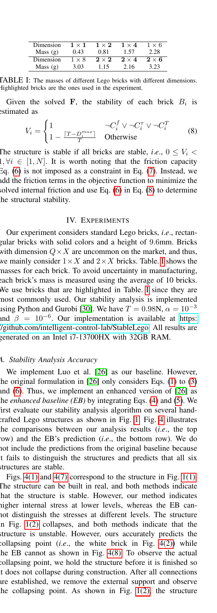

**Fig. 2.** , Lego bricks are held together due to the static friction

(i.e., U and D) at the contact points caused by deformation. The structure is stable if the friction is within the limit. In our analysis, we assume all deformations are identical and all frictions share the same limit T . A structure is stable if all friction forces do not exceed the limit. Thus, we have the capacity constraint as C T i : (

```text
0 ≤ U jU
i ≤ T, ∀jU ∈ [1, MUi ]
0 ≤ DjD
i ≤ T, ∀jD ∈ [1, MDi ] , ∀i ∈ [1, N]. (6)
```

### D. Stability Analysis Formulation

Following the intuition in RBE [26], a given structure is stable if there exists a set of forces F that satisfies Eqs. (1) to (6). We can use the force distribution to estimate the stability of the structure. To solve F, we formulate the optimization as arg min F NX

```text
i=1
(
|C f
i | + |C τ
i | + αDmax
i + β
MDiX
j=1
Dj
i
)
,
subject to:



C +
i
C ||
i
C =
, ∀i ∈ [1, N].
(7)
where Dmax
i = max j Dj
i is the maximum dragging force
```

for a brick Bi. The objective function minimizes the static equilibrium values in Eqs. (1) and (2) as well as the maximum friction and the total friction in each brick. The terms |C f i |

```text
and |C τ
```

i | encourage the solver to solve a distribution of F that makes the structure to reach static equilibrium. Dmax i tries to avoid extreme values among the dragging forces in Bi. And PMDi

```text
j=1 Dj
i encourages the solver to solve F with
minimum internal friction. α and β are tunable weights to
```

adjust the influence of the two terms so that they do not take over the effect of the static equilibrium. Note that the key difference between Eq. (7) and previous works is that instead of imposing static equilibrium Eqs. (1) and (2) as equality constraints, we encode them in the objective function. This is critical since enforcing them as constraints is essentially assuming there exists a F that satisfies the static equilibrium. If a given structure does not have such a F, the formulation is voided. An example could be a structure with floating bricks. Including them in the objective function instead of as hard constraints can relax the single-connected assumption and solve the stability of any structures. Aside from the objective function, Eq. (7) also imposes more equality constraints ( i.e., Eqs. (4) and (5)) than prior works to improve the accuracy of predicted stability.

```text
Dimension 1 × 1 1 × 2 1 × 4 1 × 6
Mass (g) 0.43 0.81 1.57 2.28
Dimension 1 × 8 2 × 2 2 × 4 2 × 6
Mass (g) 3.03 1.15 2.16 3.23
```

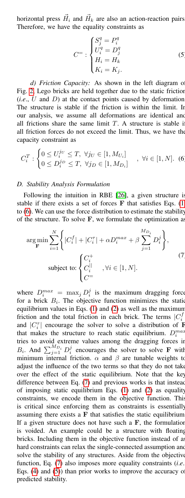

**TABLE I.** The masses of different Lego bricks with different dimensions.

Highlighted bricks are the ones used in the experiment. Given the solved F, the stability of each brick Bi is estimated as

```text
Vi =
(
1 ¬C f
i ∨ ¬C τ
i ∨ ¬C T
i
1 − ⌈T −Dmax
i ⌉
T Otherwise (8)
The structure is stable if all bricks are stable, i.e., 0 ≤ Vi <
1, ∀i ∈ [1, N]. It is worth noting that the friction capacity
```

Eq. (6) is not imposed as a constraint in Eq. (7). Instead, we add the friction terms in the objective function to minimize the solved internal friction and use Eq. (6) in Eq. (8) to determine the structural stability. IV. E XPERIMENTS Our experiment considers standard Lego bricks, i.e., rectangular bricks with solid colors and a height of 9.6mm. Bricks with dimension Q×X are uncommon on the market, and thus, we mainly consider 1×X and 2×X bricks. Table. I shows the masses for each brick. To avoid uncertainty in manufacturing, each brick’s mass is measured using the average of 10 bricks. We use bricks that are highlighted in Table. I since they are most commonly used. Our stability analysis is implemented

```text
using Python and Gurobi [30]. We have T = 0.98N, α = 10 −3
and β = 10 −6. Our implementation is available at https:
```

//github.com/intelligent-control-lab/StableLego. All results are generated on an Intel i7-13700HX with 32GB RAM.

### A. Stability Analysis Accuracy

We implement Luo et al. [26] as our baseline. However, the original formulation in [26] only considers Eqs. (1) to (3) and (6). Thus, we implement an enhanced version of [26] as the enhanced baseline (EB) by integrating Eqs. (4) and (5). We first evaluate our stability analysis algorithm on several handcrafted Lego structures as shown in Fig. 1. Fig. 4 illustrates the comparisons between our analysis results ( i.e., the top row) and the EB’s prediction ( i.e., the bottom row). We do not include the predictions from the original baseline because it fails to distinguish the structures and predicts that all six structures are stable. Figs. 4(1) and 4(7) correspond to the structure in Fig. 1(1). The structure can be built in real, and both methods indicate that the structure is stable. However, our method indicates higher internal stress at lower levels, whereas the EB cannot distinguish the stresses at different levels. The structure in Fig. 1(2) collapses, and both methods indicate that the structure is unstable. However, ours accurately predicts the collapsing point ( i.e., the white brick in Fig. 4(2)) while the EB cannot as shown in Fig. 4(8). To observe the actual collapsing point, we hold the structure before it is finished so it does not collapse during construction. After all connections are established, we remove the external support and observe the collapsing point. As shown in Fig. 1(2), the structure

<!-- Page 5 -->

5 (1) Ours Fig. 1(1) (2) Ours Fig. 1(2) (3) Ours Fig. 1(3) (4) Ours Fig. 1(4) (5) Ours Fig. 1(5) (6) Ours Fig. 1(6) (7) EB Fig. 1(1) (8) EB Fig. 1(2) (9) EB Fig. 1(3) (10) EB Fig. 1(4) (11) EB Fig. 1(5) (12) EB Fig. 1(6)

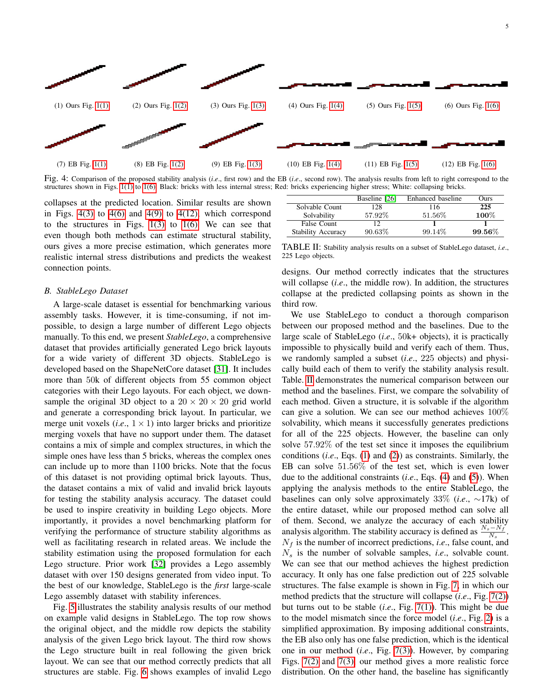

**Fig. 4.** Comparison of the proposed stability analysis ( i.e., first row) and the EB ( i.e., second row). The analysis results from left to right correspond to the

structures shown in Figs. 1(1) to 1(6). Black: bricks with less internal stress; Red: bricks experiencing higher stress; White: collapsing bricks. collapses at the predicted location. Similar results are shown in Figs. 4(3) to 4(6) and 4(9) to 4(12), which correspond to the structures in Figs. 1(3) to 1(6). We can see that even though both methods can estimate structural stability, ours gives a more precise estimation, which generates more realistic internal stress distributions and predicts the weakest connection points.

### B. StableLego Dataset

A large-scale dataset is essential for benchmarking various assembly tasks. However, it is time-consuming, if not impossible, to design a large number of different Lego objects manually. To this end, we presentStableLego, a comprehensive dataset that provides artificially generated Lego brick layouts for a wide variety of different 3D objects. StableLego is developed based on the ShapeNetCore dataset [31]. It includes more than 50k of different objects from 55 common object categories with their Lego layouts. For each object, we downsample the original 3D object to a 20 × 20 × 20 grid world and generate a corresponding brick layout. In particular, we merge unit voxels ( i.e., 1 × 1) into larger bricks and prioritize merging voxels that have no support under them. The dataset contains a mix of simple and complex structures, in which the simple ones have less than 5 bricks, whereas the complex ones can include up to more than 1100 bricks. Note that the focus of this dataset is not providing optimal brick layouts. Thus, the dataset contains a mix of valid and invalid brick layouts for testing the stability analysis accuracy. The dataset could be used to inspire creativity in building Lego objects. More importantly, it provides a novel benchmarking platform for verifying the performance of structure stability algorithms as well as facilitating research in related areas. We include the stability estimation using the proposed formulation for each Lego structure. Prior work [32] provides a Lego assembly dataset with over 150 designs generated from video input. To the best of our knowledge, StableLego is the first large-scale Lego assembly dataset with stability inferences.

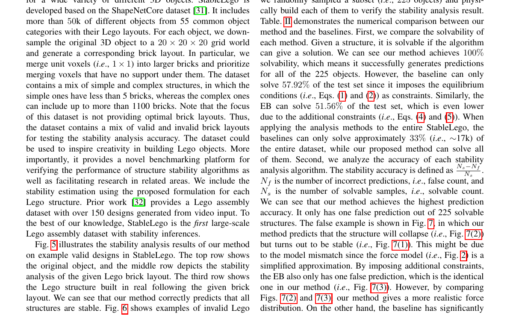

**Fig. 5.** illustrates the stability analysis results of our method

on example valid designs in StableLego. The top row shows the original object, and the middle row depicts the stability analysis of the given Lego brick layout. The third row shows the Lego structure built in real following the given brick layout. We can see that our method correctly predicts that all structures are stable. Fig. 6 shows examples of invalid Lego Baseline [26] Enhanced baseline Ours Solvable Count 128 116 225 Solvability 57.92% 51 .56% 100% False Count 12 1 1 Stability Accuracy 90.63% 99 .14% 99.56%

**TABLE II.** Stability analysis results on a subset of StableLego dataset, i.e.,

## 225 Lego objects.

designs. Our method correctly indicates that the structures will collapse ( i.e., the middle row). In addition, the structures collapse at the predicted collapsing points as shown in the third row. We use StableLego to conduct a thorough comparison between our proposed method and the baselines. Due to the large scale of StableLego ( i.e., 50k+ objects), it is practically impossible to physically build and verify each of them. Thus, we randomly sampled a subset ( i.e., 225 objects) and physically build each of them to verify the stability analysis result.

**Table..** II demonstrates the numerical comparison between our

method and the baselines. First, we compare the solvability of each method. Given a structure, it is solvable if the algorithm can give a solution. We can see our method achieves 100% solvability, which means it successfully generates predictions for all of the 225 objects. However, the baseline can only solve 57.92% of the test set since it imposes the equilibrium conditions (i.e., Eqs. (1) and (2)) as constraints. Similarly, the EB can solve 51.56% of the test set, which is even lower due to the additional constraints ( i.e., Eqs. (4) and (5)). When applying the analysis methods to the entire StableLego, the baselines can only solve approximately 33% (i.e., ∼17k) of the entire dataset, while our proposed method can solve all of them. Second, we analyze the accuracy of each stability analysis algorithm. The stability accuracy is defined as Ns−Nf Ns . Nf is the number of incorrect predictions, i.e., false count, and Ns is the number of solvable samples, i.e., solvable count. We can see that our method achieves the highest prediction accuracy. It only has one false prediction out of 225 solvable structures. The false example is shown in Fig. 7, in which our method predicts that the structure will collapse ( i.e., Fig. 7(2)) but turns out to be stable ( i.e., Fig. 7(1)). This might be due to the model mismatch since the force model ( i.e., Fig. 2) is a simplified approximation. By imposing additional constraints, the EB also only has one false prediction, which is the identical one in our method ( i.e., Fig. 7(3)). However, by comparing Figs. 7(2) and 7(3), our method gives a more realistic force distribution. On the other hand, the baseline has significantly

<!-- Page 6 -->

6 (1) (2) (3) (4) (5) (6) (7) (8) (9) (10) (11) (12) (13) (14) (15) (16) (17) (18) (19) (20) (21) (22) (23) (24) (25) (26) (27) (28) (29) (30)

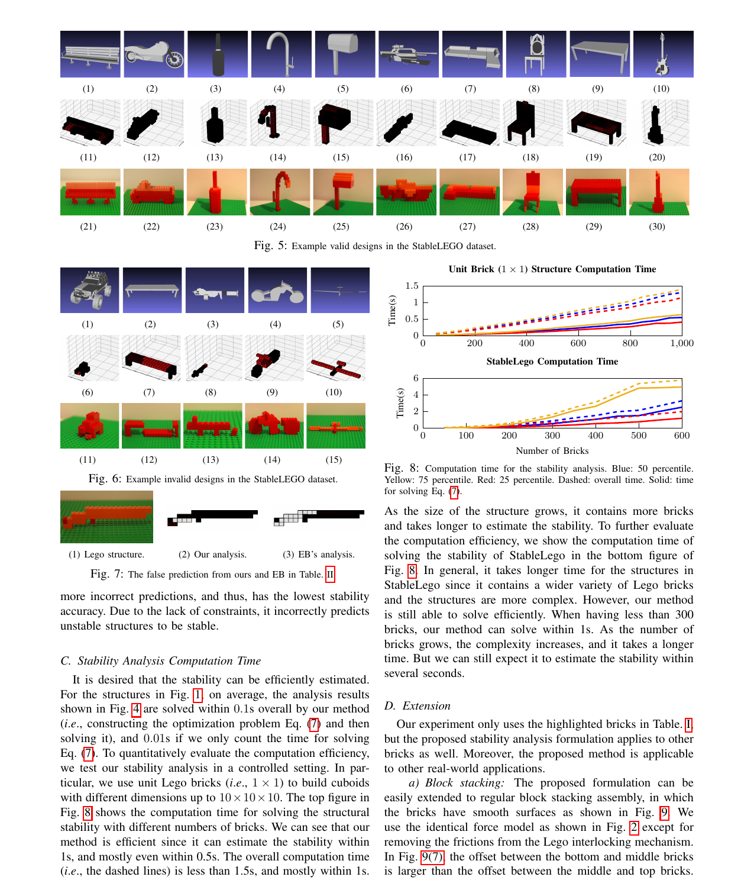

**Fig. 5.** Example valid designs in the StableLEGO dataset.

(1) (2) (3) (4) (5) (6) (7) (8) (9) (10) (11) (12) (13) (14) (15)

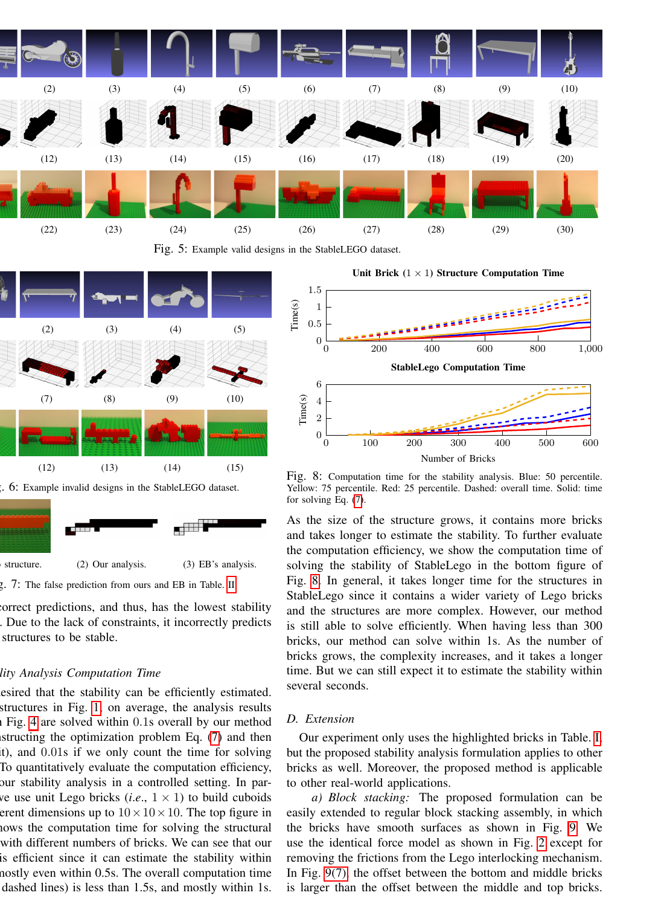

**Fig. 6.** Example invalid designs in the StableLEGO dataset.

(1) Lego structure. (2) Our analysis. (3) EB’s analysis.


**Fig. 7.** The false prediction from ours and EB in Table. II.

more incorrect predictions, and thus, has the lowest stability accuracy. Due to the lack of constraints, it incorrectly predicts unstable structures to be stable.

## C. Stability Analysis Computation Time

It is desired that the stability can be efficiently estimated. For the structures in Fig. 1, on average, the analysis results shown in Fig. 4 are solved within 0.1s overall by our method (i.e., constructing the optimization problem Eq. (7) and then solving it), and 0.01s if we only count the time for solving Eq. (7). To quantitatively evaluate the computation efficiency, we test our stability analysis in a controlled setting. In particular, we use unit Lego bricks ( i.e., 1 × 1) to build cuboids with different dimensions up to 10×10×10. The top figure in


**Fig. 8.** shows the computation time for solving the structural

stability with different numbers of bricks. We can see that our method is efficient since it can estimate the stability within 1s, and mostly even within 0.5s. The overall computation time (i.e., the dashed lines) is less than 1.5s, and mostly within 1s. 0 200 400 600 800 1,0000 0.5 1 1.5 Time(s) Unit Brick ( 1 × 1) Structure Computation Time 0 100 200 300 400 500 6000 2 4 6 Number of Bricks Time(s) StableLego Computation Time

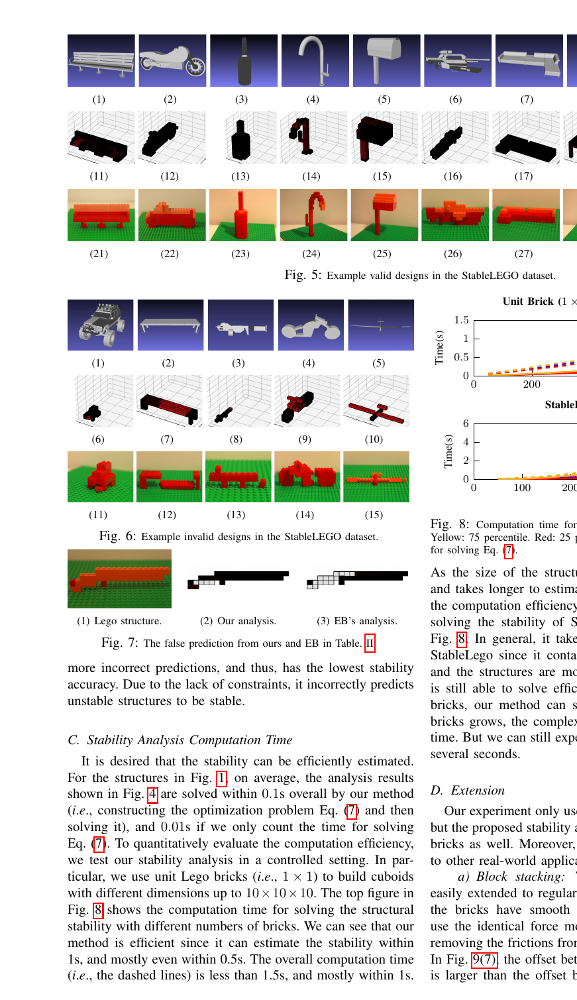

**Fig. 8.** Computation time for the stability analysis. Blue: 50 percentile.

Yellow: 75 percentile. Red: 25 percentile. Dashed: overall time. Solid: time for solving Eq. (7). As the size of the structure grows, it contains more bricks and takes longer to estimate the stability. To further evaluate the computation efficiency, we show the computation time of solving the stability of StableLego in the bottom figure of

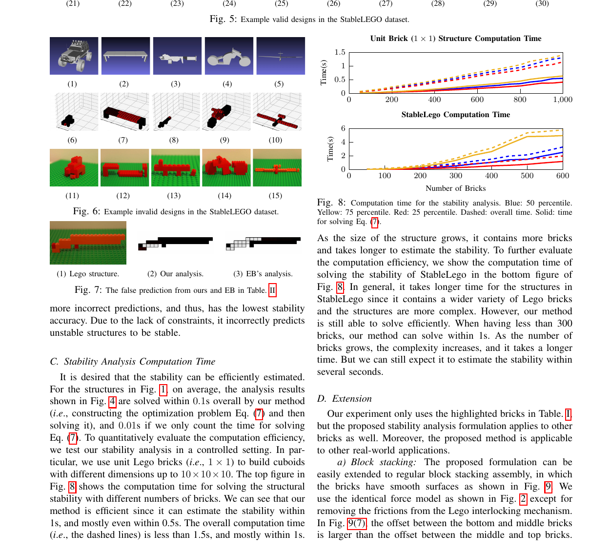

**Fig. 8..** In general, it takes longer time for the structures in

StableLego since it contains a wider variety of Lego bricks and the structures are more complex. However, our method is still able to solve efficiently. When having less than 300 bricks, our method can solve within 1s. As the number of bricks grows, the complexity increases, and it takes a longer time. But we can still expect it to estimate the stability within several seconds.

### D. Extension

Our experiment only uses the highlighted bricks in Table. I, but the proposed stability analysis formulation applies to other bricks as well. Moreover, the proposed method is applicable to other real-world applications. a) Block stacking: The proposed formulation can be easily extended to regular block stacking assembly, in which the bricks have smooth surfaces as shown in Fig. 9. We use the identical force model as shown in Fig. 2 except for removing the frictions from the Lego interlocking mechanism. In Fig. 9(7), the offset between the bottom and middle bricks is larger than the offset between the middle and top bricks.

<!-- Page 7 -->

7 (1) (2) (3) (4) (5) (6) (7) (8) (9) (10) (11) (12)

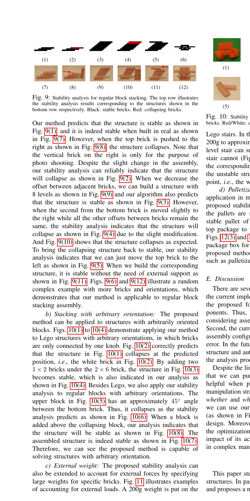

**Fig. 9.** Stability analysis for regular block stacking. The top row illustrates

the stability analysis results corresponding to the structures shown in the bottom row respectively. Black: stable bricks. Red: collapsing bricks. Our method predicts that the structure is stable as shown in

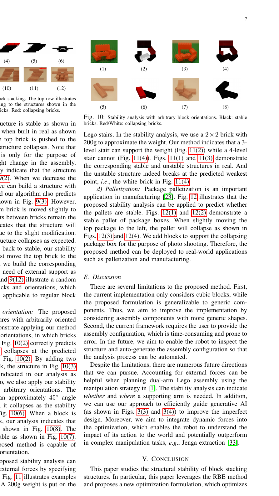

**Fig. 9.** (1), and it is indeed stable when built in real as shown

in Fig. 9(7). However, when the top brick is pushed to the right as shown in Fig. 9(8), the structure collapses. Note that the vertical brick on the right is only for the purpose of photo shooting. Despite the slight change in the assembly, our stability analysis can reliably indicate that the structure will collapse as shown in Fig. 9(2). When we decrease the offset between adjacent bricks, we can build a structure with

## 8 levels as shown in Fig. 9(9) and our algorithm also predicts

that the structure is stable as shown in Fig. 9(3). However, when the second from the bottom brick is moved slightly to the right while all the other offsets between bricks remain the same, the stability analysis indicates that the structure will collapse as shown in Fig. 9(4) due to the slight modification. And Fig. 9(10) shows that the structure collapses as expected. To bring the collapsing structure back to stable, our stability analysis indicates that we can just move the top brick to the left as shown in Fig. 9(5). When we build the corresponding structure, it is stable without the need of external support as shown in Fig. 9(11). Figs. 9(6) and 9(12) illustrate a random complex example with more bricks and orientations, which demonstrates that our method is applicable to regular block stacking assembly. b) Stacking with arbitrary orientation: The proposed method can be applied to structures with arbitrarily oriented blocks. Figs. 10(1) to 10(4) demonstrate applying our method to Lego structures with arbitrary orientations, in which bricks are only connected by one knob. Fig. 10(2) correctly predicts that the structure in Fig. 10(1) collapses at the predicted position, i.e., the white brick in Fig. 10(2). By adding two 1 × 2 bricks under the 2 × 6 brick, the structure in Fig. 10(3) becomes stable, which is also indicated in our analysis as shown in Fig. 10(4). Besides Lego, we also apply our stability analysis to regular blocks with arbitrary orientations. The upper block in Fig. 10(5) has an approximately 45◦ angle between the bottom brick. Thus, it collapses as the stability analysis predicts as shown in Fig. 10(6). When a block is added above the collapsing block, our analysis indicates that the structure will be stable as shown in Fig. 10(8). The assembled structure is indeed stable as shown in Fig. 10(7). Therefore, we can see the proposed method is capable of solving structures with arbitrary orientation. c) External weight: The proposed stability analysis can also be extended to account for external forces by specifying large weights for specific bricks. Fig. 11 illustrates examples of accounting for external loads. A 200g weight is put on the (1) (2) (3) (4) (5) (6) (7) (8)


**Fig. 10.** Stability analysis with arbitrary block orientations. Black: stable

bricks. Red/White: collapsing bricks. Lego stairs. In the stability analysis, we use a 2 × 2 brick with 200g to approximate the weight. Our method indicates that a 3level stair can support the weight (Fig. 11(2)) while a 4-level stair cannot (Fig. 11(4)). Figs. 11(1) and 11(3) demonstrate the corresponding stable and unstable structures in real. And the unstable structure indeed breaks at the predicted weakest point, i.e., the white brick in Fig. 11(4). d) Palletization: Package palletization is an important application in manufacturing [23]. Fig. 12 illustrates that the proposed stability analysis can be applied to predict whether the pallets are stable. Figs. 12(1) and 12(2) demonstrate a stable pallet of package boxes. When slightly moving the top package to the left, the pallet will collapse as shown in Figs. 12(3) and 12(4). We add blocks to support the collapsing package box for the purpose of photo shooting. Therefore, the proposed method can be deployed to real-world applications such as palletization and manufacturing.

### E. Discussion

There are several limitations to the proposed method. First, the current implementation only considers cubic blocks, while the proposed formulation is generalizable to generic components. Thus, we aim to improve the implementation by considering assembly components with more generic shapes. Second, the current framework requires the user to provide the assembly configuration, which is time-consuming and prone to error. In the future, we aim to enable the robot to inspect the structure and auto-generate the assembly configuration so that the analysis process can be automated. Despite the limitations, there are numerous future directions that we can pursue. Accounting for external forces can be helpful when planning dual-arm Lego assembly using the manipulation strategy in [1]. The stability analysis can indicate whether and where a supporting arm is needed. In addition, we can use our approach to efficiently guide generative AI (as shown in Figs. 3(3) and 3(4)) to improve the imperfect design. Moreover, we aim to integrate dynamic forces into the optimization, which enables the robot to understand the impact of its action to the world and potentially outperform in complex manipulation tasks, e.g., Jenga extraction [33]. V. C ONCLUSION This paper studies the structural stability of block stacking structures. In particular, this paper leverages the RBE method and proposes a new optimization formulation, which optimizes

<!-- Page 8 -->

8 (1) (2) (3) (4)

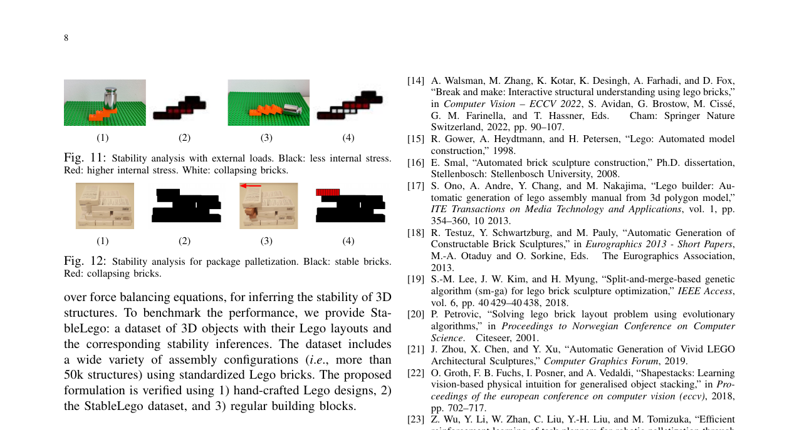

**Fig. 11.** Stability analysis with external loads. Black: less internal stress.

Red: higher internal stress. White: collapsing bricks. (1) (2) (3) (4)

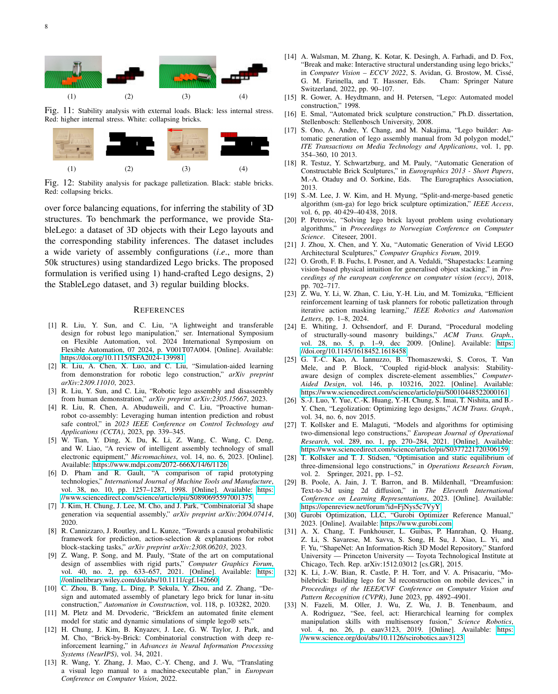

**Fig. 12.** Stability analysis for package palletization. Black: stable bricks.

Red: collapsing bricks. over force balancing equations, for inferring the stability of 3D structures. To benchmark the performance, we provide StableLego: a dataset of 3D objects with their Lego layouts and the corresponding stability inferences. The dataset includes a wide variety of assembly configurations ( i.e., more than 50k structures) using standardized Lego bricks. The proposed formulation is verified using 1) hand-crafted Lego designs, 2) the StableLego dataset, and 3) regular building blocks.

## REFERENCES

[1] R. Liu, Y . Sun, and C. Liu, “A lightweight and transferable design for robust lego manipulation,” ser. International Symposium on Flexible Automation, vol. 2024 International Symposium on Flexible Automation, 07 2024, p. V001T07A004. [Online]. Available: https://doi.org/10.1115/ISFA2024-139981 [2] R. Liu, A. Chen, X. Luo, and C. Liu, “Simulation-aided learning from demonstration for robotic lego construction,” arXiv preprint arXiv:2309.11010, 2023. [3] R. Liu, Y . Sun, and C. Liu, “Robotic lego assembly and disassembly from human demonstration,” arXiv preprint arXiv:2305.15667 , 2023. [4] R. Liu, R. Chen, A. Abuduweili, and C. Liu, “Proactive humanrobot co-assembly: Leveraging human intention prediction and robust safe control,” in 2023 IEEE Conference on Control Technology and Applications (CCTA), 2023, pp. 339–345. [5] W. Tian, Y . Ding, X. Du, K. Li, Z. Wang, C. Wang, C. Deng, and W. Liao, “A review of intelligent assembly technology of small electronic equipment,” Micromachines, vol. 14, no. 6, 2023. [Online]. Available: https://www.mdpi.com/2072-666X/14/6/1126 [6] D. Pham and R. Gault, “A comparison of rapid prototyping technologies,” International Journal of Machine Tools and Manufacture, vol. 38, no. 10, pp. 1257–1287, 1998. [Online]. Available: https: //www.sciencedirect.com/science/article/pii/S0890695597001375 [7] J. Kim, H. Chung, J. Lee, M. Cho, and J. Park, “Combinatorial 3d shape generation via sequential assembly,” arXiv preprint arXiv:2004.07414 , 2020. [8] R. Cannizzaro, J. Routley, and L. Kunze, “Towards a causal probabilistic framework for prediction, action-selection & explanations for robot block-stacking tasks,” arXiv preprint arXiv:2308.06203 , 2023. [9] Z. Wang, P. Song, and M. Pauly, “State of the art on computational design of assemblies with rigid parts,” Computer Graphics Forum , vol. 40, no. 2, pp. 633–657, 2021. [Online]. Available: https: //onlinelibrary.wiley.com/doi/abs/10.1111/cgf.142660 [10] C. Zhou, B. Tang, L. Ding, P. Sekula, Y . Zhou, and Z. Zhang, “Design and automated assembly of planetary lego brick for lunar in-situ construction,” Automation in Construction , vol. 118, p. 103282, 2020. [11] M. Pletz and M. Drvoderic, “Brickfem an automated finite element model for static and dynamic simulations of simple lego® sets.” [12] H. Chung, J. Kim, B. Knyazev, J. Lee, G. W. Taylor, J. Park, and

### M. Cho, “Brick-by-Brick: Combinatorial construction with deep re-

inforcement learning,” in Advances in Neural Information Processing Systems (NeurIPS), vol. 34, 2021. [13] R. Wang, Y . Zhang, J. Mao, C.-Y . Cheng, and J. Wu, “Translating a visual lego manual to a machine-executable plan,” in European Conference on Computer Vision , 2022. [14] A. Walsman, M. Zhang, K. Kotar, K. Desingh, A. Farhadi, and D. Fox, “Break and make: Interactive structural understanding using lego bricks,” in Computer Vision – ECCV 2022 , S. Avidan, G. Brostow, M. Ciss ´e, G. M. Farinella, and T. Hassner, Eds. Cham: Springer Nature Switzerland, 2022, pp. 90–107. [15] R. Gower, A. Heydtmann, and H. Petersen, “Lego: Automated model construction,” 1998. [16] E. Smal, “Automated brick sculpture construction,” Ph.D. dissertation, Stellenbosch: Stellenbosch University, 2008. [17] S. Ono, A. Andre, Y . Chang, and M. Nakajima, “Lego builder: Automatic generation of lego assembly manual from 3d polygon model,” ITE Transactions on Media Technology and Applications , vol. 1, pp. 354–360, 10 2013. [18] R. Testuz, Y . Schwartzburg, and M. Pauly, “Automatic Generation of Constructable Brick Sculptures,” in Eurographics 2013 - Short Papers , M.-A. Otaduy and O. Sorkine, Eds. The Eurographics Association, 2013. [19] S.-M. Lee, J. W. Kim, and H. Myung, “Split-and-merge-based genetic algorithm (sm-ga) for lego brick sculpture optimization,” IEEE Access, vol. 6, pp. 40 429–40 438, 2018. [20] P. Petrovic, “Solving lego brick layout problem using evolutionary algorithms,” in Proceedings to Norwegian Conference on Computer Science. Citeseer, 2001. [21] J. Zhou, X. Chen, and Y . Xu, “Automatic Generation of Vivid LEGO Architectural Sculptures,” Computer Graphics Forum, 2019. [22] O. Groth, F. B. Fuchs, I. Posner, and A. Vedaldi, “Shapestacks: Learning vision-based physical intuition for generalised object stacking,” in Proceedings of the european conference on computer vision (eccv) , 2018, pp. 702–717. [23] Z. Wu, Y . Li, W. Zhan, C. Liu, Y .-H. Liu, and M. Tomizuka, “Efficient reinforcement learning of task planners for robotic palletization through iterative action masking learning,” IEEE Robotics and Automation Letters, pp. 1–8, 2024. [24] E. Whiting, J. Ochsendorf, and F. Durand, “Procedural modeling of structurally-sound masonry buildings,” ACM Trans. Graph. , vol. 28, no. 5, p. 1–9, dec 2009. [Online]. Available: https: //doi.org/10.1145/1618452.1618458 [25] G. T.-C. Kao, A. Iannuzzo, B. Thomaszewski, S. Coros, T. Van Mele, and P. Block, “Coupled rigid-block analysis: Stabilityaware design of complex discrete-element assemblies,” Computer- Aided Design , vol. 146, p. 103216, 2022. [Online]. Available: https://www.sciencedirect.com/science/article/pii/S0010448522000161 [26] S.-J. Luo, Y . Yue, C.-K. Huang, Y .-H. Chung, S. Imai, T. Nishita, and B.- Y . Chen, “Legolization: Optimizing lego designs,” ACM Trans. Graph., vol. 34, no. 6, nov 2015. [27] T. Kollsker and E. Malaguti, “Models and algorithms for optimising two-dimensional lego constructions,” European Journal of Operational Research, vol. 289, no. 1, pp. 270–284, 2021. [Online]. Available: https://www.sciencedirect.com/science/article/pii/S0377221720306159 [28] T. Kollsker and T. J. Stidsen, “Optimisation and static equilibrium of three-dimensional lego constructions,” in Operations Research Forum , vol. 2. Springer, 2021, pp. 1–52. [29] B. Poole, A. Jain, J. T. Barron, and B. Mildenhall, “Dreamfusion: Text-to-3d using 2d diffusion,” in The Eleventh International Conference on Learning Representations , 2023. [Online]. Available:

```text
https://openreview.net/forum?id=FjNys5c7VyY
```

[30] Gurobi Optimization, LLC, “Gurobi Optimizer Reference Manual,” 2023. [Online]. Available: https://www.gurobi.com [31] A. X. Chang, T. Funkhouser, L. Guibas, P. Hanrahan, Q. Huang,

### Z. Li, S. Savarese, M. Savva, S. Song, H. Su, J. Xiao, L. Yi, and

### F. Yu, “ShapeNet: An Information-Rich 3D Model Repository,” Stanford

University — Princeton University — Toyota Technological Institute at Chicago, Tech. Rep. arXiv:1512.03012 [cs.GR], 2015. [32] K. Li, J.-W. Bian, R. Castle, P. H. Torr, and V . A. Prisacariu, “Mobilebrick: Building lego for 3d reconstruction on mobile devices,” in Proceedings of the IEEE/CVF Conference on Computer Vision and Pattern Recognition (CVPR), June 2023, pp. 4892–4901. [33] N. Fazeli, M. Oller, J. Wu, Z. Wu, J. B. Tenenbaum, and

### A. Rodriguez, “See, feel, act: Hierarchical learning for complex

manipulation skills with multisensory fusion,” Science Robotics , vol. 4, no. 26, p. eaav3123, 2019. [Online]. Available: https: //www.science.org/doi/abs/10.1126/scirobotics.aav3123
