# ScienceDirect Streamlining LEGO® model design: an automated optimisation approach

Source PDF: `Streamlining LEGO model design- an automated optimisation approach.pdf`

Evidence bundle: `evidence/`

<!-- Page 1 -->

Available online at www.sciencedirect.com Procedia CIRP 126 (2024) 945–950 2212-8271 © 2024 The Authors. Published by Elsevier B.V. This is an open access article under the CC BY-NC-ND license ( https://creativecommons.org/licenses/by-nc-nd/4.0 ) Peer-review under responsibility of the scientific committee of the 17th CIRP Conference on Intelligent Computation in Manufacturing Engineering (CIRP ICME‘23) 10.1016/j.procir.2024.08.359 17th CIRP Conference on Intelligent Computation in Manufacturing Engineering (CIRP ICME ‘23)

### Keywords: Design optimisation; Greedy algorithm; Graph optimisation

## 1. Introduction

LEGO® bricks are used for a variety of purposes, including artwork, merchandising, commercial promotion, and corporate branding through large-scale models that showcase uniqueness, artistry, and custom scenic designs [1]. The LEGO® construction problem (LCP), which dates back to 2001 [2], poses the question of how to construct any 3D object using LEGO® bricks. Ongoing research and development efforts aim to improve the automation and accessibility of the LCP [1]. Automated LEGO® construction algorithms (LCA) [3] are a method of automatically constructing LEGO® brick models using computer science(CS) and machine learning(ML). Such algorithms are designed to improve the efficiency of LEGO® brick model creation. Traditional methods require designers to measure the target object, collect model information, and manually design the brick layout using LEGO® bricks. This process is time consuming and relies on the designer expertise and personal preferences. In contrast, the LCA accelerates and simplifies the construction of complex models through computational algorithms and techniques. Kuo et. al. proposed the Pixel2Brick computational framework to automatically construct 2D brick models from pixel art, where the input is limited to pixelart images andthe output is2D models only [4]. Luo et. al. developed a force -based analysis to evaluate the physical stability of a given model [5]. Hong et. al. provided a novel approach to generatea mechanically balanced LCA for a 3D model from a mechanical analysis using centroid adjustment and inner engraving, which was built using only six types of bricks [6]. Lee et al. proposed a split-and-merge-based genetic algorithm (SM-GA) to convert a given 3D voxel model into a LEGO ® model using a minimum number of bricks, Nengsheng Baoa, Yongyi Zhanga, Yuchen Fana,b, Alessandro Simeoneb,* aIntelligent Manufacturing Key Laboratory of Ministry of Education, Shantou University, Shantou, China bDepartment of Management and Production Engineering, Politecnico di Torino, Corso Duca degli Abruzzi 24, Torino, Italy * Corresponding author. Tel.: +39-011-0907689. E-mail address: alessandro.simeone@polito.it

## Abstract

LEGO® models have become increasingly popular beyond their traditional toy and entertainment applications, and are now used in fields such as education, cognitive science, engineeringand robotics. However, designing LEGO® models for such diverse applications poses new challenges in terms of automation and optimisation. To address such issues, this paper proposes a design support system that automatically generates LEGO® models from any 3D model of a target object using a specific set of standard LEGO® bricks in a layer-by-layer fashion. The system converts the 3D model into a LEGO® model using the minimum number of LEGO® bricks required. The core of the proposed system lies in the use of a greedy algorithm for merging optimisation of each layer of bricks and a depth-first search algorithm for optimising the connection between multiple layers of bricks. Experimental results on several 3D graphics validate the effectiveness of the proposed methodology and its ability to output the corresponding LEGO® model and detailed layout illustrations for each layer of bricks. The proposed system can provide LEGO® builders with an automated optimisation approach for designing LEGO® models, minimising errors compared to manual design. © 2024 The Authors. Published by Elsevier B.V . This is an open access article under the CC BY-NC-ND license (https://creativecommons.org/licenses/by-nc-nd/4.0) Peer-review under responsibility of the scientific committee of the 17th CIRP Conference on Intelligent Computation in Manufacturing Engineering (CIRP ICME‘23)

<!-- Page 2 -->

## 946 Nengsheng Bao et al. / Procedia CIRP 126 (2024) 945–950

although this approach did not provide a stability assessment of the LEGO® model [7]. Zhou et al. introduced an automated system for converting architectural models into LEGO ® models while preserving the shape features of the original model, but the study was limited to architectural models [8]. Kollsker et al. presented an automated method for optimising LEGO® structures, focusing on the construction of LEGO ® models of two -dimensional structures, but did not conduct research on three-dimensional LEGO® models [9]. To address the literature gap, this research presents a design support system that efficiently generates LEGO® models from diverse 3D objects using a minimal set of standard bricks. It uses a greedy algorithm to optimise brick layers and a depth first search algorithm to i mprove connections between layers. The system accepts different 3D models, evaluates stability, and produces comprehensive 3D model outputs. Users can interact with a graphical user interface (GUI) to select input models, choose from 11 brick types, adjust scale, and obtain LEGO® model outputs, including 3D files, brick usage statistics and assembly step images.

## 2. Framework and methodology

This research presents a methodology consisting of 5 key steps aimed at supporting the design process by transforming a generic 3D model into a LEGO® model built with standard bricks, as shown in Fig. 1.

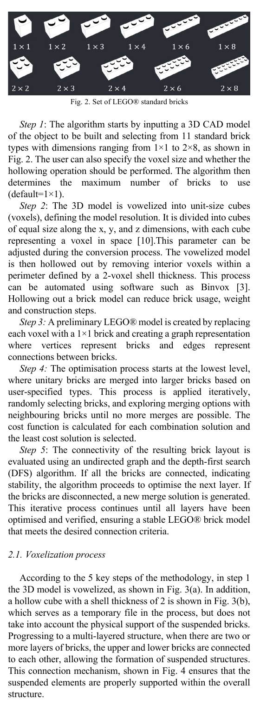

**Fig. 1..** Methodology flowchart

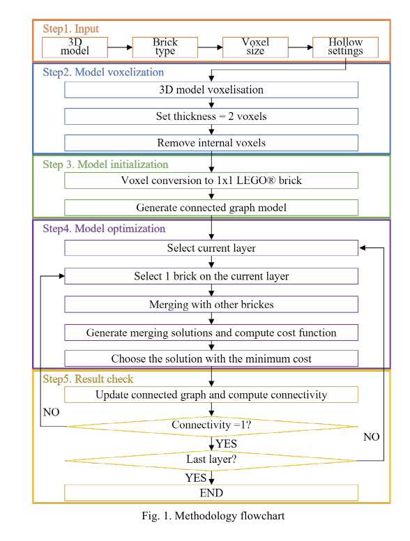

**Fig. 2..** Set of LEGO® standard bricks

Step 1: The algorithm starts by inputting a 3D CAD model of the object to be built and selecting from 11 standard brick types with dimensions ranging from 1×1 to 2×8, as shown in

**Fig. 2..** The user can also specify the voxel size and whether the

hollowing operation should be performed. The algorithm then determines the maximum number of bricks to use

```text
(default=1×1).
```

Step 2: The 3D model is vowelized into unit -size cubes (voxels), defining the model resolution. It is divided into cubes of equal size along the x, y, and z dimensions, with each cube representing a voxel in space [10].This parameter can be adjusted during the conversion process. The vowelized model is then hollowed out by removing interior voxels within a perimeter defined by a 2 -voxel shell thickness. This process can be automated using software such as Binvox [3]. Hollowing out a brick model can reduce brick usage, weight and construction steps. Step 3: A preliminary LEGO® model is created by replacing each voxel with a 1×1 brick and creating a graph representation where vertices represent bricks and edges represent connections between bricks. Step 4: The optimisation process starts at the lowest level, where unitary bricks are merged into larger bricks based on user-specified types. This process is applied iteratively, randomly selecting bricks, and exploring merging options with neighbouring bricks until no more merges are possible. The cost function is calculated for each combination solution and the least cost solution is selected. Step 5: The connectivity of the resulting brick layout is evaluated using an undirected graph and the depth-first search (DFS) algorithm. If all the bricks are connected, indicating stability, the algorithm proceeds to optimise the next layer. If the bricks are disconnected, a new merge solution is generated. This iterative process continues until all layers have been optimised and verified, ensuring a stable LEGO® brick model that meets the desired connection criteria.

### 2.1. Voxelization process

According to the 5 key steps of the methodology, in step 1 the 3D model is vowelized, as shown in Fig. 3(a). In addition, a hollow cube with a shell thickness of 2 is shown in Fig. 3(b), which serves as a temporary file in the process, but does not take into account the physical support of the suspended bricks. Progressing to a multi-layered structure, when there are two or more layers of bricks, the upper and lower bricks are connected to each other, allowing the formation of suspended structures. This connection mechanism, shown in Fig. 4 ensures that the suspended elements are properly supported within the overall structure.

<!-- Page 3 -->

Nengsheng Bao et al. / Procedia CIRP 126 (2024) 945–950 947 (a) (b)

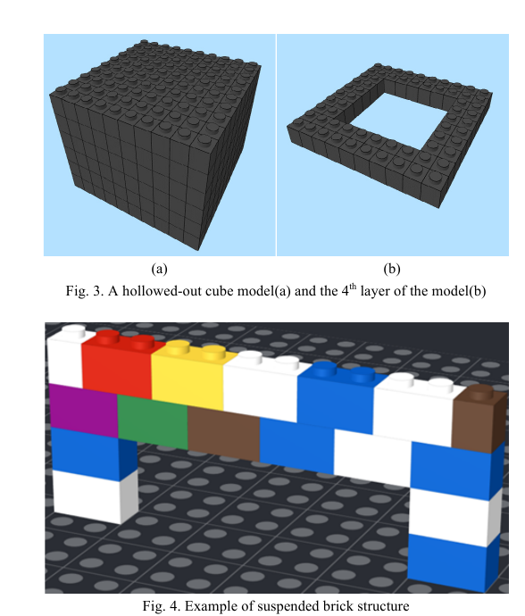

**Fig. 3..** A hollowed-out cube model(a) and the 4th layer of the model(b)

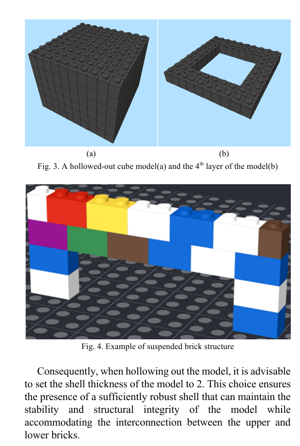

**Fig. 4..** Example of suspended brick structure

Consequently, when hollowing out the model, it is advisable to set the shell thickness of the model to 2. This choice ensures the presence of a sufficiently robust shell that can maintain the stability and structural integrity of the model while accommodating the interconnection between the upper and lower bricks.

### 2.2. Greedy algorithm

With a fixed shape, there is a limited choice of different bricks to fill the area. The cost function mathematically describes the objective statement of the optimisation problem to effectively explore the search space and find solutions that are close to optimal. This research work describes three merging decision actions for making merging decisions on individual LEGO® bricks, as shown in Fig. 5, which define the neighbourhood of a new solution: a) Randomly select a LEGO® brick in the current area and join it with an adjacent LEGO® brick to make a larger brick. b) Some basic bricks cannot be made by simply joining two smaller bricks. Randomly select a LEGO® brick in the current area and join it with several adjacent bricks to create a larger brick. c) In some cases, when there are no more unmerged bricks to merge, the current partial solution is reconstructed by splitting and moving a large brick. Randomly select a brick and decompose it into 1×1 bricks. Note that the decomposed and merged bricks must be part of the set of basic LEGO® bricks specified by the algorithm. To ensure the stability of LEGO® structures, three requirements must be met [11]: (a) (b) (c)

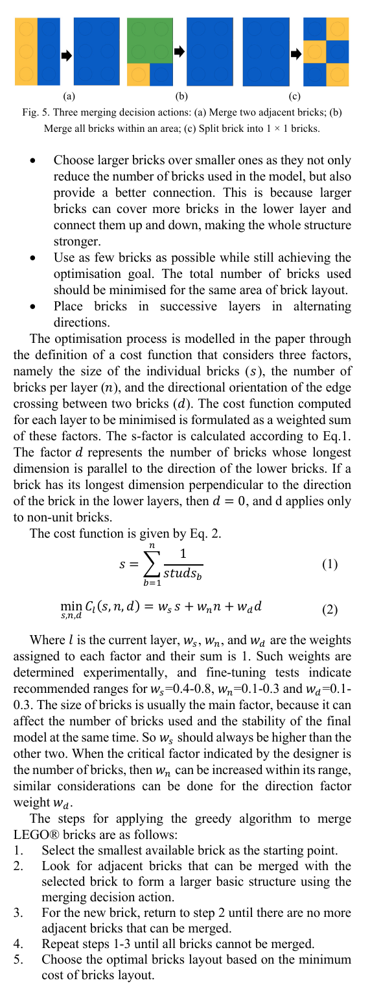

**Fig. 5..** Three merging decision actions: (a) Merge two adjacent bricks; (b)

Merge all bricks within an area; (c) Split brick into 1 × 1 bricks. • Choose larger bricks over smaller ones as they not only reduce the number of bricks used in the model, but also provide a better connection. This is because larger bricks can cover more bricks in the lower layer and connect them up and down, making the whole structure stronger. • Use as few bricks as possible while still achieving the optimisation goal. The total number of bricks used should be minimised for the same area of brick layout. • Place bricks in successive layers in alternating directions. The optimisation process is modelled in the paper through the definition of a cost function that considers three factors, namely the size of the individual bricks ( 𝑠𝑠), the number of bricks per layer (𝑛𝑛), and the directional orientation of the edge crossing between two bricks ( 𝑑𝑑). The cost function computed for each layer to be minimised is formulated as a weighted sum of these factors. The s -factor is calculated according to Eq.1 . The factor 𝑑𝑑represents the number of bricks whose longest dimension is parallel to the direction of the lower bricks. If a brick has its longest dimension perpendicular to the direction

```text
of the brick in the lower layers, then 𝑑𝑑= 0, and d applies only
to non-unit bricks.
The cost function is given by Eq. 2.
𝑠𝑠= & 1
𝑠𝑠𝑠𝑠𝑠𝑠𝑑𝑑𝑠𝑠!
"
!#$
(1)
min
%,",'
𝐶𝐶((𝑠𝑠, 𝑛𝑛, 𝑑𝑑) = 𝑤𝑤% 𝑠𝑠+ 𝑤𝑤"𝑛𝑛+ 𝑤𝑤'𝑑𝑑 (2)
```

Where 𝑙𝑙is the current layer, 𝑤𝑤%, 𝑤𝑤", and 𝑤𝑤' are the weights assigned to each factor and their sum is 1 . Such weights are determined experimentally, and fine -tuning tests indicate

```text
recommended ranges for 𝑤𝑤%=0.4-0.8, 𝑤𝑤"=0.1-0.3 and 𝑤𝑤'=0.1-
```

### 0.3. The size of bricks is usually the main factor, because it can

affect the number of bricks used and the stability of the final model at the same time. So 𝑤𝑤% should always be higherthan the other two. When the critical factor indicated by the designer is the number of bricks, then 𝑤𝑤" can be increased within its range, similar considerations can be done for the direction factor weight 𝑤𝑤'. The steps for applying the greedy algorithm to merge LEGO® bricks are as follows:

## 1. Select the smallest available brick as the startingpoint.

## 2. Look for adjacent bricks that can be merged with the

selected brick to form a larger basic structure using the merging decision action.

## 3. For the new brick, return to step 2 until there are no more

adjacent bricks that can be merged.

## 4. Repeat steps 1-3 until all bricks cannot be merged.

## 5. Choose the optimal bricks layout based on the minimum

cost of bricks layout.

<!-- Page 4 -->

## 948 Nengsheng Bao et al. / Procedia CIRP 126 (2024) 945–950

(a) (b)

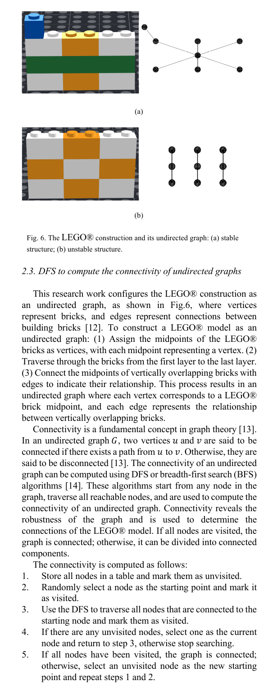

**Fig. 6..** The LEGO® construction and its undirected graph: (a) stable

structure; (b) unstable structure.

### 2.3. DFS to compute the connectivity of undirected graphs

This research work configures the LEGO® construction as an undirected graph, as shown in Fig .6, where vertices represent bricks, and edges represent connections between building bricks [12]. To construct a LEGO® model as an undirected graph: (1) Assign the midpoints of the LEGO® bricks as vertices, with each midpoint representing a vertex. (2) Traverse through the bricks from the first layer to the last layer. (3) Connect the midpoints of vertically overlapping bricks with edges to indicate their relationship. This process results in an undirected graph where each vertex corresponds to a LEGO® brick midpoint, and each edge represents the relationship between vertically overlapping bricks. Connectivity is a fundamental concept in graph theory[13]. In an undirected graph 𝐺𝐺, two vertices 𝑢𝑢and 𝑣𝑣are said to be connected if there exists a path from 𝑢𝑢to 𝑣𝑣. Otherwise, they are said to be disconnected[13]. The connectivity of an undirected graph can be computed using DFS or breadth-first search (BFS) algorithms [14]. These algorithms start from any node in the graph, traverse all reachable nodes, and are used to compute the connectivity of an undirected graph. Connectivity reveals the robustness of the graph and is used to determine the connections of the LEGO® model. If all nodes are visited, the graph is connected; otherwise, it can be divided into connected components. The connectivity is computed as follows:

## 1. Store all nodes in a table and mark them as unvisited.

## 2. Randomly select a node as the starting point and mark it

as visited.

## 3. Use the DFS to traverse all nodes that are connected to the

starting node and mark them as visited.

## 4. If there are any unvisited nodes, select one as the current

node and return to step 3, otherwise stop searching.

## 5. If all nodes have been visited, the graph is connected;

otherwise, select an unvisited node as the new starting point and repeat steps 1 and 2.

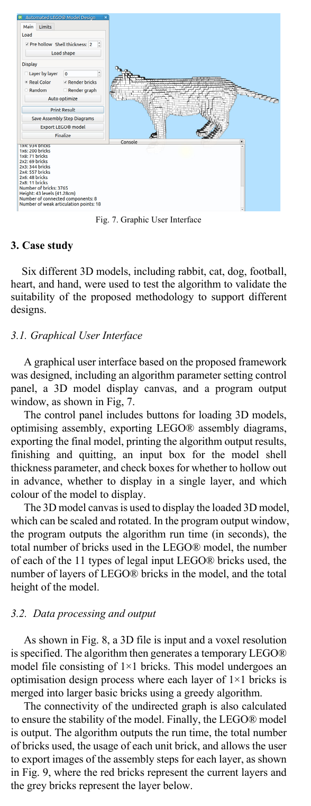

**Fig. 7..** Graphic User Interface

## 3. Case study

Six different 3D models, including rabbit, cat, dog, football, heart, and hand, were used to test the algorithm to validate the suitability of the proposed methodology to support different designs.

### 3.1. Graphical User Interface

A graphical user interface based on the proposed framework was designed, including an algorithm parameter setting control panel, a 3D model display canvas, and a program output window, as shown in Fig, 7. The control panel includes buttons for loading 3D models, optimising assembly, exporting LEGO® assembly diagrams, exporting the final model, printing the algorithm output results, finishing and quitting, an input box for the model shell thickness parameter, and check boxes for whether to hollow out in advance, whether to display in a single layer, and which colour of the model to display. The 3D model canvas is used to display the loaded 3D model, which can be scaled and rotated. In the program output window, the program outputs the algorithm run time (in seconds ), the total number of bricks used in the LEGO® model, the number of each of the 11 types of legal input LEGO® bricks used, the number of layers of LEGO® bricks in the model, and the total height of the model.

### 3.2. Data processing and output

As shown in Fig. 8, a 3D file is input and a voxel resolution is specified. The algorithm then generates a temporary LEGO® model file consisting of 1×1 bricks. This model undergoes an optimisation design process where each layer of 1×1 bricks is merged into larger basic bricks using a greedy algorithm. The connectivity of the undirected graph is also calculated to ensure the stability of the model. Finally, the LEGO® model is output. The algorithm outputs the run time, the total number of bricks used, the usage of each unit brick, and allows the user to export images of the assembly steps for each layer, as shown in Fig. 9, where the red bricks represent the current layers and the grey bricks represent the layer below.

<!-- Page 5 -->

Nengsheng Bao et al. / Procedia CIRP 126 (2024) 945–950 949 (a) (b) (c) (d) (e) (f) (g) (h)

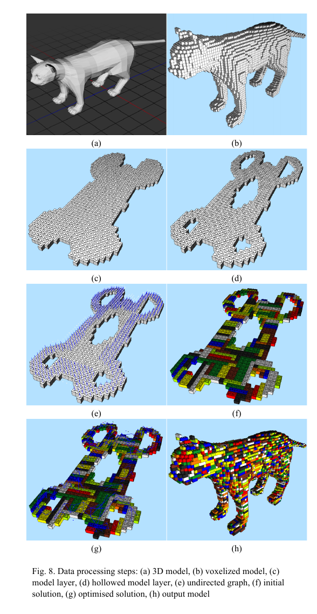

**Fig. 8..** Data processing steps: (a) 3D model, (b) voxelized model, (c)

model layer, (d) hollowed model layer, (e) undirected graph, (f) initial solution, (g) optimised solution, (h) output model

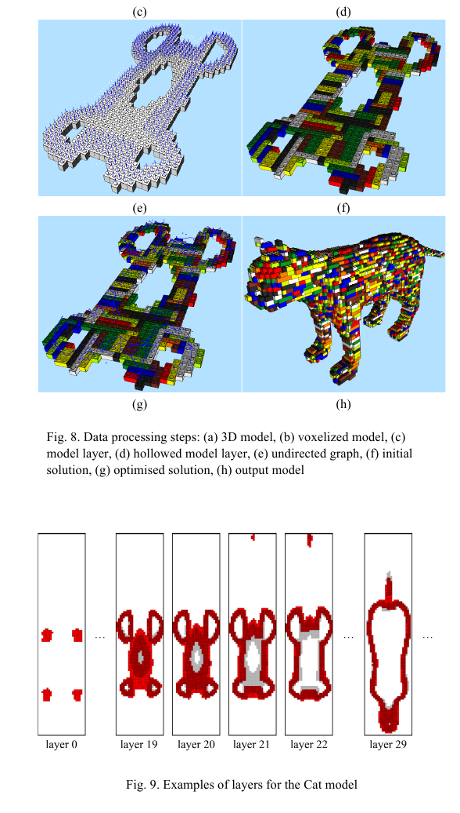

**Fig. 9..** Examples of layers for the Cat model

## 4. Results and discussion

The results of the algorithm are partially shown in Fig. 10 in terms of the input 3D files and the corresponding LEGO® model output.A detailed breakdown of the experimental results is given in Table 1 in terms of maximum resolution, number of voxels of the vowelized model, number of bricks after merging optimisation, computation time, number of bricks, number of layers and model height. In Table 1, the voxelization resolution is presented as a measure of the clarity of voxelization for 3D models, quantified by the maximum number of voxels that can be displayed in the x-, y- and z-axis directions. Based on the experimental results presented in Table 1, the proposed method has demonstrated its effectiveness in generating LEGO® models.

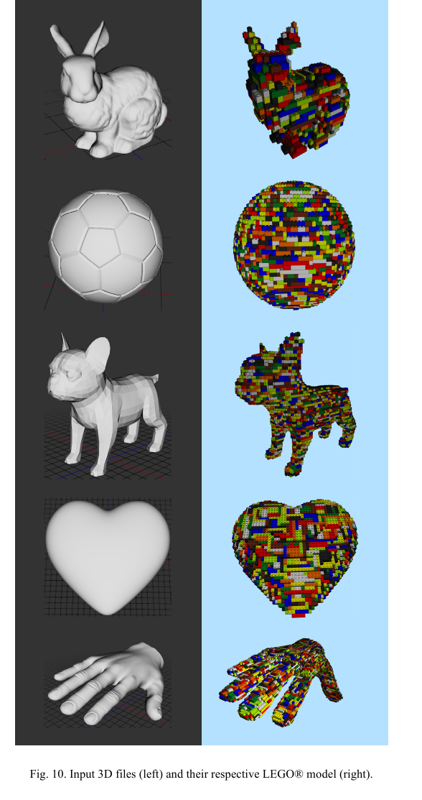

**Fig. 10..** Input 3D files (left) and their respective LEGO® model (right).

<!-- Page 6 -->

## 950 Nengsheng Bao et al. / Procedia CIRP 126 (2024) 945–950

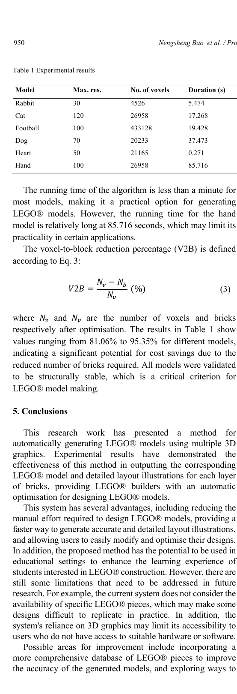

**Table 1.** Experimental results

Model Max. res. No. of voxels Duration (s) No. of bricks Layers Height (cm) V2B (%) Rabbit 30 4526 5.474 857 25 24 81.06 Cat 120 26958 17.268 3807 43 41.28 85.88 Football 100 433128 19.428 20157 83 79.68 95.35 Dog 70 20233 37.473 3461 70 67.2 82.89 Heart 50 21165 0.271 2649 18 17.28 87.48 Hand 100 26958 85.716 3710 43 41.28 86.24 The running time of the algorithm is less than a minute for most models, making it a practical option for generating LEGO® models. However, the running time for the hand model is relatively long at 85.716 seconds, which may limit its practicality in certain applications. The voxel-to-block reduction percentage (V2B) is defined according to Eq. 3: 𝑉𝑉2𝐵𝐵= 𝑁𝑁) − 𝑁𝑁! 𝑁𝑁) (%) (3) where 𝑁𝑁) and 𝑁𝑁) are the number of voxels and bricks respectively after optimisation. The results in Table 1 show values ranging from 81.06% to 95.35% for different models, indicating a significant potential for cost savings due to the reduced number of bricks required. All models were validated to be structurally stable, which is a critical criterion for LEGO® model making.

## 5. Conclusions

This research work has presented a method for automatically generating LEGO® models using multiple 3D graphics. Experimental results have demonstrated the effectiveness of this method in outputting the corresponding LEGO® model and detailed layout illustrations for each layer of bricks, providing LEGO® builders with an automatic optimisation for designing LEGO® models. This system has several advantages, including reducing the manual effort required to design LEGO® models, providing a faster way to generate accurate and detailed layout illustrations, and allowing users to easily modify and optimise their designs. In addition, the proposed method has the potential to be used in educational settings to enhance the learning experience of students interested in LEGO® construction. However, there are still some limitations that need to be addressed in future research. For example, the current system does not consider the availability of specific LEGO® pieces, which may make some designs difficult to replicate in practice . In addition, the system's reliance on 3D graphics may limit its accessibility to users who do not have access to suitable hardware or software. Possible areas for improvement include incorporating a more comprehensive database of LEGO® pieces to improve the accuracy of the generated models, and exploring ways to make the system more accessible and user-friendly for a wider audience.

## Acknowledgements

This work was supported by the 2020 Li Ka Shing Foundation Cross -Disciplinary Research under Grant 2020LKSFG06D.

## References

[1] Kim, J.W., Kang, K.K., and Lee, J.H., 2014. Survey on automated LEGO assembly construction. 22nd International Conference in Central Europe on Computer Graphics, Visualization and Computer Vision, WSCG 2014, Poster Papers Proceedings - in Co -Operation wit h EUROGRAPHICS Association. 89–96. [2] Petrovic, P., 2001. Solving LEGO brick layout problem using Evolutionary Algorithms. Evolutionary Computation and Artificial Life Group (EVAL). (May), 1–11. [3] Xu, X., Corrigan, D., Dehghani, A., Caulfield, S., and Moloney, D., 2016. 3D Object Recognition Based on Volumetric Representation Using Convolutional Neural Networks. in: pp. 147 –156. [4] Kuo, M.H., Lin, Y.E., Chu, H.K., Lee, R.R., and Yang, Y.L., 2015. Pixel 2B rick: Constructing Brick Sculptures from Pixel Art. Computer Graphics Forum. 34 (7), 339–348. [5] Luo, S.J., Yue, Y., Huang, C.K., Chung, Y.H., Imai, S., Nishita, T., et al.,

## 2015. Legolization: Optimizing LEGO designs. ACM Transactions on

Graphics. 34 (6), 1–12. [6] Hong, J.-Y., Way, D.-L., Shih, Z.-C., Tai, W.-K., and Chang, C.-C., 2016. Inner engraving for the creation of a balanced LEGO sculpture. The Visual Computer. 32 (5), 569–578. [7] Lee, S. -M., Kim, J.W., and Myung, H., 2018. Split -and-Merge-Based Genetic Algorithm (SM -GA) for LEGO Brick Sculpture Optimization. IEEE Access. 6 40429–40438. [8] Zhou, J., Chen, X., and Xu, Y., 2019. Automatic Generation of Vivid LEGO Architectural Sculptures. Computer Graphics Forum. 38 (6), 31 – 42. [9] Kollsker, T. and Malaguti, E., 2021. Models and algorithms for optimising two -dimensional LEGO constructions. European Journal of Operational Research. 289 (1), 270 –284. [10] Xu, Y., Tong, X., and Stilla, U., 2021. Voxel-based representation of 3D point clouds: Methods, applications, and its potential use in the construction industry. Automation in Construction. 126 103675. [11] Smal, E., 2008. Automated Brick Sculpture Construction, Sellenbosch University, 2008. [12] Min, K., Park, C., Yang, H., and Yun, G., 2018. Legorization from silhouette-fitted voxelization. KSII Transactions on Internet and Information Systems. 12 (6), 2782 –2805. [13] Ahmad, M., Saeed, M., Javaid, M., and Hussain, M., 2019. Exact Formula and Improved Bounds for General Sum -Connectivity Index of Graph-Operations. IEEE Access. 7 167290 –167299. [14] Williamson, S.G., 1984. Depth -First Search and Kuratowski Subgraphs. Journal of the ACM (JACM). 31 (4), 681 –693.
